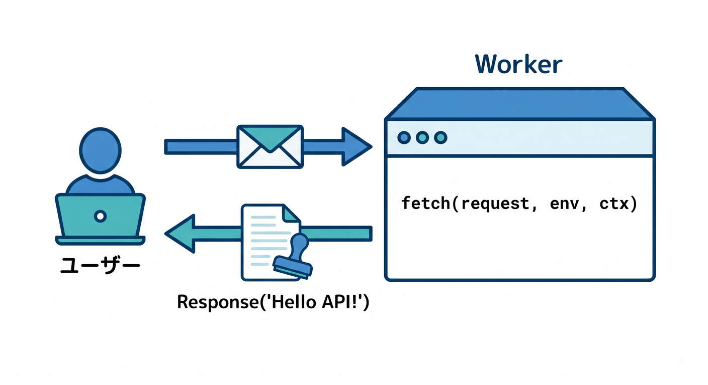
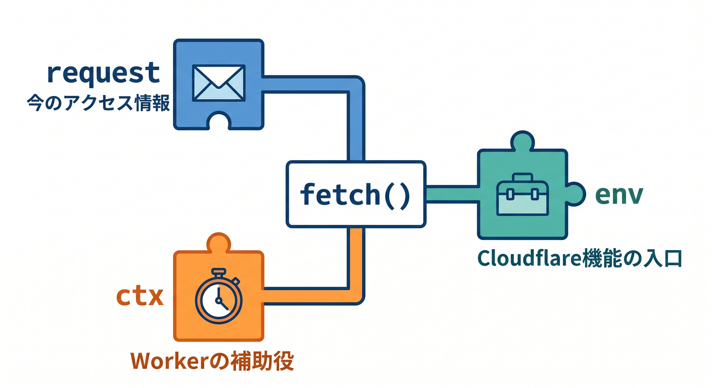
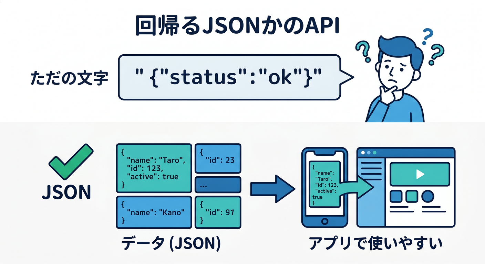
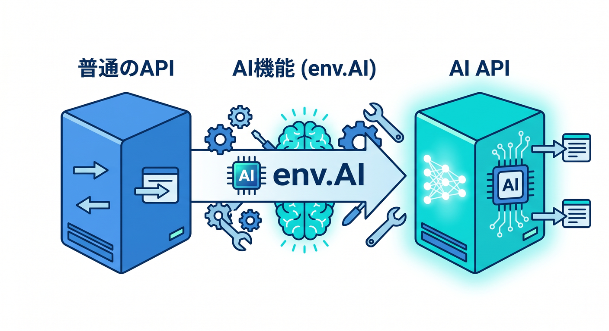

# 第03章：最初のAPIを作ろう！Hello APIで流れをつかもう 🚀💬

2026年4月17日時点のCloudflare公式では、最初のWorkerは `create-cloudflare`（C3）で作成し、Worker本体は `fetch(request, env, ctx)` ハンドラでHTTPリクエストを受け取り、`Response` を返す形が基本です。開発の中心コマンドも `wrangler dev` と `wrangler deploy` です。 ([Cloudflare Docs][1])

この章は、とにかく「自分のAPIが返事をした！」を最速で体験する章です 😊
まだ難しいことはしません。まずは **文字を返すだけ**、次に **JSONを返すだけ**。それで十分です 🎉

---

## この章のゴール 🎯

この章を終えると、こんなことができるようになります。

* Worker にアクセスしたら文字列を返せる ✨
* JSON を返す最小APIを書ける 📦
* `request` / `env` / `ctx` の役割をふわっと説明できる 🧠
* ブラウザや `fetch()` でAPIを試せる 🌍
* Copilot を使って「書く」「直す」より前に「理解する」学習ができる 🤖

---



## 1. まずは「Hello API」を1本だけ作ろう 👋

Cloudflare Workers では、HTTPリクエストが来ると `fetch()` ハンドラが呼ばれます。そして、そのハンドラは `Response` か、`Response` を解決する Promise を返す必要があります。`Request` と `Response` はどちらも Fetch API の一部です。 ([Cloudflare Docs][1])

まずは `src/index.ts` をこんなふうにします。

```ts
export default {
  async fetch(request, env, ctx): Promise<Response> {
    return new Response("Hello API! 👋");
  },
} satisfies ExportedHandler;
```

これだけです 😄
本当にこれだけでAPIです。

## ここで見てほしいポイント 👀

* `export default { ... }`

  * Workerの入口です。
* `fetch(request, env, ctx)`

  * リクエストが来たときに動く関数です。
* `new Response("Hello API! 👋")`

  * 返事そのものです。

Cloudflare公式の最初の例でも、ほぼ同じ形で `"Hello World!"` を返す最小Workerが紹介されています。 ([Cloudflare Docs][1])

---

## 2. `request` `env` `ctx` は今はどう理解すればいい？ 🧩

最初は、こんな理解で十分です。

## `request` 📩

「今きたアクセスの情報」です。
URL、HTTPメソッド、ヘッダーなどが入っています。`Request` は Fetch API のオブジェクトです。 ([Cloudflare Docs][2])

## `env` 🗃️

「Cloudflareの機能につながる入口」です。
この章ではまだ使いませんが、あとで D1、KV、Secrets、Workers AI などをつなぐときにここから使います。たとえば Workers AI の公式ガイドでは、AI binding を設定すると `env.AI` で使える形になります。 ([Cloudflare Docs][1])

## `ctx` ⏱️

「Workerの実行まわりを助ける補助役」です。
Cloudflare公式では `ctx` は Context API で、`waitUntil()` などのライフサイクル制御に使えます。今章ではまだ触るだけでOKです。 ([Cloudflare Docs][3])

この段階では、**「今は `Response` を返せば勝ち！」** くらいの気持ちで大丈夫です 🙌



---

## 3. ローカルで動かしてみよう 🛠️

Cloudflare公式のCLI導線では、C3で作ったWorkerを `wrangler dev` でローカル起動し、`http://localhost:8787` で確認できます。保存してブラウザをリロードすると表示が変わる流れも、公式の最初のチュートリアルそのままです。 ([Cloudflare Docs][1])

VS Code のターミナルで起動します。

```powershell
npx wrangler dev
```

ブラウザで開きます。

```text
http://localhost:8787
```

画面にこう出れば成功です 🎉

```text
Hello API! 👋
```

もし変わらなかったら、Cloudflare公式が案内している確認ポイントはこの3つです。

* ファイルを保存したか 💾
* `wrangler dev` が動いているか ▶️
* ブラウザを再読み込みしたか 🔄 ([Cloudflare Docs][1])


---

## 4. 次は JSON を返してみよう 📦✨

APIらしさがグッと出るのがここです。
文字列だけでなく、**データとして扱いやすい JSON** を返します。

Cloudflare公式の `Return JSON` 例では、Worker から `Response.json(data)` を返す書き方が案内されています。 ([Cloudflare Docs][4])

`src/index.ts` をこう変えてみましょう。

```ts
export default {
  async fetch(request, env, ctx): Promise<Response> {
    return Response.json({
      message: "Hello API! 👋",
      ok: true,
      chapter: 3,
    });
  },
} satisfies ExportedHandler;
```

## 何がうれしいの？ 🎁

文字列レスポンスは「表示して終わり」になりやすいですが、JSONレスポンスはフロントエンドや他のAPIから扱いやすいです。Cloudflare公式でも、JSON を直接返すWorker例がAPIやミドルウェア用途として紹介されています。 ([Cloudflare Docs][4])

ブラウザで開くと、こんな感じの返事になります。

```json
{
  "message": "Hello API! 👋",
  "ok": true,
  "chapter": 3
}
```

ここで「APIって画面を返すものじゃなくて、**データを返す窓口**なんだな」という感覚がかなり育ちます 🌱



---

## 5. ブラウザの Console から `fetch()` で呼んでみよう 🌍

Hello API は GET で返すだけなので、ブラウザでも簡単に試せます。Cloudflareのローカル開発は `wrangler dev` でプレビューするのが基本です。 ([Cloudflare Docs][1])

たとえばブラウザの開発者ツール Console でこう書けます。

## 文字列版を試す

```js
const res = await fetch("http://localhost:8787");
console.log(await res.text());
```

## JSON版を試す

```js
const res = await fetch("http://localhost:8787");
console.log(await res.json());
```

ここで大事なのは、

* `.text()` は文字列として読む 📝
* `.json()` はJSONとして読む 📦

という違いです。

この感覚は、第5章の POST/JSON、第8章の React 連携でそのまま効いてきます 💪


---

## 6. この章では「まだやらないこと」をはっきり分けよう ✋

初学者が混乱しやすいのは、最初から全部やろうとすることです 😵‍💫
この章では、あえてまだやりません。

* URLによる分岐
* クエリ文字列の読み取り
* POST の受け取り
* DB保存
* 認証
* 本格ルーティング

この章の勝ち筋はただ1つです。

**「アクセスされたら、決まった返事を返す」** ✅

これがわかれば、第4章のURL・パス・クエリにきれいにつながります。

---

## 7. Copilot を“自動作成マシン”ではなく“学習相棒”として使おう 🤖💙

Cloudflare公式は2026年時点で、Workersアプリを VS Code などのエディタやエージェントに対するシンプルなプロンプトから作れると案内しています。さらに、Cloudflare Docs 用の MCP サーバーや observability 用の MCP サーバーも案内しています。 ([Cloudflare Docs][5])

GitHub Copilot公式でも、Agent mode は複数ファイルの編集やターミナル提案まで含めて自律的に進められ、MCP による外部ツール連携ができます。VS Code では `.vscode/mcp.json` にMCPサーバーを設定し、Copilot Chat の Agent モードから利用できます。 ([GitHub Docs][6])

この章でおすすめの使い方は、**「作らせる」より「説明させる」** です 😊

## たとえばこんな聞き方がいいです 💬

* 「この `fetch(request, env, ctx)` の3引数を小学生向けに説明して」
* 「この Worker が返しているのは HTML ですか？ JSON ですか？ 理由も説明して」
* 「`new Response()` と `Response.json()` の違いを比較して」
* 「この Hello API にコメントをつけて、1行ずつ意味を書いて」
* 「Cloudflare docs を見ながら、このコードが公式の基本形から外れていないか確認して」

## MCP を使うならこんな方向が相性よし 🔌

* Cloudflare docs MCP で最新のWorkers公式情報を参照する
* observability MCP でログ確認の流れをAIに補助させる

このへんは、2026年らしいかなり強い学習体験です ✨
ただし、**AIに丸投げして意味を読まない** のはもったいないです。第3章では「自分で1行ずつ意味を言える」がいちばん大事です 📚

---

## 8. Cloudflare AI へのつながりも、実はもう見えている 🤖☁️

今はただの Hello API ですが、Cloudflare公式の Workers AI ガイドでは、Worker に AI binding を追加して `env.AI` からモデルを呼び出す流れが案内されています。つまり、**今日作った Hello API の形のまま、あとで AI API に育てられる** わけです。 ([Cloudflare Docs][7])

しかも公式ガイドでは、Workers AI のローカル開発でも `wrangler dev` を使う流れになっています。なお、Workers AI はローカル開発時でもCloudflareアカウントにアクセスして推論を実行し、利用料金が発生する案内があります。 ([Cloudflare Docs][7])

この章の時点では、こんな理解でOKです。

* いま作っているのは「普通のAPI」🌱
* その返事を AI が作るようにすると「AI API」になる 🌟
* 土台はどちらも Worker の `fetch()` です 🧱

つまり、第3章は第13章のAI APIの土台でもあります 🚀



---

## 9. この章でありがちなつまずき 😵

## ① `wrangler dev` は動いてるのに表示が変わらない

だいたい **保存忘れ** か **リロード忘れ** です 🔄
これは公式の最初の手順でも案内されている定番ポイントです。 ([Cloudflare Docs][1])

## ② `Response.json()` にしたのに、受け取る側で `.text()` している

これはエラーではないこともありますが、気持ち悪いです 😅
JSONで返したら、JSONとして読む癖をつけましょう。

## ③ `request` `env` `ctx` を全部理解しようとして止まる

今章では `request` しかほぼ使いません。
`env` と `ctx` は「あとで本格登場する脇役」くらいでOKです 🙆

## ④ Hello API を豪華にしすぎる

第3章ではシンプルさが正義です 🏆
凝るのは次章からで大丈夫です。

---

## 10. この章の練習問題 ✍️🎓

## 練習1

`Hello API! 👋` を自分の好きな文章に変えてみましょう。

## 練習2

JSON版で、返す内容をこう変えてみましょう。

* `message`
* `author`
* `version`
* `ok`

## 練習3

文字列版とJSON版を切り替えながら、ブラウザConsoleで

* `res.text()`
* `res.json()`

を試して、違いを確認しましょう。

## 練習4

Copilot にこう聞いてみましょう。

* 「このコードを初心者向けにコメント付きにして」
* 「この Worker の処理を図解っぽく説明して」
* 「このコードを壊さずに読みやすく整形して」

---

## 11. 章末ミニまとめ 🏁✨

この章の主役は、たったこれだけです。

* Worker は `fetch(request, env, ctx)` で受ける 📩
* 最後に `Response` を返す 📤
* 文字列なら `new Response(...)` 📝
* JSONなら `Response.json(...)` 📦

Cloudflare公式の現行ドキュメントでも、この Request/Response ベースがWorkersの基本で、`wrangler dev` でローカル確認し、`wrangler deploy` で公開する流れが中心です。さらに、CloudflareはVS CodeなどでのAI支援やMCP連携も公式に案内しており、CopilotのAgent modeやMCP活用とも相性があります。 ([Cloudflare Docs][1])

**この章で「返せた！」ができれば大成功です 🎉**
次の第4章では、このAPIに「URLで振る舞いを変える力」を足していきます 🛣️✨

必要ならこのまま続けて、同じ文体・同じ密度で **第4章** も作れます。

[1]: https://developers.cloudflare.com/workers/get-started/guide/ "Get started - CLI · Cloudflare Workers docs"
[2]: https://developers.cloudflare.com/workers/runtime-apis/request/ "Request · Cloudflare Workers docs"
[3]: https://developers.cloudflare.com/workers/runtime-apis/context/ "Context (ctx) · Cloudflare Workers docs"
[4]: https://developers.cloudflare.com/workers/examples/return-json/ "Return JSON · Cloudflare Workers docs"
[5]: https://developers.cloudflare.com/workers/get-started/prompting/ "Prompting · Cloudflare Workers docs"
[6]: https://docs.github.com/en/copilot/get-started/features "GitHub Copilot features - GitHub Docs"
[7]: https://developers.cloudflare.com/workers-ai/get-started/workers-wrangler/ "Get started - Workers and Wrangler · Cloudflare Workers AI docs"
