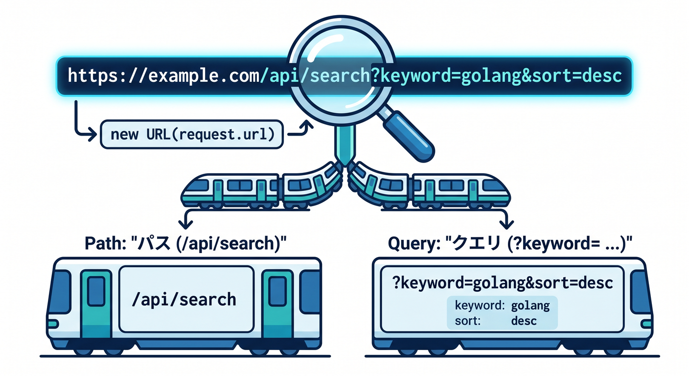
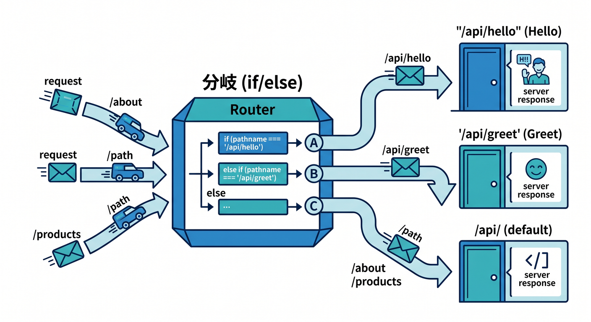
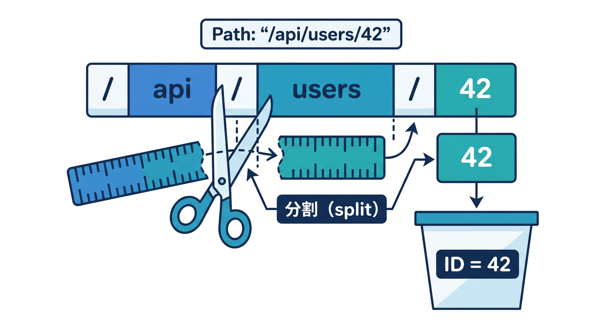
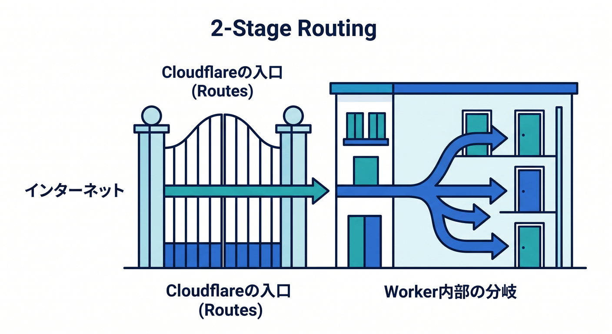
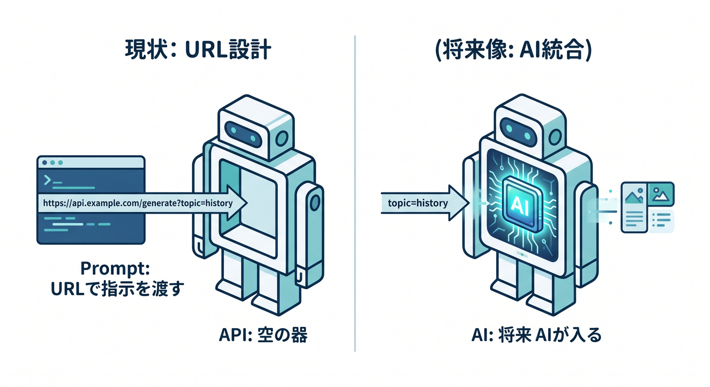

# 第04章：GETを使いこなそう！URL・パス・クエリの読み方を覚えよう 🔍🛣️

ここから、いよいよ「APIっぽさ」がグッと出てきます🎉
前の章では「アクセスしたら返事が来る！」を体験しましたが、この章ではさらに一歩進んで、**URLによって返事を変える** ところまで進みます。

Cloudflare Workers では、入ってきた HTTP リクエストが `fetch()` ハンドラーに `Request` として渡され、こちらは `Response` を返します。しかも Workers ランタイムは Web 標準 API 互換を重視しているので、`new URL(request.url)` のような素直な書き方がそのまま使えます。ここがとても学びやすいポイントです😊🌍 ([Cloudflare Docs][1])

---

## この章でできるようになること 🎯📘

この章のゴールは、次の4つです ✨

* `GET` リクエストで情報を返せる
* `request.url` から URL を読み取れる
* **パス** と **クエリ文字列** の違いがわかる
* URL に応じて API の返し方を変えられる

ここがわかると、`/api/hello` と `/api/users/42` と `/api/search?keyword=cloudflare` が「全部ただの文字列ではなく、意味を持った入口なんだ」と見えてきます🚪💡

---

## まず最初に：URLを見る場所はここです 👀🔗

Cloudflare Workers では、まずこの形を覚えればOKです。

```ts
export default {
  async fetch(request): Promise<Response> {
    const url = new URL(request.url);

    return Response.json({
      fullUrl: url.toString(),
      pathname: url.pathname,
      query: url.search,
    });
  },
} satisfies ExportedHandler;
```

`fetch()` に入ってきた `Request` から URL を取り出し、`new URL(request.url)` で分解する、というのが基本形です。JSON を返すときは、Cloudflare の公式 examples でも `Response.json(...)` が使われています。 ([Cloudflare Docs][2])

---

## URLの3兄弟を覚えよう 🧠✨

たとえば次の URL があるとします。

`https://example.com/api/search?keyword=cloudflare&limit=3`

このとき注目するのは主にこの3つです👇

* `url.pathname` → `/api/search`
* `url.search` → `?keyword=cloudflare&limit=3`
* `url.searchParams` → `keyword` や `limit` を取り出すための便利道具

つまり、

* **パス** は「どの入口か」🚪
* **クエリ文字列** は「その入口に渡す細かい条件」📝

という感覚でまずは十分です。



---

## 先に完成形を見よう！この章のメインAPI 🚀💻

この章では、1本の Worker の中で URL に応じて返事を変える練習をします。
まだ Hono などのフレームワークは使わず、**素の Workers** で書きます。ここで生の感覚をつかんでおくと、後の章がめちゃくちゃラクになります😊

```ts
export default {
  async fetch(request): Promise<Response> {
    if (request.method !== "GET") {
      return Response.json(
        { ok: false, message: "Method Not Allowed" },
        { status: 405 },
      );
    }

    const url = new URL(request.url);
    const pathname = url.pathname;
    const searchParams = url.searchParams;

    if (pathname === "/api") {
      return Response.json({
        ok: true,
        message: "APIは動いています 🎉",
        endpoints: [
          "/api/hello",
          "/api/greet?name=こみやんま",
          "/api/search?keyword=cloudflare&limit=3",
          "/api/users/42",
          "/api/ai-tip?topic=workers",
        ],
      });
    }

    if (pathname === "/api/hello") {
      return Response.json({
        ok: true,
        message: "Hello GET API! 👋",
      });
    }

    if (pathname === "/api/greet") {
      const name = searchParams.get("name") ?? "ゲスト";
      const emoji = searchParams.get("emoji") ?? "✨";

      return Response.json({
        ok: true,
        message: `${name}さん、こんにちは ${emoji}`,
      });
    }

    if (pathname === "/api/search") {
      const keyword = searchParams.get("keyword") ?? "";
      const limit = Number(searchParams.get("limit") ?? "5");

      if (!keyword) {
        return Response.json(
          { ok: false, message: "keyword を指定してください" },
          { status: 400 },
        );
      }

      if (!Number.isFinite(limit) || limit < 1 || limit > 10) {
        return Response.json(
          { ok: false, message: "limit は 1〜10 の数字で指定してください" },
          { status: 400 },
        );
      }

      return Response.json({
        ok: true,
        keyword,
        limit,
        items: Array.from({ length: limit }, (_, i) => ({
          id: i + 1,
          title: `${keyword} のサンプル ${i + 1}`,
        })),
      });
    }

    if (pathname.startsWith("/api/users/")) {
      const id = pathname.split("/")[3];

      if (!id) {
        return Response.json(
          { ok: false, message: "ユーザーIDがありません" },
          { status: 400 },
        );
      }

      return Response.json({
        ok: true,
        user: {
          id,
          name: `user-${id}`,
        },
      });
    }

    if (pathname === "/api/ai-tip") {
      const topic = searchParams.get("topic") ?? "workers";

      return Response.json({
        ok: true,
        topic,
        note: "今はダミー返答です。第13章で Workers AI に差し替えると本物のAI APIになります 🤖",
        outputFormat: "json",
      });
    }

    return Response.json(
      {
        ok: false,
        message: "Not Found",
        pathname,
      },
      { status: 404 },
    );
  },
} satisfies ExportedHandler;
```

この書き方は、Cloudflare の `fetch()` ハンドラー + `Request`/`Response` モデルにそのまま沿っています。URL を見て条件分岐する例も、Cloudflare の公式 examples にある考え方と相性がいいです。 ([Cloudflare Docs][2])



---

## 1つずつ分解して理解しよう 🪄

## 1. `request.method` を見る 📬

```ts
if (request.method !== "GET") {
  return Response.json(
    { ok: false, message: "Method Not Allowed" },
    { status: 405 },
  );
}
```

今章は GET の章なので、まずは GET だけ通すようにしています。
こうしておくと、「この API は何を受け付けるのか」が自分でも分かりやすくなります👍

---

## 2. `new URL(request.url)` が最重要 🔥

```ts
const url = new URL(request.url);
const pathname = url.pathname;
const searchParams = url.searchParams;
```

ここが今章のど真ん中です 🌟
Cloudflare Workers は Web 標準 API ベースなので、URL オブジェクトをそのまま使って自然に分解できます。 ([Cloudflare Docs][3])

---

## 3. パスで分岐する 🚪

```ts
if (pathname === "/api/hello") {
  return Response.json({
    ok: true,
    message: "Hello GET API! 👋",
  });
}
```

これは「**この入口に来たらこの返事**」という最小のルーティングです。
`/api/hello` なら挨拶、`/api` なら一覧、という感じですね😊

---

## 4. クエリ文字列を読む 📝

```ts
if (pathname === "/api/greet") {
  const name = searchParams.get("name") ?? "ゲスト";
  const emoji = searchParams.get("emoji") ?? "✨";

  return Response.json({
    ok: true,
    message: `${name}さん、こんにちは ${emoji}`,
  });
}
```

アクセス例はこちらです👇

* `/api/greet`
* `/api/greet?name=こみやんま`
* `/api/greet?name=こみやんま&emoji=🔥`

`searchParams.get("name")` は、値がなければ `null` になります。
だから `?? "ゲスト"` のようにして、未指定時の初期値を入れるのがとても大事です 💡


---

## 5. パスの一部をIDとして読む 👤

```ts
if (pathname.startsWith("/api/users/")) {
  const id = pathname.split("/")[3];
```

`/api/users/42` のような URL では、`42` の部分が「誰のデータか」を表します。
このように **パスの中の一部が意味を持つ** のが、APIらしいURLの典型です 🚀

この章ではまず `split("/")` で十分です。
「あとでもっときれいな書き方があるよ」はそのとき覚えればOKです。今はまず、**読めること** が大事です😊



---

## パスとクエリの使い分け感覚をつかもう 🎨

ざっくり次のように考えるとわかりやすいです。

* `/api/users/42`
  → **42番のユーザー** という“対象そのもの”を表す 👤

* `/api/search?keyword=cloudflare&limit=3`
  → **検索条件** を渡している 🔎

つまり、

* **パス** = どの資源・どの入口か
* **クエリ** = 絞り込み・並び替え・細かい条件

です。
この感覚があるだけで、URL設計がかなりスッキリします✨

---

## 実際にブラウザで試すとこうなる 🌐🎉

たとえばローカル開発中に次へアクセスすると、返事が変わります。

* `/api`
* `/api/hello`
* `/api/greet?name=こみやんま&emoji=🌸`
* `/api/search?keyword=workers&limit=3`
* `/api/users/42`

ブラウザでURLを直接打ってもいいですし、React 側から `fetch("/api/search?keyword=workers&limit=3")` のように呼んでもOKです。Workers は API でもフルスタックでも使える土台として案内されていて、React などのフロントと組み合わせる流れとも自然につながります。 ([Cloudflare Docs][4])

---

## Cloudflareならではの「2段階ルーティング」を理解しよう 🧭☁️

ここ、めちゃくちゃ大事です‼️

URL の話には、実は **2つの層** があります。

## ① Cloudflare 側のルーティング

どの Worker を動かすか決める入口です。
Cloudflare の **Routes** は URL パターンに Worker を割り当てます。DNS レコードが必要で、既存オリジンの前段に Worker を置く形です。Worker 自身がオリジンになるなら、**Custom Domains** が推奨です。さらに本番では `workers.dev` より Route か Custom Domain が推奨されています。 ([Cloudflare Docs][5])

## ② Worker の中のルーティング

実際に `pathname` や `searchParams` を見て、
`/api/hello` なのか `/api/users/42` なのかを分ける処理です。

この章で学ぶメインは **②** です。
でも公開時には **①** も必ず関わるので、今のうちに「外側の入口」と「中の分岐」は別物だと覚えておくと強いです💪✨



---

## Routesで知っておくと得すること 🛣️⚙️

Cloudflare Routes には、初学者が引っかかりやすいルールがあります。

* サポートされる演算子は基本的にワイルドカード `*`
* 複数マッチしたら、**より具体的なパターンが優先**
* ルートパターン自体にクエリ文字列は書けない
* パス部分は大文字小文字を区別する
* `*example.com/*` は思ったより広くマッチするので、必要なら `example.com/*` と `*.example.com/*` を分けた方が安全

これは「Worker の中の `pathname` の分岐」と混ざりやすいので注意です⚠️
今章では **Routes は入口の設定**、**`pathname` はコードの中の分岐** と切り分けて覚えましょう。 ([Cloudflare Docs][5])

---

## つまずきやすいポイント集 😵‍💫🩹

## `searchParams.get()` は文字列か `null`

だからそのまま使わず、`??` で初期値を入れるのが安全です。

```ts
const name = searchParams.get("name") ?? "ゲスト";
```

## 数字は自動で数字にならない

クエリ文字列は文字列です。
`limit=3` も `"3"` なので、必要なら `Number(...)` で変換します。

## `/api/users/42` と `/api/users/42/` は別

URL は見た目が似ていても、コード上では別扱いになりがちです。
まずは「完全一致かどうか」で考えると混乱しにくいです。

## エラーでもJSONで返すと後が楽

React や他サービスから呼ぶとき、成功も失敗も JSON だと受け取りやすいです✨

---

## この章に AI をどう絡めるか 🤖🌈

ユーザー目線では、GET + URL + クエリの学習と AI API はすごく相性がいいです。

たとえば今章の時点ではまだ本物の AI を使わなくても、

* `/api/ai-tip?topic=workers`
* `/api/summary?style=short`
* `/api/keywords?text=...`

のような **AIっぽい入口** を先に設計しておけます。
そして第13章で、その中身を **Workers AI binding** に置き換えると、「URLで条件を渡す AI API」に育てやすいです。Cloudflare は Workers AI を Workers + Wrangler の流れで案内していて、JSON Mode により構造化出力も扱えます。さらに AI Gateway binding を組み合わせる導線もあります。 ([Cloudflare Docs][6])

たとえば、将来こういうイメージにできます👇

* `/api/summary?style=short&lang=ja`
* `/api/classify?category=history`
* `/api/tag-suggest?format=json`

こういう設計にしておくと、**URL設計の勉強がそのまま AI API 設計の練習になる** ので、とてもお得です✨



---

## GitHub Copilot をこの章でどう使うと強い？ 🧠💙

本日時点で公式に確認しやすい導線としては、GitHub Copilot 側は **agent mode / custom agents / MCP**、Cloudflare 側は **docs MCP / observability MCP** がかなり相性いいです。GitHub Docs では、Copilot の agent mode がファイル編集やコマンド提案を進める機能として案内され、custom agents では prompts・tools・MCP servers を agent profile に持たせられます。Cloudflare 側も Workers 用の docs MCP と observability MCP を案内しています。 ([GitHub Docs][7])

さらに、VS Code では GitHub Copilot Chat から custom agent を作成でき、ツール設定画面で MCP サーバー由来の tools を選べます。Copilot Chat 自体も IDE 内で MCP サーバーの tools を使う流れが案内されています。 ([GitHub Docs][8])

一方で、Cloudflare の公式 VS Code Marketplace 拡張として私が確認できたものは、少なくとも明示的には **Cloudflare Workers** という bindings 管理向け拡張です。なので、学習体験としては「専用拡張ひとつで全部」より、**VS Code + Copilot + MCP + Wrangler** の組み合わせで進めるほうが、今の公式情報に照らすと堅いです。 ([Visual Studioマーケットプレイス][9])

---

## Copilot に投げると便利なプロンプト例 💬⚡

そのまま使えるように、今章向けの例を置いておきます。

この Cloudflare Worker の fetch ハンドラーで、

* pathname
* searchParams
* GET の分岐
  を初心者向けにコメント付きで説明して

この Worker に /api/posts/123 のようなパスID取得を追加して。
既存の書き方に合わせて、404 と 400 も JSON で返して

Cloudflare docs MCP を前提に、
Workers の URL ルーティングと Routes の違いを
5行で要約して

この searchParams の使い方で危ないところがあれば修正して。
limit は 1〜10 に制限して

こういう聞き方をすると、Copilot が「ただコードを吐く」だけでなく、**今学んでいる論点に沿って直してくれる** ので、かなり勉強しやすいです😊

---

## この章のミニ課題 ✍️🎓

## 課題1　あいさつAPIを育てよう

`/api/greet?name=○○&emoji=🌸` で返事を変えてみましょう。

## 課題2　検索APIを作ろう

`/api/search?keyword=castle&limit=3` でダミー検索結果を返してみましょう。

## 課題3　プロフィールAPIを作ろう

`/api/users/1`
`/api/users/2`
のように、IDで返事を変えてみましょう。

## 課題4　AI入口を先に作ろう

`/api/ai-tip?topic=history` を作り、今はダミーJSONを返すようにしてみましょう。
第13章で Workers AI に差し替える前提の“空の器”を先に作る感じです🤖

---

## 章末まとめ 🏁✨

この章でいちばん大事なのは、次の一文です。

**Cloudflare Workers では、`new URL(request.url)` で URL を分解し、`pathname` と `searchParams` を見て返事を変える。**

これができるようになると、

* URL で処理を分ける
* 条件つきで情報を返す
* React から呼びやすいAPIを作る
* 将来 Workers AI の入口を設計する

ところまで、ぜんぶつながってきます🌈

次の第5章では、ここで読めるようになった URL に対して、今度は **POST と JSON でデータを受け取る** 側へ進むと、いよいよ「受け取って処理して返すAPI」になってきます📦🚀

必要なら次に、この第4章とトーンや粒度をそろえたまま、**そのまま教材本文として使える「第5章」** も続けて作れます。

[1]: https://developers.cloudflare.com/workers/runtime-apis/handlers/fetch/?utm_source=chatgpt.com "Fetch Handler · Cloudflare Workers docs"
[2]: https://developers.cloudflare.com/workers/runtime-apis/handlers/fetch/ "Fetch Handler · Cloudflare Workers docs"
[3]: https://developers.cloudflare.com/workers/runtime-apis/ "Runtime APIs · Cloudflare Workers docs"
[4]: https://developers.cloudflare.com/workers/?utm_source=chatgpt.com "Overview · Cloudflare Workers docs"
[5]: https://developers.cloudflare.com/workers/configuration/routing/routes/ "Routes · Cloudflare Workers docs"
[6]: https://developers.cloudflare.com/workers-ai/get-started/workers-wrangler/ "Get started - Workers and Wrangler · Cloudflare Workers AI docs"
[7]: https://docs.github.com/en/copilot/get-started/features "GitHub Copilot features - GitHub Docs"
[8]: https://docs.github.com/en/copilot/how-tos/use-copilot-agents/cloud-agent/create-custom-agents "Creating custom agents for Copilot cloud agent - GitHub Docs"
[9]: https://marketplace.visualstudio.com/items?itemName=cloudflare.cloudflare-workers-bindings-extension "
        Cloudflare Workers - Visual Studio Marketplace
    "
