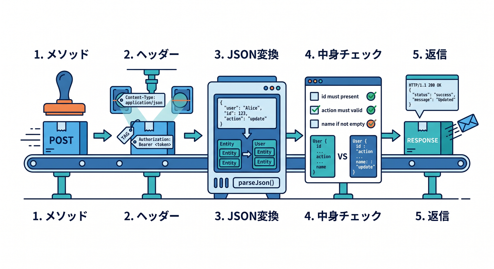
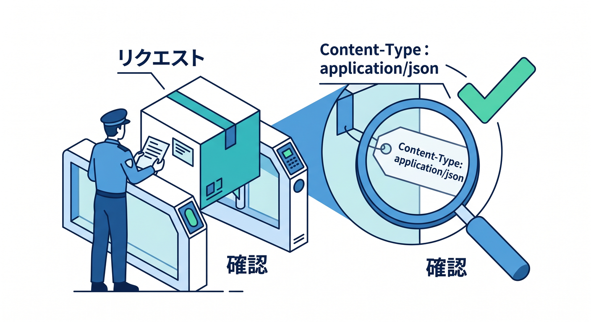
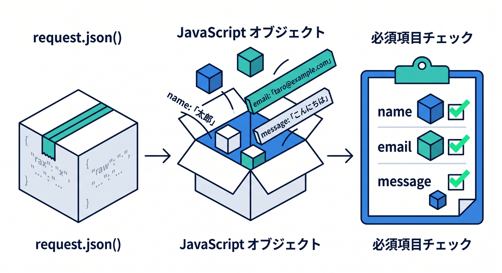
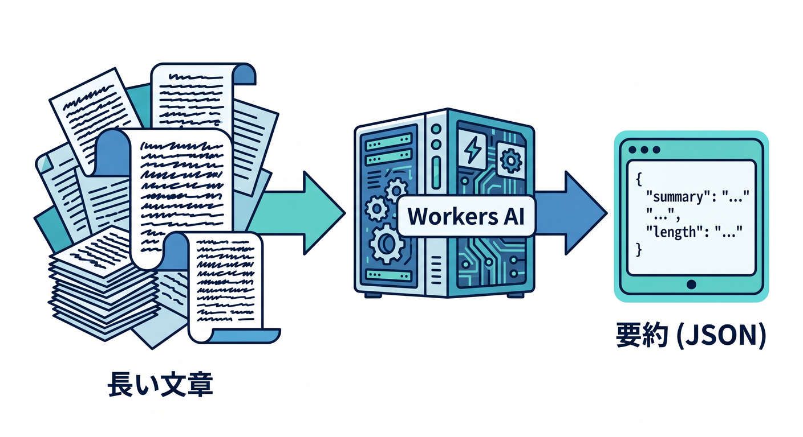

# 第05章：POSTとJSONを覚えよう！データを受け取るAPIへ 📮📦

この章では、**「受け取って、処理して、返す」** という API の本番感が一気に出てきます 😊
Cloudflare Workers では、受信した HTTP リクエストは Fetch API の `Request` として扱われ、本文は `request.json()`, `request.text()`, `request.formData()` などで読めます。返す側は `Response.json()` を使って JSON をそのまま返せるので、POST + JSON の練習にとても向いています。2026年4月17日時点の公式ドキュメントでも、この形が基本導線です。([Cloudflare Docs][1])

---

## この章でできるようになること 🎯💡

この章のゴールは、次の 4 つです ✨

* **POST リクエストを受け取れる**
* **JSON を安全に読み取れる**
* **入力データをチェックして返事を変えられる**
* **React や AI API につながる「受け口」を作れる**

特に大事なのは、**GET は「見にいく」感覚、POST は「送る」感覚**だとつかむことです。Workers の `Request` では `method` や `headers` を見られ、`GET` / `HEAD` には body を持てません。だから「入力を送る」場面では POST が自然です。([Cloudflare Docs][1])

---

## まずはイメージから 🌱📬

第4章では、URL のパスやクエリを読んで、**「どの場所にアクセスされたか」** を見ましたね 🚶‍♂️🛣️
第5章ではそこにもう 1 つ、**「中身として何が送られてきたか」** を足します 📦

たとえばこんな感じです。

* `GET /api/profile?id=1`
  → 「1番のプロフィールを見せて」
* `POST /api/contact`
  → 「名前・メール・本文を送るね」

ここから API は、ただ返すだけではなく、**受け取って考えて返す** ようになります 😊


---

## この章で作る題材 🛠️💌

今回は、**お問い合わせ受け取り API** を作ります。

エンドポイントはこれです。

* `POST /api/contact`

受け取る JSON はこんな形にします。

```json
{
  "name": "こみやんま",
  "email": "sample@example.com",
  "message": "Cloudflare Workers を勉強中です！"
}
```

返す JSON はこんな感じです。

```json
{
  "ok": true,
  "received": {
    "name": "こみやんま",
    "email": "sample@example.com",
    "messageLength": 29
  },
  "reply": "こみやんまさん、メッセージを受け取りました！"
}
```

この形にしておくと、あとで React のフォームや Next.js 側からもそのまま呼びやすいです 🌈

---

## 先に完成コードを見よう 👀🚀

`src/index.ts` はこんな感じです。

```ts
interface ContactInput {
  name?: string;
  email?: string;
  message?: string;
}

export default {
  async fetch(request: Request): Promise<Response> {
    const url = new URL(request.url);

    if (url.pathname === "/api/contact" && request.method === "POST") {
      const contentType = request.headers.get("content-type") || "";

      if (!contentType.includes("application/json")) {
        return Response.json(
          {
            ok: false,
            error: "Content-Type は application/json にしてください。"
          },
          { status: 400 }
        );
      }

      try {
        const body = (await request.json()) as ContactInput;

        const name = body.name?.trim() ?? "";
        const email = body.email?.trim() ?? "";
        const message = body.message?.trim() ?? "";

        if (!name || !email || !message) {
          return Response.json(
            {
              ok: false,
              error: "name, email, message は必須です。"
            },
            { status: 400 }
          );
        }

        return Response.json({
          ok: true,
          received: {
            name,
            email,
            messageLength: message.length
          },
          reply: `${name}さん、メッセージを受け取りました！`
        });
      } catch {
        return Response.json(
          {
            ok: false,
            error: "JSONの形式が正しくありません。"
          },
          { status: 400 }
        );
      }
    }

    if (url.pathname === "/api/contact" && request.method === "GET") {
      return Response.json({
        message: "ここは POST 専用です。JSON を送ってください。"
      });
    }

    return Response.json(
      {
        ok: false,
        error: "Not Found"
      },
      { status: 404 }
    );
  }
} satisfies ExportedHandler;
```

このコードは、Workers の標準的な `fetch(request)` ハンドラ、`Request` の本文読み取り、`Response.json()` による JSON 返却という、公式ドキュメントの流れそのままで組めています。([Cloudflare Docs][1])



---

## コードをやさしく分解しよう 🔍🧩

## 1. URL とメソッドを見る 👣

```ts
const url = new URL(request.url);

if (url.pathname === "/api/contact" && request.method === "POST") {
```

ここでは、

* どの URL に来たか
* 何メソッドで来たか

を見ています 👀

第4章では `pathname` や `searchParams` が主役でしたが、第5章ではそこに **`request.method === "POST"`** が加わります。`Request` には `url` や `method` があり、HTTP メソッドに応じて処理を分けられます。([Cloudflare Docs][1])

## 2. `Content-Type` をチェックする 📦🏷️

```ts
const contentType = request.headers.get("content-type") || "";

if (!contentType.includes("application/json")) {
```

これはすごく大事です ✨
相手が JSON を送ったつもりでも、ヘッダーが違うとこちらは正しく解釈できません。

公式の POST 読み取りサンプルでも、`content-type` を見て `application/json` / `text` / `form` を切り替える形が紹介されています。つまり、**「まずヘッダーを見る」** はかなり王道です。([Cloudflare Docs][2])



## 3. `request.json()` で本文を読む 📬

```ts
const body = (await request.json()) as ContactInput;
```

ここで、POST された JSON 本文を JavaScript のオブジェクトに変換しています。Workers の `Request` には `json()`, `text()`, `formData()`, `arrayBuffer()` などの本文読み取りメソッドがあります。([Cloudflare Docs][1])

## 4. 値を整えて、必須チェックする ✅

```ts
const name = body.name?.trim() ?? "";
const email = body.email?.trim() ?? "";
const message = body.message?.trim() ?? "";

if (!name || !email || !message) {
```

この部分は API の品質を上げる超重要ポイントです 💪
JSON を受け取れたとしても、中身が空なら意味がありません。

ここで覚えてほしいのは、**「JSON を読めた」と「正しい入力だった」は別** だということです。
API は、受け取ったあとに **検査する責任** があります 🧠



## 5. `Response.json()` で返す 🎁

```ts
return Response.json({
  ok: true,
  received: {
    name,
    email,
    messageLength: message.length
  },
  reply: `${name}さん、メッセージを受け取りました！`
});
```

Workers では `Response.json(data)` で JSON レスポンスを作れます。公式の Return JSON サンプルでもこの形が案内されています。手で `JSON.stringify()` とヘッダーを書くより、最初はこれで覚えるのがラクです 😄([Cloudflare Docs][3])

---

## 実際に送ってみよう 🧪✨

## ブラウザの `fetch()` で試す

```ts
const res = await fetch("http://127.0.0.1:8787/api/contact", {
  method: "POST",
  headers: {
    "Content-Type": "application/json"
  },
  body: JSON.stringify({
    name: "こみやんま",
    email: "sample@example.com",
    message: "Cloudflare Workers を勉強中です！"
  })
});

const data = await res.json();
console.log(data);
```

## Windows の PowerShell で試す 🪟⚡

```powershell
$body = @{
  name = "こみやんま"
  email = "sample@example.com"
  message = "Cloudflare Workers を勉強中です！"
} | ConvertTo-Json

Invoke-RestMethod `
  -Uri "http://127.0.0.1:8787/api/contact" `
  -Method Post `
  -ContentType "application/json" `
  -Body $body
```

ローカル確認は `wrangler dev` の流れに乗せれば OK です。Wrangler は Cloudflare の公式 CLI で、ローカル開発にも使う基本ツールです。([Cloudflare Docs][4])

---

## この章で一緒に覚えたい超重要ポイント 5つ 🧠🔥

## 1. POST は「本文を送る」ための主役

GET は URL で条件を渡すのが中心、POST は body でまとまったデータを送るのが中心です。Workers の `Request` でも body は `GET` / `HEAD` には付けられません。([Cloudflare Docs][1])

## 2. JSON は API の共通語みたいなもの

フロントエンド、外部 API、AI サービス連携まで、JSON は本当に出番が多いです。Workers でも受信・返却のどちらも JSON を自然に扱えます。([Cloudflare Docs][1])

## 3. ヘッダー確認はサボらない

`Content-Type` を見ないと、「JSON だと思って読んだら違った」が起きます。公式サンプルでも content type 分岐が使われています。([Cloudflare Docs][2])

## 4. エラーを返すのも API の仕事

入力不足や JSON 崩れは、ちゃんと `400` で返してあげると使う側が助かります。レスポンスの `status` は Workers の `Response` で扱えます。([Cloudflare Docs][5])

## 5. body は読み方を決めて一度で読む意識

`Request` には `bodyUsed` という状態があり、body の扱いは使い捨ての流れだと意識したほうが混乱しにくいです。最初は **1リクエストにつき本文は1回読む** と覚えるのが安全です。([Cloudflare Docs][1])

---

## 初学者がハマりやすいミス 😵‍💫🧯

## `request.json()` したらエラーになる

JSON の文法ミスか、そもそも JSON ではない本文が来ています。
だから `try...catch` で囲むのが安心です 😊

## `Content-Type` を付け忘れる

本文は JSON でも、ヘッダーがないとサーバー側で判定しづらいです。
フロントから送るときは `Content-Type: application/json` をほぼセットで覚えましょう。

## 空文字や項目不足を見逃す

API は受け取ったら終わりではなく、**ちゃんとチェックしてから返す** のが大切です ✨

## 「成功しか考えていない」

あとで React 側とつなぐと、失敗レスポンスがない API はかなり扱いづらいです。
この章のうちから `ok: false` と `status: 400` の感覚に慣れておくと強いです 💪


---

## 教材としての進め方おすすめ順 📚🌈

この章は、次の順番で進めると理解しやすいです。

1. まずは **固定 JSON を返す API** を作る
2. 次に **POST を受ける**
3. そのあと **`request.json()` で読む**
4. **入力チェック** を入れる
5. **成功と失敗を返し分ける**

いきなり全部やると少し重いので、**1つずつ増やす** のがコツです 😊

---

## GitHub Copilot をこの章でどう使うか 🤖🛠️

2026年時点では、GitHub Copilot の agent mode は MCP サーバーと組み合わせることで、外部データやツールにアクセスできるようになっています。VS Code 側でも MCP サーバーは tools / resources / prompts / interactive apps を提供でき、Cloudflare 公式も Workers 向け docs MCP サーバーと observability MCP サーバーを案内しています。つまりこの章の学習では、**Copilot に Cloudflare 公式情報を読ませながら Worker を直す** という進め方がかなり相性いいです。([GitHub Docs][6])

Copilot への頼み方の例です ✨

* 「この Worker に `application/json` チェックを追加して」
* 「`request.json()` で壊れた JSON が来たとき 400 を返すようにして」
* 「Cloudflare Workers の書き方で `Response.json()` を使う形に整理して」
* 「この API に Zod を入れる前提で、まずは素の TypeScript で安全に書き直して」
* 「Cloudflare docs MCP を参照して、POST + JSON の基本パターンを説明して」

この章では、**Copilot に全部書かせる** より、
**自分で小さく書く → Copilot に改善させる** の流れがいちばん学習効果が高いです 🌟

---

## Cloudflare AI をここで軽く絡めるならこうする 🤖📮

この章は POST + JSON の章なので、Cloudflare AI とも相性がいいです。
たとえば `POST /api/summarize` に JSON で文章を送り、Workers AI に要約させて JSON で返す、という拡張ができます。

Cloudflare 公式では、Workers AI は `wrangler` 設定で AI binding を追加すると `env.AI` から使えます。さらに Workers AI は structured output 用の JSON Mode をサポートしていて、OpenAI 互換の `response_format` 形式にも対応しています。将来の AI API 設計にそのままつながる考え方です。([Cloudflare Docs][7])

## AI binding の設定例

```jsonc
{
  "ai": {
    "binding": "AI"
  }
}
```

## 要約 API のミニ例

```ts
export interface Env {
  AI: Ai;
}

interface SummarizeInput {
  text?: string;
}

export default {
  async fetch(request: Request, env: Env): Promise<Response> {
    const url = new URL(request.url);

    if (url.pathname === "/api/summarize" && request.method === "POST") {
      const contentType = request.headers.get("content-type") || "";

      if (!contentType.includes("application/json")) {
        return Response.json(
          { ok: false, error: "application/json で送ってください。" },
          { status: 400 }
        );
      }

      try {
        const body = (await request.json()) as SummarizeInput;
        const text = body.text?.trim() ?? "";

        if (!text) {
          return Response.json(
            { ok: false, error: "text は必須です。" },
            { status: 400 }
          );
        }

        const result = await env.AI.run("@cf/meta/llama-3.1-8b-instruct", {
          prompt: `次の文章を日本語で3行以内に要約してください。\n\n${text}`
        });

        return Response.json({
          ok: true,
          result
        });
      } catch {
        return Response.json(
          { ok: false, error: "JSON が壊れています。" },
          { status: 400 }
        );
      }
    }

    return Response.json({ ok: false, error: "Not Found" }, { status: 404 });
  }
} satisfies ExportedHandler<Env>;
```

Cloudflare の公式ガイドでも `env.AI.run()` でモデルを実行する形が基本です。また、Workers AI はローカル開発中の `wrangler dev` でも実アカウントにアクセスして推論を行うため、利用料金が発生しうる点は知っておくと安心です。([Cloudflare Docs][8])



---

## React / Next.js につながる学びポイント ⚛️🔗

この章の POST + JSON が分かると、次の章以降で React のフォーム送信がかなり楽になります 😊
フロント側は基本的に `fetch(..., { method: "POST", headers, body })` で送るだけだからです。

さらに Cloudflare 側は Workers AI に OpenAI 互換エンドポイントも用意しているので、将来的には **「画面 → Worker API → AI」** の流れをかなり素直につなげられます。React/Next.js を重く持ち込みすぎなくても、今の章の POST + JSON がその土台になります。([Cloudflare Docs][9])

---

## この章の練習問題 ✍️🎓

## 練習1

`/api/contact` に `subject` を追加してみましょう。
空なら `400` を返すようにします。

## 練習2

`message.length` が 200 文字を超えたらエラーにしてみましょう。

## 練習3

`GET /api/contact` にアクセスしたとき、使い方のサンプル JSON を返してみましょう。

## 練習4

`POST /api/echo` を作って、送られてきた JSON をそのまま返してみましょう。
これは POST + JSON の最小練習としてかなりおすすめです 🌟

## 練習5

AI binding が使えるなら、`/api/summarize` を作って短文要約 API にしてみましょう 🤖

---

## この章のまとめ 🏁🎉

第5章の本質はこれです。

**API は、URL だけでなく body も読めると一気に“アプリの裏側”らしくなる** 💡

覚えてほしい流れは、とてもシンプルです。

1. `request.method` を見る
2. `Content-Type` を見る
3. `request.json()` で読む
4. 中身をチェックする
5. `Response.json()` で返す

この5ステップが身につくと、次に React のフォーム送信をやるときも、外部 API と連携するときも、Workers AI をつなぐときも、かなりスムーズです 🚀✨

必要なら続けて、この流れに合わせた
**「第5章の最後に置く理解度チェック問題集」** も、そのまま作れます。

[1]: https://developers.cloudflare.com/workers/runtime-apis/request/ "Request · Cloudflare Workers docs"
[2]: https://developers.cloudflare.com/workers/examples/read-post/ "Read POST · Cloudflare Workers docs"
[3]: https://developers.cloudflare.com/workers/examples/return-json/ "Return JSON · Cloudflare Workers docs"
[4]: https://developers.cloudflare.com/workers/get-started/guide/ "Get started - CLI · Cloudflare Workers docs"
[5]: https://developers.cloudflare.com/workers/runtime-apis/response/ "Response · Cloudflare Workers docs"
[6]: https://docs.github.com/en/copilot/tutorials/enhance-agent-mode-with-mcp "Enhancing GitHub Copilot agent mode with MCP - GitHub Docs"
[7]: https://developers.cloudflare.com/workers-ai/configuration/bindings/ "Workers Bindings · Cloudflare Workers AI docs"
[8]: https://developers.cloudflare.com/workers-ai/get-started/workers-wrangler/ "Get started - Workers and Wrangler · Cloudflare Workers AI docs"
[9]: https://developers.cloudflare.com/ai-gateway/usage/providers/workersai/ "Workers AI · Cloudflare AI Gateway docs"
