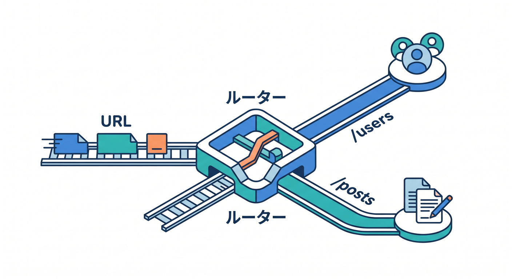
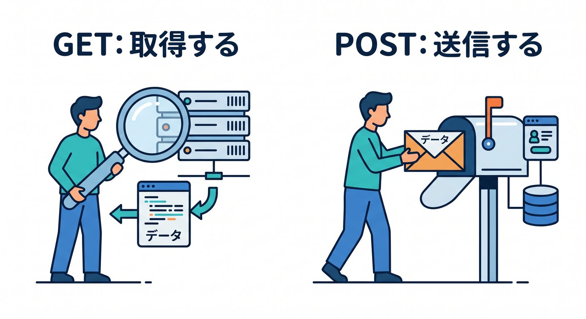

# 第06章：分岐・ルーティング・HTTPメソッド整理で“APIっぽさ”を固めよう 🚦🔀

ここから一気に「ただのサンプル」から「ちゃんとしたAPI」へ進みます 😊
Cloudflare Workers では、受け取ったHTTPリクエストが `fetch()` ハンドラに `Request` として渡され、こちらは `Response` を返します。さらに `Request` には `method` があり、HTTPメソッドを読めます。つまりこの章の本質は、**URLの道順**と**HTTPメソッド**で処理をきれいに分けることです。 ([Cloudflare Docs][1])

公式の現行導線でも、Workers はそのまま書いて学ぶ方法と、あとから Hono のような軽量フレームワークに進む方法の両方が用意されています。Hono は Cloudflare Workers と相性がよく、Cloudflare 側でも公式ガイドがあり、GA 対応フレームワークにも含まれています。 ([Cloudflare Docs][2])

この章ではまず **素の Workers で分岐を理解** します。そのうえで最後に、「あ、だからHonoが便利なんだね 😎」と見える形まで持っていきます。さらに Cloudflare の AI binding も軽く差し込み、**普通のAPIとAI APIを同じ Worker の中で分岐させる** ところまで体験します。Workers AI は `env.AI` binding と `env.AI.run()` で扱えます。 ([Cloudflare Docs][3])

---

## この章でできるようになること 🎯📘

* URL の `pathname` を見て、処理を分けられる
* `GET` と `POST` を同じ Worker の中で整理できる
* `/users` や `/posts` のように、役割ごとに API を分けられる
* 間違ったメソッドには `405`、存在しないパスには `404` を返す感覚がつかめる
* 小さな AI API を 1 本まぜて、Cloudflare らしい発展を感じられる 🤖✨

---

## 1. まずは「ルーティング」を2種類に分けて理解しよう 🧭

ここ、かなり大事です 🌟
Cloudflare には似た言葉が2つあります。



## ① Cloudflare の Route

これは **どのURLパターンに、この Worker をぶら下げるか** です。
たとえば `api.example.com/*` にこの Worker を割り当てる、みたいな設定です。Cloudflare の Routes は、URL パターンに一致したときに Worker を実行する仕組みです。 ([Cloudflare Docs][4])

## ② Worker の中のルーティング

これは **Worker の中で `/users` と `/posts` をどう分けるか** です。
つまり「この Worker が起動したあと、さらに中で分岐する」話です。

この章で主にやるのは、②のほうです 😊

---

## 2. APIっぽい設計の考え方をつかもう 🧱✨

初心者のうちは、ついこう書きたくなります。

* `/getUsers`
* `/createUser`
* `/getPosts`

でも API では、**パスは“もの”を表し、動作は HTTPメソッドに任せる** ほうが整理しやすいです 👍

たとえばこんな感じです。

* `GET /users` → ユーザー一覧を見る
* `POST /users` → ユーザーを追加する
* `GET /posts` → 投稿一覧を見る
* `POST /ai/summary` → AI に要約させる

この形にすると、「URLの役割」と「操作の種類」がスッキリ分かれます ✨

---

## 3. この章で作るミニAPIの設計図 🗺️💡

今回はこんな小さな API を作ります。

* `GET /`

  * API の案内を返す
* `GET /users`

  * ダミーのユーザー一覧を返す
* `POST /users`

  * 受け取った JSON からユーザーを1件作る
* `GET /posts`

  * ダミーの投稿一覧を返す
* `POST /ai/summary`

  * 受け取った文章を Workers AI で要約する

ポイントは、**同じ `/users` でも GET と POST で役割が違う** ところです 🚀
ここが分かると、API の骨格がかなり見えてきます。

---

## 4. まずは素の Workers で書いてみよう ✍️🔥

`src/index.ts` のイメージです。

```ts
interface Env {
  AI?: {
    run(
      model: string,
      inputs: Record<string, unknown>,
      options?: Record<string, unknown>
    ): Promise<unknown>;
  };
}

type CreateUserBody = {
  name?: string;
  email?: string;
};

type SummaryBody = {
  text?: string;
};

function json(data: unknown, status = 200): Response {
  return new Response(JSON.stringify(data, null, 2), {
    status,
    headers: {
      "content-type": "application/json; charset=UTF-8",
    },
  });
}

function notFound(): Response {
  return json(
    {
      ok: false,
      error: "Not Found",
    },
    404
  );
}

function methodNotAllowed(allow: string[]): Response {
  return new Response(
    JSON.stringify(
      {
        ok: false,
        error: "Method Not Allowed",
        allow,
      },
      null,
      2
    ),
    {
      status: 405,
      headers: {
        "content-type": "application/json; charset=UTF-8",
        allow: allow.join(", "),
      },
    }
  );
}

async function safeParseJson<T>(request: Request): Promise<T | null> {
  try {
    return (await request.json()) as T;
  } catch {
    return null;
  }
}

export default {
  async fetch(request: Request, env: Env): Promise<Response> {
    const url = new URL(request.url);
    const pathname = url.pathname.replace(/\/+$/, "") || "/";
    const method = request.method.toUpperCase();

    if (pathname === "/") {
      if (method !== "GET") {
        return methodNotAllowed(["GET"]);
      }

      return json({
        ok: true,
        message: "Chapter 6 routing demo API",
        routes: [
          "GET /",
          "GET /users",
          "POST /users",
          "GET /posts",
          "POST /ai/summary",
        ],
      });
    }

    if (pathname === "/users") {
      if (method === "GET") {
        return json({
          ok: true,
          items: [
            { id: 1, name: "Taro" },
            { id: 2, name: "Hanako" },
          ],
        });
      }

      if (method === "POST") {
        const body = await safeParseJson<CreateUserBody>(request);

        if (!body || typeof body.name !== "string" || body.name.trim() === "") {
          return json(
            {
              ok: false,
              error: "name は必須です",
            },
            400
          );
        }

        return json(
          {
            ok: true,
            item: {
              id: crypto.randomUUID(),
              name: body.name.trim(),
              email: typeof body.email === "string" ? body.email : null,
            },
          },
          201
        );
      }

      return methodNotAllowed(["GET", "POST"]);
    }

    if (pathname === "/posts") {
      if (method !== "GET") {
        return methodNotAllowed(["GET"]);
      }

      return json({
        ok: true,
        items: [
          { id: 101, title: "Workersは楽しい" },
          { id: 102, title: "Routingを覚えた" },
        ],
      });
    }

    if (pathname === "/ai/summary") {
      if (method !== "POST") {
        return methodNotAllowed(["POST"]);
      }

      if (!env.AI) {
        return json(
          {
            ok: false,
            error: "AI binding が未設定です",
          },
          500
        );
      }

      const body = await safeParseJson<SummaryBody>(request);

      if (!body || typeof body.text !== "string" || body.text.trim() === "") {
        return json(
          {
            ok: false,
            error: "text は必須です",
          },
          400
        );
      }

      const result = await env.AI.run("@cf/meta/llama-3.1-8b-instruct", {
        prompt: `次の文章を日本語で3行以内に要約してください。\n\n${body.text}`,
      });

      return json({
        ok: true,
        summary: result,
      });
    }

    return notFound();
  },
};
```

---

## 5. このコードの読みどころをやさしく分解しよう 🔍😊

## `new URL(request.url)` が分岐の入口

Workers の `fetch()` には `Request` が渡され、その `request.url` から URL を読めます。`Request` は Fetch API の `Request` で、URL を持っています。 ([Cloudflare Docs][5])

ここで `pathname` を取ると、

* `/`
* `/users`
* `/posts`
* `/ai/summary`

みたいな道筋が分かります。

## `request.method` が操作の種類

`Request` には `method` があり、`GET`、`POST` などを読めます。Workers では HTTP メソッドが使え、`CONNECT` を除くメソッドがサポートされています。 ([Cloudflare Docs][5])

だから同じ `/users` でも、

* `GET /users`
* `POST /users`

を分けられるわけです ✨



## 404 と 405 の違いも少しだけ体験

* **404** = そのパスがない
* **405** = パスはあるけど、そのメソッドはダメ

この違いを入れるだけで、急に API が「それっぽく」なります 😎
次章でここはさらにしっかり整理します。


---

## 6. Windowsで動作確認してみよう 🪟⚙️

ブラウザでもいいですが、Windows なら PowerShell で試すと API 感が出ます ✨

## 一覧取得

```powershell
Invoke-RestMethod http://127.0.0.1:8787/users
```

## 追加

```powershell
Invoke-RestMethod `
  -Uri http://127.0.0.1:8787/users `
  -Method POST `
  -ContentType "application/json" `
  -Body '{"name":"Komi","email":"komi@example.com"}'
```

## AI要約

```powershell
Invoke-RestMethod `
  -Uri http://127.0.0.1:8787/ai/summary `
  -Method POST `
  -ContentType "application/json" `
  -Body '{"text":"Cloudflare Workers では Request と Response を使って API を作れます。URL と method で処理を分けると API らしい設計になります。"}'
```


---

## 7. AIルートを1本まぜると何がうれしいの？ 🤖🌈

この章で `POST /ai/summary` を入れるのは、ただ流行りだからではありません 🙌
**ルーティングの考え方が、AI API でもまったく同じ** と分かるからです。

* 普通の一覧API → `GET /users`
* 普通の追加API → `POST /users`
* AIの要約API → `POST /ai/summary`

こうして並べると、「AI だけ別世界」ではなく、**AI も API の1種なんだ** と理解できます。Workers AI は binding で Worker に接続し、`env.AI.run()` でモデル実行できます。さらに AI Gateway の binding では、Workers AI モデルだけでなく一部のサードパーティーモデルも同じ `env.AI.run()` 形で扱えます。 ([Cloudflare Docs][3])

発展としては、今の Cloudflare には **AI Search** もあり、Workers binding・REST API・MCP で自然言語検索を扱えます。しかも新しい AI Search インスタンスは 2026年4月16日以降、managed storage・vector index・web crawling を含む構成になっています。将来 `/search` という API を足すイメージもかなり自然です。 ([Cloudflare Docs][6])


---

## 8. if 文だらけで苦しくなったら、そこで Hono 👀🧩

素の Workers は学習にすごく向いています。
でもルートが増えると、`if (pathname === "...")` がどんどん長くなります。

そこで Hono の出番です ✨
Cloudflare の公式では Hono を「ultra-fast, lightweight」で Workers と相性がよいフレームワークとして案内していて、React SPA と組み合わせた full-stack 構成の公式ガイドもあります。 ([Cloudflare Docs][7])

同じことを Hono っぽく書くと、かなり見通しがよくなります。

```ts
import { Hono } from "hono";

type Bindings = {
  AI: {
    run(
      model: string,
      inputs: Record<string, unknown>,
      options?: Record<string, unknown>
    ): Promise<unknown>;
  };
};

const app = new Hono<{ Bindings: Bindings }>();

app.get("/", (c) => {
  return c.json({
    ok: true,
    routes: ["GET /", "GET /users", "POST /users", "GET /posts", "POST /ai/summary"],
  });
});

app.get("/users", (c) => {
  return c.json({
    ok: true,
    items: [
      { id: 1, name: "Taro" },
      { id: 2, name: "Hanako" },
    ],
  });
});

app.post("/users", async (c) => {
  const body = await c.req.json<{ name?: string; email?: string }>();

  if (!body.name || body.name.trim() === "") {
    return c.json({ ok: false, error: "name は必須です" }, 400);
  }

  return c.json(
    {
      ok: true,
      item: {
        id: crypto.randomUUID(),
        name: body.name.trim(),
        email: body.email ?? null,
      },
    },
    201
  );
});

app.get("/posts", (c) => {
  return c.json({
    ok: true,
    items: [
      { id: 101, title: "Workersは楽しい" },
      { id: 102, title: "Honoも見やすい" },
    ],
  });
});

app.post("/ai/summary", async (c) => {
  const body = await c.req.json<{ text?: string }>();

  if (!body.text || body.text.trim() === "") {
    return c.json({ ok: false, error: "text は必須です" }, 400);
  }

  const result = await c.env.AI.run("@cf/meta/llama-3.1-8b-instruct", {
    prompt: `次の文章を日本語で3行以内に要約してください。\n\n${body.text}`,
  });

  return c.json({ ok: true, summary: result });
});

export default app;
```

この章では **Hono を使いこなすこと** が目的ではありません。
目的は、**素の Workers の分岐を理解したうえで、Hono が何を楽にしてくれるのか見抜けること** です 💡

なお、Cloudflare の現行 Hono ガイドでは、React SPA と Hono API を同居させるテンプレートや、Cloudflare Vite plugin によるローカル開発も案内されています。 ([Cloudflare Docs][7])


---

## 9. AIコーディング支援の使いどころ 🧠✨

Cloudflare の現行 Prompting ドキュメントでは、Workers を **VS Code、Codex、Claude Code、Cursor、Windsurf** などのエディタ／エージェントで扱う流れが案内されています。さらに Docs MCP サーバーや Observability MCP サーバーをつなぐ方法もあり、GitHub Copilot では `.github/copilot-instructions.md` を使う案内もあります。 ([Cloudflare Docs][8])

この章で相性がいい頼み方は、たとえばこんな感じです 😊

* 「この Worker のルーティング表を一覧にして」
* 「404 と 405 の分岐が正しいか確認して」
* 「`/users/:id` を追加するなら、今の構造でどう増やすべき？」
* 「この素の Workers 実装を Hono 版に安全に書き換えて」
* 「Cloudflare Docs MCP を参照して、Workers AI binding の設定差分だけ要約して」

Copilot でも AI ツールでも、**“コード生成だけさせる”より、“整理・説明・比較”をやらせる** ほうが学習効率がかなり上がります 🚀

---

## 10. この章でハマりやすいポイント 😵‍💫🪤

## パスだけ見て、メソッドを見ていない

`/users` だけで判断すると、GET と POST がごちゃごちゃになります。
**パスとメソッドはセット** で考えましょう。

## `/users/` と `/users` の違いで迷子になる

今回のサンプルでは `replace(/\/+$/, "") || "/"` で末尾スラッシュを軽く吸収しています。
初心者のうちは、こういう小さな正規化がかなり効きます ✨

## JSON パース失敗を考えていない

`await request.json()` は、JSON が壊れていたら失敗します。
だから `safeParseJson()` みたいなワンクッションが大事です。

## 何でも1本の巨大 Worker に詰め込む

学習初期はOKです 👍
でも大きくなったら、Hono に寄せる、別モジュールに分ける、あるいは将来 Service Bindings を考える、という流れになります。


---

## 11. この章のミニ課題 🧪🎓

## 課題1

`GET /profile` を追加して、自分のプロフィール JSON を返してください。

## 課題2

`POST /contact` を追加して、`name` と `message` を受け取り、受理したことを返してください。

## 課題3

`POST /ai/title` を追加して、本文から「記事タイトル案を3つ返す API」にしてください 🤖

## 課題4

`/users` に `DELETE` を送ったら `405` を返すことを確認してください。

## 課題5

素の Workers 版を見ながら、Hono 版にも同じルートを足してみてください。

---

## 12. 章末チェック ✅🌟

この章が終わった時点で、次の感覚があればかなり順調です 😊

* 1つの Worker で複数の API エンドポイントを扱える
* URL のパスで「どの機能か」を決められる
* HTTP メソッドで「何をするか」を決められる
* 普通の API と AI API を同じ設計の中に置ける
* Hono は魔法ではなく、「分岐整理を楽にする道具」だと分かる

---

## まとめ 🎉📦

第6章のテーマは、**APIを“機能の集まり”として整理すること** です。
Cloudflare Workers の基本は `Request` を受けて `Response` を返すこと。そのうえで `request.method` と URL を見て分岐すれば、`/users`、`/posts`、`/ai/summary` のような複数エンドポイントを1本の Worker にきれいに載せられます。 ([Cloudflare Docs][1])

そして現行の Cloudflare 公式導線では、その先に Hono、Workers AI、AI Gateway、AI Search、React SPA 連携まで自然につながる道が用意されています。つまりこの章は、ただの if 文練習ではなく、**Cloudflare で API を育てていくための土台づくり** なんです 🌍✨🤖 ([Cloudflare Docs][7])

次の第7章では、ここで軽く触れた **400 / 404 / 405 / 500** をちゃんと整理して、「失敗したときも分かりやすい API」にしていきます ⚠️🧯

[1]: https://developers.cloudflare.com/workers/runtime-apis/handlers/fetch/ "Fetch Handler · Cloudflare Workers docs"
[2]: https://developers.cloudflare.com/workers/static-assets/get-started/ "Get Started · Cloudflare Workers docs"
[3]: https://developers.cloudflare.com/workers-ai/configuration/bindings/ "Workers Bindings · Cloudflare Workers AI docs"
[4]: https://developers.cloudflare.com/workers/configuration/routing/routes/ "Routes · Cloudflare Workers docs"
[5]: https://developers.cloudflare.com/workers/runtime-apis/request/ "Request · Cloudflare Workers docs"
[6]: https://developers.cloudflare.com/ai-search/ "Cloudflare AI Search · Cloudflare AI Search docs"
[7]: https://developers.cloudflare.com/workers/framework-guides/web-apps/more-web-frameworks/hono/ "Hono · Cloudflare Workers docs"
[8]: https://developers.cloudflare.com/workers/get-started/prompting/ "Prompting · Cloudflare Workers docs"
