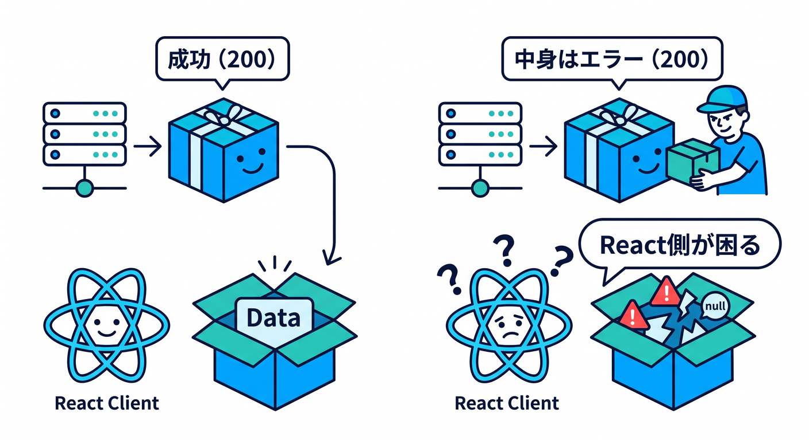
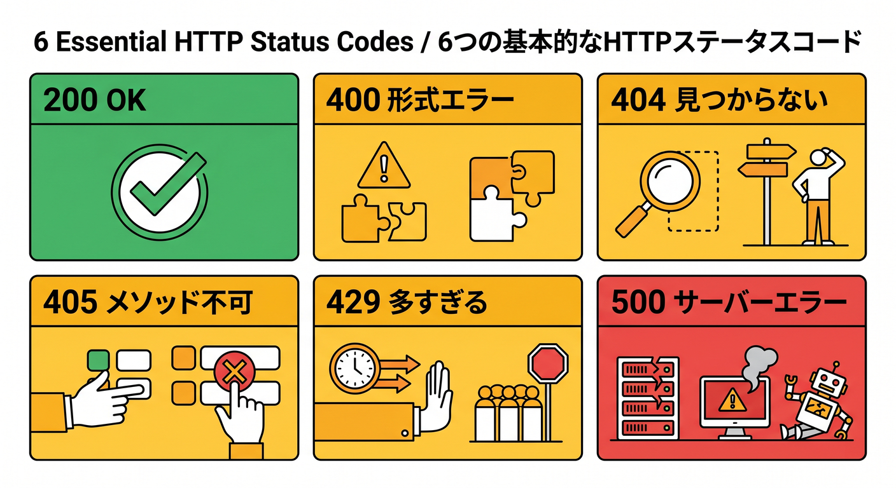
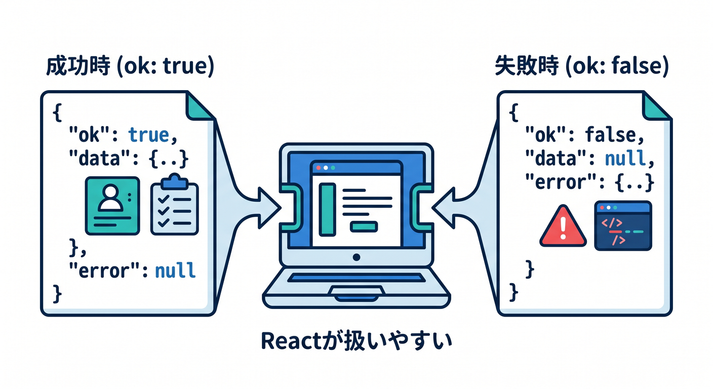
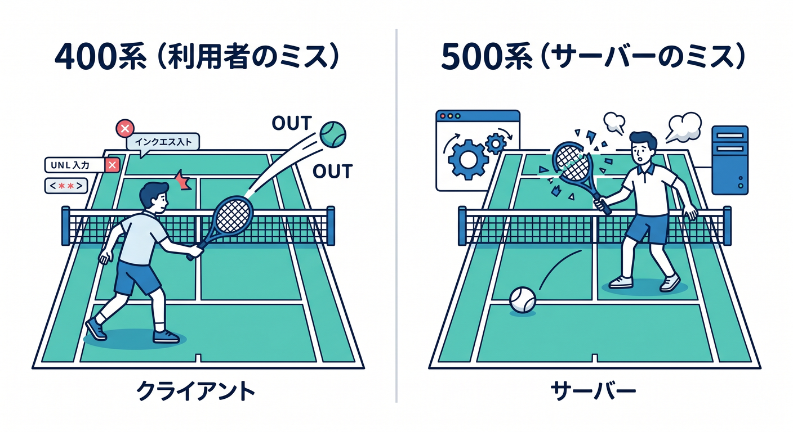
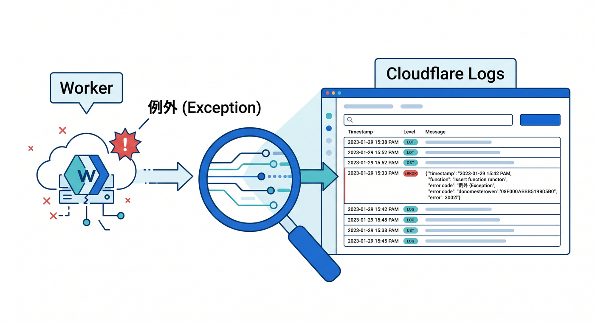
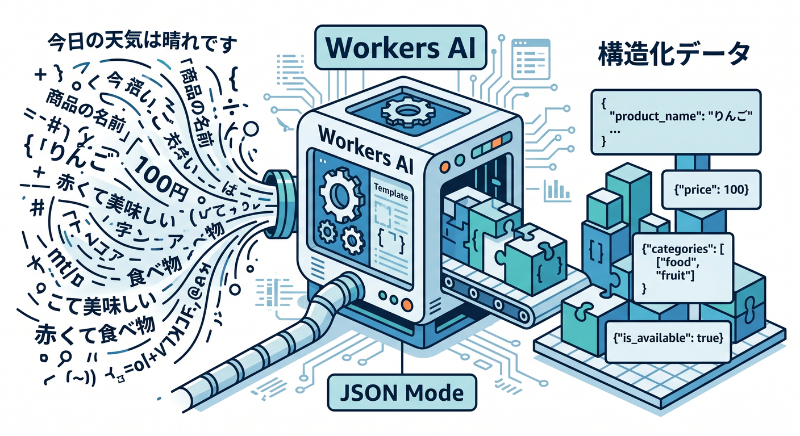

# 第07章：エラーを怖がらない！ステータスコードと失敗時の返し方を覚えよう ⚠️🧯

ここから一気に「APIっぽさ」が増します 🎯
前の章までで、URLやメソッドで処理を分ける感覚がつかめてきたはずです。次はその続きで、「うまくいかなかった時に、どう返すか」を覚えます。Cloudflare Workers では、受け取るのは Fetch API の Request、返すのは Response なので、成功でも失敗でも「どんな Response を返すか」を自分で設計していく感じです。Response には status、statusText、ok などがあり、ok は 200〜299 のときに真になります。 ([Cloudflare Docs][1])

## この章でできるようになること 🎓🌈

* 成功と失敗を、HTTPステータスコードで整理できるようになる 😊 ([MDN Web Docs][2])
* 400、404、405、500 を、自分の Worker で返せるようになる 🛠️ ([MDN Web Docs][3])
* 失敗したときも、JSON の形をそろえて返せるようになる 📦
* 予期しないエラーを console.error と Workers Logs で追えるようになる 🔍 ([Cloudflare Docs][4])
* Copilot や Cloudflare の MCP を使って、原因調査をラクに進められるようになる 🤖 ([GitHub Docs][5])

## 7-1 なぜ「失敗の返し方」が大事なの？ 💡

API は、成功した時だけきれいでも足りません 🙃
React 側や他のサービスから見ると、「失敗したのか」「何が足りないのか」「もう一回そのまま送ればいいのか」がわからないと、すごく使いづらいです。HTTP ステータスコードはそのための共通言語で、レスポンスは大きく 1xx〜5xx に分類され、特に API では 2xx が成功、4xx がリクエスト側の問題、5xx がサーバー側の問題、という見方が基本になります。 ([MDN Web Docs][2])

初心者のうちは、とりあえず全部 200 で返してしまいがちです 😅
でもそれをやると、画面側は「成功したけど中身はエラー」みたいなややこしい判定を毎回書くことになります。なのでこの章では、「成功は成功の番号」「失敗は失敗の番号」で返すクセをつけます。これは後で React から呼ぶ時も、D1 とつなぐ時も、Workers AI を組み込む時もかなり効きます。 ([MDN Web Docs][2])



## 7-2 まず覚えるべきステータスコード6個 🚦

最初はこの6個で十分です 👍

* **200 OK**
  リクエスト成功です。GET でデータ取得できた、POST の処理がうまく終わった、という時の基本です。 ([MDN Web Docs][6])

* **400 Bad Request**
  リクエストの内容が不足している、形式が変、必要な値がない、という時です。たとえば「id が必須なのに空」みたいな場面で使います。 ([MDN Web Docs][3])

* **404 Not Found**
  URL 自体が違う時にも使えますし、URL は合っているけど「そのIDのデータが存在しない」時にも使えます。APIではかなり出番が多いです。 ([MDN Web Docs][7])

* **405 Method Not Allowed**
  URL は合っているけれど、その場所ではそのHTTPメソッドは使えない、という意味です。たとえば「この API は GET 専用なのに POST で来た」みたいなケースです。405 レスポンスには、使えるメソッド一覧を Allow ヘッダーで返すのが仕様です。 ([MDN Web Docs][8])

* **429 Too Many Requests**
  短時間に叩かれすぎた時の番号です。今章では読むだけでOKですが、Cloudflare Workers の Rate Limiting API はルート単位・ユーザー単位などで制限を書けます。Retry-After ヘッダーを返す設計もよく使います。 ([MDN Web Docs][9])

* **500 Internal Server Error**
  サーバー側で予期しない問題が起きた時です。たとえばコードのバグ、想定外の例外、外部サービス障害などです。 ([MDN Web Docs][10])



## 7-3 まずは「失敗しても形がそろうAPI」を作ろう 🧱✨

この章のポイントは、**失敗のJSONを毎回バラバラにしないこと** です。
たとえば成功時は「ok: true と data」、失敗時は「ok: false と error」のようにそろえるだけで、React 側がかなり書きやすくなります。Cloudflare の公式例でも Workers では Response.json(...) を使って JSON を返す形が多く、400 を返す例も案内されています。 ([Cloudflare Docs][11])

下の Worker は、かなり教材向けにシンプル化した「エラー設計の基本形」です 😊

```ts
type ApiErrorCode =
  | "BAD_REQUEST"
  | "NOT_FOUND"
  | "METHOD_NOT_ALLOWED"
  | "INTERNAL_ERROR";

type ApiSuccess<T> = {
  ok: true;
  data: T;
};

type ApiFailure = {
  ok: false;
  error: {
    code: ApiErrorCode;
    message: string;
    details?: unknown;
  };
};

function success<T>(data: T, status = 200): Response {
  return Response.json(
    { ok: true, data } satisfies ApiSuccess<T>,
    { status }
  );
}

function failure(
  status: number,
  code: ApiErrorCode,
  message: string,
  details?: unknown,
  headers?: HeadersInit
): Response {
  return Response.json(
    {
      ok: false,
      error: {
        code,
        message,
        ...(details !== undefined ? { details } : {}),
      },
    } satisfies ApiFailure,
    { status, headers }
  );
}

export default {
  async fetch(request: Request): Promise<Response> {
    const url = new URL(request.url);

    try {
      if (url.pathname !== "/api/profile") {
        return failure(404, "NOT_FOUND", "そのURLは見つかりませんでした。");
      }

      if (request.method !== "GET") {
        return failure(
          405,
          "METHOD_NOT_ALLOWED",
          "このURLでは GET だけ使えます。",
          undefined,
          { Allow: "GET" }
        );
      }

      const id = url.searchParams.get("id");
      if (!id) {
        return failure(400, "BAD_REQUEST", "id クエリが必要です。");
      }

      const profiles: Record<string, { id: string; name: string; role: string }> = {
        "1": { id: "1", name: "Aoi", role: "student" },
        "2": { id: "2", name: "Sora", role: "creator" },
      };

      const profile = profiles[id];
      if (!profile) {
        return failure(404, "NOT_FOUND", "指定されたユーザーは存在しません。");
      }

      return success(profile);
    } catch (error) {
      console.error("unexpected error", error);
      return failure(
        500,
        "INTERNAL_ERROR",
        "サーバー側で予期しないエラーが起きました。"
      );
    }
  },
};
```

この形のよいところは3つあります 🌟
1つ目は、画面側が「ok を見ればよい」ので分岐しやすいこと。2つ目は、404 や 400 の意味がすぐ読めること。3つ目は、500 の時に内部の生エラーをそのまま利用者へ見せず、詳しい情報はログへ出せることです。Response では status や statusText を設定でき、Workers では Response.json を使った JSON 応答も自然に書けます。 ([Cloudflare Docs][12])



## 7-4 実際にどう返るかをイメージしよう 👀📮

たとえばこの Worker をローカルで動かすと、次のようなイメージになります。

```bash
curl "http://127.0.0.1:8787/api/profile?id=1"
```

成功時のイメージ 👇

```json
{
  "ok": true,
  "data": {
    "id": "1",
    "name": "Aoi",
    "role": "student"
  }
}
```

```bash
curl "http://127.0.0.1:8787/api/profile"
```

入力不足の失敗イメージ 👇

```json
{
  "ok": false,
  "error": {
    "code": "BAD_REQUEST",
    "message": "id クエリが必要です。"
  }
}
```

```bash
curl -X POST "http://127.0.0.1:8787/api/profile?id=1" -i
```

メソッド違いの失敗イメージ 👇

```http
HTTP/1.1 405 Method Not Allowed
Allow: GET
```

ここで大事なのは、「失敗した」ことを本文だけで伝えるのではなく、**HTTP の番号でも伝える** ことです。405 はそのリソースではそのメソッドが使えないことを表し、Allow ヘッダーで使えるメソッドを返すのが正しい流れです。 ([MDN Web Docs][8])


## 7-5 初学者がハマりやすい設計ミス 😵‍💫🪤

**① 何でも 200 で返してしまう**
これは本当によくあります。動いて見えるので最初は気づきにくいです。でも画面側で毎回本文の中を読んで「実は失敗でした」と判断する必要が出てきます。成功と失敗は番号から分かるようにしましょう。 ([MDN Web Docs][2])

**② 404 を「URLが違う時だけ」と思ってしまう**
APIでは「そのIDのユーザーが存在しない」みたいなケースでも 404 は自然です。URL のルート不一致にも、対象データ不在にも使われます。 ([MDN Web Docs][7])

**③ 400 と 500 を混同する**
利用者の送った内容が悪いなら 400 系、こちらのバグや障害なら 500 系です。この切り分けができるだけで、デバッグがかなりラクになります。 ([MDN Web Docs][3])

**④ 生のエラーメッセージや stack をそのまま返してしまう**
開発中は便利でも、本番では情報漏えいの元です。利用者向けには短く安全なメッセージ、詳しい情報はログに出す、という分担にするときれいです。Workers Logs はエラーや uncaught exceptions も集められます。 ([Cloudflare Docs][4])



## 7-6 Workers ならではの「本物のエラー」も知っておこう ☁️⚡

自分で 500 を返すのとは別に、**Worker がそもそも Response を返せなかった** 場合は、Cloudflare 側がエラーページを出すことがあります。公式ドキュメントでは、たとえば **1101 は JavaScript 例外**、**1102 は CPU time limit 超過** です。つまり、「自分のAPIが 500 を返した」のか、「Worker がクラッシュして Cloudflare の 11xx が出た」のかは別物です。 ([Cloudflare Docs][13])

しかも Workers には、かなり親切な検出があります 👀
たとえば Promise が解決されず、最終的に Response を返せないコードだと、「The script will never generate a response」という 1101 系エラーになることがあります。ブラウザ環境だとただ固まりそうなケースでも、Workers は明示的に教えてくれます。 ([Cloudflare Docs][13])

## 7-7 ログを見る力を、この章から育てよう 🔍📘

Cloudflare Workers には Observability と Logs の仕組みがあり、Workers Logs では invocation logs、custom logs、errors、uncaught exceptions を収集できます。しかも新しく作られた Workers では observability がデフォルトで有効になっていると案内されています。 ([Cloudflare Docs][14])

必要なら設定ファイルで明示しておくのもアリです 👍

```jsonc
{
  "observability": {
    "enabled": true,
    "head_sampling_rate": 1
  }
}
```

この設定では、ログの有効化と head-based sampling の割合を指定できます。エラー学習の段階では 1 にして、起きたことを見えやすくしておくと理解が進みやすいです。 ([Cloudflare Docs][4])



## 7-8 Copilot と Cloudflare AI を、エラー学習にどう使う？ 🤖💬

GitHub Copilot Chat は、VS Code の中でコード説明、修正提案、テスト生成などを手伝えます。GitHub 公式でも、Copilot Chat はコード提案、説明、テスト生成、修正提案に使えると案内されていて、スラッシュコマンドには **/explain**, **/fix**, **/tests** などがあります。 ([GitHub Docs][5])

この章で相性がいい聞き方は、たとえばこんな感じです 😊

* **/explain** この Worker の 400 と 500 の役割の違いを説明して
* **/fix** この catch 節が安全なエラーレスポンスになるように直して
* **/tests** 400、404、405、500 のケースを確認するテストを作って
* 「このコードで 404 と 405 が混ざっていないか見て」
* 「console.error に出すべき情報と、利用者に返すべき情報を分けて」

さらに Cloudflare 公式は、Workers 学習用に **cloudflare-docs の MCP サーバー** をつないで Workers を理解させる方法や、**cloudflare-observability の MCP サーバー** でログや例外を見て問題修正に役立てる方法も案内しています。AI を「コード生成だけ」でなく、「公式情報を引きながら原因調査する相棒」として使えるのが、いまどきの学び方です。 ([Cloudflare Docs][11])

## 7-9 Workers AI をこの章にどう絡める？ 🧠✨

この章の本筋は HTTP エラーですが、Cloudflare の AI と相性がいい考え方もここで育てられます。
Workers AI には **JSON Mode** があり、AI の出力を構造化 JSON にしやすくなっています。これは「成功でも失敗でも、返り値の形をそろえる」という API 設計の考え方とすごく相性がいいです。たとえば将来、エラーログを AI で分類して **severity、cause、nextAction** のような JSON にまとめる社内向け API を作る時、この章の考え方がそのまま使えます。 ([Cloudflare Docs][15])

ただし注意点もあります 🚨
利用者に返すエラーメッセージを、その場で AI に丸投げして長文生成するのはおすすめしません。エラー応答は短く、安定して、毎回ほぼ同じ形で返るほうが扱いやすいからです。AI は「裏側の補助」に使い、表側のエラー設計は人間が決める。この線引きがきれいです。 ([Cloudflare Docs][15])



## 7-10 この章のミニ課題 🧪🎮

1つずつ試すと、かなり身につきます ✨

* クエリの id がない時に 400 を返す
* 存在しない id の時に 404 を返す
* POST で来たら 405 と Allow ヘッダーを返す
* catch にわざと例外を起こして 500 を返す
* console.error を入れて、Workers Logs で確認する
* 余裕があれば 429 のダミー返却を作ってみる

## 章末まとめ 🏁📚

この章のゴールは、「エラーを減らすこと」ではなく、**エラーが起きても意味のある返事をできるようになること** です 💪
Cloudflare Workers では Request を受けて Response を返す形が素直なので、ステータスコード設計を早い段階で覚えると、その後の React 連携、D1、外部 API、Turnstile、Workers AI まで全部きれいにつながります。Workers 側には Logs や Observability があり、Copilot や Cloudflare の MCP も併用できるので、2026年の学習環境としてかなり強いです。 ([Cloudflare Docs][1])

この章でいちばん覚えてほしい一言はこれです 😊
**「成功の形をそろえるのと同じくらい、失敗の形をそろえるのが大事」** です。
ここができると、API は一段と“作品”っぽくなります 🎉

次の第8章では、いよいよ React 側からこの API を呼んで、「画面のエラー表示」とつなげていくと流れがとてもきれいです。

[1]: https://developers.cloudflare.com/workers/runtime-apis/request/ "Request · Cloudflare Workers docs"
[2]: https://developer.mozilla.org/ja/docs/Web/HTTP/Reference/Status?utm_source=chatgpt.com "HTTP レスポンスステータスコード - MDN Web Docs"
[3]: https://developer.mozilla.org/en-US/docs/Web/HTTP/Reference/Status/400?utm_source=chatgpt.com "400 Bad Request - HTTP - MDN Web Docs"
[4]: https://developers.cloudflare.com/workers/observability/logs/workers-logs/ "Workers Logs · Cloudflare Workers docs"
[5]: https://docs.github.com/copilot/using-github-copilot/asking-github-copilot-questions-in-your-ide "Asking GitHub Copilot questions in your IDE - GitHub Docs"
[6]: https://developer.mozilla.org/en-US/docs/Web/HTTP/Reference/Status/200?utm_source=chatgpt.com "200 OK - HTTP - MDN Web Docs - Mozilla"
[7]: https://developer.mozilla.org/ja/docs/Web/HTTP/Reference/Status/404?utm_source=chatgpt.com "404 Not Found - HTTP - MDN Web Docs - Mozilla"
[8]: https://developer.mozilla.org/ja/docs/Web/HTTP/Reference/Status/405?utm_source=chatgpt.com "405 Method Not Allowed - HTTP - MDN Web Docs"
[9]: https://developer.mozilla.org/ja/docs/Web/HTTP/Reference/Status/429?utm_source=chatgpt.com "429 Too Many Requests - HTTP - MDN Web Docs"
[10]: https://developer.mozilla.org/en-US/docs/Web/HTTP/Reference/Status/500?utm_source=chatgpt.com "500 Internal Server Error - HTTP - MDN Web Docs - Mozilla"
[11]: https://developers.cloudflare.com/workers/get-started/prompting/ "Prompting · Cloudflare Workers docs"
[12]: https://developers.cloudflare.com/workers/runtime-apis/response/ "Response · Cloudflare Workers docs"
[13]: https://developers.cloudflare.com/workers/observability/errors/ "Errors and exceptions · Cloudflare Workers docs"
[14]: https://developers.cloudflare.com/workers/observability/ "Observability · Cloudflare Workers docs"
[15]: https://developers.cloudflare.com/workers-ai/features/json-mode/ "JSON Mode · Cloudflare Workers AI docs"
