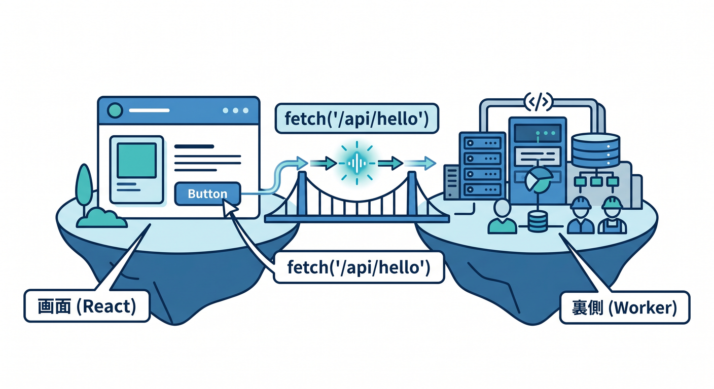
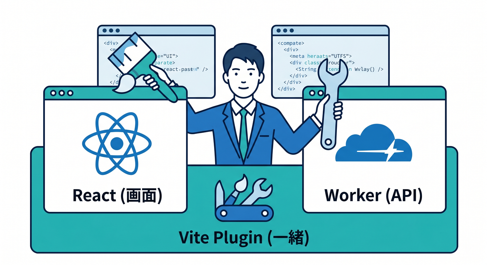
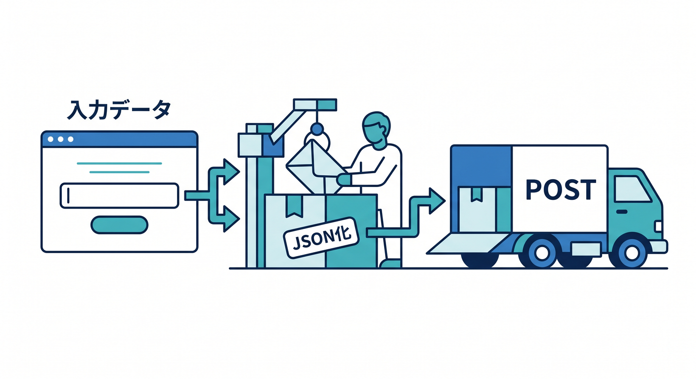
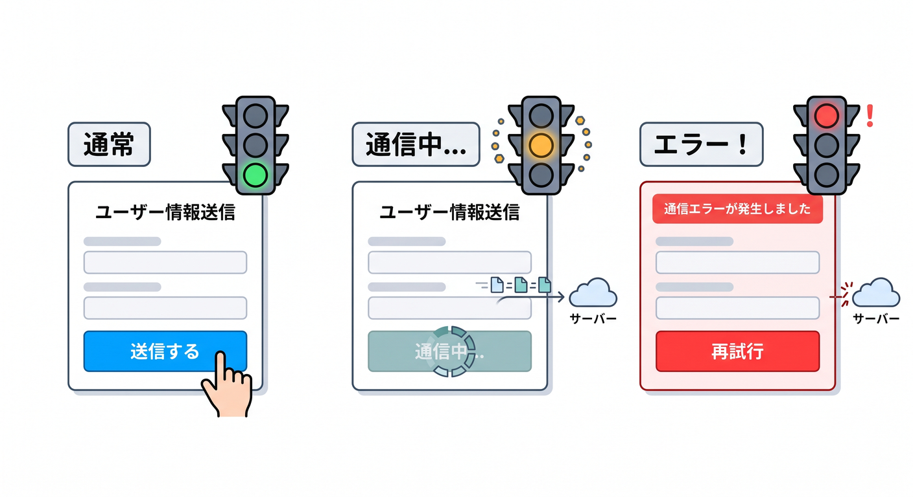
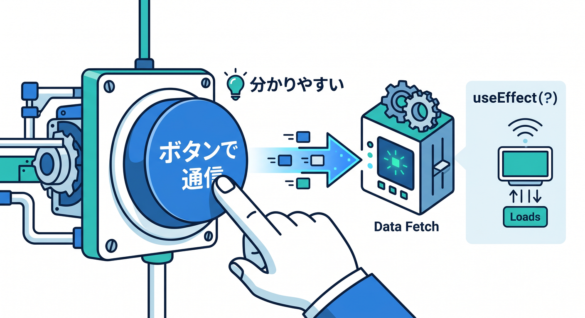
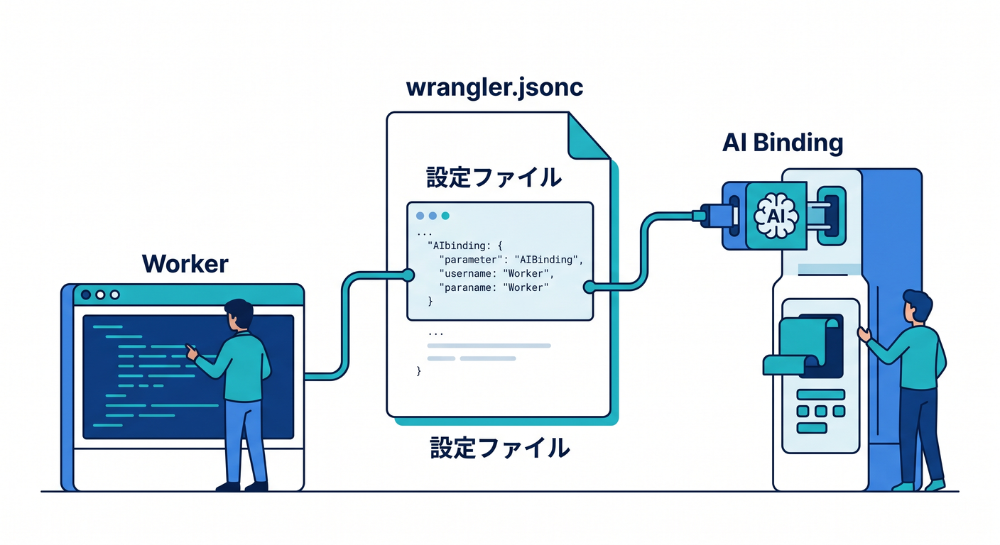
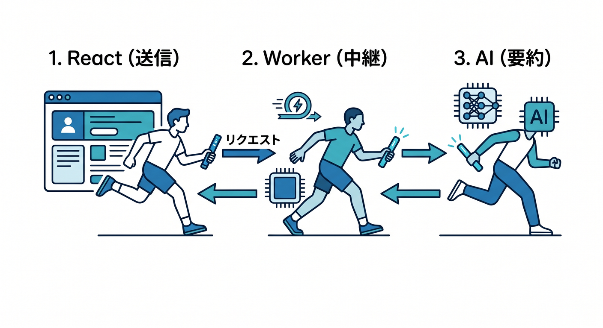

# 第08章：ReactからAPIを呼んでみよう！画面と裏側をつなぐ体験 ⚛️🌈

この章では、ついに「APIを作る側」から「APIを使う側」へ進みます 🎉
2026年4月17日時点のCloudflare公式導線では、React SPA と Workers API を Cloudflare Vite plugin でつなぐ形がかなり自然です。C3 でその土台を作れますし、Vite plugin は Workers runtime に近い形でローカル開発できるのが強みです。 ([Cloudflare Docs][1])

さらに大事なのは、React 側から Cloudflare の binding を直接触るのではなく、**React → Worker API → binding** という形でつなぐことです。Cloudflare公式でも、React アプリは Worker に `fetch()` し、その Worker が binding を使う構成が案内されています。つまりこの章は、画面とCloudflare本体を結ぶ“本当に大事な橋”を学ぶ章です 🌉✨ ([Cloudflare Docs][1])

この章では、まず **同じアプリの中に React と API を置く** 進め方にします 😊
これなら `fetch("/api/...")` のような相対パスで呼べるので、初心者がつまずきやすい CORS をいったん後回しにできます。Cloudflare公式の React + Vite ガイドや SPA with API チュートリアルも、この方向で学ぶ流れになっています。 ([Cloudflare Docs][1])

---

## この章のゴール 🎯

この章を終えるころには、こんなことができるようになります ✨

* React の画面から `fetch()` で Worker API を呼べる
* ボタンを押して結果を表示できる
* 入力欄の値を POST で送れる
* ローディング中とエラー時の見せ方を作れる
* Workers AI を API の後ろに差し込む入口がわかる
* 「画面」と「裏側」の役割分担が理解できる

---



## まず頭の中に入れたい全体図 🧠🗺️

この章の構成は、こんなイメージです。

```text
[Reactの画面]
   ↓ fetch("/api/...")
[Cloudflare Worker]
   ↓ 必要なら binding を使う
[D1 / Workers AI / KV / 外部API など]
```

ここでのポイントはシンプルです 👇

* **React** は見た目を担当 🎨
* **Worker** は受付と処理を担当 🧾
* **binding** はCloudflareの機能へつなぐ入口 🔌

Cloudflare Vite plugin は、Vite と Workers runtime をしっかり結びつけ、フロント資産のビルドや Workers API の開発をまとめて扱えます。ローカルでも HMR を使いながら、かなり本番に近い感覚で進められます。 ([Cloudflare Docs][2])

---



## この章で作る小さな完成作品 🛠️🌟

今回は、次の3機能を持つミニアプリを作る想定で進めると学びやすいです。

1. **GET /api/hello** を呼んでメッセージを表示する 👋
2. **POST /api/echo** に名前を送り、あいさつを返してもらう 📨
3. おまけで **POST /api/ai/summary** に文章を送り、AI要約を受け取る 🤖

この順番が大事です。
いきなりAIから始めるより、まずは普通のAPI呼び出しで手応えを作って、そのあと Workers AI を差し込む方が理解しやすいです 🙌

---

## プロジェクトの作り方 🚀

Cloudflare公式の React ガイドでは、C3 から React 用のフルスタック土台を作れます。React SPA、Worker API、Cloudflare Vite plugin をまとめて始められるのが便利です。 ([Cloudflare Docs][1])

```bash
npm create cloudflare@latest -- my-react-app --framework=react
cd my-react-app
npm run dev
```

このとき、公式ガイドで押さえておきたいファイルは次の4つです 📁

* `src/App.tsx` … React の画面
* `worker/index.ts` … Worker API
* `vite.config.ts` … Cloudflare Vite plugin の設定
* `wrangler.jsonc` または `wrangler.toml` … Worker 設定

Cloudflare公式では、このテンプレートで `main` が Worker エントリを指し、React アプリが `src/App.tsx` から `/api/` を呼ぶ構成が紹介されています。さらに `assets.not_found_handling = "single-page-application"` により、SPA の画面ルートは Worker に行かず資産側で扱われます。 ([Cloudflare Docs][1])

---

## 先に理解しておきたい設定ポイント ⚙️

SPA と API を同居させるなら、`wrangler.jsonc` の考え方がかなり大事です。Cloudflare公式チュートリアルでは、`assets.not_found_handling = "single-page-application"` を設定し、必要に応じて `run_worker_first = ["/api/*"]` を使う構成が案内されています。これにより、画面ルートと API ルートの交通整理がきれいにできます。 ([Cloudflare Docs][3])

まずはこう考えるとわかりやすいです 😊

* `/` や `/about` などの画面ルート → React 側へ
* `/api/...` → Worker 側へ

設定例です。

```jsonc
{
  "$schema": "./node_modules/wrangler/config-schema.json",
  "name": "my-react-app",
  "main": "./worker/index.ts",
  "compatibility_date": "2026-04-17",
  "assets": {
    "not_found_handling": "single-page-application",
    "run_worker_first": ["/api/*"]
  }
}
```

---

## Worker 側のAPIを作ろう 🧱📡

まずは Worker に、やさしい API を2本置きます。
この章では「Reactから呼ぶためのAPI」という意識で書くのがコツです ✨

```ts
export interface Env {}

const json = (data: unknown, init?: ResponseInit) => {
  return Response.json(data, {
    headers: {
      "cache-control": "no-store",
    },
    ...init,
  });
};

export default {
  async fetch(request: Request): Promise<Response> {
    const url = new URL(request.url);

    // GET /api/hello
    if (request.method === "GET" && url.pathname === "/api/hello") {
      return json({
        message: "こんにちは！Cloudflare Workers APIです 👋",
      });
    }

    // POST /api/echo
    if (request.method === "POST" && url.pathname === "/api/echo") {
      try {
        const body = (await request.json()) as { name?: string };

        if (!body.name || !body.name.trim()) {
          return json(
            { error: "name を入力してください 🙏" },
            { status: 400 }
          );
        }

        return json({
          message: `こんにちは、${body.name}さん！🎉`,
        });
      } catch {
        return json(
          { error: "JSONの形式が正しくありません ⚠️" },
          { status: 400 }
        );
      }
    }

    return json({ error: "Not Found" }, { status: 404 });
  },
} satisfies ExportedHandler<Env>;
```

ここで学んでほしいのは、コードそのものよりも役割分担です 😊

* URL を見て処理を分ける
* GET は取得、POST は送信
* エラーも JSON で返す
* React が扱いやすい形で返す

第7章で学んだ「失敗時の返し方」が、ここでいきなり生きてきます 🔥

---

## React 側から GET を呼んでみよう ⚛️📥

次は `src/App.tsx` 側です。
まずは一番わかりやすい、**ボタンを押したらGETで取得して表示** をやってみます。

```tsx
import { useState } from "react";

type HelloResponse = {
  message: string;
};

export default function App() {
  const [message, setMessage] = useState("");
  const [loading, setLoading] = useState(false);
  const [error, setError] = useState("");

  const loadHello = async () => {
    setLoading(true);
    setError("");

    try {
      const res = await fetch("/api/hello");

      if (!res.ok) {
        throw new Error(`HTTP ${res.status}`);
      }

      const data = (await res.json()) as HelloResponse;
      setMessage(data.message);
    } catch (err) {
      setError("メッセージの取得に失敗しました 😢");
      console.error(err);
    } finally {
      setLoading(false);
    }
  };

  return (
    <main style={{ maxWidth: 720, margin: "40px auto", fontFamily: "sans-serif" }}>
      <h1>React から Cloudflare API を呼ぼう ⚛️🌈</h1>

      <button onClick={loadHello} disabled={loading}>
        {loading ? "読み込み中..." : "GET /api/hello を呼ぶ"}
      </button>

      {message && <p>結果: {message}</p>}
      {error && <p style={{ color: "crimson" }}>{error}</p>}
    </main>
  );
}
```

Cloudflare公式のチュートリアルでも、React 側から `fetch("/api/")` のように相対パスで Worker API を呼ぶ例が示されています。しかも Vite plugin によって、クライアントとサーバーを一緒にいじっても、UI状態を保ちながら反復しやすいのが強みです。 ([Cloudflare Docs][3])

---



## 次は POST で入力値を送ろう 📨✨

GET だけだと、まだ「表示しているだけ」です。
ここから一気にアプリっぽくなります 😎

```tsx
import { useState } from "react";

type ApiResponse = {
  message?: string;
  error?: string;
};

export default function App() {
  const [name, setName] = useState("");
  const [result, setResult] = useState("");
  const [loading, setLoading] = useState(false);
  const [error, setError] = useState("");

  const sendName = async () => {
    setLoading(true);
    setError("");
    setResult("");

    try {
      const res = await fetch("/api/echo", {
        method: "POST",
        headers: {
          "content-type": "application/json",
        },
        body: JSON.stringify({ name }),
      });

      const data = (await res.json()) as ApiResponse;

      if (!res.ok) {
        setError(data.error ?? "送信に失敗しました 😢");
        return;
      }

      setResult(data.message ?? "");
    } catch (err) {
      setError("通信エラーが発生しました ⚠️");
      console.error(err);
    } finally {
      setLoading(false);
    }
  };

  return (
    <main style={{ maxWidth: 720, margin: "40px auto", fontFamily: "sans-serif" }}>
      <h1>名前をAPIへ送ろう 📨</h1>

      <input
        value={name}
        onChange={(e) => setName(e.target.value)}
        placeholder="名前を入力"
        style={{ padding: 8, width: "100%", maxWidth: 320 }}
      />

      <div style={{ marginTop: 12 }}>
        <button onClick={sendName} disabled={loading}>
          {loading ? "送信中..." : "POST /api/echo を呼ぶ"}
        </button>
      </div>

      {result && <p>結果: {result}</p>}
      {error && <p style={{ color: "crimson" }}>{error}</p>}
    </main>
  );
}
```

ここで学生さんに特に覚えてほしいのはこの3点です 📌

* 送信前に `JSON.stringify()` する
* `content-type: application/json` を付ける
* `res.ok` を見て成功・失敗を分ける

---



## ローディングとエラー表示は“おまけ”ではなく本体です 🚦💡

初心者のうちは「通信ができた！」だけで満足しがちですが、実務ではここがとても大事です。

たとえば、こんな場面は必ず起きます 👇

* クリック直後、まだ返事が来ていない
* 入力が空だった
* JSON が壊れていた
* サーバー側で 400 や 404 が返った
* ネットワークエラーが起きた

この章では、**成功したときだけでなく、失敗したときの見せ方もReact側で受け止める** のが目標です 💪
第7章のエラー設計と、React の画面制御がここで合体します 🤝

---



## 第8章では `useEffect` より「ボタン駆動」から入るのがおすすめ 🪜

もちろん React では `useEffect` で初回読み込み時に API を呼ぶ書き方もあります。
でも第8章の最初の一歩では、**ボタンを押して呼ぶ** 形のほうが理解しやすいです 😊

理由はシンプルです。

* 「いつ通信したか」が目でわかる 👀
* `loading` の意味がつかみやすい ⏳
* エラー時の分岐も追いやすい 🧭
* `useEffect` の依存配列で混乱しにくい 🙆

つまり、**通信そのものの学習に集中できる** んですね。

---



## AI を軽く差し込んでみよう 🤖✨

この教材では Cloudflare の AI を積極的に絡めたいので、第8章でも“入口だけ”入れておくとすごく良いです。
Cloudflare公式では、Workers AI は Worker に binding を作って `env.AI.run()` で呼び出す形が基本です。React 側は直接 binding を触れないので、やはり Worker が窓口になります。 ([Cloudflare Docs][4])

まずは `wrangler.jsonc` に AI binding を追加します。

```jsonc
{
  "$schema": "./node_modules/wrangler/config-schema.json",
  "name": "my-react-app",
  "main": "./worker/index.ts",
  "compatibility_date": "2026-04-17",
  "assets": {
    "not_found_handling": "single-page-application",
    "run_worker_first": ["/api/*"]
  },
  "ai": {
    "binding": "AI"
  }
}
```

Cloudflare公式では、この設定で Worker から `env.AI` として Workers AI を使えます。`env.AI.run()` でモデルを実行するのが基本です。なお、Workers AI はローカル開発中でも実際にアカウントへアクセスして推論を行うため、利用時は課金に注意が必要です。 ([Cloudflare Docs][4])

---



## Worker に AI 要約APIを足す例 🧠📝

```ts
export interface Env {
  AI: Ai;
}

const json = (data: unknown, init?: ResponseInit) => {
  return Response.json(data, init);
};

export default {
  async fetch(request: Request, env: Env): Promise<Response> {
    const url = new URL(request.url);

    if (request.method === "POST" && url.pathname === "/api/ai/summary") {
      try {
        const body = (await request.json()) as { text?: string };

        if (!body.text || !body.text.trim()) {
          return json({ error: "text を入力してください ✍️" }, { status: 400 });
        }

        const result = await env.AI.run("@cf/meta/llama-3.1-8b-instruct", {
          prompt: `次の文章を日本語で3行以内に要約してください。\n\n${body.text}`,
        });

        return json({ result });
      } catch {
        return json({ error: "AI要約に失敗しました ⚠️" }, { status: 500 });
      }
    }

    return json({ error: "Not Found" }, { status: 404 });
  },
} satisfies ExportedHandler<Env>;
```

Cloudflare公式の Workers AI ガイドでは、Worker に AI binding を追加し、`env.AI.run("@cf/meta/llama-3.1-8b-instruct", ...)` のようにモデルを呼ぶ例が紹介されています。第8章では、AIを“Reactから直接呼ぶ”のではなく、“Reactが自分のWorker APIを呼び、その先でAIを使う”という形にしておくのが理解しやすいです。 ([Cloudflare Docs][4])

---

## React 側から AI 要約を呼ぶ例 ✨

```tsx
import { useState } from "react";

type SummaryResponse = {
  result?: unknown;
  error?: string;
};

export default function App() {
  const [text, setText] = useState("");
  const [summary, setSummary] = useState("");
  const [loading, setLoading] = useState(false);
  const [error, setError] = useState("");

  const summarize = async () => {
    setLoading(true);
    setError("");
    setSummary("");

    try {
      const res = await fetch("/api/ai/summary", {
        method: "POST",
        headers: {
          "content-type": "application/json",
        },
        body: JSON.stringify({ text }),
      });

      const data = (await res.json()) as SummaryResponse;

      if (!res.ok) {
        setError(data.error ?? "要約に失敗しました 😢");
        return;
      }

      const output =
        typeof data.result === "string"
          ? data.result
          : JSON.stringify(data.result, null, 2);

      setSummary(output);
    } catch (err) {
      setError("通信エラーが発生しました ⚠️");
      console.error(err);
    } finally {
      setLoading(false);
    }
  };

  return (
    <main style={{ maxWidth: 720, margin: "40px auto", fontFamily: "sans-serif" }}>
      <h1>AI 要約デモ 🤖</h1>

      <textarea
        value={text}
        onChange={(e) => setText(e.target.value)}
        rows={8}
        style={{ width: "100%" }}
        placeholder="要約したい文章を入力"
      />

      <div style={{ marginTop: 12 }}>
        <button onClick={summarize} disabled={loading}>
          {loading ? "要約中..." : "AIで要約する"}
        </button>
      </div>

      {summary && (
        <pre style={{ whiteSpace: "pre-wrap", marginTop: 16 }}>{summary}</pre>
      )}
      {error && <p style={{ color: "crimson" }}>{error}</p>}
    </main>
  );
}
```

これで「入力 → POST送信 → Worker → Workers AI → Reactへ結果表示」という流れが体感できます 🎊
第13章でAI APIを本格化する前の、ちょうどいい助走になります。

---

## この章で初心者がハマりやすいポイント 😵‍💫🧩

### 1. `fetch("https://どこかのURL")` にしてしまう

この章では、まず **相対パス** の `fetch("/api/hello")` を使うのがコツです。
同じアプリ内の API を呼ぶなら、これが一番わかりやすいです。

### 2. POST なのに `headers` を付け忘れる

`application/json` を付けないと、あとで混乱しやすいです。

### 3. `await res.json()` の前に `res.ok` を見ない

成功と失敗を分けて考えるクセをつけましょう。

### 4. 画面側で loading を作らない

通信しているのに何も変わらないと、ユーザーは「壊れた？」と思います 😢

### 5. React から binding を直接使おうとする

binding は Worker 側です。React は Worker API を通して使います。Cloudflare公式もこの形を基本導線にしています。 ([Cloudflare Docs][1])

---

## Copilot をこの章でどう使うか 🤝🧠

2026年の学び方として、Copilot はかなり相性がいいです。GitHub公式では、MCP は Copilot を他システムとつなぐための仕組みで、IDE や CLI、GitHub.com 上の agent にも広がっています。VS Code 側でも MCP サーバーは tools・resources・prompts・interactive apps を提供でき、Copilot の文脈強化に使えます。さらに Cloudflare公式は Workers 学習向けに docs MCP と observability MCP を案内しています。 ([GitHub Docs][5])

VS Code の Copilot 自体も、いまは単なる補完だけではなく、プロジェクト全体を見て計画・編集・検証するエージェント的な使い方が前提になっています。だからこの章では、次のような聞き方がかなり有効です。 ([Visual Studio Code][6])

おすすめの使い方です ✨

* 「この `fetch("/api/echo")` の流れを初心者向けに説明して」
* 「`loading` と `error` を追加して」
* 「400 と 500 の返し分けを改善して」
* 「この Worker を Hono に書き換えず、そのまま整理して」
* 「Cloudflare docs を踏まえて `run_worker_first` の意味を要約して」
* 「Workers AI binding を追加したときの型定義を見直して」

GitHubのMCPまわりは VS Code で追加・管理でき、GitHub MCP server は Visual Studio Code ではリモート構成が推奨されています。組織利用ではポリシー制御が入ることもあります。 ([GitHub Docs][7])

---

## この章のおすすめ課題 🎓🔥

### 課題1　天気っぽいダミー表示を作る ☀️

`GET /api/weather` を作って、固定JSONを返す
React で「東京」「大阪」ボタンを押したら表示を切り替える

### 課題2　問い合わせミニフォームを作る 📨

名前と本文を入力し、`POST /api/contact-preview` へ送る
まだ保存はしないで、「受け取った内容をそのまま返すAPI」にする

### 課題3　AI説明文メーカーを作る 🤖

商品名を入力すると、Worker が Workers AI に投げて
「紹介文っぽい一文」を返す

### 課題4　エラー練習 💥

空文字を送ったら 400
存在しないURLなら 404
例外時は 500
これを React 側で見分けて表示する

---

## 第8章のまとめ 🎁

この章の本質は、React を覚えることそのものではありません。
**「画面からAPIを使うと、アプリになる」** を体でつかむことです ⚛️🌈

覚えておきたいキーワードはこの4つです。

* `fetch()` で呼ぶ 📡
* `useState` で画面を変える 🎛️
* Worker がAPIの窓口になる 🚪
* binding や AI は Worker の奥で使う 🔌🤖

Cloudflare公式の現在の流れでも、React SPA + Worker API + Vite plugin はかなり扱いやすい基本形ですし、Workers AI も binding 経由で自然に差し込めます。第8章でこの形に慣れておくと、第9章のCORS、第11章のD1、第13章のAI APIにつながりやすくなります。 ([Cloudflare Docs][1])

---

## 章末チェックリスト ✅🎉

* React から `fetch("/api/...")` を呼べる
* GET と POST の両方を画面から試せる
* `loading` と `error` を表示できる
* Worker が React と Cloudflare機能の橋渡しだと理解している
* Workers AI を API の奥に差し込むイメージがある

必要なら次に、そのまま続けて
**「第8章の完成版教材として、導入文・本文・練習問題・まとめまで含む“そのまま掲載できる記事形式”」** に整えて出します。

[1]: https://developers.cloudflare.com/workers/framework-guides/web-apps/react/ "React + Vite · Cloudflare Workers docs"
[2]: https://developers.cloudflare.com/workers/vite-plugin/ "Vite plugin · Cloudflare Workers docs"
[3]: https://developers.cloudflare.com/workers/vite-plugin/tutorial/ "Tutorial - React SPA with an API · Cloudflare Workers docs"
[4]: https://developers.cloudflare.com/workers-ai/configuration/bindings/ "Workers Bindings · Cloudflare Workers AI docs"
[5]: https://docs.github.com/en/copilot/concepts/context/mcp "About Model Context Protocol (MCP) - GitHub Docs"
[6]: https://code.visualstudio.com/docs/copilot/overview "GitHub Copilot in VS Code"
[7]: https://docs.github.com/en/copilot/how-tos/provide-context/use-mcp-in-your-ide/set-up-the-github-mcp-server "Setting up the GitHub MCP Server - GitHub Docs"
