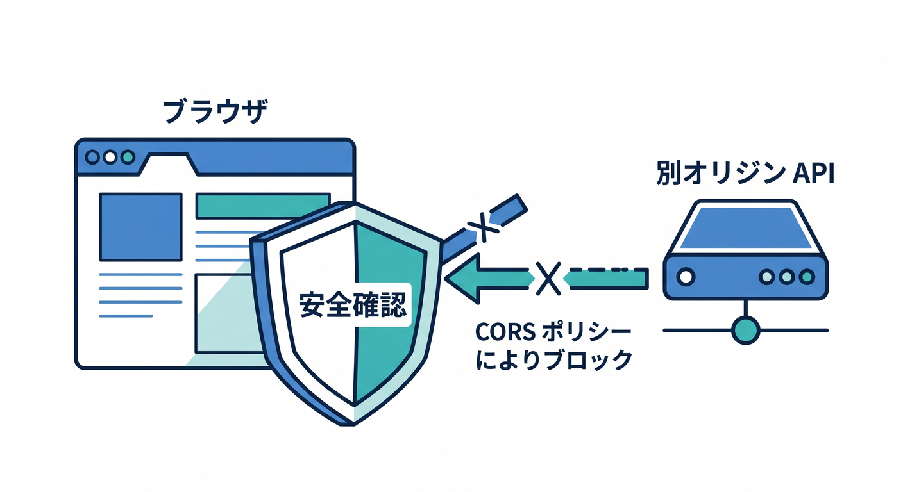
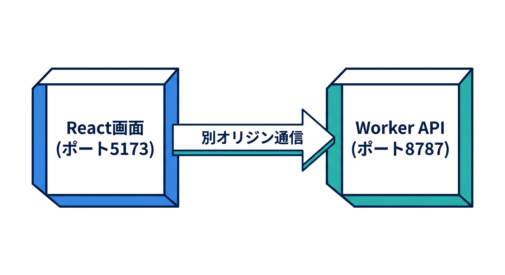
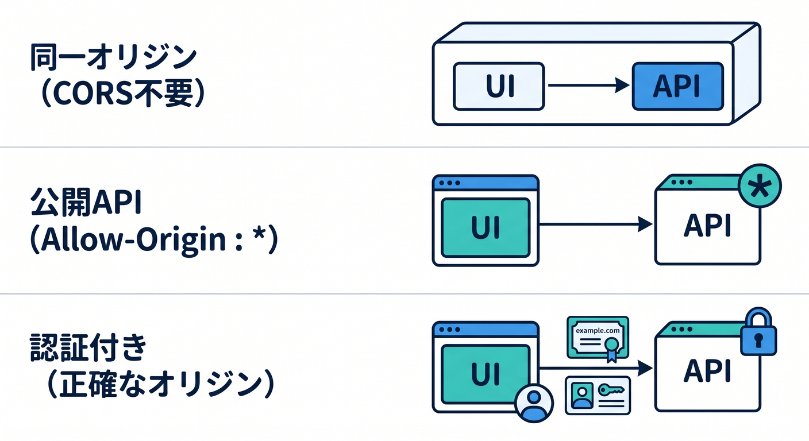
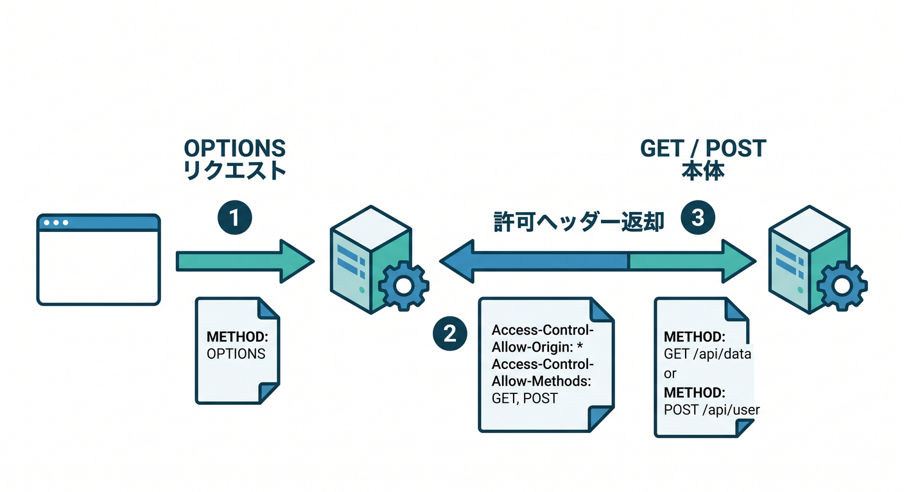
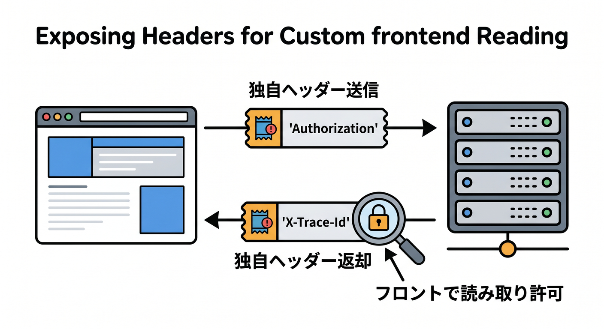
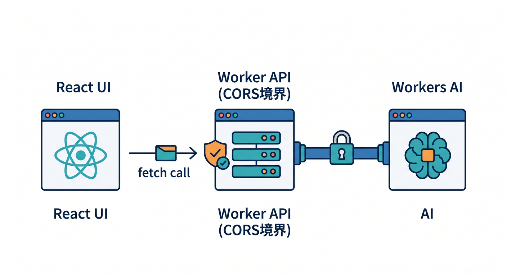

# 第09章：CORSをやさしく理解しよう！“つながらない理由”を見抜けるようにする 🌐🧩

この章では、React の画面から Cloudflare Workers の API を呼んだときに出やすい **CORS エラー**を、ふわっとではなく「なぜ起きるのか」から理解します。CORS は、**ブラウザが別オリジンへのアクセスを安全に制御するための HTTP ヘッダーベースの仕組み**です。オリジンは **ドメイン・スキーム・ポート**で決まり、ブラウザは必要に応じて本番リクエストの前に **`OPTIONS` のプリフライト**を送ります。([MDN Web Docs][1])

## この章のゴール 🎯

* CORS が「API のバグ」ではなく、**ブラウザ側の安全確認**だと分かる 😊 ([MDN Web Docs][2])
* `Access-Control-Allow-Origin`、`Access-Control-Allow-Methods`、`Access-Control-Allow-Headers` の役割を区別できるようになる 🧠 ([MDN Web Docs][3])
* `POST + JSON` で `OPTIONS` が増えやすい理由を説明できるようになる 📮 ([MDN Web Docs][4])
* Cloudflare Workers で **実際のレスポンス**にも **`OPTIONS` レスポンス**にも CORS ヘッダーを付ける形を書けるようになる 🛠️ ([Cloudflare Docs][5])

---

## 9-1. まず、CORSって何？ 🌍



CORS は、同一オリジンポリシーを必要な範囲でゆるめるための仕組みです。たとえば、React の画面が `https://app.example.com`、API が `https://api.example.com` にあると、ブラウザから見るとこれは **別オリジン**です。そこでサーバー側が「このオリジンからの読み取りは許可しますよ」とヘッダーで伝えないと、ブラウザは JavaScript からそのレスポンスを読ませません。([MDN Web Docs][1])

ここで大事なのは、**CORS はブラウザのルール**だということです。だから、サーバーそのものは返事していても、ブラウザのコンソールでは「読み取りをブロックした」と見えることがあります。初心者のうちは「API が死んでる」と思いがちですが、実際は **ヘッダー不足**のことがとても多いです。([MDN Web Docs][6])

---

## 9-2. 第8章の React 連携で急に出やすくなる理由 😵‍💫



第8章までは「API 単体」で動かしていても、React 側と API 側を別々に立てた瞬間に CORS が出やすくなります。たとえば `http://localhost:5173` の画面から `http://localhost:8787` の Worker を呼ぶと、**ポートが違うので別オリジン**です。さらに `fetch()` はクロスオリジン時に既定で CORS の仕組みに従います。([MDN Web Docs][1])

しかも、よくある `POST` の JSON 送信は `Content-Type: application/json` を使いますが、CORS のセーフリストに入る `Content-Type` は `application/x-www-form-urlencoded`、`multipart/form-data`、`text/plain` です。つまり **JSON を送っただけでプリフライトが発生しやすい**ので、学習がここで一気に詰まりやすいわけです。([MDN Web Docs][4])

---

## 9-3. まずはこの3パターンだけ覚えよう ✍️



**パターンA：画面と API が同一オリジン**
同じオリジンで配信できているなら、CORS をほぼ意識しなくて済みます。Cloudflare の現行導線では React + Vite + Workers API を組み合わせたフルスタック構成が案内されており、Cloudflare Vite plugin はローカルでも `workerd` 上で動くため、本番に近い確認がしやすいです。なので、構成次第では「CORS を学ぶ」のとは別に、「そもそも CORS が起きにくい置き方をする」こともできます。([Cloudflare Docs][7])

**パターンB：別オリジンだけど公開 API として読ませたい**
この場合は `Access-Control-Allow-Origin` を返します。公開読み取りだけなら `*` でも動かせます。([MDN Web Docs][3])

**パターンC：別オリジン + Cookie や認証情報も使いたい**
この場合は `*` ではなく **正確なオリジン**を返し、必要なら `Access-Control-Allow-Credentials: true` を付けます。さらに、オリジンごとに返す値が変わるなら `Vary: Origin` も必要です。([MDN Web Docs][8])

---

## 9-4. まず動かす！最小の CORS 対応 Worker 🛠️✨



最初の教材としては、「許可するオリジンを絞る形」で覚えるのがおすすめです。`*` は理解用には便利ですが、あとで認証つき構成へ進むと考え直しが発生しやすいからです。([MDN Web Docs][8])

```ts
const ALLOWED_ORIGINS = new Set([
  "http://localhost:5173",
  "https://example-frontend.pages.dev",
]);

function buildCorsHeaders(request: Request): Headers {
  const headers = new Headers();
  const origin = request.headers.get("Origin");

  if (!origin) return headers;
  if (!ALLOWED_ORIGINS.has(origin)) return headers;

  headers.set("Access-Control-Allow-Origin", origin);
  headers.set("Vary", "Origin");
  headers.set("Access-Control-Allow-Methods", "GET,POST,OPTIONS");
  headers.set("Access-Control-Allow-Headers", "Content-Type, Authorization");
  headers.set("Access-Control-Max-Age", "86400");

  return headers;
}

function json(data: unknown, init: ResponseInit = {}, corsHeaders?: Headers): Response {
  const headers = new Headers(init.headers);
  headers.set("Content-Type", "application/json; charset=utf-8");

  if (corsHeaders) {
    corsHeaders.forEach((value, key) => headers.set(key, value));
  }

  return new Response(JSON.stringify(data), {
    ...init,
    headers,
  });
}

export default {
  async fetch(request: Request): Promise<Response> {
    const url = new URL(request.url);
    const corsHeaders = buildCorsHeaders(request);

    if (request.method === "OPTIONS") {
      if (!corsHeaders.has("Access-Control-Allow-Origin")) {
        return new Response("CORS origin denied", { status: 403 });
      }

      return new Response(null, {
        status: 204,
        headers: corsHeaders,
      });
    }

    if (url.pathname === "/api/hello" && request.method === "GET") {
      return json({ message: "CORS OK 🎉" }, { status: 200 }, corsHeaders);
    }

    if (url.pathname === "/api/contact" && request.method === "POST") {
      const body = await request.json<{ name?: string }>().catch(() => null);

      if (!body?.name) {
        return json({ error: "name is required" }, { status: 400 }, corsHeaders);
      }

      return json(
        { message: `こんにちは、${body.name}さん` },
        { status: 200 },
        corsHeaders,
      );
    }

    return json({ error: "Not Found" }, { status: 404 }, corsHeaders);
  },
} satisfies ExportedHandler;
```

このコードのポイントは3つです。
1つ目は **`OPTIONS` を先に処理**していること。プリフライトは `OPTIONS` なので、ここで許可メソッドや許可ヘッダーを返します。
2つ目は **実際の `GET` / `POST` のレスポンスにも `Access-Control-Allow-Origin` を付けている**こと。
3つ目は、許可オリジンを固定文字列で返すのではなく、リクエストの `Origin` を見て **正確に返し、`Vary: Origin` を付けている**ことです。Cloudflare の例でも実レスポンスへ `Access-Control-Allow-Origin` と `Vary: Origin` を付ける形が示されています。([MDN Web Docs][9])

---

## 9-5. React 側はこう呼ぶ ⚛️📮

React 側は特別なことをたくさん書くより、まずは普通の `fetch()` で十分です。大事なのは「**サーバー側の CORS が合っているか**」です。([MDN Web Docs][10])

```tsx
import { useState } from "react";

const API_BASE = "https://your-worker.your-subdomain.workers.dev";

export default function App() {
  const [name, setName] = useState("");
  const [result, setResult] = useState("");

  const loadHello = async () => {
    const response = await fetch(`${API_BASE}/api/hello`);
    const data = await response.json();
    setResult(data.message);
  };

  const sendName = async () => {
    const response = await fetch(`${API_BASE}/api/contact`, {
      method: "POST",
      headers: {
        "Content-Type": "application/json",
      },
      body: JSON.stringify({ name }),
    });

    const data = await response.json();
    setResult(data.message ?? data.error);
  };

  return (
    <main style={{ padding: 24 }}>
      <h1>CORS 学習デモ 🌈</h1>

      <button onClick={loadHello}>GET してみる</button>

      <div style={{ marginTop: 16 }}>
        <input
          value={name}
          onChange={(e) => setName(e.target.value)}
          placeholder="名前を入力"
        />
        <button onClick={sendName}>POST してみる</button>
      </div>

      <pre style={{ marginTop: 16 }}>{result}</pre>
    </main>
  );
}
```

この例で `POST` が通らないときは、かなりの確率で **プリフライト用の `OPTIONS` が未対応**です。`application/json` はセーフリスト条件から外れるので、ブラウザが先に `OPTIONS` を送り、そこで許可が確認できないと本体の `POST` に進めません。([MDN Web Docs][4])

---

## 9-6. Cookie やログイン付き API のときは別ルール 🍪🔐

ログイン状態をまたいで使う API では、CORS を少し厳しく考える必要があります。`Access-Control-Allow-Credentials: true` を返すなら、`Access-Control-Allow-Origin: *` は使えません。**正確なオリジン**を返してください。プリフライトには資格情報そのものは含まれず、サーバーが `Access-Control-Allow-Credentials: true` を返した場合に、本体リクエストで資格情報が使われます。([MDN Web Docs][11])

たとえば後で Cloudflare Access や独自ログインを扱う章へ進むと、この違いがとても大事になります。今の段階では、**公開 API なら `*` もあり、認証 API なら正確なオリジン**、と覚えておくと十分です。([MDN Web Docs][8])

---

## 9-7. 追加ヘッダー・追加レスポンスヘッダーの罠 🪤



フロントから `Authorization` や `X-Trace-Id` のような独自ヘッダーを送るときは、プリフライトに対して `Access-Control-Allow-Headers` で許可する必要があります。特に、プリフライトに `Access-Control-Request-Headers` が含まれているなら、サーバーはそれに応じた `Access-Control-Allow-Headers` を返す必要があります。([MDN Web Docs][12])

逆に、サーバーから返した独自レスポンスヘッダーを React 側で読みたいときは、`Access-Control-Expose-Headers` が必要です。ブラウザがデフォルトで読ませてくれるレスポンスヘッダーは限られているので、たとえば `X-Trace-Id` を `response.headers.get()` で読みたいなら、明示的に公開しましょう。([MDN Web Docs][13])

---

## 9-8. Cloudflare ではどこで CORS を付けるのが正解？ ☁️

Cloudflare では CORS の付け方が複数あります。キャッシュ系・静的配信なら Worker、Snippet、Transform Rules でヘッダーを足す方法がありますし、Static Assets なら `_headers` ファイルでも `Access-Control-Allow-Origin` を付けられます。([Cloudflare Docs][14])

ただし、**Worker が動的に生成する API レスポンス**では、`_headers` ではなく **Worker の `Response` で付ける**のが大事です。Cloudflare のドキュメントでも、API エンドポイントで CORS を許可したいなら、**`OPTIONS` を含めて Worker コード側で CORS ヘッダーを付ける**よう明記されています。ここは試験にも実務にも出る重要ポイントです。([Cloudflare Docs][5])

---

## 9-9. Cloudflare AI をからめるならこう考える 🤖✨



この章の主役は CORS ですが、Cloudflare の AI サービスと組み合わせると理解がグッと実践的になります。Workers AI は Worker から **binding** で使うのが公式導線です。つまり、React から直接 AI をたたくより、**Worker の `/api/summary` のような API を1本立てて、その中で `env.AI` を呼ぶ**構成にすると整理しやすいです。CORS の考え方はそのままで、React → Worker API の部分だけをきちんと許可すればよい、という形になります。([Cloudflare Docs][15])

このやり方のよいところは、あとで第13章の AI API に進んでも、フロント側の呼び方がほぼ変わらないことです。**CORS は「AI だから特別」ではなく、「ブラウザから別オリジン API を読むなら必要」**というだけです。ここで土台ができると、要約 API、分類 API、説明文生成 API へ進みやすくなります。([MDN Web Docs][1])

---

## 9-10. GitHub Copilot を学習アシスタントにする使い方 🤝🧠

GitHub Copilot には IDE 上の **agent mode** があり、ファイル編集やターミナル操作の提案まで含めて作業を進められます。また GitHub Docs では MCP を使って Copilot に外部コンテキストをつなぐ方法が案内されています。Cloudflare 側も、Workers 学習用に **`cloudflare-docs` MCP サーバー**や **`cloudflare-observability` MCP サーバー**を案内しています。([GitHub Docs][16])

この章では、Copilot にこんなふうに頼むとかなり役立ちます 😊

* 「この Worker の `OPTIONS` レスポンスに足りない CORS ヘッダーを指摘して」
* 「`POST application/json` でプリフライトが起きる理由を初心者向けに説明して」
* 「`Access-Control-Allow-Origin` を固定文字列ではなく許可リストで返すように直して」
* 「Cloudflare Docs を見ながら、この実装が `_headers` ではなく Worker 側でやるべき理由を要約して」

特に CORS は「1文字足りないだけで全部失敗」が起きやすいので、AI に **ヘッダーの棚卸し**をさせると学習効率がかなり上がります。Cloudflare 公式がドキュメント MCP と observability MCP を出しているのは、まさにこういう確認と修正をしやすくするためです。([Cloudflare Docs][17])

---

## 9-11. よくある詰まりポイント集 🚧

* **`GET` は通るのに `POST` だけ失敗**
  → `application/json` 送信でプリフライトが発生し、`OPTIONS` が未対応のことが多いです。([MDN Web Docs][4])

* **`Access-Control-Allow-Origin` は付けたのにまだ失敗**
  → 実レスポンスだけでなく、プリフライトへの返答や `Allow-Headers` / `Allow-Methods` が足りない可能性があります。([MDN Web Docs][12])

* **Cookie 認証つきで `*` を使っている**
  → 認証情報つきでは `*` は使えません。正確なオリジンを返します。([MDN Web Docs][8])

* **特定オリジン許可にしたのにキャッシュで変な動きをする**
  → `Vary: Origin` を忘れていないか見ます。([MDN Web Docs][3])

* **`response.headers.get("X-Trace-Id")` が読めない**
  → `Access-Control-Expose-Headers` を足します。([MDN Web Docs][13])

* **Static Assets の設定だけで API まで直そうとしている**
  → Worker が返す API は Worker の `Response` 側で CORS を付けるのが基本です。([Cloudflare Docs][5])

---

## 9-12. この章の練習課題 📝💪

1. `http://localhost:5173` だけ許可し、別のローカルポートからはブロックしてみよう。
2. `POST /api/contact` に `Authorization` ヘッダーを追加し、`Access-Control-Allow-Headers` を直してみよう。
3. `X-Trace-Id` をレスポンスに付け、React 側で表示してみよう。必要に応じて `Access-Control-Expose-Headers` も入れてみよう。
4. 発展として `/api/summary` を作り、Worker の中から Workers AI binding を呼ぶ設計を考えてみよう。CORS は React → Worker API の境界だけ意識すればよい、ということを確認しよう。([MDN Web Docs][13])

---

## まとめ 🎉

この章でいちばん大事なのは、**CORS はブラウザが勝手に意地悪しているのではなく、安全のために確認している**と理解することです。そして実装では、次の順番で見ればかなり解けます。

* そもそも別オリジンか？
* `OPTIONS` は返しているか？
* 実レスポンスにも `Access-Control-Allow-Origin` はあるか？
* `POST JSON` や独自ヘッダーでプリフライトが増えていないか？
* 認証つきなのに `*` を使っていないか？

ここが分かると、「画面から API を呼ぶ」が急に怖くなくなります 😊✨ ([MDN Web Docs][1])

## 次章へのつながり 🔗

第10章では `fetch()` で **外部 API** とつながります。すると今度は「自分の React → 自分の Worker」だけでなく、「自分の Worker → 外部 API」という流れが入ってきます。ここで CORS を理解していると、**どこでブラウザ制約がかかり、どこではサーバー間通信として自由度が高いのか**をきれいに切り分けられるようになります。([Cloudflare Docs][18])

次はこの第9章を、前後の章と文体をそろえた「そのまま教材に貼れる完全版レイアウト」に整えて出します。

[1]: https://developer.mozilla.org/en-US/docs/Web/HTTP/Guides/CORS "Cross-Origin Resource Sharing (CORS) - HTTP | MDN"
[2]: https://developer.mozilla.org/ja/docs/Glossary/Same-origin_policy "Same-origin policy (同一オリジンポリシー) - MDN Web Docs 用語集 | MDN"
[3]: https://developer.mozilla.org/ja/docs/Web/HTTP/Reference/Headers/Access-Control-Allow-Origin "Access-Control-Allow-Origin ヘッダー - HTTP | MDN"
[4]: https://developer.mozilla.org/ja/docs/Glossary/CORS-safelisted_request_header?utm_source=chatgpt.com "CORS セーフリストリクエストヘッダー - MDN Web Docs"
[5]: https://developers.cloudflare.com/workers/static-assets/headers/ "Headers · Cloudflare Workers docs"
[6]: https://developer.mozilla.org/en-US/docs/Web/HTTP/Guides/CORS/Errors?utm_source=chatgpt.com "CORS errors - HTTP - MDN Web Docs - Mozilla"
[7]: https://developers.cloudflare.com/workers/framework-guides/web-apps/react/ "React + Vite · Cloudflare Workers docs"
[8]: https://developer.mozilla.org/en-US/docs/Web/HTTP/Reference/Headers/Access-Control-Allow-Origin?utm_source=chatgpt.com "Access-Control-Allow-Origin header - HTTP - MDN Web Docs"
[9]: https://developer.mozilla.org/en-US/docs/Glossary/Preflight_request "Preflight request - Glossary | MDN"
[10]: https://developer.mozilla.org/en-US/docs/Web/API/Fetch_API/Using_Fetch "Using the Fetch API - Web APIs | MDN"
[11]: https://developer.mozilla.org/en-US/docs/Web/HTTP/Reference/Headers/Access-Control-Allow-Credentials?utm_source=chatgpt.com "Access-Control-Allow-Credentials header - HTTP | MDN"
[12]: https://developer.mozilla.org/ja/docs/Web/HTTP/Reference/Headers/Access-Control-Allow-Headers "Access-Control-Allow-Headers ヘッダー - HTTP | MDN"
[13]: https://developer.mozilla.org/ja/docs/Web/HTTP/Reference/Headers/Access-Control-Expose-Headers "Access-Control-Expose-Headers - HTTP | MDN"
[14]: https://developers.cloudflare.com/cache/cache-security/cors/ "Cross-Origin Resource Sharing (CORS) · Cloudflare Cache (CDN) docs"
[15]: https://developers.cloudflare.com/workers-ai/configuration/bindings/ "Workers Bindings · Cloudflare Workers AI docs"
[16]: https://docs.github.com/en/copilot/get-started/features "GitHub Copilot features - GitHub Docs"
[17]: https://developers.cloudflare.com/workers/get-started/prompting/ "Prompting · Cloudflare Workers docs"
[18]: https://developers.cloudflare.com/workers/get-started/guide/ "Get started - CLI · Cloudflare Workers docs"
