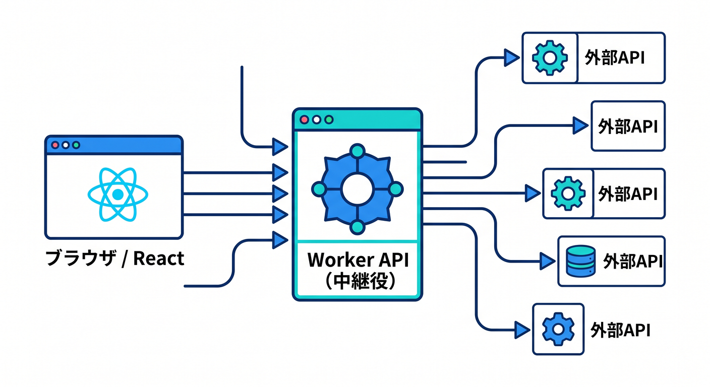
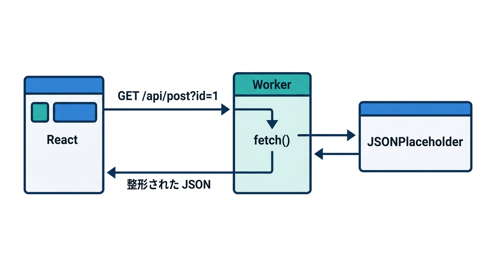
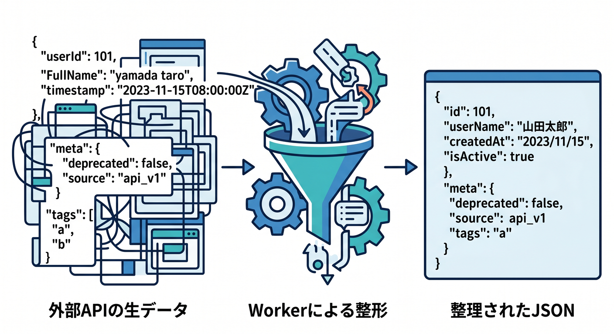
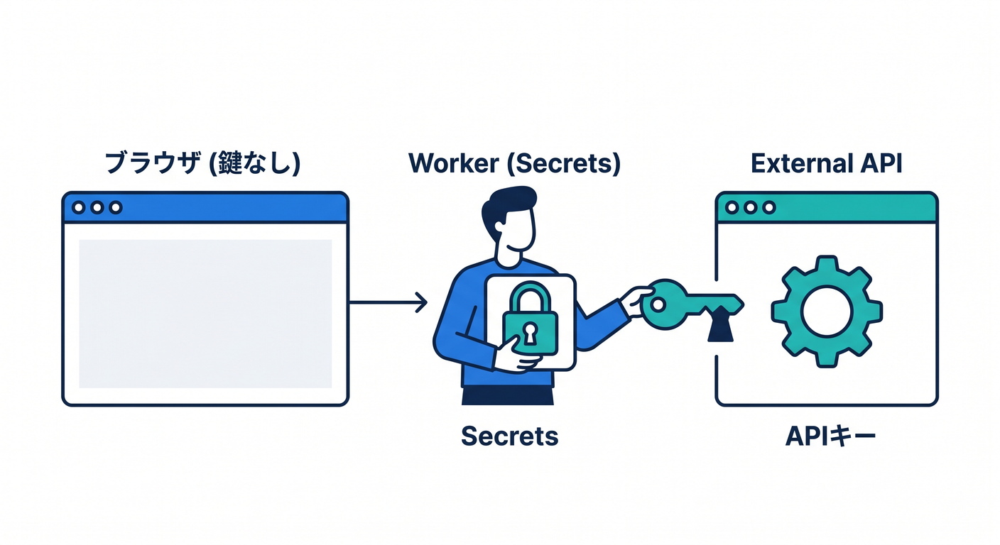
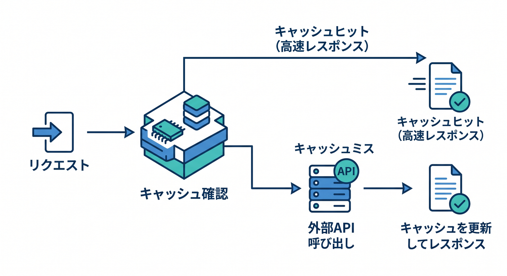
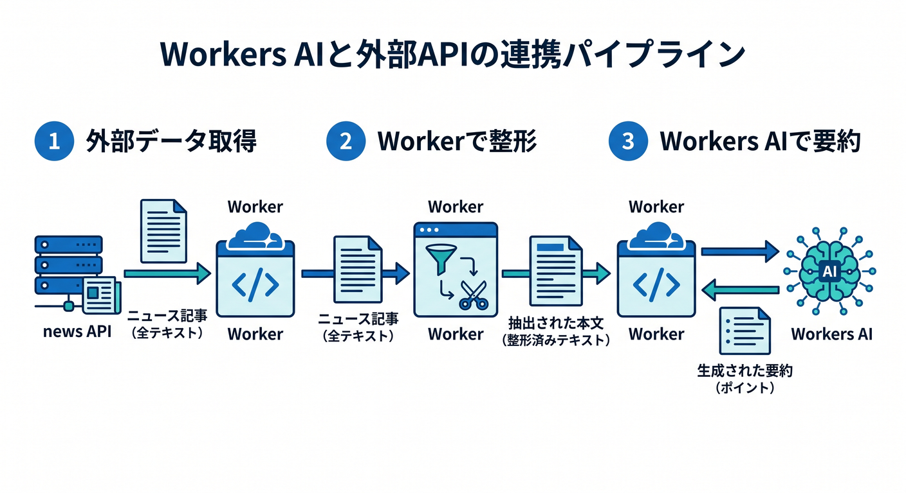

# 第10章：外部APIとつないでみよう！fetchで世界を広げよう 🌍🔗

この章では、Cloudflare Workers の中から外部APIを呼び出して、受け取ったデータを自分のAPIとして整えて返すところまで進みます 😊
Cloudflare公式でも、サードパーティAPI連携は Workers から `fetch` を使って行う形が基本として案内されています。本日時点でもその考え方は変わっていません。 ([Cloudflare Docs][1])

## この章のゴール 🎯

この章を終えるころには、こんなことができるようになります ✨

* Worker から外部APIへ `GET` リクエストを送れる
* 受け取った JSON を読み取って、見やすい形に整えて返せる
* APIキーを secrets で安全に扱える
* 外部APIの結果を軽くキャッシュできる
* ログを見ながら「どこで失敗しているか」を追える
* 将来的に AI API や Workers AI へつなぐ見通しが持てる 🤖

---

## まずは全体像をつかもう 🧠🌈



この章の主役は「Worker を中継役にする」という発想です。
ブラウザや React 画面がいきなり外部APIを叩くのではなく、まず自分の Worker にリクエストを送り、その Worker が外部APIへ `fetch` して結果を整えて返します。こうすると、返す JSON の形をそろえやすく、認証情報もブラウザに出さずに済みます 👍
Workers では外部API呼び出しに `fetch` を使い、`fetch()` のような非同期処理はハンドラの中で実行する必要があります。さらに、Node互換のライブラリはかなり動く一方で、`fs`、`http/net`、`window` に依存するSDKはそのままでは合わないことがあります。 ([Cloudflare Docs][1])

---

## この章で作るミニAPI 📦



今回は、練習用の公開ダミーAPIとして JSONPlaceholder を使うイメージで進めます。JSONPlaceholder はダミーデータを試すための free fake REST API として案内されており、`fetch` の練習台にちょうどいいです。 ([JSONPlaceholder][2])

イメージはこんな感じです ✨

* React などの画面 → `/api/post?id=1` にアクセス
* Worker → 外部APIへ `fetch`
* Worker → 必要な形に整形して返す
* 画面 → きれいな JSON を受け取る

---

## 最小ハンズオン：外部APIを呼んで返してみよう 🚀

まずは「動く体験」を優先しましょう。
下のコードは、Worker の `/api/post?id=1` へ来たアクセスに対して、外部APIから投稿を1件取得し、整形して返す最小例です 😊

```ts
type JsonPlaceholderPost = {
  userId: number;
  id: number;
  title: string;
  body: string;
};

export default {
  async fetch(request: Request): Promise<Response> {
    const url = new URL(request.url);

    if (url.pathname === "/api/post") {
      const id = url.searchParams.get("id") ?? "1";

      const upstreamResponse = await fetch(
        `https://jsonplaceholder.typicode.com/posts/${id}`,
        {
          headers: {
            Accept: "application/json",
          },
        }
      );

      if (!upstreamResponse.ok) {
        return Response.json(
          {
            ok: false,
            message: "外部APIの取得に失敗しました",
            upstreamStatus: upstreamResponse.status,
          },
          { status: 502 }
        );
      }

      const post = (await upstreamResponse.json()) as JsonPlaceholderPost;

      return Response.json({
        ok: true,
        source: "jsonplaceholder",
        data: {
          id: post.id,
          title: post.title,
          preview: post.body.slice(0, 60),
        },
      });
    }

    return Response.json(
      {
        ok: false,
        message: "Not Found",
      },
      { status: 404 }
    );
  },
};
```

このコードの大事なポイントは4つです 🌟

1つ目は、Worker の中で `fetch()` していること。
2つ目は、`upstreamResponse.ok` を見て外部APIの失敗を拾っていること。
3つ目は、外部APIそのままの形ではなく、自分のAPIとして見やすい JSON に整えて返していること。
4つ目は、外部サービス側の失敗を `502` で返して、「自分のサーバーというより上流の問題だよ」と表現していることです。
Cloudflare の Workers は `Request` を受けて `Response` を返すシンプルなモデルで、外部API連携もこの形に自然に乗せられます。 ([Cloudflare Docs][1])

---

## なぜ「整形して返す」のが大事なの？ 🪄



初学者のうちは、つい「外部APIの結果をそのまま返す」で済ませたくなります。
でも実務では、ここで一段ラップするのがかなり大事です 😊

* フロント側が扱う JSON の形を固定しやすい
* 外部APIを別サービスに差し替えても、フロント側をあまり変えずに済む
* 余計な項目を落として、必要な項目だけ返せる
* エラー形式を自分で統一できる
* ここにキャッシュやログやAI処理をあとから足しやすい

この「自分の Worker をハブにする」感覚が、第10章のいちばん大事な収穫です 🌍✨

---

## APIキーが必要な外部APIでは secrets を使おう 🔐



ここからが実務っぽいところです。
外部APIの中には、認証トークンや API キーが必要なものがあります。このとき Cloudflare は、秘密情報を `vars` に置かず、secrets を使うよう案内しています。ローカル開発では `.dev.vars` か `.env` を使えますが、両方を同時には使わず、しかも Git にコミットしないのが基本です。 ([Cloudflare Docs][3])

まず、秘密情報を登録します 👇

```powershell
npx wrangler secret put API_TOKEN
```

ローカルで試すなら、たとえばこうです 👇

```env
API_TOKEN=your_local_token
```

そして Worker 側では `env` から読みます ✨

```ts
type Env = {
  API_TOKEN: string;
};

export default {
  async fetch(_request: Request, env: Env): Promise<Response> {
    const upstreamResponse = await fetch("https://example.com/v1/items", {
      headers: {
        Accept: "application/json",
        Authorization: `Bearer ${env.API_TOKEN}`,
      },
    });

    if (!upstreamResponse.ok) {
      return Response.json(
        { ok: false, message: "認証付きAPIの呼び出しに失敗しました" },
        { status: 502 }
      );
    }

    const data = await upstreamResponse.json();

    return Response.json({ ok: true, data });
  },
};
```

ここで覚えたいのは、「秘密はブラウザではなく Worker の中に置く」です 🔒
その発想があるだけで、設計がかなり安定します。

---

## ちょいキャッシュを足して、無駄な呼び出しを減らそう ⚡



外部APIは毎回呼ぶと遅くなったり、回数制限に近づいたりします。
Cloudflare の Cache API は、Workers から細かくキャッシュを制御するための仕組みです。ただし、キャッシュ内容は全世界で完全共有されるわけではなく、作られたデータセンター単位で扱われます。さらに `cache.put()` は tiered caching とは別物なので、まずは「同じ場所からの同じ取得を少し軽くする仕組み」と考えるとわかりやすいです。 ([Cloudflare Docs][4])

こんな感じで足せます 🧩

```ts
type JsonPlaceholderPost = {
  userId: number;
  id: number;
  title: string;
  body: string;
};

export default {
  async fetch(request: Request): Promise<Response> {
    const url = new URL(request.url);

    if (url.pathname !== "/api/post") {
      return Response.json({ ok: false, message: "Not Found" }, { status: 404 });
    }

    const cache = caches.default;
    const cacheKey = new Request(request.url, request);

    const cached = await cache.match(cacheKey);
    if (cached) {
      return cached;
    }

    const id = url.searchParams.get("id") ?? "1";
    const upstreamResponse = await fetch(
      `https://jsonplaceholder.typicode.com/posts/${id}`
    );

    if (!upstreamResponse.ok) {
      return Response.json(
        { ok: false, message: "外部APIの取得に失敗しました" },
        { status: 502 }
      );
    }

    const post = (await upstreamResponse.json()) as JsonPlaceholderPost;

    const response = Response.json(
      {
        ok: true,
        cached: false,
        data: {
          id: post.id,
          title: post.title,
          preview: post.body.slice(0, 60),
        },
      },
      {
        headers: {
          "Cache-Control": "public, max-age=300",
        },
      }
    );

    await cache.put(cacheKey, response.clone());
    return response;
  },
};
```

学習段階では、まず「同じURLなら結果を少し再利用できる」とつかめれば十分です 😊

---

## ログを見る力もセットで育てよう 🪵🔎

外部API連携は、成功時より失敗時に本領が出ます。
Cloudflare の Workers Logs では、invocation logs、custom logs、errors、uncaught exceptions を集めて確認できます。しかも新しく作成された Worker では observability がデフォルト有効です。リアルタイム確認はダッシュボードでもできますし、`npx wrangler tail` でも見られます。さらに tracing を使うと、subrequest がどれくらい時間を使っているか追いやすくなります。 ([Cloudflare Docs][5])

たとえば、こんなログを入れておくと便利です 👇

```ts
console.log("upstream start", { id });

const upstreamResponse = await fetch(`https://jsonplaceholder.typicode.com/posts/${id}`);

console.log("upstream end", {
  id,
  status: upstreamResponse.status,
  ok: upstreamResponse.ok,
});
```

そして確認はこれです 👇

```powershell
npx wrangler tail
```

「動かない…😵」となったときに、
`ログを見る → upstream の status を見る → 自分の返し方を見る`
この順番で追うクセをつけると、かなり強くなれます 💪✨

---

## 外部API連携と Cloudflare AI をどうつなげるの？ 🤖🌟



ここ、かなり大事です。
外部API連携を覚えると、その先に AI との接続が見えてきます。

たとえば流れはこうです 👇

* 外部のニュースAPIや記事APIを Worker で取得する
* その本文を Worker の中で整形する
* 必要なら AI で要約する
* フロントへ返す

Cloudflare 側の選択肢としては、大きく2つあります ✨

1つ目は、外部AIサービスを `fetch` で呼ぶやり方。
2つ目は、Cloudflare の Workers AI を binding で直接使うやり方です。
Workers AI は Free / Paid の両プランで利用でき、Workers から binding 経由で呼び出せます。公式概要では 50+ のオープンモデルにアクセスできると案内されています。さらに AI Gateway は全プランで使え、analytics、logging、caching、rate limiting、retries、model fallback などをまとめて扱えます。 ([Cloudflare Docs][6])

「外部のAI APIを呼ぶ」のももちろんアリですが、
Cloudflare の中で閉じやすい構成を作りたいなら、Workers AI や AI Gateway がかなり相性いいです 😊

概念確認用の最小イメージはこんな感じです 👇

```ts
export default {
  async fetch(request: Request, env: any): Promise<Response> {
    const articleText = "ここに外部APIから取ってきた本文を入れる";

    const result = await env.AI.run("@cf/meta/llama-3.1-8b-instruct", {
      prompt: `次の文章を日本語で3行に要約してください:\n\n${articleText}`,
    });

    return Response.json({
      ok: true,
      summary: result,
    });
  },
};
```

この章では「外部データを取ってくるところ」までを主役にして、
AIの本格運用は第13章で深掘り、という流れがきれいです 🎉

---

## Copilot をどう使うと学習がはかどる？ 🧑‍💻🤝🤖

2026年の今は、Copilot を“補助輪”としてかなり活用しやすいです。
GitHub Copilot の agent mode は、複数ファイルにまたがる修正やエラー対応のような複数ステップの作業に向いていて、必要なファイル修正やターミナルコマンドの提案まで行えます。また、外部アプリケーションとの連携、たとえば MCP サーバー連携にも対応しています。さらに VS Code では、`.github/agents` 配下に custom agent profile を置き、組み込みツールや MCP server のツールを agent に持たせる構成も可能です。 ([GitHub Docs][7])

この章なら、Copilot へのお願いはこんな感じが使いやすいです ✨

* 「この Worker の外部API呼び出し部分を `fetchJson<T>()` に切り出して」
* 「401 / 403 / 429 / 500 系のエラー分岐を追加して」
* 「外部APIレスポンスの TypeScript 型を作って」
* 「`wrangler tail` で見やすいようにログ項目を整えて」
* 「このコードが Workers で動きにくい Node 専用SDKを使っていないか確認して」

Copilot に丸投げするというより、
「型作成」「エラー分岐のたたき台」「リファクタリング案」を出してもらう使い方が、この章ではかなり相性いいです 🙌

---

## この章でハマりやすいポイント 😵‍💫🪤

* `fetch()` をファイルの一番上で呼んでしまう
  → Workers では非同期の `fetch` はハンドラ内で実行する必要があります。 ([Cloudflare Docs][8])

* Node向けSDKをそのまま持ってきて動かない
  → Workers は V8 ベースなので、`fs`、`http/net`、`window` 前提のライブラリはそのままでは合わないことがあります。 ([Cloudflare Docs][9])

* APIキーを `vars` に入れてしまう
  → 秘密情報は `vars` ではなく secrets を使います。ローカルは `.dev.vars` か `.env` のどちらか一方です。 ([Cloudflare Docs][3])

* キャッシュしたのに「どこでも同じように効く」と思い込む
  → Cache API の内容は、作られたデータセンター外へ自動で複製されるわけではありません。 ([Cloudflare Docs][4])

* 外部APIを細かく呼びすぎる
  → 本日時点では Workers Free で 1 invocation あたり外部 subrequests は 50 件です。必要なら `limits` 設定で自分側の上限をさらに下げることもできます。 ([Cloudflare Docs][10])

---

## 実践ミニ課題 ✍️🌟

1. `/api/post?id=1` を `/api/post-summary?id=1` に変えて、`title` と `preview` だけ返すようにしてみましょう。
2. `id` が数字ではないときは `400 Bad Request` を返してみましょう。
3. `console.log()` で upstream status を出し、`wrangler tail` で確認してみましょう。
4. 同じリクエストが連続したとき、キャッシュが効くようにしてみましょう。
5. 余裕があれば、取得した本文を Workers AI で1〜2行要約する設計図を書いてみましょう 🤖

---

## まとめ 🎊

この章のキモは、
**「Worker は単なる返答装置ではなく、外部サービスをまとめるハブになれる」**
とつかむことです 🌍✨

`fetch` で外部APIを呼ぶ → JSON を整える → secrets で守る → 必要なら cache/log/AI を足す。
この流れが見えたら、第10章は大成功です 🙌

次の第11章で D1 に進むと、
「外から取ってくるAPI」だけでなく、
「自分で保存して育てるAPI」へ一気に進化できます 🚀📚

必要なら次に、そのまま続きで
**「第10章の教材として使える練習問題つき完全版」**
まで展開します。

[1]: https://developers.cloudflare.com/workers/configuration/integrations/apis/ "APIs · Cloudflare Workers docs"
[2]: https://jsonplaceholder.typicode.com/?utm_source=chatgpt.com "JSONPlaceholder - Free Fake REST API"
[3]: https://developers.cloudflare.com/workers/configuration/secrets/ "Secrets · Cloudflare Workers docs"
[4]: https://developers.cloudflare.com/workers/runtime-apis/cache/ "Cache · Cloudflare Workers docs"
[5]: https://developers.cloudflare.com/workers/observability/logs/workers-logs/ "Workers Logs · Cloudflare Workers docs"
[6]: https://developers.cloudflare.com/workers-ai/ "Overview · Cloudflare Workers AI docs"
[7]: https://docs.github.com/en/copilot/get-started/features "GitHub Copilot features - GitHub Docs"
[8]: https://developers.cloudflare.com/workers/runtime-apis/fetch/ "Fetch · Cloudflare Workers docs"
[9]: https://developers.cloudflare.com/workers/configuration/integrations/external-services/ "External Services · Cloudflare Workers docs"
[10]: https://developers.cloudflare.com/changelog/post/2026-02-11-subrequests-limit/ "Workers are no longer limited to 1000 subrequests · Changelog"
