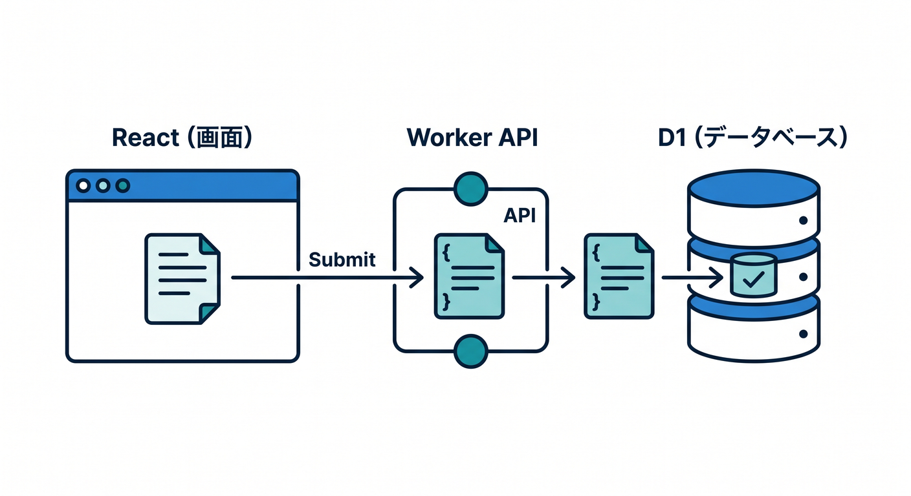
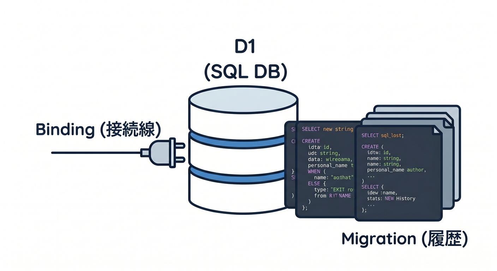
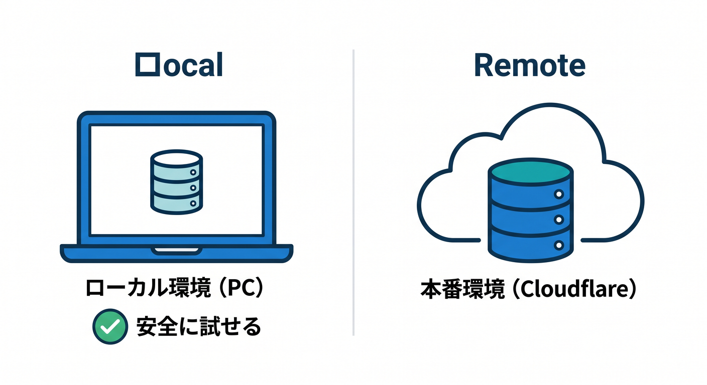
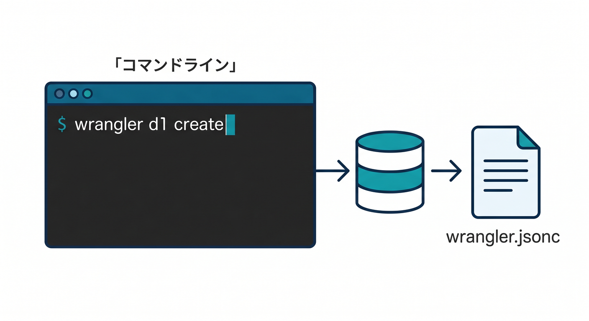
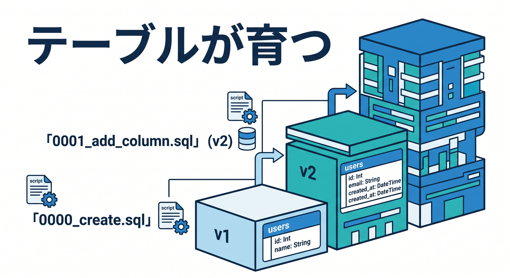
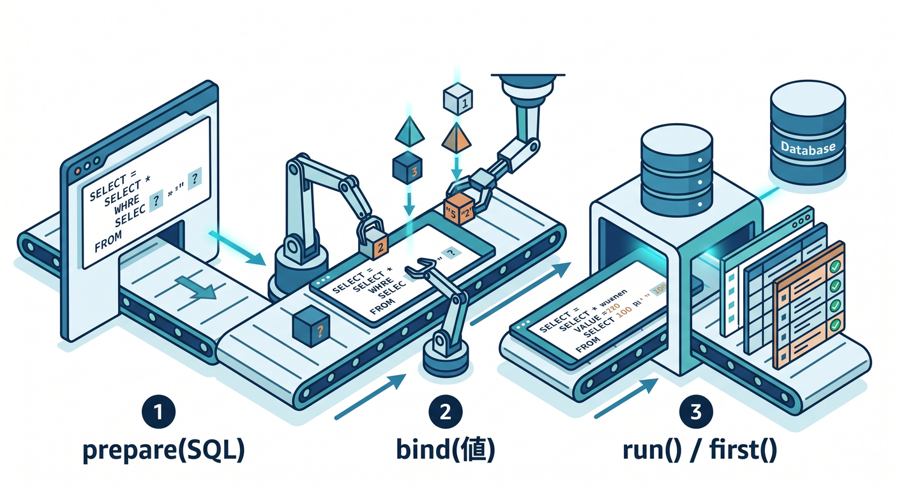

# 第11章：D1とつないで“保存できるAPI”へ進もう 🧾💾

この章は、Cloudflare公式の現行ドキュメントを本日時点で確認したうえで組み立てています。D1 は Cloudflare のマネージドな serverless SQL database で、SQLite のSQLセマンティクスを使え、Workers からは binding 経由で扱うのが基本です。さらに Time Travel により、直近30日以内の任意の分まで復元できる仕組みもあります。 ([Cloudflare Docs][1])

ここまでで API は「受け取って返す」ところまで作れるようになりました。ここから先は、**返すだけのAPI** から **保存できるAPI** へ進みます ✨
この章の主役は D1 です。Workers から D1 を使う公式の流れは、**binding を作る → prepare する → bind する → run / first する** です。 ([Cloudflare Docs][2])

---

## この章でできるようになること 🎯

この章を終えると、こんなことができるようになります。

* D1 データベースを作る 🏗️
* Worker に D1 binding をつなぐ 🔌
* migration でテーブルを育てる 🌱
* メモを **一覧取得 / 1件取得 / 追加 / 更新 / 削除** する CRUD API を作る 📝
* ローカルDBと本番DBの違いを理解して、安全に試す 🧪
* おまけで、Workers AI を使って「保存前に要約をつける」発展も見られる 🤖

---

## まずはイメージをつかもう 🧠☁️



今回作るのは、シンプルな **メモAPI** です。
たとえばこんな流れです。

1. React の入力欄からタイトルと本文を送る ✍️
2. Worker がその内容を受け取る 📮
3. D1 に保存する 💾
4. あとで一覧や詳細を取り出せる 📚
5. 更新も削除もできる 🧹

この章のポイントは、**Cloudflare上で“保存のあるAPI”を初めて体験すること**です。D1 は Workers / Pages から直接扱える Cloudflare の SQL データベースで、SQLite セマンティクスにかなり近いので、SQL 入門とも相性がいいです。 ([Cloudflare Docs][1])

---

## 先に知っておく用語たち 📘✨



## D1 って何？ 🗄️

D1 は Cloudflare の serverless SQL database です。SQLite の SQL セマンティクスをベースにしていて、Workers や Pages から扱えます。JSON 関数や FTS5 など、SQLite 系の機能も一部サポートされています。 ([Cloudflare Docs][1])

## binding って何？ 🔌

binding は、Worker に「このD1を使っていいよ」と能力を渡す仕組みです。Cloudflare公式では、binding は REST API を直接たたくより **高性能で制約も少ない** と案内されています。D1 も `env.DB` のように binding 経由で使います。 ([Cloudflare Docs][3])

## migration って何？ 🧱

migration は、データベースの変更履歴を `.sql` ファイルとして管理する仕組みです。D1 では migration ファイルは `migrations/` に作られ、適用済み履歴は `d1_migrations` テーブルに記録されます。 ([Cloudflare Docs][4])

## ローカルDBと本番DBの違い 🌍🆚💻



`wrangler dev` はローカルモードがデフォルトで、Miniflare / workerd によるローカル資源が自動で作られます。つまり、**まずはローカルD1で安心して試し、あとで本番へ反映** する流れが取りやすいです。ローカルの変更は通常、本番データに影響しません。 ([Cloudflare Docs][5])

---

## この章の題材：メモ帳API 📝🌟

今回は次のようなテーブルを使います。

* `id`：メモID
* `title`：タイトル
* `body`：本文
* `summary`：AI要約（あとで使う発展枠）
* `created_at`：作成日時

題材は小さいですが、学べることはかなり本格的です。
実務でも、問い合わせ一覧、メモ、タスク、投稿、予約、商品一覧など、基本形はだいたいこの延長です 😊

---

## ステップ1：D1データベースを作ろう 🚀



Cloudflare の現行導線では、C3 で Workers プロジェクトを作り、Wrangler で開発・デプロイしていきます。さらに Cloudflare は新規プロジェクトでは `wrangler.jsonc` を推奨していて、一部の新しめの機能は JSON 設定前提です。 ([Cloudflare Docs][6])

```bash
npm create cloudflare@latest -- memo-api
cd memo-api
npx wrangler d1 create memo-app-db
```

`wrangler d1 create` は D1 データベースを作り、binding 名や database ID を設定ファイルに入れるための情報を返します。`--update-config` を使うと設定ファイルの自動更新もできます。 ([Cloudflare Docs][7])

## `wrangler.jsonc` のイメージ 🧩

```json
{
  "$schema": "./node_modules/wrangler/config-schema.json",
  "name": "memo-api",
  "main": "src/index.ts",
  "compatibility_date": "2026-04-17",
  "d1_databases": [
    {
      "binding": "DB",
      "database_name": "memo-app-db",
      "database_id": "ここに作成されたID"
    }
  ]
}
```

D1 binding は Worker から `env.DB` で使えます。binding 名は `wrangler.jsonc` 側の `binding` に合わせます。 ([Cloudflare Docs][8])

---

## ステップ2：migration でテーブルを作ろう 🧱✨



D1 の migration は、**DBの設計変更をコードとして残す**ための仕組みです。Cloudflare 公式でも、migration はバージョン付き `.sql` ファイルとして保存し、順番に適用していく形です。 ([Cloudflare Docs][4])

まず migration ファイルを作ります。

```bash
npx wrangler d1 migrations create memo-app-db create_memos_table
```

このコマンドは `migrations/0000_create_memos_table.sql` のようなファイルを作ります。 ([Cloudflare Docs][9])

中身はこんな感じでOKです。

```sql
CREATE TABLE IF NOT EXISTS memos (
  id INTEGER PRIMARY KEY AUTOINCREMENT,
  title TEXT NOT NULL,
  body TEXT NOT NULL,
  summary TEXT,
  created_at TEXT NOT NULL DEFAULT CURRENT_TIMESTAMP
) STRICT;
```

ここで `STRICT` を付けているのはおすすめです。Cloudflare の D1 Worker API では型変換が起きるため、公式でも型のズレを避けるために SQLite の STRICT table を勧めています。 ([Cloudflare Docs][2])

ローカルに適用します。

```bash
npx wrangler d1 migrations apply memo-app-db --local
```

`d1 migrations apply` は未適用 migration を順に適用します。適用時にはバックアップが取られ、適用エラー時はその migration がロールバックされます。かなり安心設計です 👍 ([Cloudflare Docs][7])

---

## ステップ3：まずは SQL を1回たたいてみよう 🔍

ローカル DB に対してコマンドで直接 SQL を流すこともできます。

```bash
npx wrangler d1 execute memo-app-db --local --command "SELECT * FROM memos;"
```

`wrangler d1 execute` はコマンド文字列や `.sql` ファイルを実行でき、`--local` を付けるとローカルDB、付けないとリモート側へ向きます。ここは混乱しやすいので、最初は **ローカルにだけ打つ** のが安全です。 ([Cloudflare Docs][7])

---

## ステップ4：Worker から D1 を読む・書く ✨



Cloudflare 公式の基本パターンはこうです。

1. `env.DB.prepare("SQL")`
2. `.bind(...)`
3. `.run()` または `.first()`

`.run()` は結果＋メタデータ付き、`.first()` は先頭1件だけがほしいときに便利です。`first()` はメタデータを返さず、1件のオブジェクトか `null` を返します。公式では単一取得時に `LIMIT 1` を付けて効率化するのも勧めています。 ([Cloudflare Docs][2])

---

## 完成コード：メモCRUD API 🛠️💖

`src/index.ts` をこんな感じにします。

```ts
type MemoRow = {
  id: number;
  title: string;
  body: string;
  summary: string | null;
  created_at: string;
};

interface Env {
  DB: D1Database;
}

function json(data: unknown, status = 200) {
  return Response.json(data, {
    status,
    headers: {
      "content-type": "application/json; charset=utf-8",
    },
  });
}

function parseId(pathname: string): number | null {
  const match = pathname.match(/^\/api\/memos\/(\d+)$/);
  if (!match) return null;

  const id = Number(match[1]);
  return Number.isNaN(id) ? null : id;
}

export default {
  async fetch(request: Request, env: Env): Promise<Response> {
    const url = new URL(request.url);
    const { pathname } = url;
    const method = request.method;

    try {
      // GET /api/memos
      if (method === "GET" && pathname === "/api/memos") {
        const result = await env.DB
          .prepare(
            `SELECT id, title, body, summary, created_at
             FROM memos
             ORDER BY id DESC
             LIMIT 100`
          )
          .run<MemoRow>();

        return json({
          ok: true,
          items: result.results,
        });
      }

      // GET /api/memos/:id
      if (method === "GET") {
        const id = parseId(pathname);

        if (id !== null) {
          const memo = await env.DB
            .prepare(
              `SELECT id, title, body, summary, created_at
               FROM memos
               WHERE id = ?
               LIMIT 1`
            )
            .bind(id)
            .first<MemoRow>();

          if (!memo) {
            return json({ ok: false, message: "メモが見つかりません。" }, 404);
          }

          return json({
            ok: true,
            item: memo,
          });
        }
      }

      // POST /api/memos
      if (method === "POST" && pathname === "/api/memos") {
        const body = await request.json<{
          title?: string;
          body?: string;
        }>();

        const title = body.title?.trim();
        const content = body.body?.trim();

        if (!title || !content) {
          return json(
            { ok: false, message: "title と body は必須です。" },
            400
          );
        }

        const result = await env.DB
          .prepare(
            `INSERT INTO memos (title, body)
             VALUES (?, ?)`
          )
          .bind(title, content)
          .run();

        return json(
          {
            ok: true,
            id: result.meta.last_row_id,
            message: "メモを追加しました。",
          },
          201
        );
      }

      // PUT /api/memos/:id
      if (method === "PUT") {
        const id = parseId(pathname);

        if (id !== null) {
          const body = await request.json<{
            title?: string;
            body?: string;
          }>();

          const title = body.title?.trim();
          const content = body.body?.trim();

          if (!title || !content) {
            return json(
              { ok: false, message: "title と body は必須です。" },
              400
            );
          }

          const result = await env.DB
            .prepare(
              `UPDATE memos
               SET title = ?, body = ?
               WHERE id = ?`
            )
            .bind(title, content, id)
            .run();

          if (result.meta.changes === 0) {
            return json({ ok: false, message: "メモが見つかりません。" }, 404);
          }

          return json({
            ok: true,
            message: "メモを更新しました。",
          });
        }
      }

      // DELETE /api/memos/:id
      if (method === "DELETE") {
        const id = parseId(pathname);

        if (id !== null) {
          const result = await env.DB
            .prepare(`DELETE FROM memos WHERE id = ?`)
            .bind(id)
            .run();

          if (result.meta.changes === 0) {
            return json({ ok: false, message: "メモが見つかりません。" }, 404);
          }

          return json({
            ok: true,
            message: "メモを削除しました。",
          });
        }
      }

      return json({ ok: false, message: "ルートが見つかりません。" }, 404);
    } catch (error) {
      console.error(error);
      return json(
        { ok: false, message: "サーバーエラーが発生しました。" },
        500
      );
    }
  },
};
```

このコードの学習ポイントはかなり大事です 😊

* 単一取得では `.first()` を使う
* 追加・更新・削除では `.run()` を使う
* 書き込み系では `results` ではなく `meta.changes` や `meta.last_row_id` を見る

D1 公式では、`.run()` は `success`、`meta`、`results` を持つ `D1Result` を返し、書き込み系では `results` は空になります。`last_row_id` や `changes` は `meta` 側で確認します。 ([Cloudflare Docs][10])

---

## ステップ5：Windows でローカル動作確認しよう 🪟🧪

`wrangler dev` を起動します。

```bash
npx wrangler dev
```

`wrangler dev` はローカルモードがデフォルトで、ローカルの D1 binding を使って起動します。新規ローカル資源は空なので、必要に応じて `--local` 付きで migration や seed を流します。 ([Cloudflare Docs][5])

PowerShell での確認例です。

## 追加（POST）📮

```powershell
Invoke-RestMethod `
  -Method Post `
  -Uri "http://127.0.0.1:8787/api/memos" `
  -ContentType "application/json" `
  -Body '{"title":"買い物","body":"牛乳とパンを買う"}'
```

## 一覧取得（GET）📚

```powershell
Invoke-RestMethod `
  -Method Get `
  -Uri "http://127.0.0.1:8787/api/memos"
```

## 1件取得（GET）🔍

```powershell
Invoke-RestMethod `
  -Method Get `
  -Uri "http://127.0.0.1:8787/api/memos/1"
```

## 更新（PUT）✏️

```powershell
Invoke-RestMethod `
  -Method Put `
  -Uri "http://127.0.0.1:8787/api/memos/1" `
  -ContentType "application/json" `
  -Body '{"title":"買い物メモ","body":"牛乳、パン、卵を買う"}'
```

## 削除（DELETE）🧹

```powershell
Invoke-RestMethod `
  -Method Delete `
  -Uri "http://127.0.0.1:8787/api/memos/1"
```

---

## ステップ6：ローカルDBと本番DBで混乱しないコツ 🧭

ここは初学者がかなりハマりやすいです 😵‍💫

* `wrangler dev` はローカルモードがデフォルト
* `wrangler d1 execute ... --local` はローカルDBを触る
* `--local` を付けない実行はリモートDB側へ向く
* binding に `"remote": true` を入れると、ローカル開発中でもリモートDBへつなげるが、変更は元に戻せないことがある

Cloudflare 公式でも、ローカルと本番は分離され、本番DBにうっかり触れないようになっています。逆に言うと、**「さっき入れたデータが見えない！」** ときは、ローカルとリモートを取り違えていることがよくあります。 ([Cloudflare Docs][5])

---

## ステップ7：この章で AI を少しだけ絡めるなら？ 🤖📝

第13章で本格的に AI API をやる前に、この章でも軽く AI を混ぜられます。
やりやすいのは、**保存前にメモの要約を1文つける** パターンです。Workers AI は binding を作ると `env.AI.run()` でモデルを呼べます。 ([Cloudflare Docs][11])

## `wrangler.jsonc` に AI binding を追加

```json
{
  "ai": {
    "binding": "AI"
  }
}
```

Cloudflare 公式では、この設定で Worker から `env.AI` が使えるようになります。 ([Cloudflare Docs][11])

## 追加時に要約も作るイメージ

```ts
const aiResult = await env.AI.run("@cf/meta/llama-3.1-8b-instruct", {
  prompt: `次のメモを日本語で1文に要約してください。\n\nタイトル: ${title}\n本文: ${content}`
});

// 返り値の整形はモデル出力に合わせて調整
const summary =
  typeof aiResult === "string"
    ? aiResult
    : JSON.stringify(aiResult);

await env.DB
  .prepare(
    `INSERT INTO memos (title, body, summary)
     VALUES (?, ?, ?)`
  )
  .bind(title, content, summary)
  .run();
```

この使い方そのものは Workers AI の公式導線どおりで、binding を作って `env.AI.run()` を呼ぶ形です。ここでは「AIで要約してから保存」という小さな味付けにとどめておくと、第11章の主役である D1 の理解を邪魔しません 🌈 ([Cloudflare Docs][11])

---

## Copilot 活用ポイント 💡🤝

Cloudflare は Workers 向けに **Prompting** ガイドを公開していて、VS Code を含む各種AIツールで Workers アプリをプロンプトから組み立てる流れを案内しています。GitHub 側でも、Copilot は VS Code 上の agent mode と MCP 対応を前提に説明していて、MCP は外部ツールやデータ源と文脈連携するための仕組みです。 ([Cloudflare Docs][12])

この章では、Copilot にこう頼むとかなり便利です ✨

* 「この migration SQL を初心者向けに 1 行ずつ説明して」
* 「この `meta.changes` と `last_row_id` の違いを教えて」
* 「POST と PUT のバリデーションを共通関数に切り出して」
* 「`GET /api/memos/:id` の処理だけ読みやすくリファクタして」
* 「D1 の `.first()` を使う理由をコメント付きで書いて」

AIに丸投げするより、**“今のコードを説明させる → 1か所だけ直させる”** の順がかなり学びやすいです 👍

---

## ここでハマりやすいポイント集 🚧😇

## 1. INSERT したのに `results` が空 😳

正常です。D1 では書き込み系操作の `results` は空で、更新件数や採番IDは `meta.changes` や `meta.last_row_id` を見ます。 ([Cloudflare Docs][10])

## 2. SQL に値を直接埋め込みたくなる 💥

なるべくやめましょう。Cloudflare 公式でも、`prepare(...).bind(...)` による parameterized query を推していて、SQL injection 対策にもつながります。 ([Cloudflare Docs][10])

## 3. ローカルで動いたのに本番でデータがない 😵

ローカルDBとリモートDBを見間違えていることが多いです。`wrangler dev` はローカル、`wrangler d1 execute ... --local` もローカルです。 ([Cloudflare Docs][5])

## 4. 何でも1つの巨大DBに詰め込みたくなる 🧱

D1 は多くの小さなDBへ水平展開する設計とも相性がよく、各 D1 データベースは本質的に single-threaded で、クエリは1つずつ処理されます。なので、この章ではまず **小さい構成で短いクエリを書く** 感覚を身につけるのが大切です。 ([Cloudflare Docs][1])

## 5. 型がぐちゃっとしやすい 🌀

D1 は値の型変換があるので、schema では `STRICT` を使うのが安心です。TypeScript 側でも `.run<RowType>()` や `.first<RowType>()` のように型パラメータを付けると読みやすくなります。D1 Worker API は `wrangler types` による型生成にも対応しています。 ([Cloudflare Docs][2])

---

## 発展ミニ課題 💪🎓

余裕があれば、次を追加するとかなり力がつきます。

1. `completed` カラムを追加して、完了済みメモを管理する ✅
2. `?q=買い物` のような検索APIを作る 🔎
3. AI 要約を保存して、一覧では本文ではなく要約を出す 🤖
4. `updated_at` カラムを追加して、更新日時も持たせる ⏰
5. 既存の SQLite データを D1 に取り込む流れを調べる 📦

D1 には SQLite データの import / export の導線もあり、既存データを持ち込みたいケースにもつながります。 ([Cloudflare Docs][13])

---

## この章のまとめ 🎉

この章では、Cloudflare Workers と D1 をつないで、**保存できるAPI** の最初の完成形を作りました。
大事なのは次の3つです 😊

* **Worker から D1 は binding 経由で使う**
* **SQL は prepare + bind で安全に扱う**
* **テーブル変更は migration で育てる**

ここまで来ると、API はかなり “アプリらしく” なってきます 💖
次の章では、この API を **どう守るか** に進みます。Secrets、Turnstile、Rate Limiting を入れると、ぐっと本番っぽくなります 🔐🛡️

必要なら次に、この第11章と文体・粒度をそろえたまま **「章末課題」「理解度チェック問題」「React側の接続サンプル」付き版** に拡張できます。

[1]: https://developers.cloudflare.com/d1/ "Overview · Cloudflare D1 docs"
[2]: https://developers.cloudflare.com/d1/worker-api/ "Workers Binding API · Cloudflare D1 docs"
[3]: https://developers.cloudflare.com/workers/runtime-apis/bindings/ "Bindings (env) · Cloudflare Workers docs"
[4]: https://developers.cloudflare.com/d1/reference/migrations/ "Migrations · Cloudflare D1 docs"
[5]: https://developers.cloudflare.com/d1/best-practices/local-development/ "Local development · Cloudflare D1 docs"
[6]: https://developers.cloudflare.com/workers/get-started/guide/?utm_source=chatgpt.com "Get started - CLI · Cloudflare Workers docs"
[7]: https://developers.cloudflare.com/workers/wrangler/commands/d1/ "D1 · Cloudflare Workers docs"
[8]: https://developers.cloudflare.com/d1/worker-api/d1-database/?utm_source=chatgpt.com "D1 Database"
[9]: https://developers.cloudflare.com/workers/wrangler/commands/d1/?utm_source=chatgpt.com "D1 · Cloudflare Workers docs"
[10]: https://developers.cloudflare.com/d1/worker-api/prepared-statements/ "Prepared statement methods · Cloudflare D1 docs"
[11]: https://developers.cloudflare.com/workers-ai/configuration/bindings/ "Workers Bindings · Cloudflare Workers AI docs"
[12]: https://developers.cloudflare.com/workers/get-started/prompting/ "Prompting · Cloudflare Workers docs"
[13]: https://developers.cloudflare.com/d1/best-practices/import-export-data/ "Import and export data · Cloudflare D1 docs"
