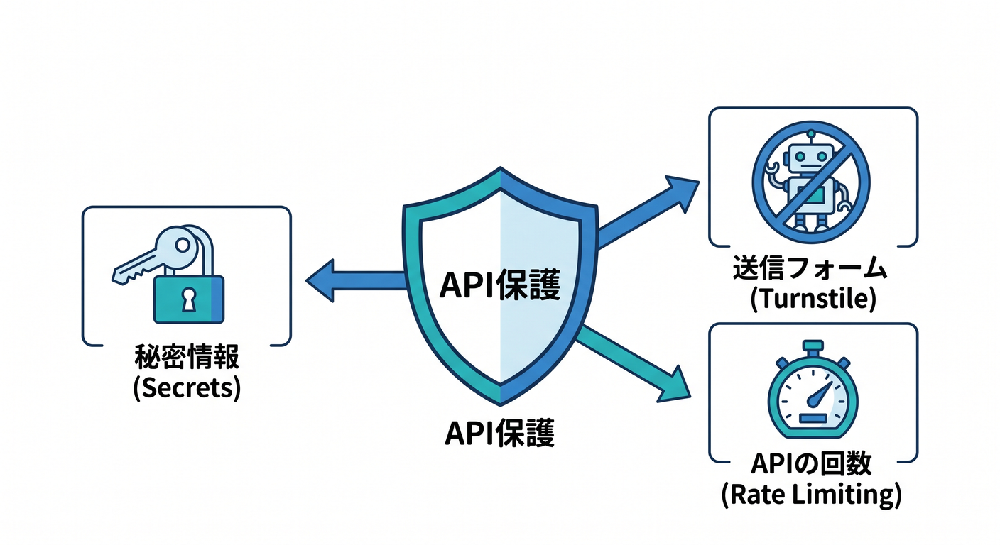
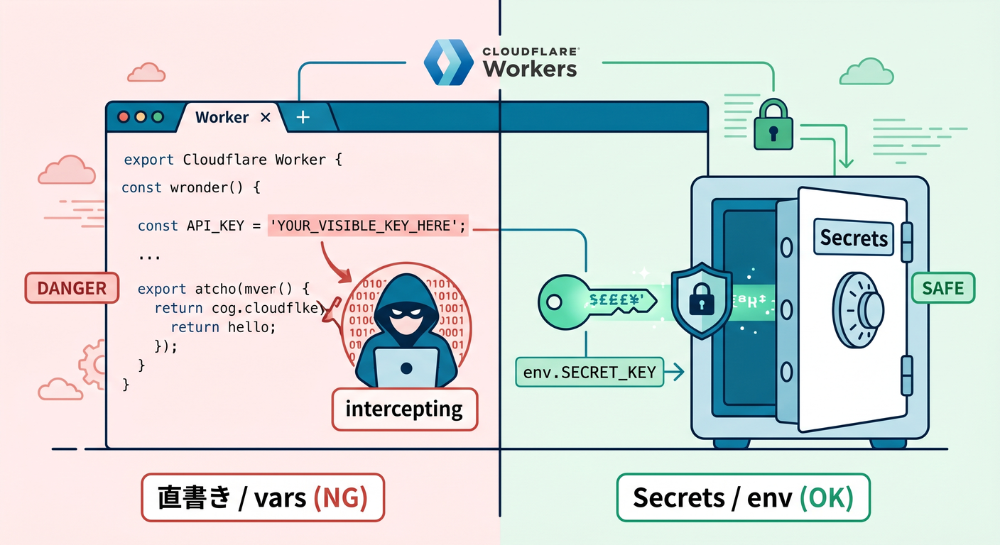
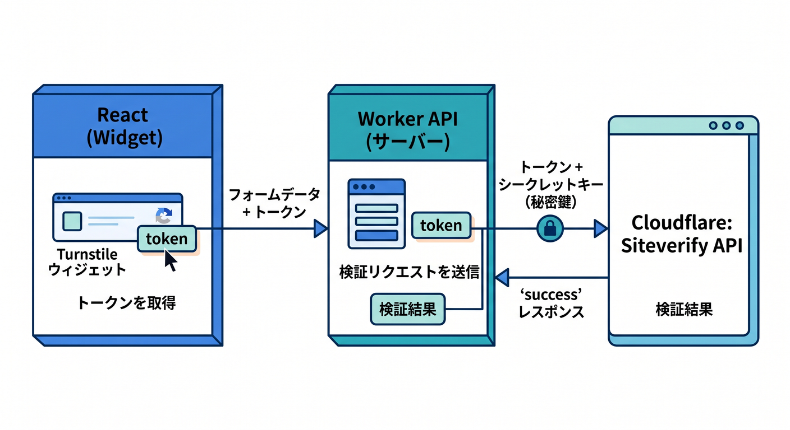
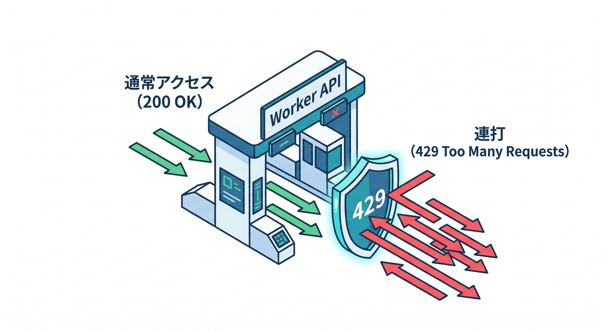
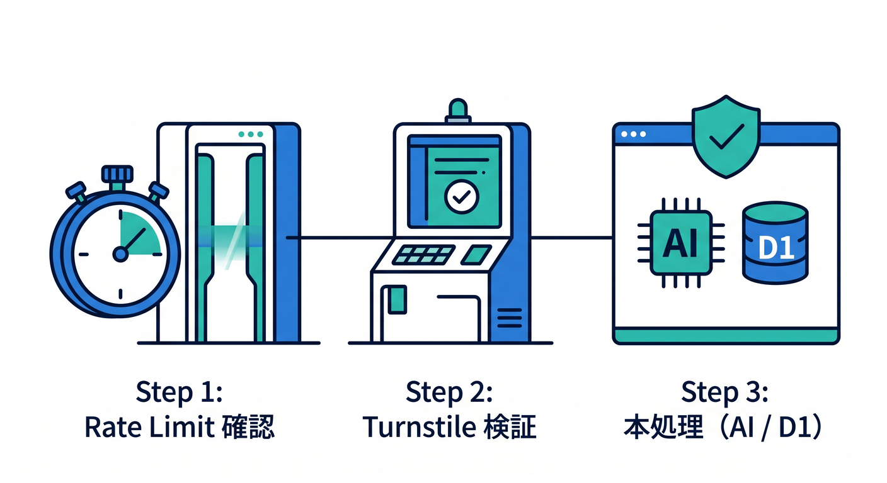
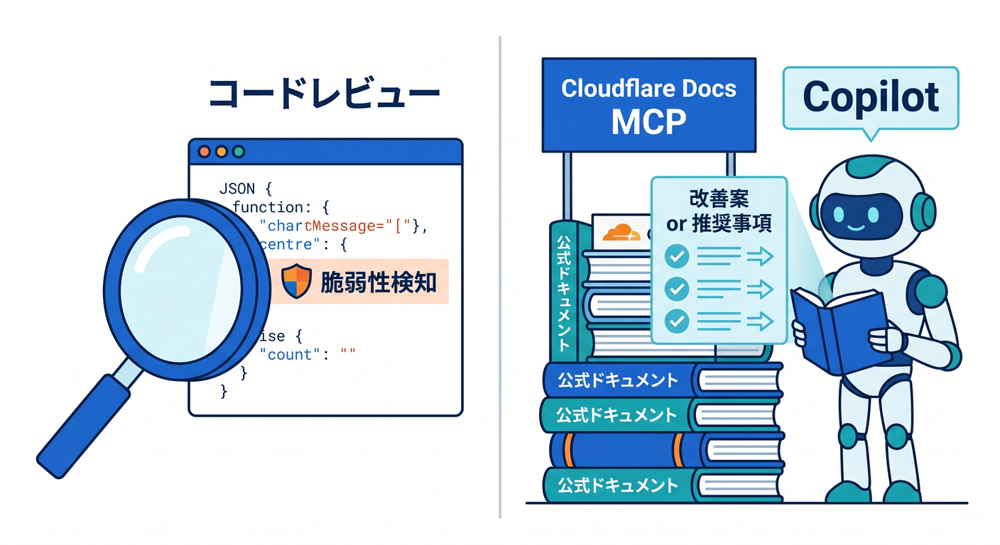

# 第12章：APIを守ろう！Secrets・Turnstile・Rate Limitingの入口 🔐🛡️

この章では、**「動くAPI」から「公開しても少し安心なAPI」へ進む最初の一歩**をやります 😊
Cloudflare Workers では、Secrets・Rate Limiting・D1・Workers AI などが **binding** としてまとまっていて、Worker から安全寄りに扱いやすいのが大きな強みです。Cloudflare は binding を「権限とAPIが一体になったもの」として案内していて、Cloudflare上のリソースへアクセスするための秘密情報をコードへ直接埋め込まなくてよい形を推しています。 ([Cloudflare Docs][1])

この章のゴールは3つです ✨
**① Secrets をコード直書きしない感覚をつかむ**、**② Turnstile でフォームやAPI入口を守る**、**③ Rate Limiting で乱打や濫用を抑える**、です。特にこのあと Workers AI を使うAPIを作ると、1回1回の呼び出しがより重くなりやすいので、この章の守り方がかなり効いてきます。Workers の binding には AI・D1・Rate Limiting・Secrets などが並んでいます。 ([Cloudflare Docs][1])

---

## 12-1. まずは「何を守るの？」🤔🔍



APIで守りたいものは、だいたい次の3つです。

* **秘密情報**：外部APIキー、認証トークン、秘密鍵
* **送信フォーム**：bot 送信、スパム送信、いたずら投稿
* **APIの回数**：短時間の連打、雑なスクレイピング、総当たり

Cloudflare Turnstile は CAPTCHA 代替として案内されていて、Cloudflare の CDN を使っていないサイトにも埋め込めます。さらに、Turnstile のサーバー側検証は必須で、クライアント側にウィジェットを置いただけでは保護は完成しません。 ([Cloudflare Docs][2])

Rate limiting も2段構えで考えるとわかりやすいです 😎
**外側の門番**として WAF の rate limiting rules、**Worker の中の細かい門番**として Workers の Rate Limiting API、という使い分けができます。WAF の rate limiting rules は、ログインAPIの総当たり対策や、1クライアントあたりのAPI回数制限に使えると公式で案内されています。Workers の Rate Limiting API は、Worker の処理が始まったあと、特定のルートや特定ユーザー種別にだけ制限をかける用途に向いています。 ([Cloudflare Docs][3])

---

## 12-2. Secrets を覚えよう 🔐📦



Cloudflare Workers の **Secrets** は、暗号化されたテキスト値を Worker に結びつける binding です。API キーや認証トークンのような機密情報向けで、`env` から読めます。さらに 2025 以降の Workers では `cloudflare:workers` から `env` を import して使う書き方も案内されています。Node.js compatibility を有効にした Worker では `process.env` からも扱えます。 ([Cloudflare Docs][4])

まず大事なのは、**機密情報を `vars` に入れない**ことです ⚠️
Cloudflare の Secrets ドキュメントでは、機密情報を Wrangler の `vars` に置かず、Secrets を使うよう明記されています。ローカル開発では `.dev.vars` か `.env` を使えますが、**両方を同時に混ぜない**こと、そして **git にコミットしない**ことも強く重要です。 ([Cloudflare Docs][4])

たとえば設定ファイルはこんな感じで始められます 👇

```json
{
  "secrets": {
    "required": ["TURNSTILE_SECRET_KEY", "NEWS_API_KEY"]
  },
  "ratelimits": [
    {
      "name": "CONTACT_RATE_LIMIT",
      "namespace_id": "12001",
      "simple": {
        "limit": 20,
        "period": 60
      }
    }
  ]
}
```

`secrets.required` を定義すると、Wrangler はその secret 名を型生成の元にでき、`wrangler deploy` や `wrangler versions upload` のときに不足している secret があればエラーで止めてくれます。なお、この `secrets` 設定プロパティは現時点では experimental 扱いです。 ([Cloudflare Docs][5])

secret の登録は Wrangler からできます 👍

```powershell
npx wrangler secret put TURNSTILE_SECRET_KEY
npx wrangler secret put NEWS_API_KEY
```

`wrangler secret put` は、その secret を追加した新しい Worker バージョンを即時デプロイします。段階デプロイを使う場合は `wrangler versions secret put` も用意されています。 ([Cloudflare Docs][4])

Worker から使うときは、まずは素直に `env` で十分です 😊

```ts
interface Env {
  TURNSTILE_SECRET_KEY: string;
  NEWS_API_KEY: string;
}

export default {
  async fetch(request, env): Promise<Response> {
    const masked = env.NEWS_API_KEY.slice(0, 4) + "****";
    return Response.json({ ok: true, masked });
  }
} satisfies ExportedHandler<Env>;
```

なお、Cloudflare は binding を通じたアクセスについて、**権限と API が一体化しており、Cloudflare アカウント資源へアクセスするための秘密情報を Worker コードに直接持ち込まなくてよい**という考え方を示しています。複数 Worker で共有する秘密情報が増えてきたら、per-Worker secrets ではなく **Secrets Store（beta）** という account-level secrets もあります。 ([Cloudflare Docs][1])

---

## 12-3. Turnstile で「人の送信」を確認しよう 🤖🚫➡️🙂



Turnstile は、Cloudflare の CAPTCHA 代替です。
Widget には **sitekey** と **secret key** のペアがあり、**sitekey は公開鍵**、**secret key はサーバー側検証用の秘密鍵**です。モードは Managed / Non-Interactive / Invisible があり、公式では **Managed が推奨**です。 ([Cloudflare Docs][6])

React 系の画面で覚えておきたいポイントはここです 🌈
Turnstile の埋め込みには **implicit rendering** と **explicit rendering** があり、公式では **静的ページなら implicit**、**SPA や動的にフォームが出る画面なら explicit** を勧めています。React + Vite のようなSPAでは explicit の考え方が相性よいです。 ([Cloudflare Docs][7])

最小の埋め込みイメージはこんな感じです。

```html
<script
  src="https://challenges.cloudflare.com/turnstile/v0/api.js"
  async
  defer
></script>

<div class="cf-turnstile" data-sitekey="YOUR_SITE_KEY"></div>
```

Turnstile の `api.js` は、**必ず公式が示す正確な URL から読む**必要があります。プロキシやキャッシュをかけると将来の更新時に失敗しうる、と公式に注意があります。 ([Cloudflare Docs][7])

でも、ここがいちばん大事です ❗
**Turnstile はサーバー側検証をして初めて成立**します。Siteverify API に `secret` と `response` を送って、`success` を確認します。token は **5分で期限切れ**になり、**1回しか使えません**。使い回しや期限切れは `timeout-or-duplicate` 扱いで落ちます。 ([Cloudflare Docs][8])

---

## 12-4. Rate Limiting で「回数」を守ろう ⏱️🚦



Workers の Rate Limiting API は、Worker の中で `limit()` を呼んで判定する仕組みです。
Cloudflare 公式では、**Worker が始まったあとで必要な場所だけ制限をかけられる**、**無料ユーザーと有料ユーザーで制限を分けられる**、**ルートごとに制限を変えられる**、と説明されています。しかもこの API は WAF の rate limiting rules と同じ基盤の上にあります。 ([Cloudflare Docs][9])

設定はこんな形です 👇

```json
{
  "ratelimits": [
    {
      "name": "MY_RATE_LIMITER",
      "namespace_id": "1001",
      "simple": {
        "limit": 100,
        "period": 60
      }
    }
  ]
}
```

TypeScript 側ではこんな感じで呼べます。

```ts
interface Env {
  MY_RATE_LIMITER: RateLimit;
}

export default {
  async fetch(request, env): Promise<Response> {
    const { pathname } = new URL(request.url);
    const { success } = await env.MY_RATE_LIMITER.limit({ key: pathname });

    if (!success) {
      return new Response("Too Many Requests", { status: 429 });
    }

    return new Response("OK");
  }
} satisfies ExportedHandler<Env>;
```

Rate Limiting でとても大事なのは **key の選び方** です 🔑
Cloudflare は、key には API key、ユーザーID、テナントID、特定ルートなどの **安定した識別子** を勧めています。逆に **IPアドレスは多人数で共有されやすい**ので、一般論としては非推奨です。今回の学習では匿名フォームの都合で IP fallback を使うことはありますが、本番ではユーザーIDや発行済み API キーを優先したほうがきれいです。 ([Cloudflare Docs][9])

もうひとつ、Workers の Rate Limiting API は **高速だけど厳密課金向けではない**、という点も知っておきましょう。Cloudflare はこの API を **per-location でキャッシュされる、permissive で eventually consistent な仕組み**として説明していて、正確な会計システムとして使うものではないと案内しています。また、rate limiting binding 自体は現時点では Cloudflare ダッシュボード上に一覧表示されず、観測は Workers Logs / Traces や Analytics Engine で行う形です。 ([Cloudflare Docs][9])

---

## 12-5. ミニ実装：お問い合わせAPIを守ってみよう 📮🛡️



ここでは、`/api/contact` を守る Worker を作ります。
流れはシンプルです。

1. React 側で Turnstile の token を取る
2. Worker 側で rate limit を確認する
3. Worker 側で Turnstile token を Siteverify に投げる
4. 成功したら本処理へ進む

Turnstile の検証は Siteverify へ `POST` し、`secret` と `response` を渡すのが基本です。`remoteip` は任意です。 ([Cloudflare Docs][8])

```ts
interface Env {
  TURNSTILE_SECRET_KEY: string;
  CONTACT_RATE_LIMIT: RateLimit;
}

type ContactBody = {
  name?: string;
  email?: string;
  message?: string;
  turnstileToken?: string;
};

async function verifyTurnstile(
  secret: string,
  token: string,
  remoteIp?: string,
) {
  const form = new FormData();
  form.append("secret", secret);
  form.append("response", token);

  if (remoteIp) {
    form.append("remoteip", remoteIp);
  }

  const response = await fetch(
    "https://challenges.cloudflare.com/turnstile/v0/siteverify",
    {
      method: "POST",
      body: form,
    },
  );

  return response.json<{
    success: boolean;
    "error-codes"?: string[];
  }>();
}

export default {
  async fetch(request, env): Promise<Response> {
    const url = new URL(request.url);

    if (url.pathname !== "/api/contact") {
      return new Response("Not Found", { status: 404 });
    }

    if (request.method !== "POST") {
      return new Response("Method Not Allowed", { status: 405 });
    }

    const body = (await request.json()) as ContactBody;

    if (!body.name || !body.email || !body.message || !body.turnstileToken) {
      return Response.json(
        { ok: false, error: "入力が不足しています" },
        { status: 400 },
      );
    }

    const stableUserKey =
      request.headers.get("x-user-id") ??
      request.headers.get("cf-connecting-ip") ??
      "anonymous";

    const limited = await env.CONTACT_RATE_LIMIT.limit({
      key: `contact:${stableUserKey}`,
    });

    if (!limited.success) {
      return Response.json(
        { ok: false, error: "送信回数が多すぎます。少し待ってください。" },
        { status: 429 },
      );
    }

    const remoteIp = request.headers.get("cf-connecting-ip") ?? undefined;
    const result = await verifyTurnstile(
      env.TURNSTILE_SECRET_KEY,
      body.turnstileToken,
      remoteIp,
    );

    if (!result.success) {
      return Response.json(
        { ok: false, error: "bot 判定に失敗しました。再試行してください。" },
        { status: 401 },
      );
    }

    // 本来はここで D1 保存、Queue 送信、メール送信、Workers AI 呼び出しなどへ進む
    return Response.json({
      ok: true,
      message: "送信できました 🎉",
    });
  },
} satisfies ExportedHandler<Env>;
```

React 側からは、最終的にこんな形で token を一緒に投げればOKです。

```ts
await fetch("/api/contact", {
  method: "POST",
  headers: { "content-type": "application/json" },
  body: JSON.stringify({
    name,
    email,
    message,
    turnstileToken,
  }),
});
```

このパターンはそのまま **Workers AI の要約API・分類API・生成API** にも流用できます 🤖
つまり、**高コストな処理の前に rate limit**、**人の操作確認に Turnstile**、**秘密鍵は Secrets**、という並びです。Cloudflare の binding 一覧にも AI・Rate Limiting・Secrets が並んでいて、こういう組み合わせがしやすい構造になっています。 ([Cloudflare Docs][1])

---

## 12-6. React で Turnstile を扱うときの考え方 ⚛️🧩

React では、**素の script + explicit rendering** で組んでもいいですし、必要なら公式 docs が紹介している community resource を使う手もあります。Cloudflare の community resources では React 用ライブラリとして `react-turnstile` と `@marsidev/react-turnstile` が挙げられており、後者については Cloudflare が「安全に使え、期待どおり動くことを確認した」と注記しています。ただし同ページには、これらは **community-maintained** で Cloudflare 直保守ではない、という注意もあります。 ([Cloudflare Docs][10])

なので教材としては、まずは **仕組みを理解するために素の実装**、実務で書く量を減らしたくなったら **React 用ライブラリも検討**、という順番がわかりやすいです 😊

---

## 12-7. Copilot を使った学習の進め方 🤝✨



Cloudflare の Workers ドキュメントは、2026年時点で **VS Code・Codex などのエディタ/エージェントから prompt で Workers 開発を進める流れ**を公式に案内しています。さらに、Cloudflare は docs 用 MCP サーバー `https://docs.mcp.cloudflare.com/mcp` と observability 用 MCP サーバー `https://observability.mcp.cloudflare.com/mcp` を案内しています。 ([Cloudflare Docs][11])

GitHub Docs 側でも、MCP は GitHub Copilot を他システムと連携させるための仕組みとして説明されていて、Copilot の機能マトリクスでは **VS Code は Agent mode と MCP に対応**しています。IDE 上で MCP サーバーを一覧表示し、Copilot Chat から使う流れも案内されています。 ([GitHub Docs][12])

この章では、Copilot にはこんな依頼が相性いいです 💡

* 「この Worker で secret を `vars` に置いていないかチェックして」
* 「Turnstile の server-side validation が抜けていないかレビューして」
* 「429 を返したときのフロント側メッセージを改善して」
* 「この rate limit の key は IP より userId のほうがよいか説明して」
* 「Cloudflare docs MCP を見て、Siteverify の必須パラメータを要約して」

---

## 12-8. 練習課題 📝🎯

## やってみよう 1

お問い合わせAPIの `rate limit` を、**1分20回** から **1分5回** に変えて、429 を返す様子を確認してみましょう。
Worker 内 rate limiting は path や user 種別ごとに切り替えやすいので、`/api/contact` と `/api/ai/summarize` で別設定にするのもおすすめです。 ([Cloudflare Docs][9])

## やってみよう 2

Turnstile の **テスト用ダミーキー**でローカル検証してみましょう。公式 docs には、**必ず成功する sitekey / secret key** や、**必ず失敗する組み合わせ**が用意されています。自動テストやローカル確認で便利です。たとえば可視 widget の always-pass sitekey は `1x00000000000000000000AA`、always-pass validation 用 secret は `1x0000000000000000000000000000000AA` です。 ([Cloudflare Docs][13])

## やってみよう 3

この章の `/api/contact` を、次章の準備として `/api/summarize` に名前だけ変えてみましょう。
まだ AI 本体は呼ばなくてOKです。**秘密鍵の管理・bot対策・回数制限の土台**を先に作っておくと、AI API を載せたときにかなり安心です。 ([Cloudflare Docs][1])

---

## 12-9. この章のまとめ 🎉

この章で覚えてほしい芯は、たった3つです 😊

* **Secrets**：秘密情報はコードに直書きしない
* **Turnstile**：widget を置くだけで終わりではなく、**サーバー側検証までやる**
* **Rate Limiting**：外側は WAF、内側は Worker の `limit()` で守る

ここまでできると、APIがかなり**本番っぽい顔**になります 🛡️✨
次章で Workers AI を触るときも、この章の守り方をそのまま上に載せればOKです。Turnstile は server-side validation 必須、Rate Limiting rules は API や login endpoint の abuse 対策向け、Workers の Rate Limiting API は route や user ごとに細かく制御できる、という3点をもう一度押さえておけば十分です。 ([Cloudflare Docs][8])

必要なら次に、そのまま続けて **「第12章の完成版教材」として、導入文・本文・ハンズオン・小テスト付きの完全原稿** に整えます。

[1]: https://developers.cloudflare.com/workers/runtime-apis/bindings/ "Bindings (env) · Cloudflare Workers docs"
[2]: https://developers.cloudflare.com/turnstile/ "Overview · Cloudflare Turnstile docs"
[3]: https://developers.cloudflare.com/waf/rate-limiting-rules/ "Rate limiting rules · Cloudflare Web Application Firewall (WAF) docs"
[4]: https://developers.cloudflare.com/workers/configuration/secrets/ "Secrets · Cloudflare Workers docs"
[5]: https://developers.cloudflare.com/workers/wrangler/configuration/ "Configuration - Wrangler · Cloudflare Workers docs"
[6]: https://developers.cloudflare.com/turnstile/concepts/widget/ "Turnstile widgets · Cloudflare Turnstile docs"
[7]: https://developers.cloudflare.com/turnstile/get-started/client-side-rendering/ "Embed the widget · Cloudflare Turnstile docs"
[8]: https://developers.cloudflare.com/turnstile/get-started/server-side-validation/ "Validate the token · Cloudflare Turnstile docs"
[9]: https://developers.cloudflare.com/workers/runtime-apis/bindings/rate-limit/ "Rate Limiting · Cloudflare Workers docs"
[10]: https://developers.cloudflare.com/turnstile/community-resources/ "Community resources · Cloudflare Turnstile docs"
[11]: https://developers.cloudflare.com/workers/get-started/prompting/ "Prompting · Cloudflare Workers docs"
[12]: https://docs.github.com/en/copilot/concepts/context/mcp "About Model Context Protocol (MCP) - GitHub Docs"
[13]: https://developers.cloudflare.com/turnstile/troubleshooting/testing/ "Test your Turnstile implementation · Cloudflare Turnstile docs"
