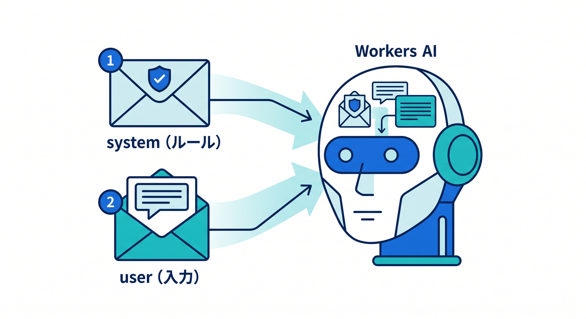
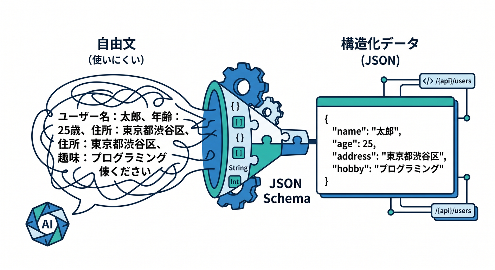
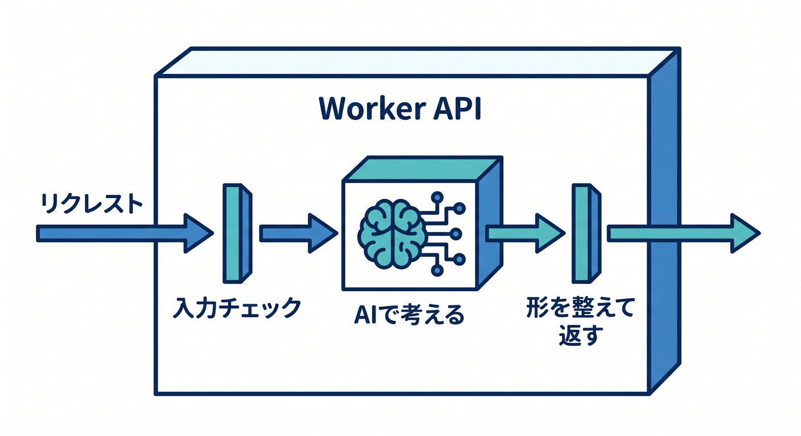
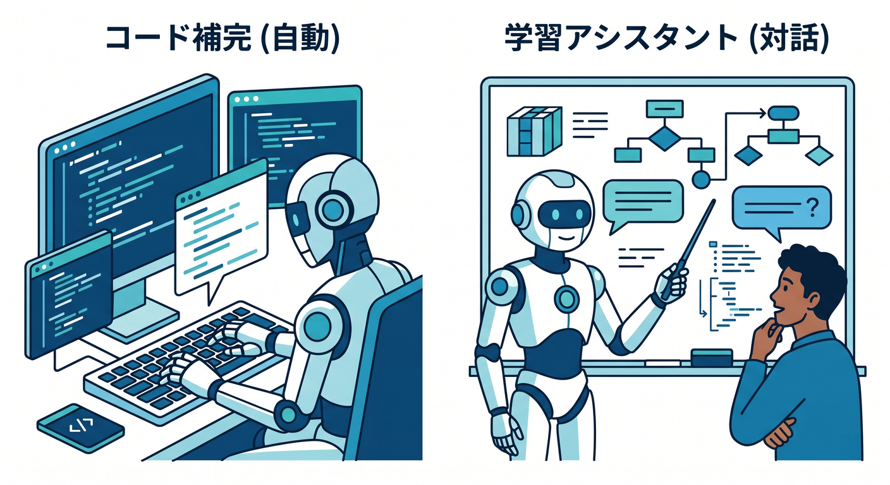

# 第13章：Workers AIでAI APIを1本作ろう 🤖✨

この章では、ついに **Cloudflare上でAIつきAPIを1本完成** させます 🎉
ここまでで学んだ「GET / POST」「JSON」「エラー処理」「APIの守り方」を、AIにもそのままつなげる回です。Workers AI はすでに一般提供されていて、Worker から **binding 経由でAIモデルを直接呼べる** のが大きな強みです。さらに Cloudflare 公式では、Workers AI の周辺として **AI Gateway** や **Vectorize** もそろっていて、観測・キャッシュ・RAG方向へ広げやすい構成になっています。 ([Cloudflare Docs][1])

この章で目指すのは、難しいAI理論を覚えることではありません 🙌
**「普通のAPIを作る感覚のまま、AIを1つの機能として組み込める」** ところまで進むことです。

---

## この章でできるようになること 🌟

この章を終えると、こんなことができるようになります。

* Worker に **Workers AI binding** を追加できる
* `POST /api/summarize` のような **AI API** を作れる
* AIの返事を自然文ではなく **JSONで受け取る** 感覚がわかる
* 次の発展先として **AI Gateway** や **Vectorize** がどう効くか見えてくる

Workers AI では、テキスト生成だけでなく、画像分類・物体検出など複数タスク向けのモデルが用意されています。モデルカタログには、たとえば **Gemma 3 系のようなマルチモーダルモデル** もあり、2026年4月には **Gemma 4 26B A4B** も追加されています。つまり本日時点では、単なる「文章生成」だけでなく、かなり広いAI機能をWorkersから扱える状態です。 ([Cloudflare Docs][1])

---

## 今回作るミニ作品 🧠📮

今回は、わかりやすくて実務でも使い道がある **問い合わせ要約API** を作ります ✨

送るデータはこんな形です。

```json
{
  "text": "昨日からログイン時に500エラーが出ます。PCでもスマホでも再現します。至急確認してください。"
}
```

返ってくる結果はこんな感じです。

```json
{
  "summary": "ログイン時に500エラーが発生し、PCとスマホの両方で再現している。",
  "category": "障害報告",
  "urgency": "高",
  "keywords": ["ログイン", "500エラー", "再現", "至急"]
}
```

ここで大事なのは、AIに「文章を返してね」ではなく、**APIとして扱いやすいJSONを返してね** と頼むことです。Workers AI は **JSON Mode** をサポートしていて、`response_format` に JSON Schema を渡すことで、構造化された出力を狙えます。 ([Cloudflare Docs][2])

---

## まずは考え方をつかもう 🪄

この章では、AIをこう考えるとわかりやすいです。

**AI = すごく賢い処理関数** です 😊

今までのAPIは、

* 入力を受け取る
* 条件分岐する
* JSONを返す

という流れでした。

AI APIでも、基本は同じです。

* 入力文を受け取る
* 必要ならバリデーションする
* `env.AI.run()` でモデルに渡す
* 結果をJSONで返す

Cloudflare 公式のWorkers AI導線でも、Worker に AI binding を付けて `env.AI.run()` を呼ぶ流れが基本になっています。Workers AI の `run` では、`prompt` だけでなく `messages` 形式も扱え、2026年2月の更新では `/ai/run` が **`messages` / `prompt` / `input`** を動的に受け分けることも案内されています。 ([Cloudflare Docs][3])

---

## ステップ1：AI binding を追加しよう 🔌🤖

Workers AI を Worker から使うには、まず **AI binding** を追加します。Cloudflare 公式では、新しいプロジェクトでは `wrangler.jsonc` の利用が推奨されていて、AI binding は `ai.binding` で設定します。TypeScript を使うなら、設定変更後に `wrangler types` を走らせて `env` の型を再生成するのが公式の流れです。 ([Cloudflare Docs][4])

`wrangler.jsonc` のイメージです。

```jsonc
{
  "name": "chapter13-workers-ai-api",
  "main": "src/index.ts",
  "compatibility_date": "2026-04-17",
  "ai": {
    "binding": "AI"
  }
}
```

ここでの `"AI"` は、コード中では `env.AI` になります。 ([Cloudflare Docs][5])

設定を書いたら、型を更新します。

```powershell
npx wrangler types
```

---

## ステップ2：まずは最小のAI呼び出しを知ろう 🐣

Cloudflare の公式チュートリアルでは、最初の例として `@cf/meta/llama-3.1-8b-instruct` を `env.AI.run()` で呼び出しています。`wrangler dev` でローカル確認もできますが、**Workers AI はローカル開発中でも実際にCloudflareアカウントへアクセスして課金対象になりうる** と明記されています。ここはかなり大事です 💡 ([Cloudflare Docs][3])

最小例はこんな形です。

```ts
export interface Env {
  AI: Ai;
}

export default {
  async fetch(request, env): Promise<Response> {
    const result = await env.AI.run("@cf/meta/llama-3.1-8b-instruct", {
      prompt: "こんにちは。Cloudflare Workers AIとは何ですか？"
    });

    return new Response(JSON.stringify(result), {
      headers: { "content-type": "application/json; charset=UTF-8" }
    });
  }
} satisfies ExportedHandler<Env>;
```

でも、この章ではここから一歩進めて、**ちゃんとAPIらしい形** にしていきます ✨

---

## ステップ3：問い合わせ要約APIを完成させよう 🧩

今回は `POST /api/summarize` を作ります。
ポイントは次の3つです。

* `request.json()` で本文を受け取る
* `messages` 形式でAIに役割を伝える
* `response_format` でJSON Schemaを渡す

コード全体はこちらです。

```ts
export interface Env {
  AI: Ai;
}

type SummaryResponse = {
  summary: string;
  category: "質問" | "障害報告" | "要望" | "その他";
  urgency: "低" | "中" | "高";
  keywords: string[];
};

export default {
  async fetch(request, env): Promise<Response> {
    const url = new URL(request.url);

    if (request.method === "GET" && url.pathname === "/") {
      return jsonResponse({
        message: "POST /api/summarize に text を送ってください"
      });
    }

    if (request.method === "POST" && url.pathname === "/api/summarize") {
      try {
        const body = (await request.json()) as { text?: string };
        const text = body.text?.trim();

        if (!text) {
          return jsonResponse({ error: "text は必須です" }, 400);
        }

        if (text.length > 3000) {
          return jsonResponse({ error: "text は3000文字以内で送ってください" }, 400);
        }

        const aiResult = await env.AI.run(
          "@cf/meta/llama-3.1-8b-instruct",
          {
            messages: [
              {
                role: "system",
                content:
                  "あなたは日本語の問い合わせ整理アシスタントです。入力文を読み、要約・分類・緊急度判定・キーワード抽出を行ってください。余計な説明は書かず、必ず指定されたJSONだけを返してください。"
              },
              {
                role: "user",
                content: text
              }
            ],
            response_format: {
              type: "json_schema",
              json_schema: {
                type: "object",
                properties: {
                  summary: { type: "string" },
                  category: {
                    type: "string",
                    enum: ["質問", "障害報告", "要望", "その他"]
                  },
                  urgency: {
                    type: "string",
                    enum: ["低", "中", "高"]
                  },
                  keywords: {
                    type: "array",
                    items: { type: "string" }
                  }
                },
                required: ["summary", "category", "urgency", "keywords"]
              }
            }
          }
        );

        const normalized = normalizeAiResult(aiResult);
        return jsonResponse(normalized);
      } catch (error) {
        console.error(error);
        return jsonResponse(
          { error: "AI処理中にエラーが発生しました" },
          500
        );
      }
    }

    return jsonResponse({ error: "Not Found" }, 404);
  }
} satisfies ExportedHandler<Env>;

function jsonResponse(data: unknown, status = 200): Response {
  return new Response(JSON.stringify(data, null, 2), {
    status,
    headers: {
      "content-type": "application/json; charset=UTF-8"
    }
  });
}

function normalizeAiResult(result: unknown): SummaryResponse {
  if (typeof result === "string") {
    return JSON.parse(result) as SummaryResponse;
  }

  if (typeof result === "object" && result !== null) {
    const record = result as Record<string, unknown>;

    if (typeof record.response === "string") {
      return JSON.parse(record.response) as SummaryResponse;
    }

    return record as unknown as SummaryResponse;
  }

  throw new Error("Unexpected AI response format");
}
```

---

## このコードの見どころをやさしく整理 🍀

### 1. `messages` を使うとAIに役割を渡しやすい



`system` で「どう振る舞うか」を決めて、`user` で実際の入力を渡しています。Workers AI では `prompt` だけでなく `messages` 形式も使えるので、**少し本格的なAI API** を作るならこちらの形がかなり便利です。 ([Cloudflare Docs][6])

### 2. `response_format` が超重要



AIは放っておくと説明文をたくさん返しがちです 😅
でも API では、画面やDBや別システムにつなぎたいので、**決まった形のJSON** がほしいです。Workers AI の JSON Mode では、`response_format` に JSON Schema を渡して、構造化出力を要求できます。しかも OpenAI の JSON Mode 互換として説明されています。 ([Cloudflare Docs][2])

### 3. 入力チェックを先にやる

AIに渡す前に `text` の有無や長さをチェックしています。
これはAIに限らず、普通のAPIの基本です。無駄な実行を減らせるので、**料金面でもエラー面でも大事** です。

### 4. `normalizeAiResult()` で受け取りを安定させる

教材ではまず「動かして理解する」が大事なので、返却値を少し柔らかく吸収する形にしています。
ここはあとで自分の使うモデルやSDKに合わせて、もっと厳密にしていけばOKです 👍

---

## ステップ4：Windowsでローカル確認しよう 🪟🧪

開発サーバーを起動します。

```powershell
npx wrangler dev
```

Cloudflare 公式でも、Workers AI のローカル開発は `wrangler dev` で進める流れです。ただし先ほど触れた通り、**ローカルでもAI実行はCloudflare側へ飛ぶ** ので、利用量は意識しておきましょう。 ([Cloudflare Docs][3])

PowerShell からテストするなら、たとえばこうです。

```powershell
Invoke-RestMethod `
  -Method Post `
  -Uri "http://127.0.0.1:8787/api/summarize" `
  -ContentType "application/json" `
  -Body '{"text":"昨日からログイン時に500エラーが出ます。PCでもスマホでも再現します。至急確認してください。"}'
```

うまくいけば、**要約・カテゴリ・緊急度・キーワード** が JSON で返ってきます 🎉

---

## ステップ5：公開してAI APIにしよう 🚀

動作確認できたら公開です。

```powershell
npx wrangler deploy
```

これで、Cloudflareのグローバルネットワーク上でAI APIが動きます。Workers AI は Workers と binding で自然につながる設計なので、外部AIサービスを別途つなぎ込むよりも、**Cloudflare内でひとまとまりに作りやすい** のが魅力です。 ([Cloudflare Docs][5])

---

## この章で一緒に覚えたい設計感覚 🧱

ここ、かなり大事です。

AI API を作るときは、つい
「AIに全部まかせればいいのでは？」
と思いがちです 🤔

でも実際は、

* **入力チェック** は自分でやる
* **返す形** は自分で決める
* **エラー処理** も自分で持つ
* AIには **考える部分だけ** を 맡せる

これが基本です。

つまり、AIは API 全体の主役ではなく、**APIの中の1機能** として置くと安定します。



この感覚は、今後 D1・R2・Vectorize・AI Gateway と組み合わせるときにすごく効きます。Workers AI の関連製品として、Cloudflare 公式でも **AI Gateway**、**Vectorize**、**D1**、**R2** などが並んでいて、AI機能をアプリ全体へ広げやすい構成になっています。 ([Cloudflare Docs][1])

---

## 一歩先：AI Gateway をどう考える？ 🛰️


この章では必須ではありませんが、AI API を少し本番寄りにするなら **AI Gateway** を早めに意識しておくと良いです。Cloudflare 公式では、AI Gateway は **analytics / caching / security** をWorkers AIリクエストに付けられる位置づけで説明されています。関連ページではさらに、キャッシュ、レート制御、リトライ、モデルフォールバックなどの機能も案内されています。 ([Cloudflare Docs][7])

将来的には、こんな発想ができます。

* 開発初期：まず `env.AI.run()` だけで作る
* 利用が増えたら：**AI Gateway** で観測やキャッシュを付ける
* 検索や社内ナレッジ対応をしたくなったら：**Vectorize** を足す

ちなみに AI binding は AI Gateway ともそのままつながり、Workers AI モデルだけでなく、**AI Gateway経由でサードパーティモデル** を使う道もあります。公式では、その場合は Unified Billing が使われ、Cloudflare がプロバイダ認証情報を管理し、binding経由では **BYOK は未対応** と案内されています。 ([Cloudflare Docs][8])

---

## 一歩先：Vectorize につながる未来 🧭


今作ったのは「入力された1文を整理する」AI APIでした。
でも次の段階では、「資料やFAQを検索してから答える」AIが欲しくなります 📚

そのときに出てくるのが **Vectorize** です。Cloudflare 公式では Vectorize はすでに一般提供で、Workers AI を使って **埋め込みベクトルを作成し、Vectorize に保存して検索する** 流れが案内されています。つまり将来は、

* 問い合わせ文を埋め込み化
* 近いFAQを検索
* その結果をAIへ渡して返答

という **RAGの入口** に自然に進めます。 ([Cloudflare Docs][9])

---

## Copilot活用メモ ✍️🤝

この章は、GitHub Copilot やAIエディタと相性がとてもいいです。Cloudflare 公式の Prompting ページでは、Workers アプリを **VS Code などのエディタや各種エージェントからプロンプトで作れる** こと、さらに **Cloudflare Docs MCP** や **Observability MCP** をつないで、ドキュメント参照やログ確認に役立てられることが案内されています。 ([Cloudflare Docs][10])

たとえば Copilot には、こんな聞き方が便利です 💬

* 「この Worker の `POST /api/summarize` の流れを初心者向けに説明して」
* 「`response_format` の JSON Schema をもっと厳密にして」
* 「Cloudflare Docs MCP を見て、この `env.AI.run()` の書き方が今も有効か確認して」
* 「エラー時に `400 / 500 / 404` を返す理由をコメントで追記して」

こういう使い方をすると、**コード補完AI** ではなく **学習アシスタントAI** として活用しやすいです 😊



---

## この章でつまずきやすいポイント ⚠️

### AIの返事が自由すぎる

→ `response_format` を使う。
自由文のままだと、あとでReact画面やDBにつなぎにくいです。 ([Cloudflare Docs][2])

### なんでもAIに任せたくなる

→ 入力チェックとHTTP設計は自分で持つ。
AIは「判断・生成」担当、APIは「入口と出口」担当です。

### ローカルなら無料だと思い込む

→ Workers AI はローカル開発でも実アカウントにアクセスし、利用料金が発生しうる点に注意です。 ([Cloudflare Docs][3])

### モデル選びで悩みすぎる

→ まずは公式の定番例にならって1つ動かす。
Workers AI はモデルカタログが広いので、最初から最適解を探しすぎるより、まず小さく作る方が早いです。現在もモデル追加が続いています。 ([Cloudflare Docs][1])

---

## 練習問題 📝✨

1. `keywords` を最大3件までにしてみましょう
2. `category` に「請求」「アカウント」を追加してみましょう
3. 英文入力でも同じJSON形式で返すようにしてみましょう
4. 返却結果を D1 に保存して「AIで整理した問い合わせ履歴API」にしてみましょう
5. AI Gateway を使う前提で、「あとで観測しやすい設計」を考えてみましょう

---

## この章のまとめ 🎊

この章でいちばん大事なのは、
**AIは特別な魔法ではなく、Workersの中で呼び出せる1つの機能**
とつかむことです。

Workers AI は一般提供されていて、binding によって Worker から直接扱えます。JSON Mode による構造化出力、AI Gateway による観測と制御、Vectorize による検索拡張まで、Cloudflare の中で一本道につながっているのが本当に強いところです。 ([Cloudflare Docs][1])

第13章の到達点はこれです 🎯

* AIモデルを Worker から呼べる
* POST API として公開できる
* JSONで返してアプリにつなげられる
* 次の発展先が見える

つまり、ここで初めて
**「CloudflareでAIアプリっぽいものを自力で作れた！」**
という感覚が出てきます 🤖🌈✨

必要ならこの続きとして、次にそのまま使える形で
**「第13章の確認テスト」** または **「第13章の演習問題＋模範解答」** まで続けて作れます。

[1]: https://developers.cloudflare.com/workers-ai/ "Overview · Cloudflare Workers AI docs"
[2]: https://developers.cloudflare.com/workers-ai/features/json-mode/ "JSON Mode · Cloudflare Workers AI docs"
[3]: https://developers.cloudflare.com/workers-ai/get-started/workers-wrangler/ "Get started - Workers and Wrangler · Cloudflare Workers AI docs"
[4]: https://developers.cloudflare.com/workers/wrangler/configuration/ "Configuration - Wrangler · Cloudflare Workers docs"
[5]: https://developers.cloudflare.com/workers-ai/configuration/bindings/ "Workers Bindings · Cloudflare Workers AI docs"
[6]: https://developers.cloudflare.com/workers-ai/changelog/ "Changelog · Cloudflare Workers AI docs"
[7]: https://developers.cloudflare.com/ai-gateway/usage/providers/workersai/ "Workers AI · Cloudflare AI Gateway docs"
[8]: https://developers.cloudflare.com/ai-gateway/integrations/worker-binding-methods/ "Workers Bindings · Cloudflare AI Gateway docs"
[9]: https://developers.cloudflare.com/vectorize/get-started/embeddings/ "Vectorize and Workers AI · Cloudflare Vectorize docs"
[10]: https://developers.cloudflare.com/workers/get-started/prompting/ "Prompting · Cloudflare Workers docs"
