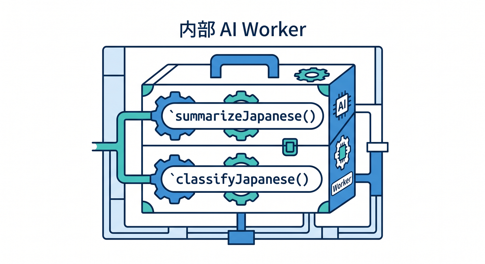
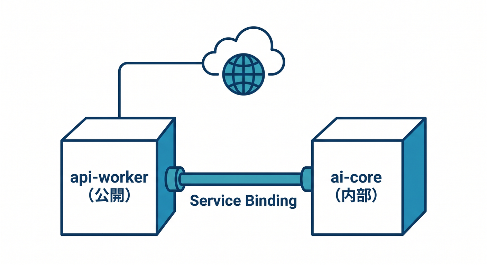
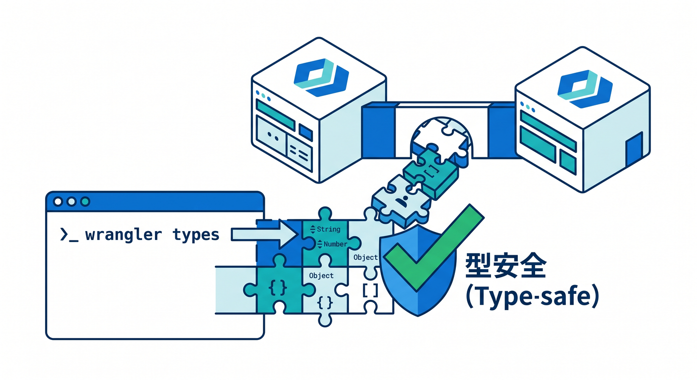
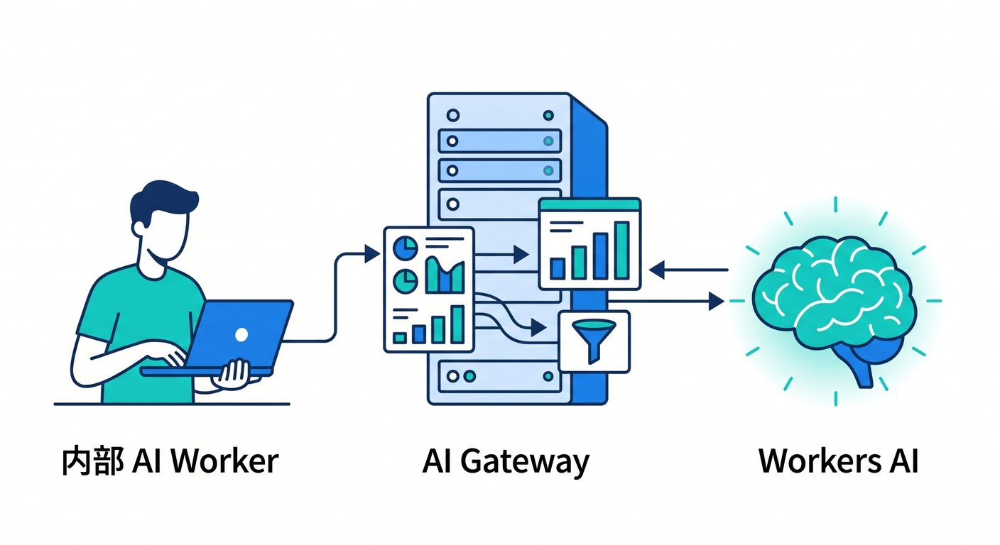
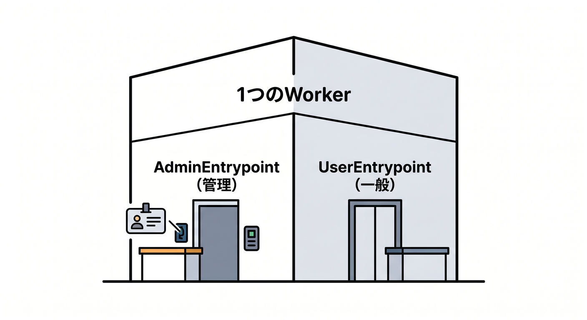
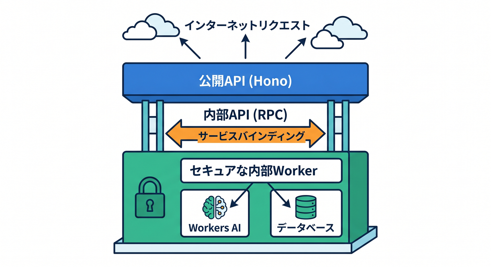

# 第14章：Hono・Service Bindings・RPCで“整理されたAPI”へ進もう 🧱🧠

この章では、今まで作ってきたAPIを「ただ動くもの」から「育てやすいもの」へ進化させます 🌱
第13章でAI APIを1本作れたなら、次は **役割ごとに分ける**、**内部だけで呼ぶ**、**型で事故を減らす**、この3つを覚える番です。Cloudflare公式でも、外に見せる入口と内部処理を分ける設計はとても相性がよく、複数Workerを **Service Bindings + type-safe RPC** でつなぐ構成が案内されています。 ([Cloudflare Docs][2])

---

## この章のゴール 🎯📘

この章を終えると、次のことができるようになります。

* **Hono** を使って、外向きAPIのルーティングを見やすく整理できる 😊 ([Cloudflare Docs][3])
* **Service Bindings** を使って、Workerから別Workerを **公開URLなし** で呼べる 🚪➡️🚪 ([Cloudflare Docs][1])
* **RPC** を使って、内部Workerのメソッドを **関数っぽく直接呼ぶ** 感覚をつかめる ⚡ ([Cloudflare Docs][4])
* **Workers AI** や **AI Gateway** を、外向きAPIの裏側にきれいに隠して扱える 🤖🌐 ([Cloudflare Docs][5])
* **wrangler types** を使って、binding名ミスや型ズレを早めに見つけられる 🛟 ([Cloudflare Docs][6])

---

## この章で作る完成イメージ 🏗️✨

今回の完成イメージはこんな感じです。

**ブラウザ / React画面**
→ **Honoで作った公開API Worker**
→ **内部専用のAI Worker**
→ **Workers AI / AI Gateway / 将来はD1やVectorizeも追加**

この分け方にすると、ユーザーが叩くのは公開API Workerだけです。AIの呼び出し方、モデルの差し替え、ログ収集、将来のRAG化などは内部Worker側で吸収しやすくなります。CloudflareのAI関連ドキュメントでも、Workers AI・AI Gateway・Vectorize を組み合わせた構成が案内されています。 ([Cloudflare Docs][7])

---

## まずは3つの道具をやさしく整理しよう 🧰🌈

## 1. Honoって何？ 🍜

Hono は、Cloudflare Workers と相性のよい軽量フレームワークです。Cloudflare公式では、**React SPA + Hono API + Cloudflare Vite plugin** の組み合わせで始める例も出ていて、ローカル開発時も Workers 本番に近いランタイムで動かしやすい流れになっています。 ([Cloudflare Docs][3])

この章では、Honoを「外向きAPIの受付係」として使います。
たとえば、

* **POST /api/summary**
* **POST /api/classify**
* **GET /api/health**

みたいに、ブラウザやReactから呼ばれる入口をHonoでまとめます 😊

---

## 2. Service Bindingsって何？ 🔗

Service Bindings は、**Worker A から Worker B を内部接続で呼ぶ仕組み**です。Cloudflare公式では、**publicly-accessible URL を通さない**、**zero overhead / added latency がない**、**追加コストなし** と説明されています。さらにベストプラクティスでも、Worker同士の通信は公開URLではなく Service Bindings を使うよう案内されています。 ([Cloudflare Docs][1])

大事なのはここです👇

* 外向きURLをわざわざ叩かなくていい 🌐❌
* 内部用Workerを **外に公開しなくて済む** 🔒
* 機能ごとに分割しても遅くなりにくい ⚡
* 「認証」「AI」「DB」などを役割別に切り分けやすい 🧩

---

## 3. RPCって何？ ☎️✨

CloudflareのRPCは、内部Workerのメソッドを **JavaScriptの関数みたいに呼べる** 仕組みです。公式では **WorkerEntrypoint** を継承して公開メソッドを作り、呼び出し側Workerは binding 経由でそのメソッドを直接呼びます。たとえば公式例では、片方のWorkerが **add(a, b)** を公開し、呼び出し側が **env.WORKER_B.add(1, 2)** のように使えます。 ([Cloudflare Docs][4])

つまり、HTTPのURLを自分で組み立てて **fetch** する代わりに、

* **env.AI_CORE.summarizeJapanese(text)**
* **env.AUTH_SERVICE.validate(token)**

みたいに呼べるわけです 😍
この感覚がつかめると、一気に「整理された設計」が見えてきます。

---

## HTTPのService BindingとRPCの違い 🆚🧠

ここ、初学者が混ざりやすいので整理します。

## HTTPでつなぐ場合 🌐

binding先の **fetch()** を呼びます。Cloudflare公式でも **env.WORKER_B.fetch(request)** という形で説明されています。HTTPのRequest/Responseをそのまま流したいときに向いています。 ([Cloudflare Docs][8])

## RPCでつなぐ場合 ⚡

binding先の **公開メソッド** を直接呼びます。Cloudflare公式では、**WorkerEntrypoint** の公開メソッドを別Workerから直接呼べるようになっています。処理単位がはっきりしていて、TypeScriptで安全に扱いたいときにかなり便利です。 ([Cloudflare Docs][4])

## 今回の章ではどっちを採用する？

**外向きは Hono + HTTPっぽいAPI**、**内向きは Service Bindings + RPC** がいちばん学習効果が高いです 😊
利用者には普通のAPIとして見せつつ、内部はきれいに関数呼び出しのように整理できます。

---

## この章のおすすめ設計 🏛️✨

この章では、こう考えるとスッと入ります。

## 公開API Workerの役目 🌍

* ルーティング
* 入力チェック
* エラー整形
* 認証チェック
* レスポンス形式の統一

## 内部AI Workerの役目 🤖

* 要約
* 分類
* 文章整形
* AI Gatewayのログやキャッシュ設定
* 将来のモデル差し替え

Cloudflareの配置ガイドでも、**認証やルーティングなどの edge logic** と、**DB問い合わせやAPI呼び出しなどの back-end logic** を複数Workerに分け、Service Bindings と type-safe RPC でつなぐ構成が案内されています。 ([Cloudflare Docs][2])

---

## ハンズオン：公開API Worker と 内部AI Worker を分けてみよう 🛠️🤖

ここからが実践です 💪✨
今回はシンプルに、2つのWorkerを用意します。

* **api-worker** … Honoで公開APIを受ける
* **ai-core** … 内部専用。Workers AI を呼ぶ

Cloudflare公式では新規プロジェクトでは **wrangler.jsonc** 推奨です。新しい機能はJSON設定を前提にしているものもあるので、この章でも JSONC で進めます。 ([Cloudflare Docs][9])

---

## 手順1：内部AI Worker を作る 🤖

まずはAI処理専用のWorkerです。ここは外から直接触らせない「中身」にします。

## ai-core / wrangler.jsonc

```json
{
  "$schema": "./node_modules/wrangler/config-schema.json",
  "name": "ai-core",
  "main": "src/index.ts",
  "compatibility_date": "2026-04-17",
  "ai": {
    "binding": "AI"
  }
}
```

Workers AI は **AI binding** を追加すると Worker から **env.AI** として使えます。Cloudflare公式でも、この形で binding を追加して **env.AI.run()** を呼ぶ流れが案内されています。 ([Cloudflare Docs][5])

## ai-core / src/index.ts

```ts
import { WorkerEntrypoint } from "cloudflare:workers";

type TextResult = {
  text: string;
};

export default class AiCore extends WorkerEntrypoint<Env> {
  async summarizeJapanese(input: string): Promise<TextResult> {
    const result = await this.env.AI.run("@cf/meta/llama-3.1-8b-instruct", {
      prompt: `次の文章を日本語でやさしく3行以内に要約してください。\n\n${input}`,
    });

    return {
      text: String((result as { response?: string }).response ?? ""),
    };
  }

  async classifyJapanese(input: string): Promise<TextResult> {
    const result = await this.env.AI.run("@cf/meta/llama-3.1-8b-instruct", {
      prompt: `次の文章を「質問」「感想」「要望」のどれか1語で分類してください。\n\n${input}`,
    });

    return {
      text: String((result as { response?: string }).response ?? ""),
    };
  }
}
```

ここでのポイントは、**fetch ハンドラではなく メソッドを公開している** ことです。



このWorkerは「URLを受ける窓口」より、「内部から呼ばれる道具箱」っぽい存在です。Cloudflare公式でも、**WorkerEntrypoint を継承して公開メソッドを作る** のがRPCの基本形です。 ([Cloudflare Docs][4])

---

## 手順2：公開API Worker に Service Binding を付ける 🌍➡️🤖

次は、外に見せる側です。
こちらは Hono を使って、入口をスッキリ整理します。

## api-worker / wrangler.jsonc

```json
{
  "$schema": "./node_modules/wrangler/config-schema.json",
  "name": "api-worker",
  "main": "src/index.ts",
  "compatibility_date": "2026-04-17",
  "services": [
    {
      "binding": "AI_CORE",
      "service": "ai-core"
    }
  ]
}
```

ここで超大事なのは、**Service Binding は呼び出し側の Wrangler 設定に書く** ことです。



Cloudflare公式でも、Service Binding は **caller 側** に追加すると説明されています。 ([Cloudflare Docs][1])

---

## 手順3：Honoで公開APIを作る 🍜✨

## api-worker / src/index.ts

```ts
import { Hono } from "hono";

const app = new Hono<{ Bindings: Env }>();

app.get("/api/health", (c) => {
  return c.json({ ok: true });
});

app.post("/api/summary", async (c) => {
  const body = await c.req.json<{ text?: string }>();

  if (!body.text) {
    return c.json({ error: "text は必須です" }, 400);
  }

  const result = await c.env.AI_CORE.summarizeJapanese(body.text);
  return c.json({ summary: result.text });
});

app.post("/api/classify", async (c) => {
  const body = await c.req.json<{ text?: string }>();

  if (!body.text) {
    return c.json({ error: "text は必須です" }, 400);
  }

  const result = await c.env.AI_CORE.classifyJapanese(body.text);
  return c.json({ label: result.text });
});

export default app;
```

Hono 側はかなり読みやすいですね 😊
「どのURLを受けるか」「入力が足りないときどう返すか」「内部AI Workerのどの処理を呼ぶか」が、かなり素直に見えるはずです。

Cloudflare公式のHonoガイドでも、Honoアプリは Worker 上で動き、binding を通じて **compute / storage / AI** などと統合できる形が案内されています。さらに Vite plugin により、ローカル開発も本番に近いWorkersランタイムで試しやすくなっています。 ([Cloudflare Docs][3])

---

## 手順4：型を自動生成する 🧠🛟

Service Bindings と RPC を使うなら、**wrangler types** はほぼ必須です。



Cloudflare公式では、**Env を手書きしないで wrangler types を使う** ことがベストプラクティスとして案内されています。binding を追加・変更したら再実行するのが大事です。 ([Cloudflare Docs][10])

たとえばワークスペースでこうします。

```bash
npx wrangler types -c ./api-worker/wrangler.jsonc -c ./ai-core/wrangler.jsonc
```

Cloudflare公式のRPC TypeScriptガイドでも、複数の Wrangler 設定ファイルを指定して型を生成すると、**Service<...>** を含む正しい型が作られ、**env.SUM_SERVICE.sum(...)** のようなRPCメソッドが型付きで扱えると説明されています。 ([Cloudflare Docs][11])

---

## 手順5：動かして確認する ▶️✨

ローカルで開発するとき、Cloudflare公式のHonoガイドでは Cloudflare Vite plugin によって **Workers runtime に近い形** で動かせて、binding のローカルエミュレーションも使えると案内されています。 ([Cloudflare Docs][3])

確認したい流れはこんな感じです。

1. **POST /api/summary** に文章を送る
2. Hono がJSONを受け取る
3. **c.env.AI_CORE.summarizeJapanese(...)** を呼ぶ
4. 内部AI Worker が **env.AI.run()** で要約する
5. 結果を Hono が整えて返す

この時点で、外からは普通のAPIに見えるのに、内部はかなり整理されています 🎉

---

## さらに一歩：AI Gateway を混ぜるともっと今っぽい 🚀🤖

Cloudflare公式では、AI binding の **env.AI** から AI Gateway の機能を直接使えます。
AI Gateway には **analytics / logging / caching / rate limiting / retries / fallback** などがあり、AIアプリの観測と制御に向いています。Workers AI モデルも、AI binding 経由で Gateway オプションを付けて実行できます。 ([Cloudflare Docs][12])

たとえば内部AI Workerだけをこう変えると、公開APIの形を変えずに、AIログやキャッシュ制御を足せます。



```ts
const result = await this.env.AI.run(
  "@cf/moonshotai/kimi-k2.5",
  {
    prompt: `次の文章を日本語で要約してください。\n\n${input}`,
  },
  {
    gateway: {
      id: "chapter14-gateway",
      collectLog: true,
      cacheTtl: 300,
    },
  },
);
```

こういう分離にしておくと、将来、

* モデル変更 🔄
* AI Gateway導入 📊
* VectorizeによるRAG化 📚
* D1で履歴保存 🧾

みたいな拡張がしやすいです。CloudflareのAIユースケースでも、**Workers + Workers AI / AI Gateway + Vectorize** の組み合わせが案内されています。 ([Cloudflare Docs][7])

---

## named entrypoints を知ると、さらに整理上手になれる 🏷️✨

Cloudflare公式のRPCドキュメントでは、1つのWorker内に **複数の WorkerEntrypoint** を定義し、Service Binding 側で **entrypoint** を指定して特定の役割だけを呼ぶ形も紹介されています。たとえば **AdminEntrypoint** のように、管理者用の機能だけ切り出せます。 ([Cloudflare Docs][4])

たとえばイメージはこんな感じです。

```ts
import { WorkerEntrypoint } from "cloudflare:workers";

export class AdminEntrypoint extends WorkerEntrypoint<Env> {
  async rebuildIndex() {
    return { ok: true };
  }
}

export class UserEntrypoint extends WorkerEntrypoint<Env> {
  async summarize(text: string) {
    return { ok: true, text };
  }
}
```

そして binding 側で、

```json
{
  "services": [
    {
      "binding": "ADMIN",
      "service": "ai-core",
      "entrypoint": "AdminEntrypoint"
    }
  ]
}
```

こんなふうにすると、**同じWorkerでも役割別に入口を分ける** ことができます。



大きめのAPIや、管理用・一般用を分けたいときにかなり便利です 😊

---

## 発展：ctx.props と ctx.exports は「上級者の入口」🧪✨

Cloudflare公式では、**ctx.props** を使って「特定の権限や特定の対象に限定した custom binding」を作る考え方も紹介されています。さらに **ctx.exports** を使うと、自分のWorkerの top-level export に対する loopback binding を自動で扱えます。 ([Cloudflare Docs][13])

ただし、ここは第14章では **軽く知るだけでOK** です。
まずは、

* 公開APIは Hono
* 内部処理は Service Binding
* メソッド呼び出しは RPC

この3段だけ押さえれば十分です 👍

---

## よくあるつまずきポイント ⚠️😵‍💫

## 1. binding を設定したのに env に出てこない

たいていは **wrangler types の再生成忘れ** です。Cloudflare公式でも、binding を追加・変更したら **wrangler types を再実行** するよう案内されています。 ([Cloudflare Docs][10])

## 2. 内部Workerなのに公開URLへ fetch してしまう

Cloudflareのベストプラクティスでは、Worker同士の通信は **公開URLより Service Bindings** が推奨です。そこをURL呼び出しに戻すと、この章の良さがかなり消えます。 ([Cloudflare Docs][10])

## 3. Honoを入れたら全部解決すると思う

Honoは **外向きルーティング整理** にとても便利ですが、**内部通信の設計** までは自動でやってくれません。内部構造は Service Bindings / RPC で考える、という役割分担が大事です。 ([Cloudflare Docs][3])

## 4. Env型を手書きしてしまう

Cloudflare公式では、**Env を手書きせず wrangler types を使う** のが推奨です。手書きだと binding 名変更でズレやすいです。 ([Cloudflare Docs][10])

---

## Copilot活用メモ 🤝✨

GitHub Copilot は **MCP** で外部ツールやコンテキストをつなげられます。GitHub公式では、Copilot は IDE でも MCP を使って拡張できると案内されています。Cloudflare側も **cloudflare-docs MCP server** と **cloudflare-observability MCP server** を公開していて、Workers やログ確認に活用できます。 ([GitHub Docs][14])

この章の学習では、たとえば Copilot にこんな感じで聞くと相性がいいです 😊

* 「この Service Binding 設定を確認して」
* 「この Hono ルートを RPC 呼び出しに分割して」
* 「wrangler types が必要な理由をこのコードで説明して」
* 「Cloudflare observability の観点で、AI Gateway のログ確認ポイントを教えて」

こういう進め方をすると、2026年らしい学び方になります 🚀

---

## この章の演習問題 ✍️🌟

## 演習1

**POST /api/tags** を追加して、内部AI Workerに「3つのタグを返す」メソッドを生やしてみましょう。
ポイントは、**Hono側は入口だけ**、**AI処理は内部Worker側** に置くことです。

## 演習2

内部AI Workerに **AdminEntrypoint** を追加して、管理者だけが使う **clearCache()** や **rebuildPrompts()** っぽいメソッドを分けてみましょう。
named entrypoints の意味がかなりつかめます。 ([Cloudflare Docs][4])

## 演習3

AI Worker の **env.AI.run()** に Gateway オプションを付けて、**collectLog** と **cacheTtl** を試してみましょう。
「APIの形は同じなのに、中の運用だけ強くなる」体験ができます。 ([Cloudflare Docs][12])

---

## この章のまとめ 🎉📚

第14章の本質は、こうです。

* **Hono** で外向きAPIを読みやすくする 🍜
* **Service Bindings** で内部Workerを安全に呼ぶ 🔗
* **RPC** で内部処理を関数みたいに扱う ⚡
* **Workers AI / AI Gateway** を裏側に閉じ込めて育てやすくする 🤖

ここまで来ると、Cloudflare Workers は「小さなAPIを1本書く場所」から、「役割を分けたちゃんとしたアプリ基盤」へ見え方が変わってきます。



Cloudflare公式でも、複数Worker構成、type-safe RPC、AI binding、AI Gateway、Hono連携がかなりきれいにつながる形で整理されています。 ([Cloudflare Docs][2])

必要なら次に、この第14章に続く形で
**「章末課題」**、**「確認テスト10問」**、**「教材ページそのまま貼れる完成原稿」** のどれか1つに整えて渡せます。

[1]: https://developers.cloudflare.com/workers/runtime-apis/bindings/service-bindings/ "Service bindings - Runtime APIs · Cloudflare Workers docs"
[2]: https://developers.cloudflare.com/workers/configuration/placement/ "Placement · Cloudflare Workers docs"
[3]: https://developers.cloudflare.com/workers/framework-guides/web-apps/more-web-frameworks/hono/ "Hono · Cloudflare Workers docs"
[4]: https://developers.cloudflare.com/workers/runtime-apis/bindings/service-bindings/rpc/ "Service bindings - RPC (WorkerEntrypoint) · Cloudflare Workers docs"
[5]: https://developers.cloudflare.com/workers-ai/configuration/bindings/ "Workers Bindings · Cloudflare Workers AI docs"
[6]: https://developers.cloudflare.com/workers/languages/typescript/ "Write Cloudflare Workers in TypeScript · Cloudflare Workers docs"
[7]: https://developers.cloudflare.com/use-cases/ai/ "AI applications · Use cases · Cloudflare use cases"
[8]: https://developers.cloudflare.com/workers/runtime-apis/bindings/service-bindings/http/ "Service bindings - HTTP · Cloudflare Workers docs"
[9]: https://developers.cloudflare.com/workers/wrangler/configuration/ "Configuration - Wrangler · Cloudflare Workers docs"
[10]: https://developers.cloudflare.com/workers/best-practices/workers-best-practices/ "Workers Best Practices · Cloudflare Workers docs"
[11]: https://developers.cloudflare.com/workers/runtime-apis/rpc/typescript/ "Workers RPC — TypeScript · Cloudflare Workers docs"
[12]: https://developers.cloudflare.com/ai-gateway/integrations/worker-binding-methods/ "Workers Bindings · Cloudflare AI Gateway docs"
[13]: https://developers.cloudflare.com/workers/runtime-apis/context/ "Context (ctx) · Cloudflare Workers docs"
[14]: https://docs.github.com/en/copilot/concepts/context/mcp?utm_source=chatgpt.com "About Model Context Protocol (MCP)"
