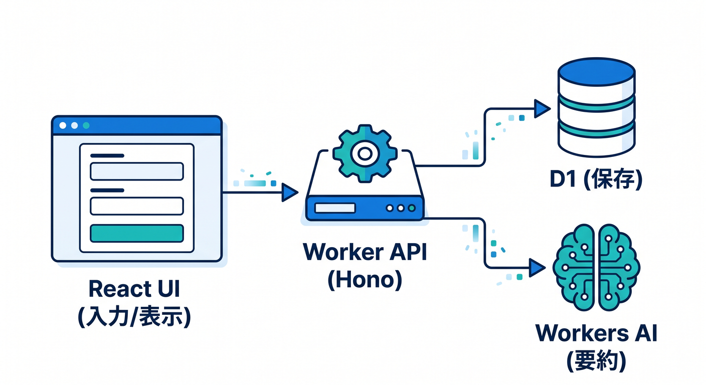
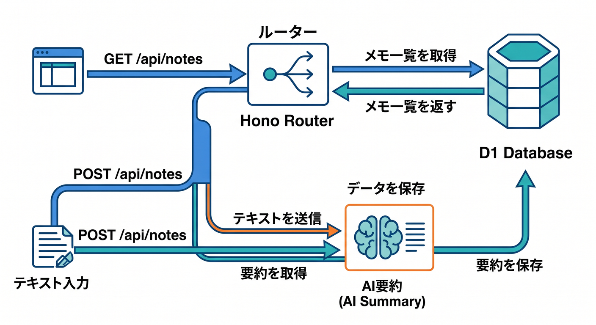
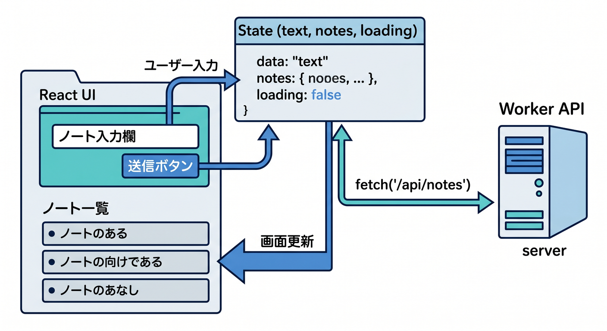
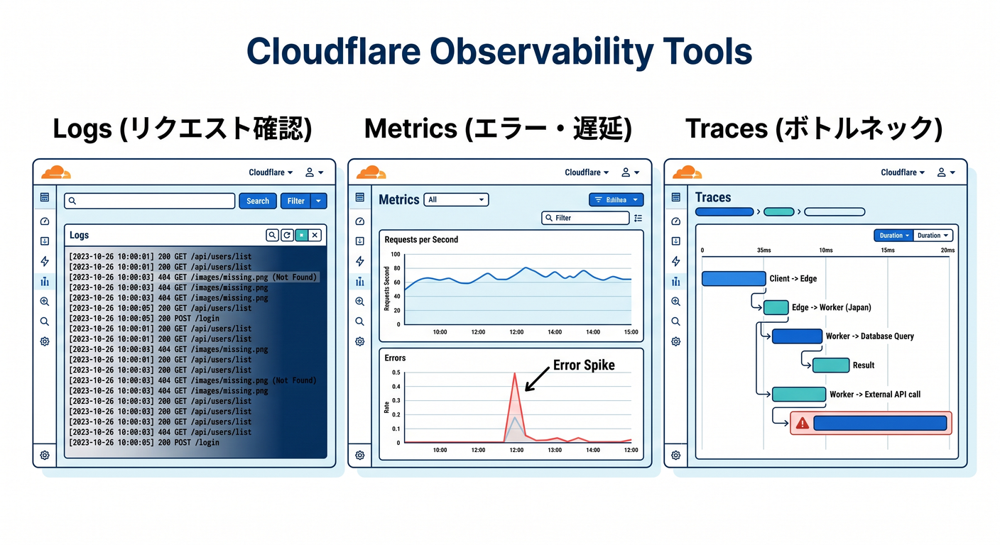
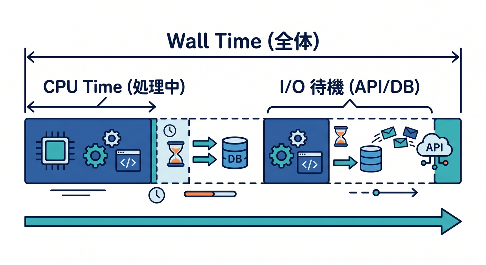
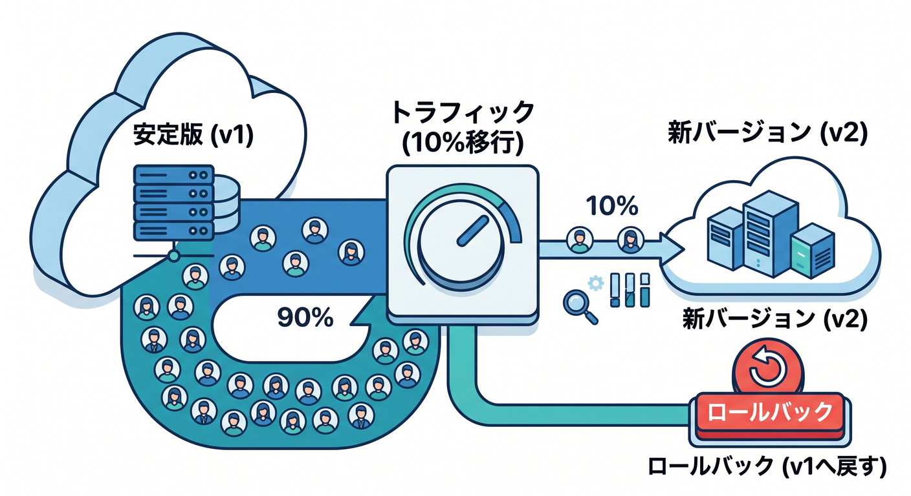
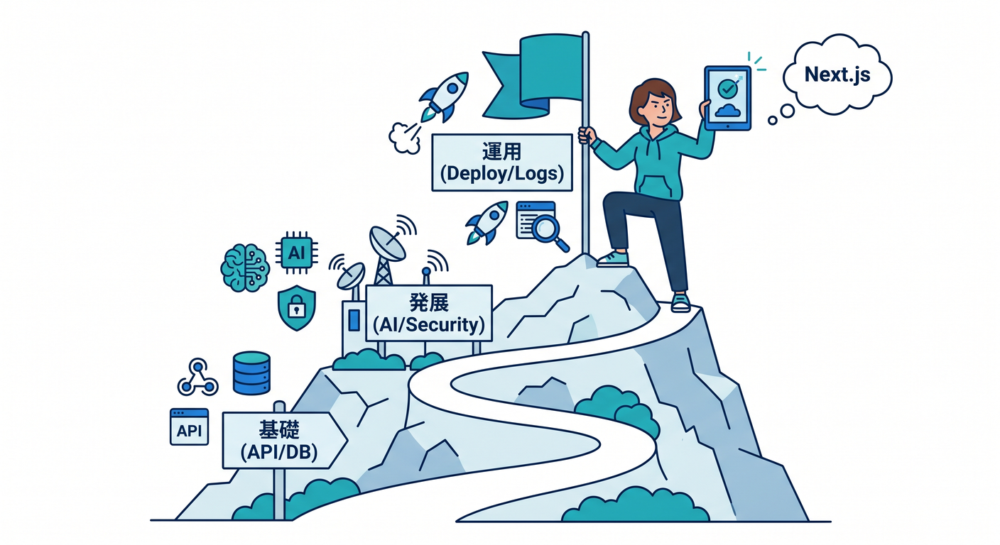

# 第15章：仕上げ！公開・観測・Next.js紹介までつないで作品にしよう 🏁🎉

ここまでで、APIの基本、JSON、React連携、D1、セキュリティ、Workers AI、Honoまで触ってきましたね 🙌
この最終章では、それらをバラバラの知識のまま終わらせず、**「ひとつの作品」としてまとめる力**をつけます。Cloudflare Workers は公開だけでなく、**ログ、メトリクス、トレース、バージョン管理、段階的デプロイ、ロールバック**まで含めて運用しやすい土台がそろっています。さらに、Cloudflare 公式は React + Vite のフルスタック導線、Workers AI の binding、AI Gateway、そして Next.js を Workers 上で動かす OpenNext adapter まで整理しています。 ([Cloudflare Docs][1])

---

## この章で作るもの 🎨📦

最終課題として、こんな小さな作品を完成させます ✨

**「学習メモ要約アプリ」**です 📝🤖

できることはシンプルです。

* React の画面でメモを入力する
* Workers API に送る
* D1 に保存する
* Workers AI で短い要約を作る
* AI Gateway で AI 呼び出しを見守る
* 公開後は Logs / Metrics / Traces で状態を見る
* 必要なら段階的デプロイやロールバックを使う

この流れにすると、**画面・API・DB・AI・運用**が全部ひとつにつながります。React + Vite と Workers の組み合わせは Cloudflare の現行導線でも強く案内されていて、静的アセットと API をまとめて扱える構成が学習しやすいです。Workers AI は binding 経由で Worker から使え、AI Gateway は分析、ログ、キャッシュ、レート制御、リトライ、フォールバックなどを足せます。 ([Cloudflare Docs][2])



---

## この章のゴール 🎯🌈

この章を終えたら、次の状態になっていれば大成功です 🎉

1. **完成作品を公開できる**
2. **公開後にどこを見るべきか分かる**
3. **不具合が出たときに戻す方法を知っている**
4. **Next.js に進む前の位置づけが分かる**
5. **AIつき開発を Cloudflare 流に進める感覚がつく**

Cloudflare の Observability では、Logs、Real-time logs、Metrics、Tracing、Query Builder が用意されています。Versions & Deployments では、**バージョンを作ること**と**どのバージョンに本番トラフィックを流すか**を分けて扱えます。 ([Cloudflare Docs][1])

---

## まずは完成形を頭に入れよう 🧠🏗️

今回の完成形は、こんなイメージです。

* **フロント**：React
* **公開先**：Cloudflare Workers
* **API**：Hono を使った Workers API
* **保存先**：D1
* **AI**：Workers AI
* **AIの見守り**：AI Gateway
* **運用確認**：Workers Logs / Metrics / Traces / Query Builder

ここで大事なのは、**同じ Cloudflare の土台の上でまとめる**ことです。
フロントを静的アセットとして配りつつ、同じ Worker から API を出す形にすると、構成がかなり素直になります。Workers の static assets は Wrangler で設定でき、必要なら assets binding で Worker 側からも扱えます。なお、1つの Worker に設定できる static assets のコレクションは1つです。 ([Cloudflare Docs][3])

---

## 作品のフォルダイメージ 📁✨

こんな形を想像すると分かりやすいです。

```text
study-notes-app/
├─ src/
│  ├─ worker.ts
│  └─ db.ts
├─ frontend/
│  ├─ src/
│  │  └─ App.tsx
│  └─ index.html
├─ migrations/
│  └─ 0001_init.sql
├─ dist/
├─ package.json
└─ wrangler.jsonc
```

Cloudflare は今、新規プロジェクトでは **wrangler.jsonc** を推奨しています。また、Wrangler の設定ファイルを「設定の正本」として扱い、ダッシュボード側で設定をバラバラに変えすぎない運用を勧めています。 ([Cloudflare Docs][4])

---

## 1. Wrangler 設定を仕上げる 🔧📘

まずは設定ファイルです。最終章では「なんとなく動く」ではなく、**何を使うアプリなのか設定で見える**状態にします。

```json
{
  "$schema": "./node_modules/wrangler/config-schema.json",
  "name": "study-notes-app",
  "main": "src/worker.ts",
  "compatibility_date": "2026-04-17",

  "assets": {
    "directory": "./dist"
  },

  "observability": {
    "enabled": true,
    "logs": {
      "invocation_logs": true,
      "head_sampling_rate": 1
    }
  },

  "d1_databases": [
    {
      "binding": "DB",
      "database_name": "study_notes",
      "database_id": "YOUR_DATABASE_ID"
    }
  ],

  "ai": {
    "binding": "AI"
  }
}
```

この設定では、**静的アセット配信、D1 binding、Workers AI binding、Observability** をまとめています。Cloudflare は JSONC 形式を新規で推奨しており、Workers AI は Wrangler で binding を追加して使います。Query Builder の説明ページでも、Observability を Wrangler で有効にする形が案内されています。 ([Cloudflare Docs][4])

## ここでの学び 🌟

* 設定ファイルを見るだけで、このアプリが何を使うか分かる
* 本番運用で見る機能を最初からオンにできる
* AI も DB も「binding としてつなぐ」のが Cloudflare らしい

---

## 2. D1 のテーブルを作る 🧾💾

次に保存先です。今回は最低限で十分です。

```sql
CREATE TABLE notes (
  id INTEGER PRIMARY KEY AUTOINCREMENT,
  original_text TEXT NOT NULL,
  summary TEXT NOT NULL,
  created_at TEXT NOT NULL DEFAULT CURRENT_TIMESTAMP
);
```

この章では DB 設計を難しくしすぎず、**「入力された文章」と「AIが作った要約」をセットで保存する**だけにします。
最終章の目的は DB の高度設計ではなく、**作品を完成させて運用まで見ること**だからです。

---

## 3. API を仕上げる 🧱⚡

第14章で触れた Hono をここで活かします。
最終章では「コードをきれいにまとめる」がかなり大事です 😊

## Worker 側の例

```ts
import { Hono } from "hono";

type Bindings = {
  DB: D1Database;
  AI: Ai;
};

type NoteRow = {
  id: number;
  original_text: string;
  summary: string;
  created_at: string;
};

const app = new Hono<{ Bindings: Bindings }>();

function pickAiText(result: unknown): string {
  if (typeof result === "string") return result.trim();

  if (result && typeof result === "object") {
    const obj = result as Record<string, unknown>;

    if (typeof obj.response === "string") return obj.response.trim();
    if (typeof obj.text === "string") return obj.text.trim();
    if (Array.isArray(obj.result) && typeof obj.result[0] === "string") {
      return obj.result[0].trim();
    }
  }

  return "要約を取得できませんでした。";
}

app.get("/api/notes", async (c) => {
  const result = await c.env.DB.prepare(`
    SELECT id, original_text, summary, created_at
    FROM notes
    ORDER BY id DESC
    LIMIT 20
  `).all<NoteRow>();

  return c.json({
    ok: true,
    notes: result.results ?? []
  });
});

app.post("/api/notes", async (c) => {
  const body = await c.req.json<{ text?: string }>();
  const text = body.text?.trim() ?? "";

  if (!text) {
    return c.json(
      { ok: false, message: "メモ本文を入力してください。" },
      400
    );
  }

  const aiResult = await c.env.AI.run(
    "@cf/moonshotai/kimi-k2.5",
    {
      prompt:
        "次の日本語メモを60文字以内でやさしく1文に要約してください。\n\n" + text
    },
    {
      gateway: {
        id: "study-notes-gateway",
        collectLog: true,
        metadata: {
          feature: "note-summary"
        }
      }
    }
  );

  const summary = pickAiText(aiResult);

  const inserted = await c.env.DB.prepare(`
    INSERT INTO notes (original_text, summary)
    VALUES (?1, ?2)
    RETURNING id, original_text, summary, created_at
  `)
    .bind(text, summary)
    .first<NoteRow>();

  return c.json({
    ok: true,
    note: inserted
  });
});

export default app;
```

この例では、**一覧取得**と**投稿＋AI要約＋保存**の2本だけに絞っています。すごく小さいですが、実はかなり「作品っぽい」です ✨


Workers AI は Worker から binding 経由で使うのが基本です。AI Gateway の Workers binding では、AI binding の「env.AI」からモデル呼び出しと Gateway 機能をまとめて扱えます。公式の binding 例でも、Gateway ID を渡して AI 呼び出しを記録・制御する形が案内されています。 ([Cloudflare Docs][5])

## このコードの見どころ 👀

* Hono でルーティングが読みやすい
* D1 は API の中から自然に呼べる
* AI の呼び出しを API の流れに組み込める
* AI Gateway のログも残せる

Cloudflare の AI Gateway は、**分析、ログ、キャッシュ、レート制限、リトライ、モデルフォールバック**などを足すための窓口です。最終章では「AIを呼べた」で終わらず、**AI呼び出しも運用対象**だと意識するのがポイントです。 ([Cloudflare Docs][6])

---

## 4. React 画面を仕上げる ⚛️🎨

フロントは、入力欄・送信ボタン・一覧表示の最小セットで十分です。
ここでは「見た目を豪華にする」より、**APIと作品としてつながっている感覚**が大切です 😊

```tsx
import { useEffect, useState } from "react";

type Note = {
  id: number;
  original_text: string;
  summary: string;
  created_at: string;
};

export default function App() {
  const [text, setText] = useState("");
  const [notes, setNotes] = useState<Note[]>([]);
  const [loading, setLoading] = useState(false);

  async function loadNotes() {
    const res = await fetch("/api/notes");
    const data = await res.json();
    setNotes(data.notes ?? []);
  }

  async function submitNote() {
    if (!text.trim()) return;

    setLoading(true);
    try {
      const res = await fetch("/api/notes", {
        method: "POST",
        headers: {
          "Content-Type": "application/json"
        },
        body: JSON.stringify({ text })
      });

      const data = await res.json();

      if (data.ok) {
        setText("");
        await loadNotes();
      } else {
        alert(data.message ?? "送信に失敗しました。");
      }
    } finally {
      setLoading(false);
    }
  }

  useEffect(() => {
    loadNotes();
  }, []);

  return (
    <main style={{ maxWidth: 800, margin: "40px auto", padding: 16 }}>
      <h1>学習メモ要約アプリ 📝✨</h1>

      <textarea
        value={text}
        onChange={(e) => setText(e.target.value)}
        rows={6}
        style={{ width: "100%", marginTop: 12 }}
        placeholder="今日学んだことを書いてみよう"
      />

      <button onClick={submitNote} disabled={loading} style={{ marginTop: 12 }}>
        {loading ? "送信中..." : "保存して要約する 🤖"}
      </button>

      <hr style={{ margin: "24px 0" }} />

      <ul>
        {notes.map((note) => (
          <li key={note.id} style={{ marginBottom: 16 }}>
            <strong>要約：</strong>{note.summary}
            <br />
            <span>{note.original_text}</span>
          </li>
        ))}
      </ul>
    </main>
  );
}
```

React + Vite の Cloudflare 公式導線は、**React SPA、Workers API、Cloudflare Vite plugin** をまとめて扱う形です。Cloudflare の React ガイドでも、この組み合わせでフルスタック構成を学ぶ流れが案内されています。 ([Cloudflare Docs][2])



## ここでうれしいこと 😊

この構成だと、フロントと API をかなり近い距離で育てられます。
学習中にありがちな「フロントは別、API は別、CORS で詰まる😵」というつまずきを減らしやすいです。

---

## 5. 公開する 🚀🌍

完成したら公開です。
基本は、ビルドしてからデプロイです。

```bash
npm run build
npx wrangler deploy
```

Cloudflare は 2026 年時点で、既存プロジェクトに対しても **Wrangler がフレームワークを自動検出して設定を作る導線**を強化しています。最低 Wrangler 4.68.0 以降では、既存プロジェクトでも「wrangler deploy」で自動構成できる流れがあります。とはいえ、この教材では学習しやすさのために **wrangler.jsonc を明示して持つ**形が分かりやすいです。 ([Cloudflare Docs][7])

---

## 6. 公開したら、まず何を見る？ 👀📊

ここが最終章の本番です。
**公開はゴールではなく、観測のスタート**です 🎯



## まず見る順番

## ① Logs 🪵

「ちゃんとリクエストが来ているか？」を見る場所です。
Workers Logs には invocation logs、custom logs、errors、uncaught exceptions が入り、新規 Worker では observability がデフォルト有効です。 ([Cloudflare Docs][8])

## ② Real-time logs ⚡

「今のデプロイ、壊れてない？」をすぐ見る場所です。
Real-time logs は dashboard の Live 表示や「wrangler tail」で確認でき、新しいデプロイ直後の即時確認に向いています。高トラフィック時は sampling が入ることがあります。 ([Cloudflare Docs][9])

## ③ Metrics 📈

「エラー率が増えていないか？」「CPU time が重すぎないか？」を見る場所です。
Workers metrics では request counts、error rates、CPU time、wall time、execution duration などを確認できます。 ([Cloudflare Docs][1])

## ④ Traces 🧭

「どこで遅いのか？」を深掘りする場所です。
Tracing は request が Worker や関連サービスをどう通ったかを追いやすくし、subrequest や binding 操作の見え方も強化されています。いまは open beta で、service bindings や Durable Objects が別 trace に見えるなどの制限もあります。 ([Cloudflare Docs][10])

## ⑤ Query Builder 🔎

「どのパスで 5xx が多い？」「遅いのはどの呼び出し？」みたいな分析に使います。
Query Builder は Workers Logs に保存されたデータを対象に検索・集計・可視化でき、Filter、Group By、Order By、Limit などで調べられます。すべての開発者が使えます。 ([Cloudflare Docs][11])

---

## 7. CPU time と wall time をやさしく理解しよう ⏱️🧠

これは初学者が混乱しやすいので、最後にちゃんと整理しておきます。

* **CPU time**
  Worker が実際に CPU を使ってコードを動かしていた時間
* **wall time**
  リクエスト全体として経過した時間



Cloudflare の limits ドキュメントでは、ネットワーク待ちや DB 待ちのような I/O 待機は CPU time には含まれないと説明されています。だから、**外部 API や DB 待ちで遅いのに CPU time は低い**、ということは普通にあります。ここを見分けられると、ボトルネック調査が一気に上手になります。 ([Cloudflare Docs][12])

---

## 8. デプロイを安全にしよう 🛡️🚦

最終章では「デプロイしたら祈る🙏」を卒業しましょう。

Cloudflare の Versions & Deployments では、**バージョンをアップロードすること**と**そのバージョンに本番トラフィックを流すこと**が分かれています。Gradual Deployments を使うと、新しいバージョンへ少しずつトラフィックを移せます。不具合が見つかったら、以前の安定版へロールバックできます。 ([Cloudflare Docs][13])



## ただし注意 ⚠️

React のようなフロントつきアプリで static assets を含む Worker を段階的デプロイすると、**古い index.html と新しいハッシュ付き JS/CSS が混ざる**ようなミスマッチで 404 が起きることがあります。Cloudflare の docs でも、この種の gradual rollout では asset reference mismatch に注意と書かれています。なので、**画面側アセットが大きく変わる公開では preview URL で確認してから一気に出す**ほうが安心です。 ([Cloudflare Docs][14])

## ロールバック時の注意 ⚠️

ロールバックは便利ですが、**関連リソースそのものは巻き戻りません**。
たとえば D1 や KV、R2 の binding 先が消えていたり、Durable Object migration が入っていたりすると、以前のバージョンへ戻せない場合があります。Cloudflare docs でも、rollback 時に binding やリソース変更が制約になることが説明されています。 ([Cloudflare Docs][15])

---

## 9. Git連携と Preview URL も覚えておこう 🌿🔍

最終章らしく、公開フローも少しだけ現代的にしておきます ✨

Cloudflare の Workers Builds は GitHub / GitLab と連携して、自動 build / deploy を回せます。各 version には Preview URL を持たせられ、本番に出す前に確認できます。さらに、非本番ブランチの build を有効にすると、production ブランチ以外でも preview を使いやすくなります。 ([Cloudflare Docs][16])

学習段階では、最初は手動デプロイで十分です。
でも、**作品として人に見せる段階**に入ったら、Preview URL があるとすごく安心です 😊

---

## 10. Next.js はどう位置づければいい？ ▲☁️

この教材では、Cloudflare の中心はあくまで Workers です。
だから Next.js は「ここから先に進む選択肢」として紹介するくらいがちょうどいいです 👍

Cloudflare の 2026 年時点の公式導線では、Next.js は Workers 上で **OpenNext adapter** を使って動かす形です。C3 から Next.js プロジェクトを作る導線もあり、Cloudflare の Next.js ガイドもその前提で整理されています。 ([Cloudflare Docs][17])

## この教材の中でのおすすめ判断 🌱

* **React + Workers API で十分なうちは、まず今の構成でOK**
* **SSR や Next.js 固有機能が必要になったら、Next.js を検討**
* **Cloudflare を学ぶ主軸は崩さない**

つまり、今はまだ **React + Workers の完成度を高める段階**です。
Next.js は「次の冒険」ですね 😊

---

## 11. AIつき開発をどう進める？ 🤖💡

2026 年らしい学習として、ここも大事です。

Cloudflare の公式 docs には、Workers アプリを **VS Code を含む各種エディタや agent から prompt ベースで作る**案内があります。また Cloudflare は、Documentation MCP Server や API MCP Server など、**managed remote MCP servers** も案内しています。つまり、AI 補助を使いながら **最新 docs に寄せて学ぶ**流れがかなりやりやすくなっています。 ([Cloudflare Docs][18])

## AI補助への頼み方の例 ✍️✨

こんな聞き方がかなり実用的です。

* 「この Worker の POST /api/notes の責務を3行で説明して」
* 「この Hono ルートで 400 を返す条件を洗い出して」
* 「この wrangler.jsonc に不足している binding を指摘して」
* 「D1 insert 周りで起きそうな失敗パターンを列挙して」
* 「Workers Logs で確認すべき項目を初心者向けに整理して」

ここでのコツは、**AIに丸投げするのでなく、観測と照合に使う**ことです 🔍
コードを書いたら Logs を見る、遅かったら Metrics と Traces を見る、この往復ができると強いです。

---

## 12. 章末ミニ課題 🧪🎓

最後に、理解を固めるための課題です。

## 課題1

AI要約の前に、入力文字数が 10 文字未満なら 400 を返してみよう。

## 課題2

要約だけでなく、AIに「タグを2個つける」よう拡張してみよう。

## 課題3

Workers Logs で POST /api/notes だけを確認してみよう。

## 課題4

エラーをわざと起こして、Logs と Real-time logs で見え方の違いを確認しよう。

## 課題5

Preview URL で表示確認してから本番デプロイする流れを言葉で説明してみよう。

---

## 13. この章のまとめ 🏁🎊

この最終章でいちばん大事なのは、**「APIを作れた」から「作品として運べる」へ進むこと**です。



* React で入力できる ✨
* Workers API で受け取れる ⚡
* D1 に保存できる 💾
* Workers AI で価値を足せる 🤖
* AI Gateway で AI 呼び出しも見守れる 👀
* Logs / Metrics / Traces / Query Builder で運用できる 📊
* Versions / Gradual Deployments / Rollbacks で安全に出せる 🛡️
* Next.js へ進む道も見えている 🌈

Cloudflare Workers は、単なるサーバーレス実行環境ではなく、**フロント、API、AI、観測、デプロイ運用までをひとつの流れで学びやすい基盤**になっています。最終章では、その全体像を「ひとつの小さな完成作品」に落とし込めれば大成功です 🎉🚀 ([Cloudflare Docs][1])

必要なら次に、この第15章をそのまま教材本文として使いやすいように、**「導入文」「本文」「まとめ」「練習問題」まで完全な教材レイアウト版**に整えてお渡しできます。

[1]: https://developers.cloudflare.com/workers/observability/ "Observability · Cloudflare Workers docs"
[2]: https://developers.cloudflare.com/workers/framework-guides/web-apps/react/ "React + Vite · Cloudflare Workers docs"
[3]: https://developers.cloudflare.com/workers/static-assets/binding/ "Configuration and Bindings · Cloudflare Workers docs"
[4]: https://developers.cloudflare.com/workers/wrangler/configuration/ "Configuration - Wrangler · Cloudflare Workers docs"
[5]: https://developers.cloudflare.com/workers-ai/configuration/bindings/ "Workers Bindings · Cloudflare Workers AI docs"
[6]: https://developers.cloudflare.com/ai-gateway/ "Overview · Cloudflare AI Gateway docs"
[7]: https://developers.cloudflare.com/workers/framework-guides/automatic-configuration/ "Deploy an existing project · Cloudflare Workers docs"
[8]: https://developers.cloudflare.com/workers/observability/logs/workers-logs/ "Workers Logs · Cloudflare Workers docs"
[9]: https://developers.cloudflare.com/workers/observability/logs/real-time-logs/ "Real-time logs · Cloudflare Workers docs"
[10]: https://developers.cloudflare.com/workers/observability/traces/ "Traces · Cloudflare Workers docs"
[11]: https://developers.cloudflare.com/workers/observability/query-builder/ "Query Builder · Cloudflare Workers docs"
[12]: https://developers.cloudflare.com/workers/platform/limits/ "Limits · Cloudflare Workers docs"
[13]: https://developers.cloudflare.com/workers/configuration/versions-and-deployments/ "Versions & Deployments · Cloudflare Workers docs"
[14]: https://developers.cloudflare.com/workers/static-assets/routing/advanced/gradual-rollouts/ "Gradual rollouts · Cloudflare Workers docs"
[15]: https://developers.cloudflare.com/workers/configuration/versions-and-deployments/rollbacks/ "Rollbacks · Cloudflare Workers docs"
[16]: https://developers.cloudflare.com/workers/ci-cd/builds/?utm_source=chatgpt.com "Builds · Cloudflare Workers docs"
[17]: https://developers.cloudflare.com/workers/framework-guides/web-apps/nextjs/ "Next.js · Cloudflare Workers docs"
[18]: https://developers.cloudflare.com/workers/get-started/prompting/ "Prompting · Cloudflare Workers docs"
