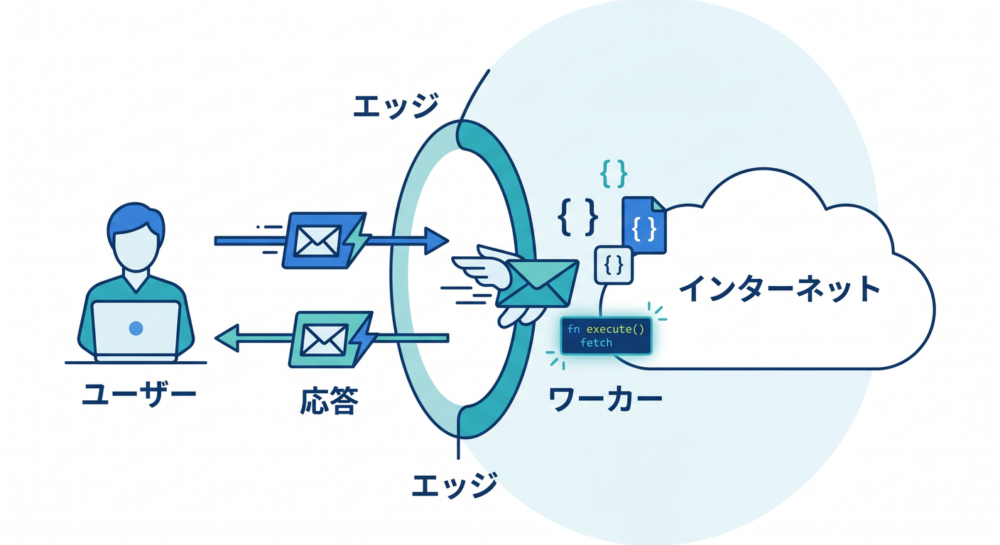
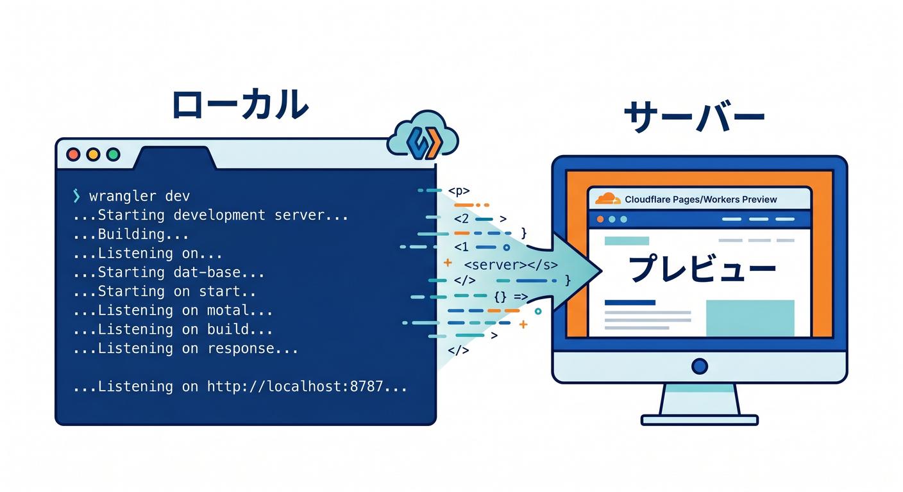
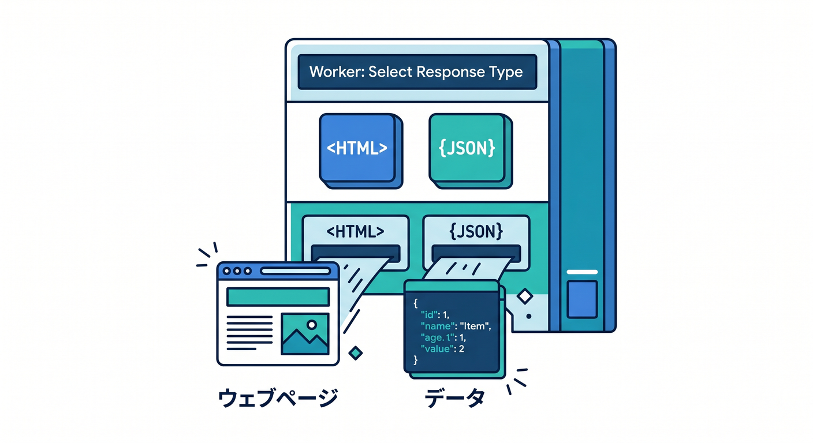
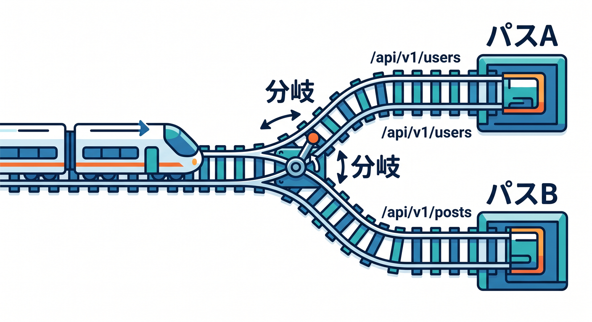

# 「最初のWorkerを動かしてみよう」を広げた15章構成 ☁️🚀✨

## 第1章　Workerってそもそも何？🌍☁️

この章では、Workerを「Cloudflareの上で動く小さなプログラム」としてつかみます。
まずは「アクセスが来る → コードが動く → 返事を返す」という1本の流れだけに集中します。
サーバーを借りて常時動かす感じと、Workersで必要なときに処理する感じの違いも見ます。
Edgeで動くメリットは、最初は「近い場所で返せるから速くしやすい」くらいの理解で十分です。
Cloudflare全体の話を広げすぎず、ここではWorkersだけを主役にします。
ダッシュボードの中で、Workersがどこにいるのかも軽く見ます。
専門語を増やすより、「あ、こういう仕組みなのね」が先です。
この章のゴールは、Workerを怖いものではなく「Webの延長」として見られることです。 ([Cloudflare Docs][2])

## 第2章　最初のHello WorldをC3で作ろう 🚀📦

ここではCloudflare公式の現在の入口である **C3** で、最初のWorkerプロジェクトを作ります。
いきなり手書きで始めず、まずは公式が用意した安全な入口に乗ります。
「Hello World example」と「Worker only」を選ぶ意味もやさしく説明します。
作った瞬間に、Cloudflare向けの最低限の土台がもう揃っている感覚を味わいます。
コマンドは暗記よりも、「何を作るためのコマンドか」を理解することが大切です。
ここでは成功体験を最優先にして、細かい仕組みはあとで回収します。
新しいCloudflareのCLI導線では、C3はかなり中心的な存在です。
まずは「自分のWorkerプロジェクトが生まれた！」をしっかり感じる章です。 ([Cloudflare Docs][3])

## 第3章　作られたファイルをCopilotと一緒に読んでみよう 🤖📁

この章では、生成されたフォルダとファイルを「読める状態」にします。
`src`、`package.json`、`wrangler.jsonc` が何を担当しているのかをざっくり整理します。
特に `wrangler.jsonc` は、Cloudflare開発でかなり大事な中心ファイルです。
ここでGitHub Copilotにも参加してもらい、「この設定は何をしているの？」と説明役をやらせます。
AIに丸投げするのではなく、**自分が読めるようになるために使う**のがコツです。
Copilot Chat では agent mode もありますが、最初は説明・要約・比較に使うのがやさしいです。
「生成されたものが黒箱」に見えなくなると、以後の学習がかなり楽になります。
この章は、コードを書く章というより“Cloudflareの雰囲気に慣れる章”です。 ([Cloudflare Docs][4])

## 第4章　`wrangler dev` でローカル起動してみよう 🔍⚡

ここでは、作ったWorkerをローカルで起動して動かします。
「保存して、ブラウザで見て、直して、また見る」という開発の基本ループを体験します。
最初のうちは、本番公開よりこの小さな反復のほうがずっと大事です。
Wranglerは今もCloudflare開発の中心CLIで、ローカル確認の入口でもあります。
グローバルインストールに頼りすぎず、プロジェクトごとのWranglerを使う感覚もここで入れます。
「起動したけど何が起きているのかわからない」を減らすため、表示されるログも一緒に読みます。
ローカルで見られるだけで、Cloudflareはぐっと身近になります。
この章のゴールは、**怖がらずに何度も実行できること**です。 ([Cloudflare Docs][5])

## 第5章　`fetch()` を読んで、RequestとResponseをつかもう 📨🌐

この章では、Workerのいちばん大事な入口である `fetch()` をやさしく見ます。
HTTPリクエストを受け取り、レスポンスを返す、という最小構造を学びます。
いきなり難しいAPI設計に行かず、まずは1回受けて1回返すだけで十分です。
`request`、`env`、`ctx` の3つが渡される意味もざっくり理解します。
ここで「関数の引数が増えると急に怖い」という感覚をほぐします。
CloudflareのWorkerは、ES Modulesの形で `export default` を使うのが基本です。
この章を越えると、サンプルコードが急に読めるようになります。
Hello Worldの裏で何が起きていたのかが、ここでやっと言葉になります。 ([Cloudflare Docs][3])

## 第6章　文字だけじゃないよ。HTMLとJSONも返してみよう 🧾✨

この章では、ただの文字列だけでなく、HTMLやJSONも返してみます。
「ブラウザ向け」と「JavaScript向け」で返し方が変わる感覚をここでつかみます。
Content-Type をきちんと意識すると、レスポンスの見え方が変わることも学びます。
同じWorkerでも、返すものを変えるだけで用途がぐっと広がるのが面白いところです。
HTMLを返せば簡単なページっぽくなり、JSONを返せばAPIっぽくなります。
この段階ではテンプレートエンジンなどは使わず、手で返すだけで十分です。
難しい技術を足さなくても、Workerの可能性はかなり見えてきます。
「Cloudflareで何か作れそう！」と思える気持ちを育てる章です。 ([Cloudflare Docs][2])

## 第7章　URLで分岐して“小さなAPI”っぽくしよう 🛣️🔗

ここでは、URLによって処理を変える流れを学びます。
`/` は挨拶、`/json` はJSON、`/about` は説明、というような簡単な分岐を作ります。
本格的なルーターを入れる前に、まずは自分の手で分岐を書く体験をします。
この章で、「1本のWorkerで複数の入口を持てる」ことがわかります。
Webアプリらしさが一気に出るので、ここはかなり楽しい章です。
同時に、処理が増えると整理が必要になることも自然に感じます。
あとでHonoなどに進むとしても、まずは素朴な分岐を知っておくと理解が深いです。
この章のゴールは、**WorkerがただのHello Worldで終わらない**と実感することです。 ([Cloudflare Docs][2])

## 第8章　TypeScriptにして、型のありがたさを味わおう 🔷✍️

この章では、JavaScriptのHello Worldから少し進んで、TypeScript版のWorkerへ入ります。
型を全部覚えるのではなく、Cloudflare開発で必要なところだけをやさしく押さえます。
大事なのは `wrangler types` で、実行環境に合った型を自動生成する流れです。
昔のように型定義をなんとなく置くのではなく、今は設定から合わせるのがきれいです。
`Env` の型や runtime API の型がそろうと、補完がかなり気持ちよくなります。
Copilotに説明させるときも、型があると話がかなり噛み合いやすくなります。
型エラーは失敗ではなく、「先に教えてくれる注意書き」だと感じてもらいます。
この章は、TypeScriptへの苦手意識を減らすための章です。 ([Cloudflare Docs][6])

## 第9章　Node.jsっぽく書ける範囲を知ろう 🟢🧰

この章では、Workersは **Node.jsそのものではない** けれど、かなり近づいてきていることを学びます。
`nodejs_compat` の意味を、初心者向けにやさしく整理します。
Nodeの感覚で使えるものと、Cloudflareならではの流儀が残るものを分けて理解します。
これを知らないと、「npm入れたのに動かない😢」で止まりやすいです。
逆にここを知っておくと、外部ライブラリを使う時の安心感がかなり違います。
Cloudflareは互換フラグと compatibility date の組み合わせで新しい挙動に入っていきます。
最初から全部を使いこなす必要はなく、「そういう仕組みなのね」で十分です。
この章は、Node経験をWorkersへ気持ちよく橋渡しする章です。 ([Cloudflare Docs][7])

## 第10章　`wrangler.jsonc` と bindings を読めるようになろう 🧭📘

この章では、Cloudflare開発の設定の心臓部である `wrangler.jsonc` をじっくり見ます。
`name`、`main`、`compatibility_date`、`vars`、`env` あたりをやさしく整理します。
「コードを書く場所」と「Cloudflare側の接続設定を書く場所」を分けて理解します。
さらに bindings の考え方もここで入れます。
AI、KV、R2、D1などに触るとき、Workerはこの binding を通じてつながります。
Workers AI も binding を設定すると `env.AI` から使える形になります。
設定ファイルが読めるようになると、Cloudflare学習はかなり強くなります。
この章のゴールは、**設定を見て意味がわかること**です。 ([Cloudflare Docs][4])

## 第11章　環境変数とSecretsをちゃんと使おう 🔐🌱

ここでは「動くけど危ない」を卒業します。
APIキーや秘密情報をコードへ直書きしない習慣を、早い段階で入れます。
`vars` と secrets の違いも、ふわっとではなくきちんと整理します。
ローカル用の値、本番用の値、環境ごとの切り替えもやさしく扱います。
Cloudflareでは `.dev.vars` や `.env`、`--env` 指定などの考え方も大事です。
最近のWrangler設定では required secrets を宣言する流れもあり、型生成ともつながります。
セキュリティは後回しにすると直しにくいので、ここで先に触れるのが親切です。
「安全に作る」が最初から当たり前になる章です。 ([Cloudflare Docs][8])

## 第12章　ログ・ブレークポイント・テストで“直せる人”になろう 🐞📈

この章では、うまく動かない時の見方を覚えます。
`console.log` だけに頼らず、Workers Logs や observability の基本にも触れます。
今のCloudflareでは、ログを使うには observability 設定を有効にする流れがあります。
さらにVS Codeのブレークポイントも使って、「止めて見る」体験を入れます。
テストは難しくしすぎず、まずは Vitest integration の存在を知るところから始めます。
Cloudflareは Workers runtime の中でテストできる流れを公式にかなり整えています。
「なんとなく直す」から「見ながら直す」へ進む、大事な章です。
この章が入ると、学習者が急に“開発者っぽく”なります。 ([Cloudflare Docs][9])

## 第13章　最初のデプロイで“本当に公開された！”を味わおう 🌐🎉

ここでは、ローカルで動いたWorkerをCloudflareへデプロイします。
最初の公開は、学習の大きなごほうびです。
同時に `compatibility_date` の意味もここでちゃんと整理します。
Cloudflareでは runtime の更新を compatibility date と flags で受け取る考え方です。
新しい機能に乗るには date が大事、でも急に壊さない仕組みもある、という安心感を伝えます。
デプロイ後にURLへアクセスして、世界へ見えている感じを味わいます。
公開後の設定は全部触らず、最初は「ちゃんと出せた」で十分です。
この章のゴールは、**Hello Worldが本当にインターネットへ出た**という感覚です。 ([Cloudflare Docs][3])

## 第14章　Reactの小さな画面とつないで“アプリ感”を出そう ⚛️💡

この章では、Workerを単体で終わらせず、軽いReact画面とつないでみます。
Reactは主役ではなく、Workerのよさを見せるための前面パーツとして使います。
入力して、送って、レスポンスを画面に出すだけでも、かなりアプリらしくなります。
Cloudflareは Vite plugin の導線も整っていて、React系の学習と相性がいいです。
React自体は最新メジャーの流れで学べば十分で、重たい設計までは入りません。
この章では state と fetch の最小体験だけに絞ります。
「画面」と「Cloudflareの処理」がつながると、理解がぐっと立体的になります。
この章は、学習の楽しさが一気に増えるごほうび章です。 ([Cloudflare Docs][10])

## 第15章　Workers AI・AI Gateway・Copilot・MCPで“今どきのWorker学習”に仕上げよう 🤖☁️🪄

最後は、CloudflareらしいAIの世界へ自然につなげます。
まずWorkers AIで、WorkerからそのままAIモデルを呼べる感覚をつかみます。
次にAI Gatewayで、ログ、分析、キャッシュ、レート制限、リトライ、フォールバックの考え方を軽く見ます。
さらにBrowser Renderingも紹介し、必要ならブラウザ操作をCloudflare側へ寄せられることを知ります。
GitHub Copilotは agent mode と MCP で、説明・修正・調査の相棒としてかなり強く使えます。
Cloudflare自身も managed remote MCP servers を用意していて、AI連携の入口がかなり豊かです。
Next.js は最後に「Workersでもいけるよ」と紹介だけに留め、主役はあくまでWorkerのままにします。
この章のゴールは、**Hello Worldから始めた学びが、AI時代のCloudflare開発へきれいにつながる**ことです。 ([Cloudflare Docs][11])

## まとめ 🌈

この15章は、**「最初のWorkerを動かす」だけで終わらせず、そこから設定・型・デバッグ・公開・React連携・AI連携まで、無理なく伸ばしていく設計**です。
特に2026年の公式導線に寄せて、**C3、Wrangler、`wrangler.jsonc`、`wrangler types`、Workers AI、AI Gateway、Copilot、MCP** を自然に混ぜています。
なので、古い「とりあえずHello Worldだけやる教材」よりも、**今のCloudflareらしい学び方**になっています。 ([Cloudflare Docs][3])

次は、この15章をもとに **各章ごとの「学習目標・演習課題・成果物・想定学習時間」付きの教材設計版** へ落とし込むのがきれいです。

[1]: https://developers.cloudflare.com/pages/get-started/c3/ "Create projects with C3 CLI · Cloudflare Pages docs"
[2]: https://developers.cloudflare.com/workers/?utm_source=chatgpt.com "Overview · Cloudflare Workers docs"
[3]: https://developers.cloudflare.com/workers/get-started/guide/ "Get started - CLI · Cloudflare Workers docs"
[4]: https://developers.cloudflare.com/workers/wrangler/configuration/ "Configuration - Wrangler · Cloudflare Workers docs"
[5]: https://developers.cloudflare.com/workers/wrangler/install-and-update/ "Install/Update Wrangler · Cloudflare Workers docs"
[6]: https://developers.cloudflare.com/workers/languages/typescript/ "Write Cloudflare Workers in TypeScript · Cloudflare Workers docs"
[7]: https://developers.cloudflare.com/workers/runtime-apis/nodejs/ "Node.js compatibility · Cloudflare Workers docs"
[8]: https://developers.cloudflare.com/workers/configuration/environment-variables/ "Environment variables · Cloudflare Workers docs"
[9]: https://developers.cloudflare.com/workers/observability/logs/workers-logs/ "Workers Logs · Cloudflare Workers docs"
[10]: https://developers.cloudflare.com/workers/vite-plugin/get-started/ "Get started · Cloudflare Workers docs"
[11]: https://developers.cloudflare.com/workers-ai/ "Overview · Cloudflare Workers AI docs"
