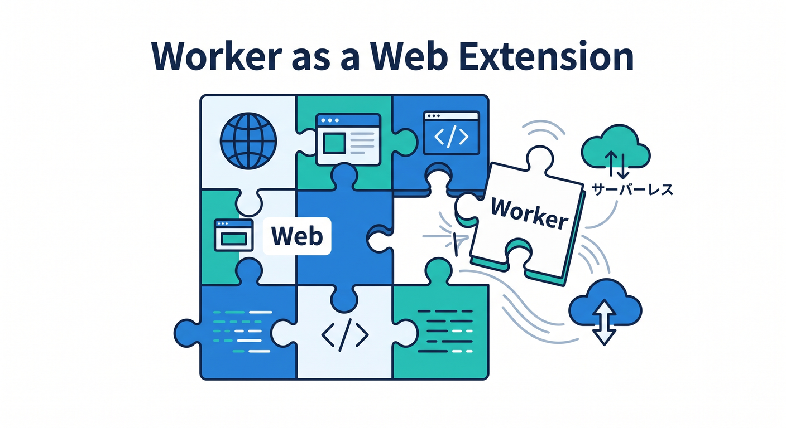
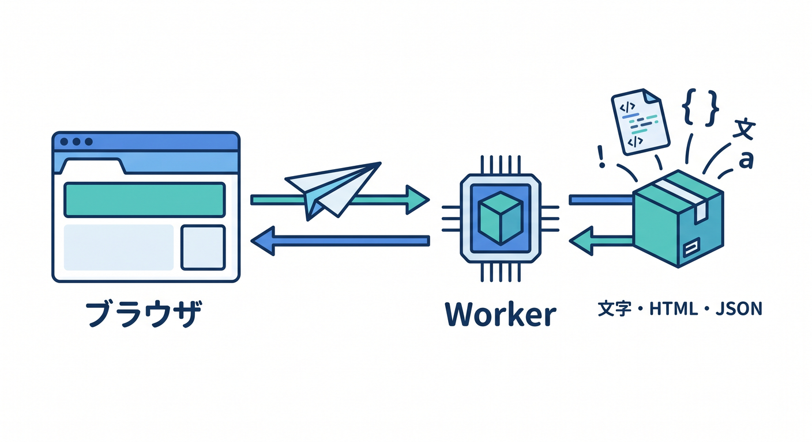
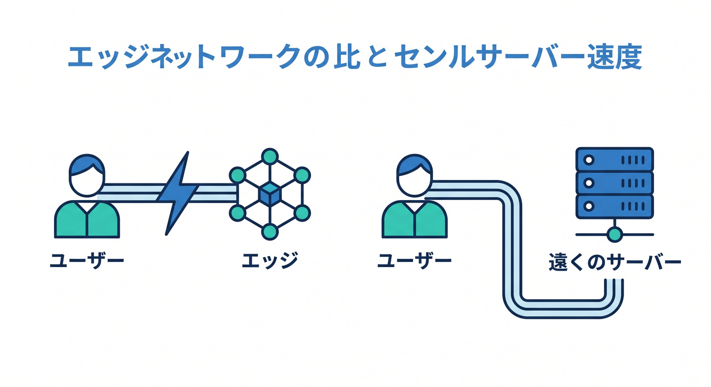
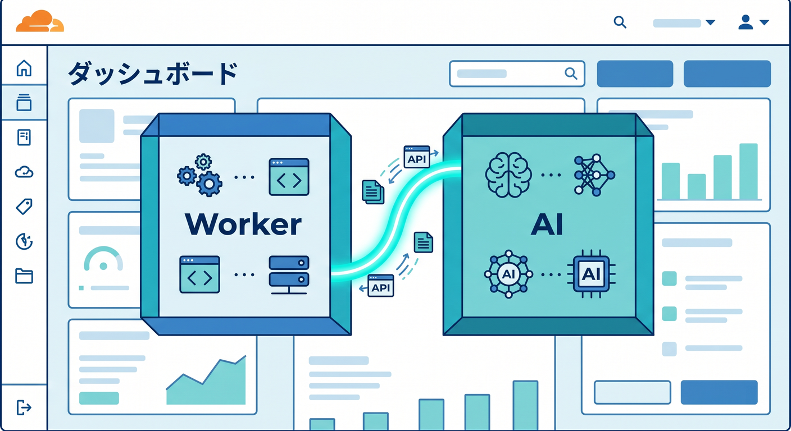
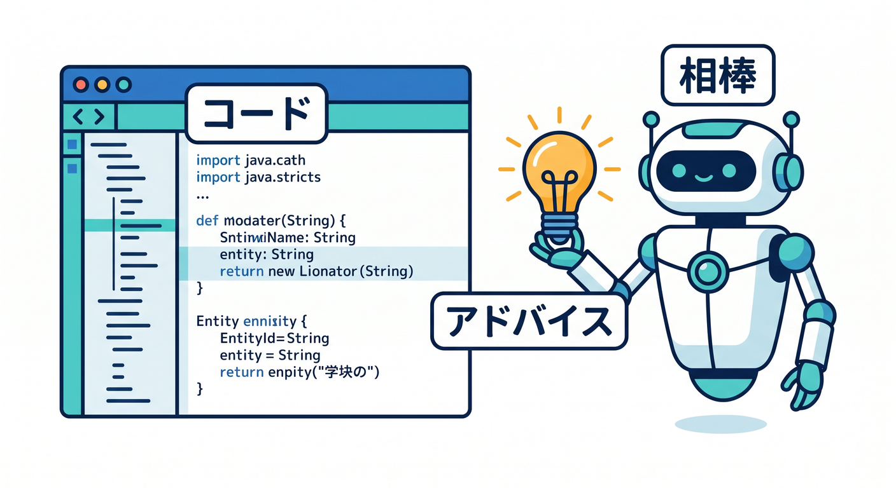

# 第1章　Workerってそもそも何？🌍☁️

この章では、Cloudflare Worker をむずかしいクラウド用語ではなく、「アクセスが来たときに動いて、返事を返す小さなWebプログラム」としてつかみます😊
Cloudflare公式でも Workers は、アプリを Cloudflare のグローバルネットワーク上で構築・デプロイ・スケールできるサーバーレス基盤として案内されていて、React や Next などのフレームワーク、JavaScript や TypeScript などの言語にも対応しています。まずは「WebページやAPIの入口になれるもの」と理解すれば十分です。 ([Cloudflare Docs][1])

最初に大事なのは、「Worker は特別な魔法の箱ではなく、Webの延長線上にある」という感覚です✨

ブラウザや Node.js で見たことがある JavaScript の感覚にかなり近く、Cloudflare の Workers runtime は V8 エンジン上で動き、標準的な Web API も多く備えています。つまり、完全に別世界の技術というより、「Webの知識を Cloudflare 上へ持っていく」イメージです。 ([Cloudflare Docs][2])

---

## この章のゴール 🎯

この章のゴールは次の4つです 🌱

1. Worker をひとことで説明できる
2. 「アクセス → コード実行 → レスポンス」の流れを頭の中で描ける
3. ふつうのサーバー常駐型の考え方との違いをざっくり言える
4. Workers が、今の Cloudflare の AI 機能や開発体験の入口にもなっているとわかる ([Cloudflare Docs][1])

---

## 1. Workerをひとことで言うと？☁️

Worker は、Cloudflare 上で動く小さなプログラムです💡
誰かがURLへアクセスしたり、APIを呼んだりすると、その場でコードが動いて、文字・HTML・JSON などの返事を返せます。Cloudflare公式も、Workers を「フロントエンド」「バックエンド」「サーバーレスAI推論」「バックグラウンド処理」まで扱える基盤として位置づけています。 ([Cloudflare Docs][1])

ここでのポイントは、「まずは1回受けて1回返す」だけ見ればいいことです✉️➡️⚙️➡️📨
最初からデータベース、認証、監視、スケール、デプロイ戦略まで全部理解しようとすると重たくなります。第1章では、Worker を “リクエストを受け取ってレスポンスを返す係” として見るだけで十分です。これは Cloudflare の最初の CLI ガイドでも、まず Worker を作り、ローカルで動かし、コードを書き、最後にデプロイする順で学ぶ構成になっています。 ([Cloudflare Docs][3])

---

## 2. どういう流れで動くの？🔄

Worker の動きは、まずこの1本だけ覚えればOKです 🌈

ブラウザやアプリがアクセスする
→ Cloudflare 側で Worker が動く
→ Worker がレスポンスを返す

この流れは、Workers の基本的な実行モデルそのものです。Cloudflare の公式説明でも、Workers は個人のPCや1台の中央サーバーではなく、Cloudflare のグローバルネットワーク上で動くことが強調されています。 ([Cloudflare Docs][2])

つまり、あなたがコードを書いたら、そのコードが Cloudflare 側の実行環境で動いてくれるわけです✨
「自分でLinuxサーバーを立てて、プロセスを起動し続けて、待ち受けポートを管理して…」という発想から、かなり離れられます。ここが、クラウド超入門の人にとって Workers が入りやすい大きな理由です。Cloudflare自身も “no infrastructure to manage” と案内しています。 ([Cloudflare Docs][1])

---

## 3. ふつうのサーバーと何が違うの？🖥️↔️☁️

ざっくり言うと、ふつうのサーバーの学び始めでは「どこで常時動かすか」を意識しやすいですが、Workers では「アクセスが来たら処理する」に集中しやすいです😊
Cloudflare は Workers をサーバーレス基盤として提供していて、インフラ管理や複雑な設定を強く前面に出さずに始められるようにしています。なので最初の学習では、「サーバー管理の勉強」より先に「Webの処理の流れ」を体験しやすいです。 ([Cloudflare Docs][1])

もちろん、裏側では本格的な実行環境が動いています。ですが学習の最初からそこへ潜らなくても大丈夫です🙆
むしろ「このURLにアクセスしたら、このコードが動いて、こう返る」という感覚を固めたほうが、あとで設定ファイルや bindings、AI 連携へ進んだときに理解が安定します。Cloudflare の公式導線も、まず Worker を作って動かすところから始まります。 ([Cloudflare Docs][3])

---

## 4. Edgeで動くって、何がうれしいの？⚡🌍

第1章では、Edge をむずかしく考えなくて大丈夫です。
「Cloudflare の世界中のネットワーク上で動くので、利用者に近い場所で返しやすく、速さや応答性の面で有利になりやすい」くらいで十分です。Cloudflare も Workers の特徴として、世界中で高速・高信頼な実行を強く打ち出しています。 ([Cloudflare Docs][1])

あとで学ぶと、ここに CDN、キャッシュ、Smart Placement、データ配置、AI 推論の置き場所、観測性などがつながってきます🚀
でも今は、「Cloudflare は近い場所で返しやすい仕組みを持っている」「だから Worker はただの1台サーバーの話ではない」と感じ取れれば合格です。 ([Cloudflare Docs][1])

---

## 5. Cloudflare全体の中で、Workersはどこにいるの？🧭

Cloudflare のダッシュボードでは、Workers は「Workers & Pages」から扱うのが基本です。公式の Dashboard ガイドでも、新しい Workers アプリは Workers & Pages から作成します。 ([Cloudflare Docs][4])

一方で、2026年2月時点では AI 関連の導線がかなり強化されていて、Workers AI と AI Gateway はダッシュボードのサイドバーに AI のトップレベル項目として見つけやすくなっています。つまり今の Cloudflare は、「Worker を動かす場所」と「AI を使う場所」がかなり自然につながっている状態です。 ([Cloudflare Docs][5])

このことは、学習の順番としてとても良いニュースです✨
まず Worker を理解し、そのあと AI を載せる、という順番がきれいに作れるからです。AI を最初から別製品として覚えるより、「Worker から AI を呼べる」と見たほうが、頭の中が整理しやすいです。 ([Cloudflare Docs][6])

---

## 6. 2026年のCloudflareらしさは「Worker + AI」🤖☁️

今の Cloudflare を見るなら、Workers だけでなく Workers AI の存在を早めに知っておくと理解が深まります。Workers AI は、Cloudflare のグローバルネットワーク上でサーバーレスにAIモデルを実行できる仕組みで、Free / Paid 両プランで使え、50以上のオープンモデルにアクセスできます。 ([Cloudflare Docs][6])

さらに AI Gateway は、AI アプリの利用状況を見たり、ログを確認したり、キャッシュ・レート制限・リトライ・モデルフォールバックなどをかけたりできる層です。Cloudflare 公式も「可視化と制御」のための仕組みとして位置づけています。 ([Cloudflare Docs][7])

第1章ではまだAIコードは書きませんが、「Worker はAI時代の入口にもなる」という感覚を持っておくのが大切です🌟
将来、チャット、翻訳、画像まわり、音声処理、要約、分類などを作るときも、Worker が受付係になり、その先で Workers AI や AI Gateway へつなげる流れが自然に作れます。 ([Cloudflare Docs][6])

---

## 7. VS CodeとGitHub Copilotは、この学びでどう使う？🧠✨

2026年の VS Code では、GitHub Copilot はかなり強力な学習相棒です。公式には、Copilot は VS Code 上で AI agent として計画・実装・検証まで支援でき、より細かな変更には chat やインライン提案も使えます。 ([Visual Studio Code][8])

ここでひとつ大事な最新ポイントがあります📌
2026年1月の VS Code 更新では、従来の「GitHub Copilot」拡張は deprecated になり、AI機能は GitHub Copilot Chat 拡張に一本化されました。古い記事だと「Copilot 拡張と Copilot Chat 拡張の両方を…」という説明が残っていますが、今はその認識を更新しておくと混乱しにくいです。 ([Visual Studio Code][9])

また、VS Code の公式セットアップガイドでは、Copilot を有効にしたあと、チャットで `/init` を使うとプロジェクトを解析して custom instructions を作る流れも案内されています。これ、Cloudflare 学習でもかなり便利です🪄
たとえば「このプロジェクトは Cloudflare Workers の学習用。説明はやさしく、TypeScript は初級者向け、冗長なライブラリ追加は避ける」といった方針を育てやすいからです。 ([Visual Studio Code][10])

さらに、GitHub Docs では Copilot の agent mode と MCP によって、外部ツールや追加コンテキストへつなげられることも説明されています。MCP は Copilot の能力を他システムとつなぐための標準で、IDE 側でも広くサポートが進んでいます。第1章では深追いしませんが、「これからの開発補助AIは、コード補完だけで終わらない」と知っておくと、後半章で効いてきます。 ([GitHub Docs][11])

---

## 8. この章でのおすすめ理解レベル 📘

この章を終えた時点では、次のように言えれば十分です 😊

「Worker は、Cloudflare のネットワーク上で動く小さなWebプログラム。アクセスが来たらコードが動いて、レスポンスを返す。サーバー管理をあまり意識しなくても始めやすくて、今は AI ともつなげやすい。」

この説明は、Cloudflare の Workers / Workers AI / AI Gateway の公式の位置づけと、2026年の VS Code + Copilot の流れにかなり沿っています。最初の一歩としては、とてもいい理解です。 ([Cloudflare Docs][1])

---

## 9. この章で覚えたい用語だけ、やさしく整理 📝

Worker
Cloudflare 上で動くプログラムです。Webページの返答も、APIの返答もできます。 ([Cloudflare Docs][1])

Request
「こういうURLにアクセスしました」「このデータを送りました」という、届いたお願いです。これは Web の基本の入口です。 ([Cloudflare Docs][2])

Response
Worker が返す返事です。文字、HTML、JSON などが入ります。 ([Cloudflare Docs][2])

Wrangler
Cloudflare の開発用 CLI です。公式の最初のガイドでも、Worker の作成・開発・デプロイに使います。 ([Cloudflare Docs][3])

Workers AI
Cloudflare の AI 実行基盤です。Worker から呼び出しやすいのが強みです。 ([Cloudflare Docs][6])

AI Gateway
AI アプリの見える化・制御・保護を助けるレイヤーです。 ([Cloudflare Docs][7])

---

## 10. ミニ演習 ✍️🌟

この章ではまだコードを書かなくても大丈夫ですが、頭の整理のために次の3問をやってみるとかなり効きます 😊

1. 「Worker を中学生に1文で説明するならどう言う？」
2. 「普通のサーバーっぽいイメージ」と「Workerっぽいイメージ」の違いを1つだけ書く
3. 「Worker に AI を足すとしたら何を作りたい？」を1つ書く

この3つが答えられるなら、第1章の理解はかなり順調です。特に3つ目は、Cloudflare が Workers と AI を強く結びつけている今の流れにぴったりです。 ([Cloudflare Docs][6])

---

## まとめ 🌈

この章でいちばん大事なのは、「Worker は怖いクラウド技術」ではなく、「Webの延長として動く小さなプログラム」と見られるようになることです☁️✨
Cloudflare 公式でも、Workers はサーバーレス基盤としてシンプルに始めやすく、しかもフロントエンド、API、バックグラウンド処理、AI 推論まで広げられる入口になっています。 ([Cloudflare Docs][1])

そして2026年の学び方では、VS Code + GitHub Copilot を説明役・要約役・伴走役として使いながら、Cloudflare の Workers / Workers AI / AI Gateway をつないで理解していくのがかなり相性いいです🤖💙
最初は「アクセスが来る → Worker が動く → 返す」だけでOKです。ここが腹落ちすると、次章の Hello World 作成がすごく軽くなります。 ([Visual Studio Code][8])

次はこのまま、第2章「最初のHello WorldをC3で作ろう 🚀📦」の詳細版へつなげるときれいです。

[1]: https://developers.cloudflare.com/workers/ "Overview · Cloudflare Workers docs"
[2]: https://developers.cloudflare.com/workers/reference/how-workers-works/ "How Workers works · Cloudflare Workers docs"
[3]: https://developers.cloudflare.com/workers/get-started/guide/ "Get started - CLI · Cloudflare Workers docs"
[4]: https://developers.cloudflare.com/workers/get-started/dashboard/ "Get started - Dashboard · Cloudflare Workers docs"
[5]: https://developers.cloudflare.com/changelog/post/2026-02-19-ai-dashboard-experience-improvements/ "AI dashboard experience improvements · Changelog"
[6]: https://developers.cloudflare.com/workers-ai/ "Overview · Cloudflare Workers AI docs"
[7]: https://developers.cloudflare.com/ai-gateway/ "Overview · Cloudflare AI Gateway docs"
[8]: https://code.visualstudio.com/docs/copilot/overview "GitHub Copilot in VS Code"
[9]: https://code.visualstudio.com/updates/v1_109 "January 2026 (version 1.109)"
[10]: https://code.visualstudio.com/docs/copilot/setup "Set up GitHub Copilot in VS Code"
[11]: https://docs.github.com/en/copilot/tutorials/enhance-agent-mode-with-mcp "Enhancing GitHub Copilot agent mode with MCP - GitHub Docs"
