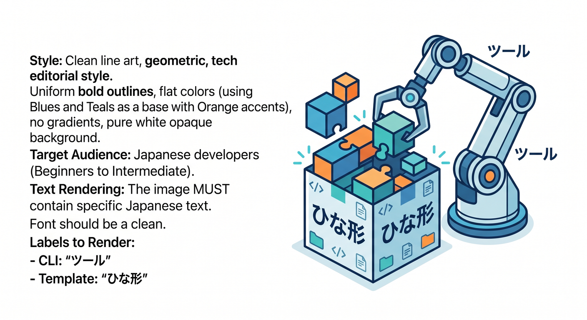

# 第2章　最初のHello WorldをC3で作ろう 🚀📦☁️

この章では、Cloudflare Workers の最初の入口として、いまの公式導線どおりに **C3** を使って最初のプロジェクトを作ります ✨
2026年4月15日時点の公式ドキュメントでは、Workers の新規作成は `npm create cloudflare@latest` から始める流れがはっきり示されていて、C3 は Cloudflare 向けの新規アプリ作成を助けるCLIとして案内されています。さらに Workers プロジェクトでは、C3 が Wrangler も一緒に入れてくれます。 ([Cloudflare Docs][1])

この章のいちばん大事な目標は、むずかしい理屈を覚えることではありません 😊
**「自分のCloudflareプロジェクトが、ちゃんと生まれた」** という感覚をつかむことです。ここで成功体験を作っておくと、この先の `wrangler dev`、デプロイ、AI連携までかなり楽になります。これは公式ガイドでも、まず C3 で最小の Hello World を作る流れが土台になっています。 ([Cloudflare Docs][1])

---

## 1. C3って何者？🤔🛠️

C3 は **create-cloudflare** という Cloudflare 公式のプロジェクト作成CLIです。役目はとてもシンプルで、最初のひな形を安全に作ってくれることです 🌱


ゼロからフォルダを作って、設定ファイルを書いて、Wrangler を入れて……という作業を自分で全部やらなくても、最初の土台をきれいに整えてくれます。Cloudflare の公式 docs でも、Workers と Pages の作成入口として C3 が案内されています。 ([Cloudflare Docs][1])

ここで大事なのは、**C3は「魔法」ではなく「公式の安全な入口」** だと見ることです ✨
初心者のうちは、いきなり全部を手で作るより、まずは公式の型に乗るほうが圧倒的にラクです。あとで設定を読む章に進んだとき、「あ、このファイルは最初にC3が作ったやつか」と自然につながります。C3 が作る Workers プロジェクトには、少なくとも `src/index.*` と `wrangler.jsonc` が含まれることが公式に示されています。 ([Cloudflare Docs][1])

---

## 2. なぜ「Hello World example」「Worker only」を選ぶの？🎯

今回の章では、C3 の質問に対して次の選び方をします。
**Hello World example → Worker only → TypeScript → git は Yes → deploy は No** です。これは Cloudflare の Workers AI の最新ガイドでも案内されている選び方で、最小構成から始めつつ、あとで AI binding や型生成へ伸ばしやすい流れです。 ([Cloudflare Docs][2])


**Hello World example** を選ぶ理由は、とにかく最小だからです 🌟
最初から多機能なテンプレートに入ると、「何がCloudflare本体の役目で、何が追加の仕組みなのか」が見えにくくなります。Hello World なら、あとで見る `fetch()` や `Response` の役割も追いやすくなります。Cloudflare の CLI ガイドでも、最初の Worker 作成ではこの選択が示されています。 ([Cloudflare Docs][1])

**Worker only** を選ぶ理由は、主役をぶらさないためです ☁️
Cloudflare には Pages やフレームワーク連携もありますが、いまの C3 は **Pages を作るなら `--platform=pages` を明示する必要があり、指定しなければ Workers プロジェクトを作る** という形になっています。つまり今の公式導線でも、まず Workers を作る流れはかなり明確です。第2章では、画面やフレームワークより先に、Worker そのものをつかむのが正解です。 ([Cloudflare Docs][3])

今回は **TypeScript** を選びます 🔷
Cloudflare の Workers の基本ガイドは最小例として JavaScript を載せていますが、Workers AI の最新ガイドでは同じ C3 の入口から TypeScript を選ぶ流れが示されています。今後 `env` の型や AI binding、`wrangler types` まで見据えると、この教材では TypeScript のほうがきれいにつながります。ここでは型理論を深追いせず、「あとで読みやすく、補完も効きやすい選択」くらいに思っておけば十分です。 ([Cloudflare Docs][1])

---

## 3. 実際に作ってみよう 💻✨

まずはターミナルを開いて、次のコマンドを実行します。Cloudflare の公式ガイドでは、Workers プロジェクト作成の入口としてこの形が案内されています。 ([Cloudflare Docs][1])


```bash
npm create cloudflare@latest -- my-first-worker
```

実行すると、C3 が質問してきます。今回はこう答えればOKです 😊 ([Cloudflare Docs][2])

* What would you like to start with? → **Hello World example**
* Which template would you like to use? → **Worker only**
* Which language do you want to use? → **TypeScript**
* Do you want to use git for version control? → **Yes**
* Do you want to deploy your application? → **No**

ここで **deploy を No** にしているのは、「先に作って、中身を見て、ローカルで確かめてから出す」ためです 🚶‍♂️
最初から公開まで一気に進めることもできますが、学習としては、まずプロジェクトがどう生まれるかを体験するほうが大切です。公式の getting started でも、最初のセットアップでは `No` を選ぶ流れが紹介されています。 ([Cloudflare Docs][1])

プロジェクトが作れたら、次にフォルダへ入ります。 ([Cloudflare Docs][1])

```bash
cd my-first-worker
```

---

## 4. 作られた瞬間、何がそろっているの？📁🎉

C3 で作った直後の段階で、もう最低限の土台はかなりそろっています。Cloudflare の公式ガイドでは、Workers プロジェクトに `wrangler.jsonc`、`src/index.*`、`package.json` などが作られると説明されています。TypeScript 側の最新ガイドでは、`src/index.ts` と `wrangler.jsonc` が含まれることもはっきり示されています。 ([Cloudflare Docs][1])


ここで特に覚えたいのは次の3つです 😊

* `src/index.ts`
  Worker本体です。あとで「アクセスが来たら何を返すか」をここに書きます。 ([Cloudflare Docs][2])
* `wrangler.jsonc`
  Cloudflare 向けの設定ファイルです。新しい Wrangler では `wrangler.jsonc` が推奨されていて、Cloudflare は新規プロジェクトで JSON 設定を勧めています。 ([Cloudflare Docs][4])
* `package.json`
  Node系プロジェクトとしての依存関係やスクリプトの入口です。VS Code で開くと、「あ、普通のWeb開発プロジェクトに近いんだな」と感じやすい場所です。 ([Cloudflare Docs][1])

この時点での気持ちは、**「もう半分できてるじゃん 😳✨」** で大丈夫です。
Cloudflare 開発はゼロから全部手で積む感じではなく、C3 で“最初の足場”をもらってから進むイメージです。これが今の公式のやさしい入口です。 ([Cloudflare Docs][1])

---

## 5. VS Codeで開いたら、Copilotをどう使う？🤖💬

この章では、GitHub Copilot は **「代わりに全部書かせる道具」ではなく、「今できたものを読めるようにする道具」** として使うのがとても相性いいです ✍️


GitHub の公式ドキュメントでは、Copilot は「どう書くべきか」「どうバグを直すか」「他人のコードが何をしているか」などのコーディング関連の質問に使えると説明されています。VS Code では Copilot を使うと、コード提案に加えて Copilot Chat も使えます。 ([GitHub Docs][5])

しかも VS Code では、最初のセットアップ時に **必要な拡張が自動で入る** と GitHub Docs に書かれています。つまり、「VS CodeでCopilotを使うための準備」もかなりスムーズです。 ([GitHub Docs][6])

この章でおすすめの聞き方はこんな感じです 😊

* 「`src/index.ts` は何をしているの？」
* 「`wrangler.jsonc` は今どの設定だけ読めばいい？」
* 「この Hello World はどこで返しているの？」
* 「今はまだ理解しなくていい部分を教えて」

こういう質問だと、Copilot はかなり役立ちます。
一方で、GitHub Docs では **edit mode** は細かく制御しながら編集したいとき向き、**agent mode** は複数ステップの複雑な作業や外部アプリ連携、MCP 利用を含むタスク向きだと説明されています。だから第2章では、まだ agent mode に大きく任せすぎず、まずは「説明役」として使うのがちょうどいいです。 ([GitHub Docs][7])

---

## 6. この章の時点で、CloudflareのAIとどうつながるの？🤖☁️✨

第2章は Hello World を作る章ですが、ここで作った Worker はあとでそのまま **Workers AI** に伸ばせます。Cloudflare の Workers AI docs では、C3 で作った Worker に AI binding を追加し、`wrangler.jsonc` に `ai.binding` を設定すると、コード側で `env.AI` として使えると説明されています。 ([Cloudflare Docs][8])


つまり今の感覚でいうと、**第2章はAI時代の入口づくり** でもあります 🌈
今はただの Hello World でも、あとで設定を少し足せば `env.AI.run()` でモデルを呼べるようになりますし、さらに AI Gateway の docs では `env.AI.run(..., { gateway: { id: "..." } })` のような形で Gateway も重ねられると案内されています。最初から全部やる必要はありませんが、「この Hello World はあとでAIを載せられる土台なんだ」と思えると、Cloudflare 学習がかなり立体的になります。 ([Cloudflare Docs][8])

---

## 7. この章でつまずきやすいところ 😵‍💫🧯

## つまずき1：「これ、Workers？ Pages？ どっち？」


いまの C3 は、Pages を作りたいときには `--platform=pages` を付ける形です。付けなければ Workers プロジェクトになります。だからこの章では迷わず Worker に集中して大丈夫です。 ([Cloudflare Docs][3])

## つまずき2：「Wranglerを別で入れないとダメ？」

C3 で Workers プロジェクトを作ると、Wrangler は一緒に入ります。さらに Cloudflare は Wrangler をグローバルではなく **プロジェクトローカルで使う** ことを勧めています。なので、今の段階では「まずC3に任せる」で十分です。 ([Cloudflare Docs][1])

## つまずき3：「いきなりReactやNext.jsに行きたい」

気持ちはすごく自然です 😄
ただ、C3 はフレームワークを選んだとき、そのフレームワーク自身の作成コマンドを使って最新の形を作る仕組みになっています。つまり React や Next.js はあとでちゃんと最新の入口から学べます。だから今は Worker only で、Cloudflare の芯を先につかむほうがきれいです。 ([Cloudflare Docs][3])

---

## 8. この章のミニ演習 📝✨

この章の終わりでは、次の3つが言えれば十分合格です 🎓

1. **C3 は Cloudflare の新規プロジェクト作成CLIである**
2. **今回の最初の選択は Hello World example / Worker only / TypeScript である**
3. **作られた直後の主役ファイルは `src/index.ts` と `wrangler.jsonc` である**

この3つは、Cloudflare の最新ドキュメントに沿った「いまの最初の一歩」です。ここが見えたら、第3章でファイルの中身を読む準備ができています。 ([Cloudflare Docs][1])

---

## 9. 章末まとめ 🌟🎉

第2章でやったことは、見た目以上に大きいです。
なぜならここで、**Cloudflare開発の公式入口にちゃんと乗れた** からです。C3 は今の Cloudflare の標準的な新規作成導線で、Workers でも Pages でも入口になっています。そして Workers 側では、最初の Hello World から Wrangler、設定ファイル、将来の AI binding まで一本につながっています。 ([Cloudflare Docs][3])

この章のゴールは、コードをたくさん書くことではありません 😊
**「CloudflareのHello Worldプロジェクトを、自分で生み出せた」** という感覚を手に入れることです。そこまで来たら十分です。次の章では、今生まれたファイルたちを VS Code と Copilot でやさしく読んでいきます 📂🤖✨ ([Cloudflare Docs][1])

必要なら続けて、このまま同じ文体・同じ粒度で
**「第3章　作られたファイルをCopilotと一緒に読んでみよう 🤖📁」**
もそのまま書けます。

[1]: https://developers.cloudflare.com/workers/get-started/guide/ "Get started - CLI · Cloudflare Workers docs"
[2]: https://developers.cloudflare.com/workers-ai/get-started/workers-wrangler/ "Get started - Workers and Wrangler · Cloudflare Workers AI docs"
[3]: https://developers.cloudflare.com/pages/get-started/c3/ "Create projects with C3 CLI · Cloudflare Pages docs"
[4]: https://developers.cloudflare.com/workers/wrangler/configuration/ "Configuration - Wrangler · Cloudflare Workers docs"
[5]: https://docs.github.com/en/copilot/get-started/quickstart?utm_source=chatgpt.com "Quickstart for GitHub Copilot"
[6]: https://docs.github.com/copilot/managing-copilot/configure-personal-settings/installing-the-github-copilot-extension-in-your-environment "Installing the GitHub Copilot extension in your environment - GitHub Docs"
[7]: https://docs.github.com/en/copilot/get-started/features "GitHub Copilot features - GitHub Docs"
[8]: https://developers.cloudflare.com/workers-ai/configuration/bindings/ "Workers Bindings · Cloudflare Workers AI docs"
