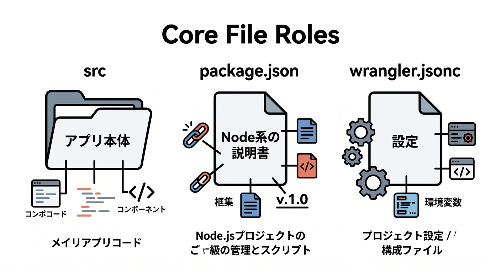
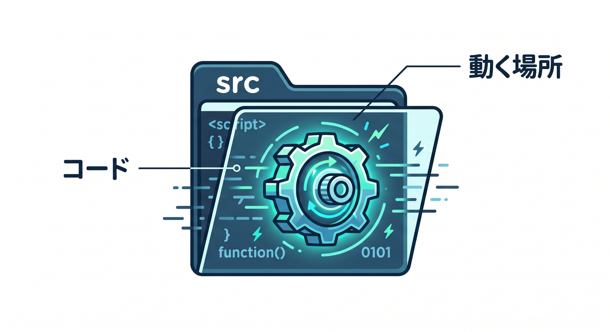
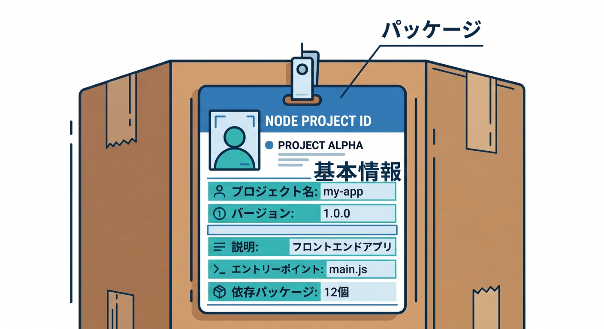
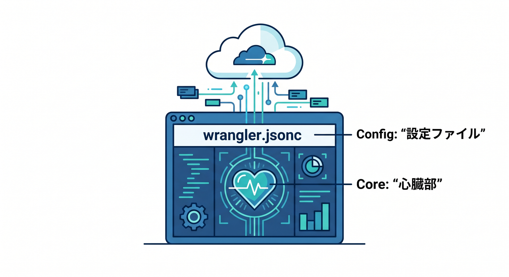
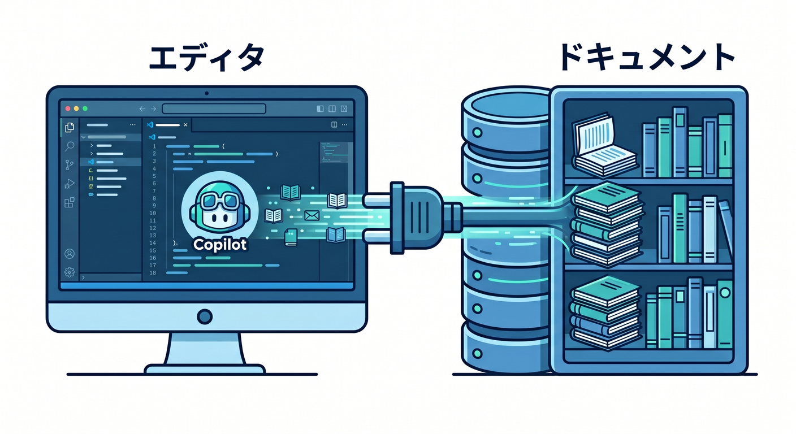

# 第3章　作られたファイルをCopilotと一緒に読んでみよう 🤖📁☁️

この章では、前章で C3 から作った Worker プロジェクトを、いきなり「編集する」のではなく、まず「読める」ようにしていきます 😊
最初のうちは、生成されたファイルが多く見えても大丈夫です。全部を覚える必要はありません。
大事なのは、**このファイルは何の役目なのか**をふんわり区別できるようになることです 🌱

C3 で公式の最初の Worker を作る流れでは、`Hello World example` と `Worker only` を選び、プロジェクト直下に `wrangler.jsonc`、`src/index.js`、`package.json` などが生成されます。Cloudflare の公式ガイドも、まずこの生成物を見ながら進む流れを採っています。 ([Cloudflare Docs][1])

---

## この章のゴール 🎯✨

この章のゴールは、次の3つです。

* `src` は「実際の Worker コード」がある場所だとわかる
* `package.json` は「Node 系の土台や実行コマンド」がある場所だとわかる
* `wrangler.jsonc` は「Cloudflare 側につなぐための中心設定」だとわかる

ここで黒箱感が減ると、以後の章が一気にラクになります 😌

---

## まずは“フォルダ全体の景色”を見よう 🗂️👀

プロジェクトを開いたら、最初に VS Code のエクスプローラーを見ます。
ここでは「全部読む」のではなく、**上から順に役割をラベル貼りする感覚**で十分です。

たとえば最初はこんな理解で OK です。

* `src/` … アプリ本体
* `package.json` … Node / npm 側の説明書
* `wrangler.jsonc` … Cloudflare へ渡す設定
* `node_modules/` … 使う部品置き場
* `package-lock.json` … npm が依存関係を固定するための記録

Cloudflare 公式の最初の Worker ガイドでも、C3 が生成する中心ファイルとして `wrangler.jsonc`、`src/index.js`、`package.json` をまず押さえる構成になっています。 ([Cloudflare Docs][1])

---

## 1. `src` を見よう。ここが“いちばん主役”です 🌟

`src` フォルダは、実際に Worker が動くコードの置き場です。

最初の Hello World では、ここにかなり短いファイルが入っています。

この時点では、細かい文法を全部理解しなくて大丈夫です。
今は、

* リクエストを受ける
* 文字を返す
* それが Worker として動く

この3つが見えれば十分です 🙆‍♂️

Cloudflare Workers の基本的なハンドラは `fetch(request, env, ctx)` で、外から来た HTTP リクエストを受けて `Response` を返す形です。Workers runtime はできるだけ Web 標準 API に寄せて設計されています。 ([Cloudflare Docs][2])

この章では、まだ `env` や `ctx` を深追いしません。
ただし「あとで設定ファイルや AI 機能とつながる入口なんだな」くらいは覚えておくと、先の章で気持ちよくつながります 🌉

---

## 2. `package.json` を見よう。これは“Node 側の名札”です 📦🟢

`package.json` は、Cloudflare 専用ファイルではありません。

Node / npm の世界で使う、**このプロジェクトの基本情報ファイル**です。

ここでは主に、次のような場所を見る癖をつけましょう。

* `name` … プロジェクト名
* `scripts` … よく使うコマンドのショートカット
* `devDependencies` … 開発中に使う道具
* `dependencies` … 実行時に必要なライブラリ

最初は `scripts` を見るだけでもかなり意味があります。
「これを実行すると開発モード」「これを実行するとデプロイ」みたいな流れが見えてくるからです ✨

この章では暗記しなくて OK です。
むしろ、**“コマンドを自分で覚える”より“package.json に聞く”** という発想を持つのが大事です。

---

## 3. `wrangler.jsonc` を見よう。ここがCloudflare開発の心臓部です ❤️☁️

この章の主役は、実は `wrangler.jsonc` です。

Cloudflare の公式ドキュメントでも、新規プロジェクトでは `wrangler.jsonc` の利用が推奨されていて、新しめの Wrangler 機能の一部は JSON 形式の設定ファイルでのみ利用できます。また Cloudflare は、この設定ファイルを Worker 設定の **source of truth** として扱うのを勧めています。 ([Cloudflare Docs][3])

つまり、ここは単なる補助ファイルではありません。
**「この Worker はどういう名前で、どのファイルから始まり、どんな設定で Cloudflare に出ていくのか」** をまとめる中心です 🧭

最初に見るポイントはこのあたりです。

* `name`
  Worker の名前です。あとでダッシュボードやデプロイ先でも関わってきます。

* `main`
  どのファイルを入口として使うかです。たとえば `src/index.js` などがここにつながります。

* `compatibility_date`
  Cloudflare runtime の互換基準日です。今は「新しめの挙動を安全に使うための日付」くらいの理解で十分です。

Cloudflare の公式説明でも、Worker の設定は Wrangler の設定ファイルで管理され、ここに project settings、bindings、deployment options が入ると整理されています。 ([Cloudflare Docs][4])

---

## 4. `wrangler.jsonc` は“あとで伸びる余白”でもある 🌱🔧🤖

今は Hello World なので設定は小さいですが、ここには将来いろいろ増えていきます。

たとえば後の章で出てくるものとして、

* 環境変数
* Secrets
* KV や R2 や D1 などの binding
* Workers AI の binding
* 環境ごとの設定

などがあります。

Workers の binding は、Worker から Cloudflare の各種リソースへつながるための仕組みです。Workers AI も binding を追加する形で使い、Wrangler 設定に AI binding を書くとコード側では `env.AI` として使えるようになります。 ([Cloudflare Docs][5])

ここで大事なのは、
**「AI 機能も、ストレージも、設定ファイルからきれいにつながるんだ」**
と見えてくることです ✨

この段階でそこまで設定しなくても、`wrangler.jsonc` をただの謎ファイルと思わなくなるだけで大成功です 🙌

---

## 5. Copilot は“代わりに書く人”より“説明してくれる先輩”として使おう 🧑‍🏫🤖

この章での GitHub Copilot のおすすめ役割は、コード自動生成よりも**説明係**です。

いまの VS Code では、Copilot Chat を使って自然言語でコードや設定の意味を聞けます。VS Code 公式の Chat overview でも、Chat view、Inline chat、Quick chat など複数の使い方があり、コード理解、修正、質問、複数ファイル編集などに使えると案内されています。さらに 2026 年時点では、従来の GitHub Copilot 拡張は deprecated になり、AI 機能は GitHub Copilot Chat 拡張に集約されています。 ([Visual Studio Code][6])

なので、この章ではこんな使い方がとても相性がいいです 💡

## Copilotに聞くと良い質問例 ✨

* `この wrangler.jsonc を初心者向けに1行ずつ説明して`
* `src/index.js の export default は何をしているの？`
* `package.json の scripts だけ抜き出して意味を教えて`
* `このプロジェクトで Cloudflare 特有のファイルはどれ？`
* `今の段階では触らなくてよい設定を教えて`

こういう聞き方だと、**理解のためのAI** としてかなり働いてくれます 😊

---

## 6. Agent mode はまだ“主役”にしなくてOK。でも知っておくと強い ⚙️🧠

GitHub Copilot の agent mode は、ファイルをまたいで編集し、必要な手順を考え、コマンド提案まで含めて進められる機能です。

GitHub Docs では、agent mode は「具体的なタスクがあり、Copilot に自律的に編集させたいとき」に向いていると説明されています。VS Code 側でも、Agent / Plan / Ask のように役割を分けて使う考え方が用意されています。 ([GitHub Docs][7])

ただ、第3章ではそこまで強く使わなくて大丈夫です。
いまは Ask 寄りで十分です 👍

この章でのおすすめはこうです。

* **Ask 的に使う**
  → ファイルや設定の意味を聞く

* **Plan 的に使う**
  → 「このプロジェクトを学ぶ順番を3段階で教えて」と頼む

* **Agent 的に使いすぎない**
  → まだ自分の目で構造を読む練習中だから

AI に全部触らせるより、
**AI と一緒に読む**
これがこの章の正解です 🌸

---

## 7. Copilot に“このリポジトリではこう振る舞ってね”も伝えられる 📝✨

GitHub Copilot には、個人向けのカスタム指示だけでなく、**リポジトリ単位の custom instructions** もあります。GitHub 公式では、リポジトリ custom instructions は、Copilot に対して「このプロジェクトをどう理解し、どうビルドし、どうテストし、どう検証してほしいか」を伝えるための仕組みと説明されています。 ([GitHub Docs][8])

この教材の流れだと、たとえば将来的にこんな方針を書けます。

* このプロジェクトは Cloudflare Workers 用です
* 設定は `wrangler.jsonc` を優先して見てください
* 変更前に `src` と `wrangler.jsonc` の関係を説明してください
* まずは初心者向けに説明してからコード変更してください

こうしておくと、Copilot の説明がプロジェクトに合いやすくなります 😊

---

## 8. CloudflareのAI導線も、実はこの章からうっすら見えている ☁️🤖✨

Cloudflare は 2026 年時点で、AI を使った開発導線をかなり公式化しています。

Workers の Prompting ドキュメントでは、VS Code などのエディタやエージェントから Workers アプリを作る導線が案内され、さらに `cloudflare-docs` MCP サーバーや `cloudflare-observability` MCP サーバーを agent に接続して、ドキュメント参照やログ調査に使う方法も紹介されています。加えて Cloudflare は OAuth で接続できる managed remote MCP servers のカタログも運用しています。 ([Cloudflare Docs][9])

そして VS Code 自体も MCP サーバーを扱えるようになっていて、GitHub Copilot 側も IDE で MCP サーバーを使う流れを公式に案内しています。VS Code では MCP サーバーが tools / resources / prompts / interactive apps を提供でき、Copilot Chat では `.vscode/mcp.json` を通して MCP サーバーを設定し、Agent モードから利用できます。 ([Visual Studio Code][10])

つまり、かなりざっくり言うと、

**VS Code + Copilot + Cloudflare Docs/MCP + Wrangler 設定**

という組み合わせで、
「設定ファイルを読みながら、必要な公式情報を AI に引かせて、修正までつなげる」
という流れが見えてきます 🚀

この章ではまだ設定しなくていいですが、
**“Cloudflare は AI と相性がいい設計になってきている”**
と感じられれば十分です。

---

## この章のおすすめ学習手順 🪜📚

## ステップ1

VS Code でフォルダ全体を眺める
→ `src`、`package.json`、`wrangler.jsonc` の3つだけ色分けした気持ちで見る

## ステップ2

`src` を開く
→ 「何を受けて、何を返しているのか」だけ見る

## ステップ3

`package.json` を開く
→ `scripts` を中心に見る

## ステップ4

`wrangler.jsonc` を開く
→ `name`、`main`、`compatibility_date` だけ見る

## ステップ5

Copilot Chat を開く
→ 「初心者向けに説明して」と頼む

## ステップ6

自分の言葉で説明し直す
→ ここが超大事です ✨
AI の説明を読んだあと、
「このファイルは○○用」
と自分で言えたら勝ちです。

---

## この章のミニ演習 ✍️🎯

## 演習1

`wrangler.jsonc` を見て、
「Cloudflare に関係しそうな設定はどれか」
を2つ探してみましょう。

## 演習2

Copilot に
`このプロジェクトで初心者が最初に触るべきファイルを順番つきで教えて`
と聞いてみましょう。

## 演習3

自分で1行メモを書きましょう。

* `src` は何のため？
* `package.json` は何のため？
* `wrangler.jsonc` は何のため？

この3つが言えたら、この章はかなりうまく進んでいます 🌸

---

## よくあるつまずき 😵‍💫🩹

## つまずき1

`node_modules` を読もうとしてしまう
→ そこは今は読まなくて OK です。主役ではありません。

## つまずき2

`wrangler.jsonc` が難しそうで閉じてしまう
→ まずは `name`、`main`、`compatibility_date` だけで十分です。

## つまずき3

Copilot に丸投げして満足してしまう
→ AI の説明を読んだあと、**自分の言葉で1回言い換える**のが大事です。

## つまずき4

Cloudflare なのに `package.json` があるのが不思議
→ Cloudflare のコードを書く時も、Node / npm の開発体験を土台にする場面が多いので自然です 😊

---

## この章のまとめ 🌈📘

この章でいちばん大事なのは、
**生成されたプロジェクトを“怖い箱”ではなく、“意味のある部屋の集まり”として見られること** です。

* `src` は本体 🧠
* `package.json` は Node 側の土台 📦
* `wrangler.jsonc` は Cloudflare 側との接続設定 ☁️

そして 2026 年時点では、Cloudflare も VS Code / Copilot も AI 連携をかなり前提にした導線を整えてきています。`wrangler.jsonc` は新規プロジェクトで推奨される中心設定であり、Copilot は Chat/Agent/MCP を通して説明・参照・編集を助けられる環境になっています。だからこそ、この章では **AIに書かせる前に、AIと一緒に読む** ことがとても価値あります。 ([Cloudflare Docs][3])

次の章では、いよいよ `wrangler dev` でローカル起動しながら、
「読めたものが、実際どう動くか」
を体でつかみにいけます 🚀✨

必要なら続けて、この第3章に対応する
「章末テスト」「演習の模範解答」「Copilotに投げる具体的プロンプト集」までそのまま作れます。

[1]: https://developers.cloudflare.com/workers/get-started/guide/ "Get started - CLI · Cloudflare Workers docs"
[2]: https://developers.cloudflare.com/workers/runtime-apis/handlers/?utm_source=chatgpt.com "Handlers - Workers"
[3]: https://developers.cloudflare.com/workers/wrangler/configuration/ "Configuration - Wrangler · Cloudflare Workers docs"
[4]: https://developers.cloudflare.com/workers/configuration/ "Configuration · Cloudflare Workers docs"
[5]: https://developers.cloudflare.com/workers/runtime-apis/bindings/?utm_source=chatgpt.com "Bindings (env) - Workers"
[6]: https://code.visualstudio.com/docs/copilot/chat/copilot-chat "Chat overview"
[7]: https://docs.github.com/copilot/using-github-copilot/asking-github-copilot-questions-in-your-ide "Asking GitHub Copilot questions in your IDE - GitHub Docs"
[8]: https://docs.github.com/en/copilot/how-tos/configure-custom-instructions "Configure custom instructions for GitHub Copilot - GitHub Docs"
[9]: https://developers.cloudflare.com/workers/get-started/prompting/ "Prompting · Cloudflare Workers docs"
[10]: https://code.visualstudio.com/docs/copilot/customization/mcp-servers "Add and manage MCP servers in VS Code"
