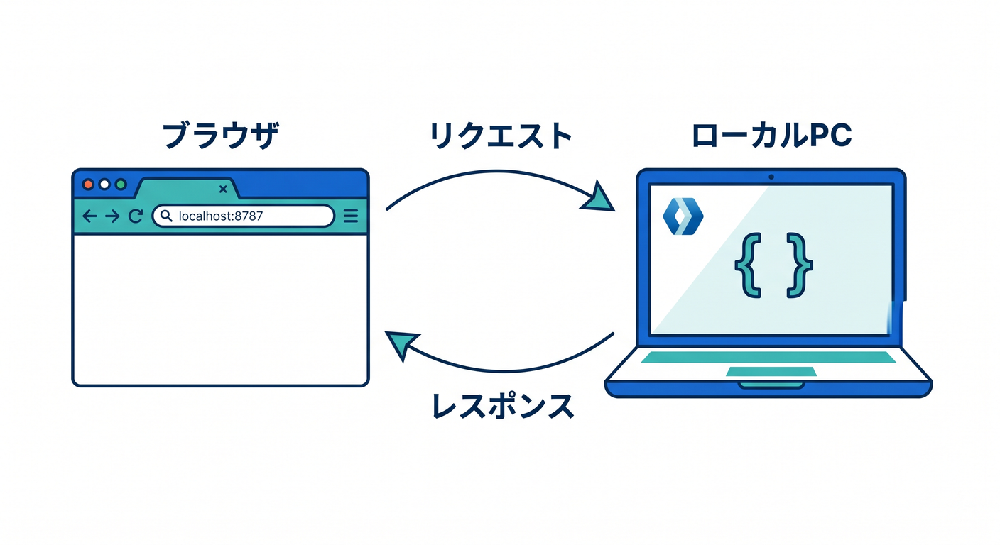
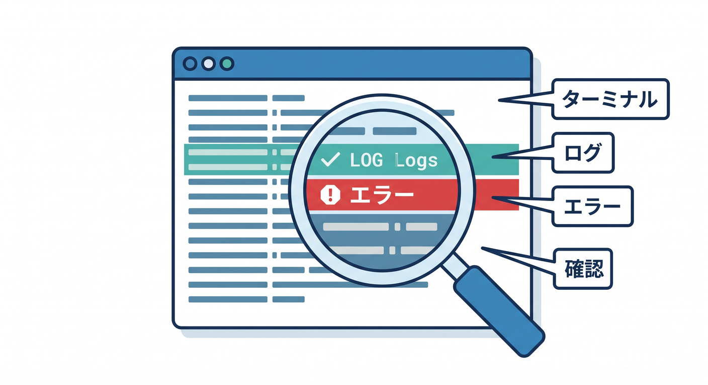
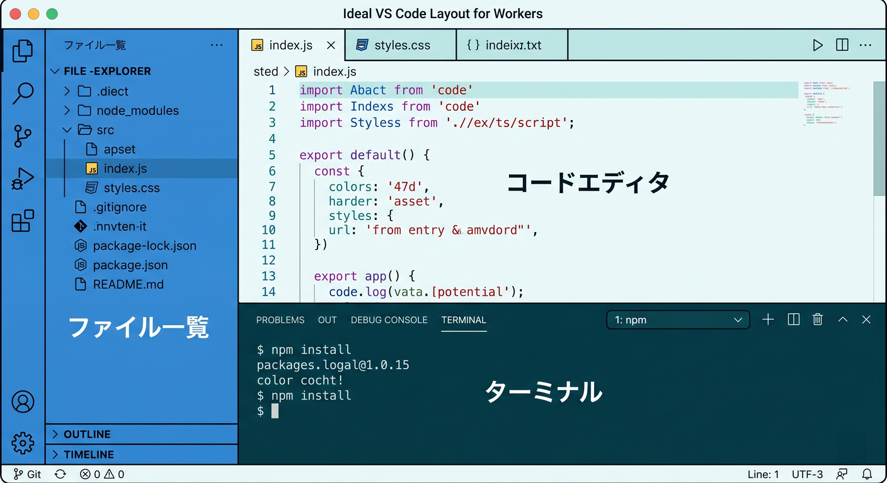
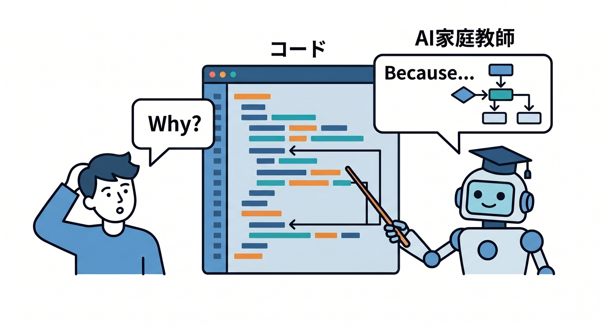

# 第4章　`wrangler dev` でローカル起動してみよう 🔍⚡🧪

この章は、**「作ったWorkerを自分のPCで動かして、見て、直して、また見る」** という、いちばん大事な反復を身につける章です 😊
本日時点の公式導線では、Cloudflare Workers のローカル開発は `wrangler dev` が基本で、Cloudflare側もこの流れを中心に案内しています。`wrangler.jsonc` も新規プロジェクト向けの推奨設定ファイルになっています。 ([Cloudflare Docs][1])

---

## この章のゴール 🎯

この章のゴールは、次の4つです ✨

1. `wrangler dev` を自分で起動できる
2. ブラウザで `localhost` を開いて、Workerの返事を確認できる
3. ターミナルに出るログや例外を「怖い文字列」ではなく「ヒント」として見られる
4. Copilotを**説明役・補助役**として使いながら、小さく直して試す流れに慣れる

Cloudflare公式では、ローカル開発サーバーの起動方法として `wrangler dev` を案内しており、`localhost:8787` で動作確認でき、`console.log` や例外もターミナルに表示されます。 ([Cloudflare Docs][1])

---

## 1. `wrangler dev` って何をしているの？ 🤔☁️

ひとことで言うと、**Cloudflare Workers を本番公開する前に、自分のPC上で試せるようにするコマンド**です 🌱
Cloudflareの開発・テスト系ドキュメントでは、`wrangler dev` を使うと Worker のコードはローカルマシンで動き、必要な各種リソースはローカルにシミュレートされるのが基本動作です。しかも、そのとき使うAPIの形は本番時と同じなので、「ローカルだけ書き方が別物」という感じになりにくいです。 ([Cloudflare Docs][1])

つまり今の段階では、
**アクセスが来る → ローカルでWorkerが動く → レスポンスが返る**


この一本だけつかめれば十分です 👍

---

## 2. まず覚えたい考え方 💡📦

WranglerはCloudflare開発の中心CLIですが、今の公式では**グローバルに雑に入れて使う**より、**プロジェクトごとにローカルインストールして、そのプロジェクトのWranglerを使う**のが推奨です。Cloudflareは、そのほうがチームで同じWranglerバージョンを揃えやすく、プロジェクトごとの管理もしやすいと案内しています。 ([Cloudflare Docs][2])

なので、この章では感覚としてこう覚えるのがきれいです 😊

* Cloudflare開発の司令塔は Wrangler
* 設定の中心は `wrangler.jsonc`
* ローカル起動の入口は `wrangler dev`
* まずは `npx wrangler ...` で、そのプロジェクトのWranglerを使う

CloudflareのD1やWorkersの現行ドキュメントでも、「Wranglerはプロジェクトにローカルインストールされ、`npx wrangler` で使える」という流れで説明されています。 ([Cloudflare Docs][2])

---

## 3. 実際に起動してみよう 🚀🖥️

VS Codeで第2章で作ったWorkerプロジェクトを開き、ターミナルでそのフォルダに入った状態で、まずはこれを実行します。

```bash
npx wrangler --version
npx wrangler dev
```

`wrangler dev` はローカルでWorkerをテストするためのコマンドで、起動中は `localhost:8787` にHTTPリクエストを送るとWorkerが実行されます。あわせて `console.log` の内容や例外もターミナルに表示されます。 ([Cloudflare Docs][3])

ブラウザで `http://localhost:8787` を開いて、Hello World っぽい表示が出ればまず成功です 🎉
CloudflareのD1チュートリアルでも、`wrangler dev` 実行後に表示されるURL（多くの場合 `localhost:8787`）へアクセスしてローカル確認する流れになっています。 ([Cloudflare Docs][4])

---

## 4. この章で大事なのは「公開」ではなく「反復」🔁✨

初心者のうちは、いきなり本番公開を急ぐより、
**保存する → ブラウザで見る → おかしければ直す → もう一回見る**
この小さなループを何度も回すほうが、ずっと力になります 🌸

Cloudflareの現在のローカル開発導線でも、まずは `wrangler dev` でローカルサーバーを立てる流れが基本です。しかも Worker のコードはローカルで動き、binding 先の各種リソースもまずはローカルで再現されるので、公開せずにかなり多くの確認ができます。 ([Cloudflare Docs][1])

ここでは「完璧に理解してから触る」ではなく、
**触りながら理解する** で大丈夫です 🙆‍♂️

---

## 5. 何が起きているかを、やさしく分解しよう 🧩🌐

`wrangler dev` を実行してブラウザで開くとき、裏ではざっくり次のことが起きています。

* WorkerコードがローカルPCで実行される
* `wrangler.jsonc` の設定を見ながら開発環境が立ち上がる
* `env` で触るようなCloudflareリソースは、まずローカルシミュレーションが使われる
* ブラウザからのアクセスが、そのWorkerへ届く

Cloudflare公式は、Wrangler設定ファイルを Worker 設定の source of truth として扱うことを勧めています。また、ローカル開発時の各種 binding は同じAPIで扱え、初期状態ではローカル側のリソースは空です。 ([Cloudflare Docs][5])

ここでのポイントは、
**「本番と完全に切り離されたおもちゃ」ではなく、本番へ近い感覚で練習している**
ということです 😊

---

## 6. ターミナルの見方に慣れよう 👀💬

`wrangler dev` 中のターミナルは、ただの黒い画面ではなく、**今のWorkerの様子を教えてくれる実況席**です 📣

見るべきものは主に3つです。

* 起動できたかどうか
* `console.log` の出力
* 例外やエラーメッセージ



Cloudflare公式は、`wrangler dev` 実行中に `console.log` と例外がターミナルへ表示されることを明記しています。なので、エラーが出たときはまずブラウザよりも**ターミナルを読む**習慣をつけると強いです。 ([Cloudflare Docs][3])

たとえば、今の段階では次の感覚が持てれば十分です ✨

* 赤っぽい表示や stack trace が出た → 何か落ちている
* `console.log("ここまで来た")` が出た → その場所までは通っている
* ブラウザが真っ白 or 想定外 → まずターミナルを見る

---

## 7. VS Codeでのおすすめ動線 🪟🧠

この章では、VS Code の画面を次の3つに分けて見るとかなり楽です。

* 左: ファイル一覧
* 真ん中: `src` のWorkerコード
* 下: ターミナル (`wrangler dev` を起動したままにする)



そして、**コードを少しだけ変える → ブラウザで再確認 → ターミナルを見る** を繰り返します。
Cloudflare公式には、VS Codeでのデバッグ設定や Miniflare へのアタッチ方法も案内されていますが、それはこの章では「後で使える上級オプション」くらいで十分です。まずはターミナル確認に慣れるのが先です。 ([Cloudflare Docs][6])

---

## 8. Copilotはこの章でどう使うと上手いの？ 🤖✨

GitHub Copilot は、今の公式ドキュメントでも**コード理解、改善案、バグ修正、テストの考え方**を質問できる相棒として案内されています。VS Code では Copilot Chat 拡張を使って、コード関連の質問ができます。 ([GitHub Docs][7])

この章では、Copilotを**自動で全部直す人**として使うより、まずは**説明してくれる家庭教師**として使うのが向いています 📚✨



たとえば、こんな聞き方が相性いいです。

* `このWorkerで wrangler dev を実行すると何が起きますか？`
* `このエラー文を初心者向けに説明して`
* `このレスポンスをHTMLに変える最小例を出して`
* `console.log を足して、処理の流れが見えるようにして`

GitHub公式では、Copilotに「このファイルを説明して」「どう改善できる？」「どうテストできる？」のような質問をする使い方が案内されています。 ([GitHub Docs][7])

---

## 9. Agent mode は使うべき？ 🛠️🤖

GitHub公式では、**agent mode** は「具体的なタスクがあり、Copilotに複数ファイル編集やターミナル操作を含む自律的な変更をさせたいとき」に向いていると説明されています。外部アプリや MCP サーバーとの連携が必要な作業にも向いています。 ([GitHub Docs][8])

ただし第4章では、まだそこまで自動化しなくて大丈夫です 🙌
この段階でおすすめなのは、

* まず自分で `wrangler dev` を起動する
* エラーを読む
* Copilotに「説明」「最小修正案」「何を確認すべきか」を聞く

この順番です。
agent mode は便利ですが、この章では**理解を育てること**のほうが大事です 🌱

---

## 10. CloudflareのAIサービスと、この章はどうつながるの？ 🤖☁️

一見すると `wrangler dev` はただのローカル起動コマンドに見えますが、実はこの章の流れは、あとで **Workers AI** を触るときにもそのまま効いてきます。Cloudflareの Workers AI の現行ガイドでも、Workers・binding・Wrangler を使ってAIアプリを組み立てる流れになっています。 ([Cloudflare Docs][9])

なので今はまだAIコードを書かなくても、
**「Wranglerで起動する」「ブラウザで確認する」「ログを見る」**
この基本ループを作っておくこと自体が、AI活用の下地になります 🌈


さらに少し先の話をすると、Cloudflareは自社の managed remote MCP servers も提供していて、各種Cloudflare設定や情報へAIクライアントから触る導線を整えています。一方GitHub側は、agent mode が MCP サーバーを含む外部連携タスクに向いていると案内しています。なので将来的には、**Cloudflare側のMCP導線 × IDE側のAIエージェント導線** を組み合わせる学び方も十分ありえます。ただし、これは第4章ではまだ“未来の拡張レーン”として知っておく程度でOKです。 ([Cloudflare Docs][10])

---

## 11. VS Code拡張まわりの補足 🔌🧰

VS Code Marketplace には、Cloudflare公式の **Cloudflare Workers** 拡張があり、説明文では「Cloudflare Worker の bindings 管理」を目的にしています。 ([Visual Studio Marketplace][11])

ただ、この章の主役はそこではありません。
第4章ではまず、

* `wrangler dev`
* ブラウザ確認
* ターミナル確認
* Copilotで理解補助

この4点に絞るのがきれいです。
拡張機能は便利ですが、**最初の理解はCLI中心**のほうが身につきやすいです 😊

---

## 12. この章でやる演習 🧪🎓

## 演習1　まずは起動してみよう

`npx wrangler dev` を実行して、`localhost:8787` をブラウザで開いてみましょう。

## 演習2　返す文字を変えよう

Hello World を、自分の好きな文に変えてみましょう。
たとえば「こんにちは、最初のWorkerです！☁️」でもOKです。

## 演習3　`console.log` を足そう

リクエストが来たら、ターミナルに1行出るようにしてみましょう。
「ブラウザに出るもの」と「ターミナルに出るもの」は違う、という感覚が育ちます。

## 演習4　Copilotに説明させよう

次のどれかをCopilot Chatで聞いてみましょう。

* `Explain this Worker in beginner-friendly Japanese.`
* `What does wrangler dev do in this project?`
* `Suggest one tiny improvement without changing the overall structure.`

---

## 13. つまずきやすいポイント 😵‍💫🩹

## ブラウザで開いても表示されない

`wrangler dev` が起動したままか、ターミナルを確認しましょう。Cloudflare公式では、`wrangler dev` 実行中のローカル確認先として `localhost:8787` が案内されています。 ([Cloudflare Docs][3])

## エラーが長すぎて意味がわからない

まずは全部読まなくてOKです。
**最初のエラー文の1行目** と **自分が最後に触った場所** だけ見ましょう。
そしてCopilotに「このエラーを初心者向けに要約して」と投げるのが有効です。Copilotはコードの意味やバグ修正の考え方を質問できる設計になっています。 ([GitHub Docs][7])

## D1やKVをあとで使ったら、ローカルで空っぽに見える

それは自然です。Cloudflare公式では、ローカル開発時の各種リソースは最初は空で、必要に応じてローカルデータを入れて使う流れです。 ([Cloudflare Docs][1])

## 将来、本物のD1やR2につないで試したい

今はまだ不要ですが、Cloudflareは remote bindings を正式提供しており、ローカルでWorkerを実行しつつ、binding呼び出しだけ実際のCloudflare上のリソースへ中継する仕組みも使えます。これは後半章で扱うととても相性がいいです。 ([Cloudflare Docs][12])

---

## 14. この章の到達イメージ 🌟

この章が終わった時点で、こうなっていれば大成功です 🎉

* `wrangler dev` を見てももう怖くない
* `localhost:8787` を開いて確認できる
* ターミナルのログを見る習慣がついた
* Copilotを「理解補助」として使える
* Cloudflare開発は、思ったより手元で回せると感じられる

Cloudflareの現行ドキュメントでも、ローカル開発はWrangler中心、React系へ広げるならVite pluginという住み分けが整理されていて、どちらも Cloudflareチーム製で Miniflare ベースです。今はまだ Wrangler に集中しておけば十分きれいな学習順です。 ([Cloudflare Docs][1])

---

## 章末まとめ 📝☁️💙

第4章の本質は、**Cloudflareを「遠いクラウド」から「自分のPCで何度も試せる開発対象」に変えること**です。`wrangler dev` はその入口で、ブラウザ確認・ログ確認・小さな修正の反復を支える中心コマンドです。 ([Cloudflare Docs][3])

そして2026年の流れで見ると、このローカル開発ループはあとで TypeScript、bindings、D1、KV、R2、Workers AI、さらにはAIエージェント的な拡張へもつながっていきます。だからこの章は地味に見えて、かなり大事です 🌱🚀☁️ ([Cloudflare Docs][1])

必要なら次に、この第4章をもとに
**「学習目標・本文・演習・確認問題・成果物」つきの教材完成版**
として、そのまま記事に貼れる形へ整えます。

[1]: https://developers.cloudflare.com/workers/development-testing/ "Development & testing · Cloudflare Workers docs"
[2]: https://developers.cloudflare.com/workers/wrangler/install-and-update/ "Install/Update Wrangler · Cloudflare Workers docs"
[3]: https://developers.cloudflare.com/workers/wrangler/commands/general/ "General commands · Cloudflare Workers docs"
[4]: https://developers.cloudflare.com/d1/get-started/ "Getting started · Cloudflare D1 docs"
[5]: https://developers.cloudflare.com/workers/wrangler/configuration/ "Configuration - Wrangler · Cloudflare Workers docs"
[6]: https://developers.cloudflare.com/workers/testing/miniflare/developing/debugger/ "Attaching a Debugger · Cloudflare Workers docs"
[7]: https://docs.github.com/en/copilot/get-started/quickstart "Quickstart for GitHub Copilot - GitHub Docs"
[8]: https://docs.github.com/copilot/using-github-copilot/asking-github-copilot-questions-in-your-ide "Asking GitHub Copilot questions in your IDE - GitHub Docs"
[9]: https://developers.cloudflare.com/workers-ai/get-started/workers-wrangler/ "Get started - Workers and Wrangler · Cloudflare Workers AI docs"
[10]: https://developers.cloudflare.com/agents/model-context-protocol/mcp-servers-for-cloudflare/ "Cloudflare's own MCP servers · Cloudflare Agents docs"
[11]: https://marketplace.visualstudio.com/items?itemName=cloudflare.cloudflare-workers-bindings-extension "
        Cloudflare Workers - Visual Studio Marketplace
    "
[12]: https://developers.cloudflare.com/changelog/post/2025-09-16-remote-bindings-ga/ "Remote bindings GA - Connect to remote resources (D1, KV, R2, etc.) during local development · Changelog"
