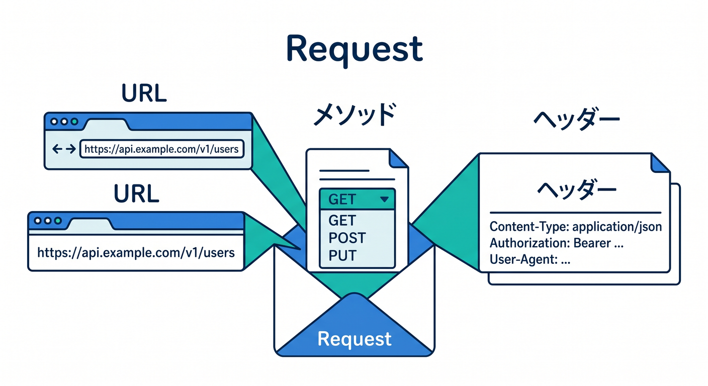
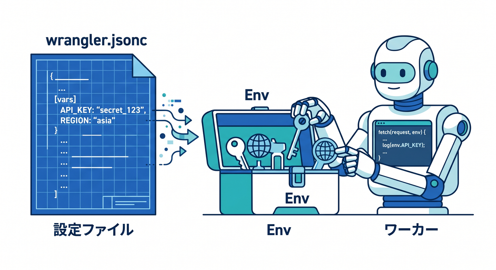
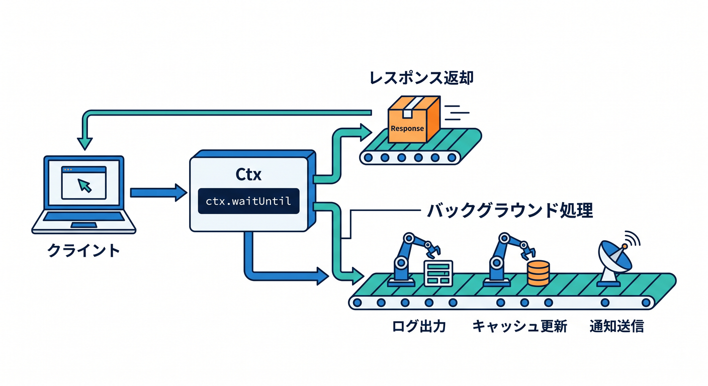
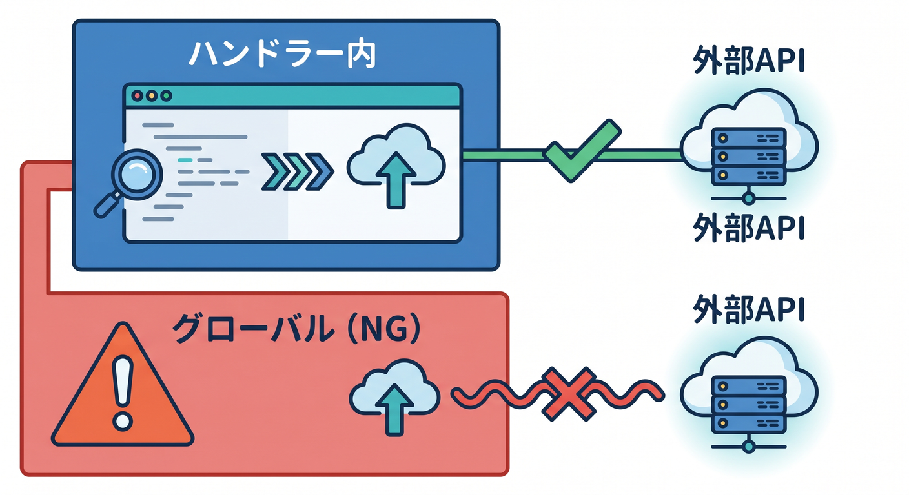
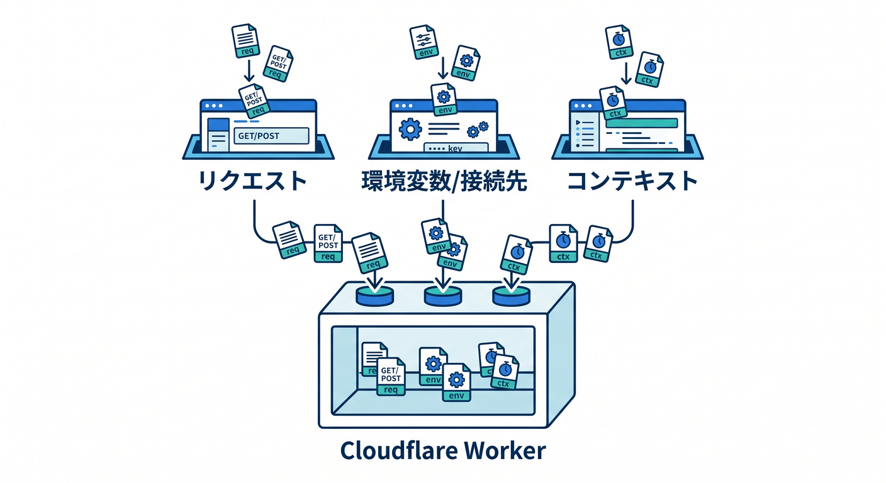

# 第5章　`fetch()` を読んで、RequestとResponseをつかもう 📨🌐✨

この章では、Workerの「心臓部」をやさしく理解していきます 💓
Cloudflare Workers の今の基本形は、`export default { async fetch(request, env, ctx) { ... } }` という ES Modules 形式です。ここで受け取る `request` は incoming HTTP リクエスト、返すのは `Response`、`env` は bindings 群、`ctx` は `waitUntil()` などの実行コンテキストです。Cloudflare の runtime はできるだけ Web 標準 API に寄せて作られているので、ブラウザの `fetch` や `Request` / `Response` の感覚がそのまま生きやすいです。 ([Cloudflare Docs][1])

この章のゴールは、難しいAPI設計へ進むことではありません 😊
まずは「リクエストを受け取る → 中を見る → レスポンスを返す」という最小ループを、頭の中で説明できるようになることです。ここがわかると、Hello World のサンプルが“ただの呪文”ではなくなり、Cloudflare公式サンプルもかなり読みやすくなります。 ([Cloudflare Docs][1])

---

## この章でできるようになりたいこと 🎯

この章の到達点は次の4つです 🌱

1. `fetch()` が Worker の入口だとわかる
2. `request` / `env` / `ctx` の役割をざっくり言える
3. `new URL(request.url)` や `request.method` を読める
4. `new Response(...)` で返事を返せる

Cloudflare公式では、HTTP リクエストは `fetch()` ハンドラに `Request` オブジェクトとして渡され、レスポンスは `Response` オブジェクトを返す形が基本です。さらに `ctx.waitUntil()` はレスポンスを待たせずに後続処理を走らせるための仕組みです。 ([Cloudflare Docs][1])

---

## 1. まずは `fetch()` を“玄関”として見る 🚪☁️

Workerは、URLにアクセスされたとき自動でこの関数に入ってきます。
つまり `fetch()` は「ブラウザやAPIクライアントから届いたリクエストを受ける玄関」です。

Cloudflare公式の基本形はこんなイメージです。 ([Cloudflare Docs][1])

```
export default {
  async fetch(request, env, ctx) {
    return new Response("Hello World!");
  },
};
```

この1本だけで、もう立派なWorkerです 🎉
大事なのは、ここでやっていることがとても単純だということです。

* `request` を受け取る
* 必要なら中身を見る
* `Response` を返す

たったこれだけです。
「クラウド」っぽい難しい言葉はいったん忘れて、**関数が入力を受けて出力を返す** と考えると、かなり気が楽になります 😊

---

## 2. `request` は“お客さんが持ってきた情報” 📬

`request` は `Request` オブジェクトです。
Cloudflare Workers の `Request` は Fetch API の一部で、URL、HTTPメソッド、ヘッダー、ボディなどの情報を持っています。Cloudflare公式では、incoming の `request` は immutable なので、内容を変えたいときは `new Request(url, request)` のように新しい `Request` を作る形が案内されています。 ([Cloudflare Docs][2])

最初に見るべきプロパティは、次の3つで十分です ✨



* `request.url`
* `request.method`
* `request.headers`

まずは URL とメソッドだけ見てみましょう。

```
export default {
  async fetch(request) {
    const url = new URL(request.url);
    const method = request.method;

    return new Response(`URL: ${url.pathname}, METHOD: ${method}`);
  },
};
```

ここで `new URL(request.url)` としているのは、文字列のURLを扱いやすい形に変えるためです。
`pathname` を見れば `/` や `/about` のようなパスが取り出せます。第7章のURL分岐につながる超重要ポイントです 🌟

---

## 3. `env` は“Cloudflareの外部機能につながる箱” 📦🔗

`env` は bindings を受け取るための引数です。
Cloudflare公式では、環境変数も bindings の一種として `env` から使えますし、KV・R2・D1・AI などの Cloudflare サービスも `env` 経由で使います。特に Workers AI をつなぐと `env.AI` で呼べる形になります。 ([Cloudflare Docs][3])

たとえば `wrangler.jsonc` に文字列設定を置くと、こんなふうに読めます。Cloudflare は新しいプロジェクトでは `wrangler.jsonc` を推奨しています。 ([Cloudflare Docs][3])

```
{
  "$schema": "./node_modules/wrangler/config-schema.json",
  "name": "my-worker",
  "main": "src/index.ts",
  "compatibility_date": "2026-04-15",
  "vars": {
    "APP_NAME": "my first worker"
  }
}
```

```
export default {
  async fetch(request, env) {
    return new Response(`App: ${env.APP_NAME}`);
  },
};
```

ここでのコツは、`env` を「設定や接続先の置き場」と考えることです 😊
まだこの段階では、`env` の中身を全部覚えなくて大丈夫です。
「Cloudflareの何かを使うとき、だいたい `env.何か` になる」とわかれば十分です。



なお、Cloudflare公式では plaintext の `vars` は暗号化されないので、機密情報は secrets を使うよう案内しています。ここでは `env` の入口だけ覚え、秘密情報の扱いは第11章で本格的に整理する流れがきれいです。 ([Cloudflare Docs][3])

---

## 4. `ctx` は“返事のあとに少し仕事を続けたいとき”の相棒 ⏱️🛠️

`ctx` は Context API です。
`fetch(request, env, ctx)` の3つ目として渡され、Workerのライフサイクルに関わる機能を持っています。まず覚えるべきなのは `ctx.waitUntil()` です。これはレスポンスを返したあとも Promise ベースの処理を続けられる仕組みで、Cloudflare公式でもキャッシュ保存やログ送信の例で説明されています。 ([Cloudflare Docs][4])



たとえばこんなイメージです。

```
export default {
  async fetch(request, env, ctx) {
    ctx.waitUntil(
      Promise.resolve().then(() => {
        console.log("あとで実行したい処理");
      })
    );

    return new Response("先に返事を返します");
  },
};
```

この章では `ctx` を使いこなす必要はありません 🙆
でも、「3つ目の引数は飾りじゃない」「あとで大事になる」という感覚は持っておきたいです。

一方で `ctx.passThroughOnException()` も存在しますが、Cloudflare の Best Practices では通常のエラーハンドリング手段として使わず、`try...catch` で明示的に扱うことが推奨されています。ここでは **`waitUntil()` を覚える、`passThroughOnException()` は存在だけ知る** でOKです。 ([Cloudflare Docs][1])

---

## 5. Request と Response を1本で理解する最小サンプル ✍️🌈

ここで、第5章の中心になるサンプルを置きます。
このコードが読めれば、この章はかなり成功です 🎊

```
export default {
  async fetch(request, env, ctx) {
    const url = new URL(request.url);
    const method = request.method;

    const message =
      `こんにちは！\n` +
      `あなたは ${url.pathname} に ${method} でアクセスしました。\n` +
      `Worker名の目印: ${env.APP_NAME ?? "未設定"}`;

    return new Response(message, {
      headers: {
        "content-type": "text/plain; charset=UTF-8",
      },
      status: 200,
    });
  },
};
```

このサンプルで学べることは、かなり多いです ✨

* `request.url` を見る
* `request.method` を見る
* `env` から値を読む
* `Response` で本文・ヘッダー・ステータスを返す

Cloudflare の `Response` はヘッダーやステータスを持てますし、`text()` や `json()` などのメソッドもあります。Workers の `Request` / `Response` には Workers 固有の拡張もありますが、基本の考え方は Web 標準の延長として理解できます。 ([Cloudflare Docs][5])

---

## 6. TypeScriptで読むと、さらに怖くなくなる 🔷😊

2026年のCloudflareでは、TypeScriptはかなり主役です。
Cloudflare公式では TypeScript を first-class language とし、`wrangler types` で Worker の設定に合った型を生成することを強く勧めています。型は `compatibility_date`、compatibility flags、bindings などに合わせて生成されます。Best Practices でも `Env` を手書きせず、`wrangler types` を再実行して合わせることが推奨されています。 ([Cloudflare Docs][6])

この章では、まず次の形に目を慣らせばOKです。

```
export default {
  async fetch(request: Request, env: Env, ctx: ExecutionContext): Promise<Response> {
    const url = new URL(request.url);
    return new Response(`Path: ${url.pathname}`);
  },
} satisfies ExportedHandler<Env>;
```

ここで大事なのは、型を暗記することではありません。
**「request は Request 型なんだな」「ctx は ExecutionContext なんだな」くらいの認識で十分** です 🌱
むしろ補完が効いて、`request.` と打ったときに候補が見えることのほうが大切です。

---

## 7. `fetch()` の中で別のAPIを呼ぶときの注意 🌍➡️🌍

Workers の中でも `fetch()` を使って外部APIへアクセスできます。Cloudflare公式でも、サードパーティAPI統合は `fetch API` を使うよう案内されています。ただし、非同期タスクとしての `fetch()` は handler の中で実行する必要があり、global scope で呼ぶとエラーになります。 ([Cloudflare Docs][7])

つまり、こういうのはOKです。

```
export default {
  async fetch(request) {
    const res = await fetch("https://example.com/");
    const text = await res.text();
    return new Response(text);
  },
};
```

でも、こういう発想はNGです ⚠️

```
const res = await fetch("https://example.com/"); // こういう発想はダメ

export default {
  async fetch(request) {
    return new Response("...");
  },
};
```

この「**外でやらず、中でやる**」感覚はかなり大事です。



Workers はサーバープログラムっぽく見えても、リクエスト文脈の中で動く部分がはっきりしています。

---

## 8. Copilot をこの章でどう使うと強いか 🤖💬

この章での GitHub Copilot は、「勝手に全部書かせる相棒」よりも、「今あるコードを言葉でほどく家庭教師」として使うのが相性抜群です ✨
GitHub公式では VS Code で Chat、Agent mode、MCP などが利用でき、Agent mode は複数ステップの作業や外部アプリ連携に向いています。また、GitHub は最新の安定版IDEとCopilot拡張を使うことを勧めています。 ([GitHub Docs][8])

この章では、たとえばこんな聞き方がかなり良いです 👇

* 「この `fetch(request, env, ctx)` の3引数を初心者向けに説明して」
* 「`request.url` と `new URL(request.url)` の違いを説明して」
* 「この Worker を `/hello` と `/about` で分岐する前段階として整理して」
* 「`Response` の `headers` と `status` を初心者向けコメント付きで書いて」

さらにCloudflare公式は、Workers を VS Code などの agent / editor から prompt ベースで作る流れや、Cloudflare Docs MCP サーバー、Observability MCP サーバーを案内しています。つまり、Copilot系の道具と Cloudflare の公式知識は、2026年時点でかなり噛み合いやすくなっています。 ([Cloudflare Docs][9])

---

## 9. この章でも AI を少しだけ混ぜると、学びが急に今どきになる 🤖☁️

第5章の主役は `fetch()` ですが、ここで少しだけ Workers AI を触れると、「`env` ってこう使うのか」が一気に立体的になります。Cloudflare公式では、Workers AI は serverless way で Cloudflare のグローバルネットワーク上のGPUモデルを使え、Worker には AI binding を追加して `env.AI.run()` で呼び出します。 ([Cloudflare Docs][10])

たとえば、概念的にはこうです。

```
export default {
  async fetch(request, env) {
    const answer = await env.AI.run("@cf/meta/llama-3.1-8b-instruct", {
      prompt: "Hello World とは何？"
    });

    return new Response(JSON.stringify(answer), {
      headers: { "content-type": "application/json; charset=UTF-8" }
    });
  },
};
```

このコードの見どころは、AIそのものよりも **`env` から binding を受け取り、`fetch()` の中で処理し、最後に `Response` を返している** ところです。
つまり、AIを入れても章の本質は変わりません。
第5章の理解が、そのまま第15章のAI連携へつながっていきます 🌈

ただしCloudflare公式では、Workers AI はローカル開発中の `wrangler dev` でも実際にアカウントへアクセスして実行され、利用料金が発生しうると案内されています。教材では「まず概念理解」「実行は必要になってから」で進めるのが親切です。 ([Cloudflare Docs][11])

---

## 10. この章でやる演習 🧪📝

**演習1：URLとメソッドを返す Worker**
`request.url` と `request.method` を読み取り、テキストで返してください。
ゴールは「アクセスしたURLの path と method が見える」ことです。

**演習2：`env` を1個読む Worker**
`wrangler.jsonc` の `vars` に `APP_NAME` を入れ、レスポンスに表示してください。
ゴールは「`env` が単なる謎の引数ではなく、設定やbindingの入口だ」と理解することです。 ([Cloudflare Docs][3])

**演習3：`ctx.waitUntil()` を入れてみる**
レスポンスはすぐ返しつつ、`waitUntil()` の中で `console.log()` するコードを書いてみてください。
ゴールは「返事のあとに処理できる」という感覚を持つことです。 ([Cloudflare Docs][12])

**演習4：Copilot に説明させる**
自分の書いた `fetch()` を選択して、Copilot Chat に「文系大学生向けに説明して」と聞いてみてください。
ゴールは、AIを“答え製造機”ではなく“理解補助装置”として使うことです。 ([GitHub Docs][8])

---

## 11. この章でつまずきやすいポイント 😵‍💫➡️🙂

**つまずき① `fetch` が2個あるように見える**
あります。
1つは「Workerの入口の `fetch(request, env, ctx)`」、もう1つは「外部へ取りに行く `fetch(url)`」です。
前者は受け取る側、後者は取りに行く側です 🌐

**つまずき② `env` が何者かわからない**
最初は「Cloudflareの機能や設定が入ってくる箱」でOKです。
細かい中身は後の章で増えます。

**つまずき③ `ctx` が空気に見える**
第5章ではほぼそう見えて大丈夫です 😄
ただし `waitUntil()` があるので、将来ちゃんと効いてきます。

**つまずき④ `Env` を自分で全部書きたくなる**
今のCloudflare公式のおすすめは、手書きより `wrangler types` です。設定に合わせた型を生成したほうがズレにくいです。 ([Cloudflare Docs][6])

---

## 12. この章のまとめ 🌟

この章でいちばん大切なのは、Workerの本質をたった1行で言えるようになることです。

**「Cloudflare Worker は、`fetch()` で HTTP リクエストを受け取り、必要な処理をして、`Response` を返すプログラム」** です。 ([Cloudflare Docs][1])

そして3引数はこう覚えるとかなりラクです 😊

* `request` = お客さんが持ってきた情報 📬
* `env` = 設定やCloudflare機能への入口 📦
* `ctx` = 返事のあとも少し仕事するための道具 ⏱️



ここが見えるようになると、Hello World はもう卒業寸前です 🎓✨
次の章で HTML や JSON を返す話へ進んでも、「何を受けて、何を返しているか」がちゃんと頭の中でつながるようになります。

---

## この章の成果物イメージ 🏁

この章の終わりには、最低でも次のどちらかを自力で書ける状態を目指します。

```
export default {
  async fetch(request) {
    const url = new URL(request.url);
    return new Response(`You requested: ${url.pathname}`);
  },
};
```

または

```
export default {
  async fetch(request, env, ctx) {
    ctx.waitUntil(Promise.resolve(console.log("background task")));
    return new Response(`App: ${env.APP_NAME ?? "unknown"}`);
  },
};
```

これが書ければ、第5章はかなり順調です 🚀

必要なら次に、この第5章をベースにして
**「学習目標・演習課題・理解度チェック問題・ミニテスト付きの完成教材版」** に整えてお渡しできます。

[1]: https://developers.cloudflare.com/workers/runtime-apis/handlers/fetch/ "Fetch Handler · Cloudflare Workers docs"
[2]: https://developers.cloudflare.com/workers/runtime-apis/request/ "Request · Cloudflare Workers docs"
[3]: https://developers.cloudflare.com/workers/configuration/environment-variables/ "Environment variables · Cloudflare Workers docs"
[4]: https://developers.cloudflare.com/workers/runtime-apis/context/ "Context (ctx) · Cloudflare Workers docs"
[5]: https://developers.cloudflare.com/workers/runtime-apis/response/ "Response · Cloudflare Workers docs"
[6]: https://developers.cloudflare.com/workers/languages/typescript/ "Write Cloudflare Workers in TypeScript · Cloudflare Workers docs"
[7]: https://developers.cloudflare.com/workers/runtime-apis/fetch/ "Fetch · Cloudflare Workers docs"
[8]: https://docs.github.com/en/copilot/get-started/features "GitHub Copilot features - GitHub Docs"
[9]: https://developers.cloudflare.com/workers/get-started/prompting/ "Prompting · Cloudflare Workers docs"
[10]: https://developers.cloudflare.com/workers-ai/ "Overview · Cloudflare Workers AI docs"
[11]: https://developers.cloudflare.com/workers-ai/get-started/workers-wrangler/ "Get started - Workers and Wrangler · Cloudflare Workers AI docs"
[12]: https://developers.cloudflare.com/workers/reference/migrate-to-module-workers/ "Migrate from Service Workers to ES Modules · Cloudflare Workers docs"
