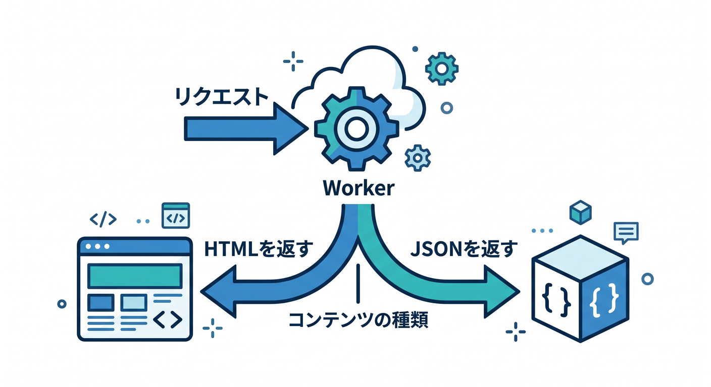
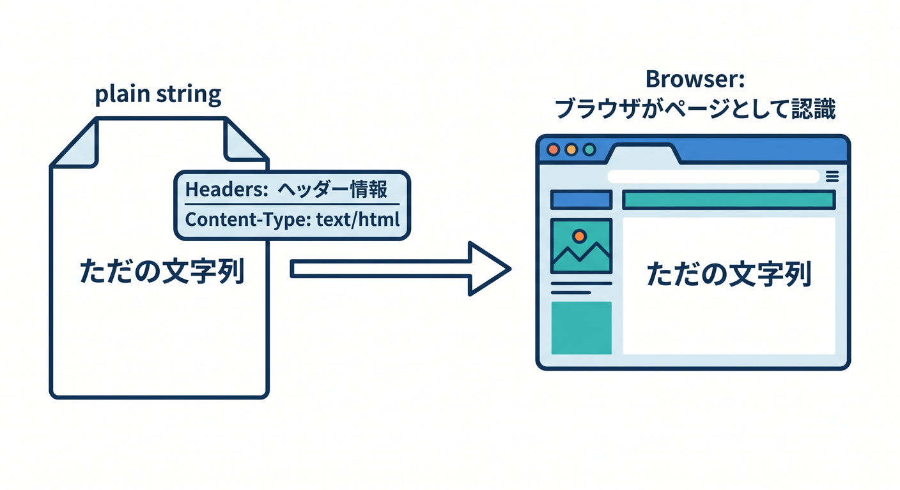
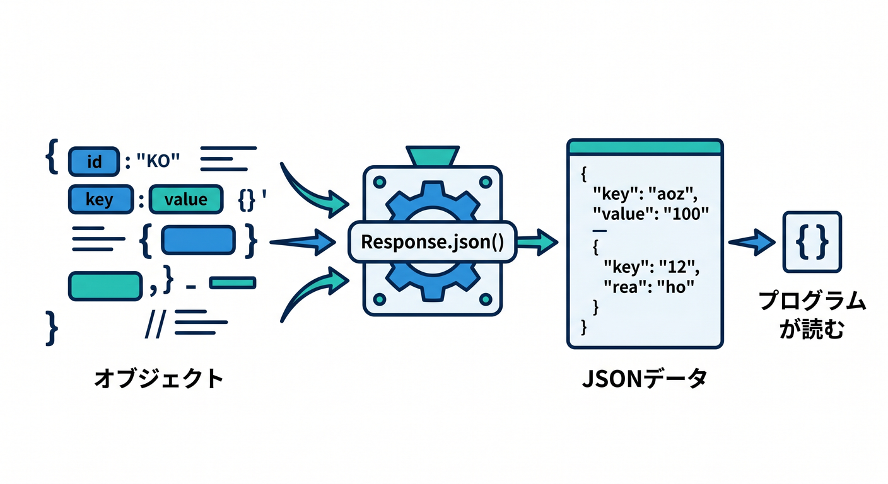
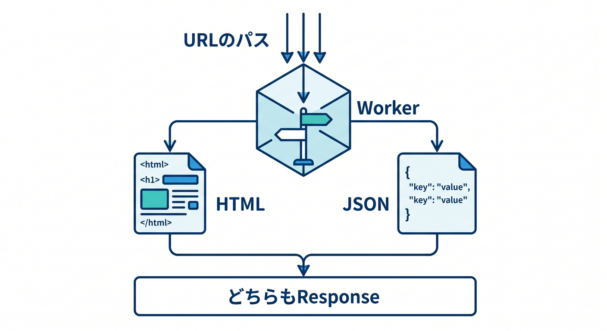
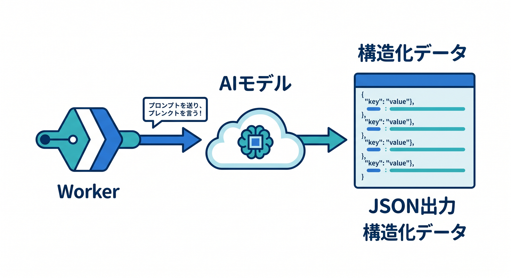

# 第6章　文字だけじゃないよ。HTMLとJSONも返してみよう 🧾✨🌐

この章では、「Workerは文字列を返すだけのもの」から一歩進んで、「ページを返す」「APIっぽく返す」という感覚をつかみます。Cloudflare Workers の返し口は **Response** で、これは Fetch API の一部です。さらに Workers ではこの Response に独自拡張も入っているので、ここを押さえると今後の章がかなり読みやすくなります。Cloudflare の公式例でも、HTML は **new Response(...)**、JSON は **Response.json(...)** という形でまっすぐ学べるようになっています。 ([Cloudflare Docs][1])

---

## この章のゴール 🎯

この章が終わるころには、こんなことができるようになっています。

* Worker で **HTML** を返せる 🖼️
* Worker で **JSON** を返せる 📦
  
* **Content-Type** を付ける意味がわかる 🏷️
* 「ブラウザ向けの返し方」と「JavaScript向けの返し方」の違いがわかる 🔀
* Copilot に「説明させる」「直させる」「改善案を出させる」使い方ができる 🤖
* 将来、Workers AI の結果を JSON で返す流れが自然に見える 🌈 ([Cloudflare Docs][2])

---

## 1. まずは考え方から ☁️💡

第5章では「リクエストを受け取ってレスポンスを返す」ことを学びました。今回はその続きで、「**何を返すか**」に注目します。Worker の中では、最終的に **Response** を返せばよくて、その中身が文字列でも HTML でも JSON でもかまいません。公式ドキュメントでも、HTML を返す例と JSON を返す例が分かれて用意されています。 ([Cloudflare Docs][1])

大事なのは、「中身」だけでなく「これは何のデータですか」を示すことです。Cloudflare の HTML 例では **content-type: text/html;charset=UTF-8** を明示し、JSON 例では **Response.json(data)** を使っています。ここを意識すると、ブラウザは「ページとして表示しよう」と判断しやすくなり、JavaScript 側は「JSONとして扱おう」と書きやすくなります。 ([Cloudflare Docs][2])


---

## 2. この章で使う Worker の見た目 👀

Cloudflare では、Worker の基本形として **fetch(request, env, ctx)** ハンドラーが使われます。**ctx** はハンドラーの3番目の引数で、Worker のライフサイクル管理に使うものです。今章ではまだ深追いしませんが、「3つ目の引数があるんだな」くらいで十分です。 ([Cloudflare Docs][3])

また、Worker 内で外部へ通信するような非同期処理、たとえば **fetch()** はハンドラー内で実行する必要があります。グローバルスコープで呼ぶとエラーになります。今章では主に「返す」ことがテーマですが、あとで JSON API と外部データ取得を組み合わせるときに、このルールが効いてきます。 ([Cloudflare Docs][4])

---

## 3. まずは HTML を返してみよう 🖼️✨

最初は、ブラウザで見たときに「ページっぽく見える」返し方です。Cloudflare 公式の HTML 例も、HTML 文字列をそのまま Response に入れて返す、とてもシンプルな形です。 ([Cloudflare Docs][5])

## 例1：小さなHTMLページを返す

```ts
export default {
  async fetch(): Promise<Response> {
    const html = `<!DOCTYPE html>
<html lang="ja">
  <head>
    <meta charset="UTF-8" />
    <title>はじめてのCloudflare HTML</title>
    <style>
      body {
        font-family: sans-serif;
        padding: 24px;
        line-height: 1.7;
      }
      .box {
        padding: 16px;
        border: 1px solid #ddd;
        border-radius: 12px;
      }
    </style>
  </head>
  <body>
    <div class="box">
      <h1>こんにちは、Cloudflare Workers! ☁️</h1>
      <p>これは Worker が返した HTML ページです。</p>
      <p>文字列だけでなく、ページそのものも返せます 🎉</p>
    </div>
  </body>
</html>`;

    return new Response(html, {
      headers: {
        "content-type": "text/html;charset=UTF-8",
      },
    });
  },
} satisfies ExportedHandler;
```

この書き方は、Cloudflare の公式例にかなり近いです。ポイントは **new Response(html, { headers: { "content-type": "text/html;charset=UTF-8" } })** の部分です。ここを省くと、HTMLとして扱われる感覚がぼんやりしやすいので、最初のうちは毎回しっかり書くのがおすすめです。 ([Cloudflare Docs][5])

## ここで覚えること 📝

* HTML は「ただの文字列」として作ってよい
* 返すときに **text/html** を付ける
* まずはテンプレートエンジンなしで十分
* 「Workerなのにページが返せるんだ！」という感覚を持つのが大事

この段階では、凝った UI は不要です。見出し、本文、少しの CSS があれば十分です 😊

---

## 4. 次は JSON を返してみよう 📦⚡

JSON は「プログラム向けの返事」です。Cloudflare の公式例では、オブジェクトを作って **Response.json(data)** でそのまま返しています。APIやフロントエンド連携では、この形がとてもよく出てきます。 ([Cloudflare Docs][2])


## 例2：JSONを返す

```ts
export default {
  async fetch(): Promise<Response> {
    const data = {
      message: "Cloudflare Workers へようこそ！",
      category: "chapter-6",
      ok: true,
      items: ["HTMLを返せる", "JSONを返せる", "次はURL分岐へ進む"],
    };

    return Response.json(data);
  },
} satisfies ExportedHandler;
```

この形のよさは、**JSON.stringify を自分で書かなくてもよい**ことです。最初は「JSONを返すときは Response.json」を合言葉にしてしまって大丈夫です。Cloudflare の公式例もこの形をそのまま使っています。 ([Cloudflare Docs][2])

---

## 5. HTML と JSON の違いを体で覚えよう 🔄🌈

ここ、すごく大事です。

* **HTML** は「人がブラウザで見る」もの 👀
* **JSON** は「JavaScriptや他のプログラムが読む」もの 🤖


もちろん実際の開発では、HTML も JavaScript も両方使います。でも初心者のうちは、「見せたいなら HTML」「データを渡したいなら JSON」と分けるだけでかなり整理しやすいです。Cloudflare 公式の例が HTML 用と JSON 用に分かれているのも、この区別をつかみやすくするためです。 ([Cloudflare Docs][2])

---

## 6. 1つのWorkerで両方を返すミニ例 🚪✨

本格的な URL 分岐は次章の主役ですが、ここでは「HTML と JSON は同じ Worker で共存できるんだよ」というミニ体験だけ先取りしておきます。 ([Cloudflare Docs][3])

```ts
export default {
  async fetch(request: Request): Promise<Response> {
    const url = new URL(request.url);

    if (url.pathname === "/api") {
      return Response.json({
        message: "これはJSONです 📦",
        now: new Date().toISOString(),
      });
    }

    const html = `<!DOCTYPE html>
<html lang="ja">
  <head>
    <meta charset="UTF-8" />
    <title>Chapter 6</title>
  </head>
  <body>
    <h1>これはHTMLです 🖼️</h1>
    <p>/api にアクセスすると JSON が返ります。</p>
  </body>
</html>`;

    return new Response(html, {
      headers: {
        "content-type": "text/html;charset=UTF-8",
      },
    });
  },
} satisfies ExportedHandler;
```

この例でいちばん見てほしいのは、「返す中身が違っても、最後はどちらも Response になる」という点です。Worker の考え方がここでかなり一本化されます 👍


---

## 7. VS Code + Copilot の使いどころ 🤖💬

GitHub Copilot Chat は、IDE の中で **コードの提案、コードの説明、単体テストの生成、コード修正の提案** に使えます。さらに agent mode では、Copilot がどのファイルを触るか考えながら、自律的に編集し、必要に応じてターミナルコマンドの提案や実行フローまで進められます。Cloudflare の学習では、いきなり全部任せるより、まず「説明役」として使うのがかなり相性いいです。 ([GitHub Docs][6])

## この章で使いやすい Copilot プロンプト例 ✨

## 説明してもらう

* 「この Worker が HTML を返している部分を初心者向けに説明して」
* 「Response.json と new Response の違いをやさしく説明して」
* 「content-type が必要な理由をこのコードに即して説明して」

## 改善してもらう

* 「この HTML をもう少し見やすくして」
* 「JSON の中に配列とネストしたオブジェクトを追加して」
* 「この Worker に 404 用の返り値を追加して」

## agent mode で頼みやすい作業 🚀

* 「この Worker を、トップページは HTML、/api は JSON を返すように整理して」
* 「表示用の HTML を少し整えて、型エラーが出ない形に直して」
* 「src/index.ts を初心者向けコメント付きに書き直して」

agent mode は便利ですが、学習の最初は「答えを全部作らせる」より、「自分のコードを説明・改善してもらう」ほうが理解が残りやすいです 😊

---

## 8. Cloudflare AI とこの章のつながり 🤖☁️

この章で JSON を返せるようになると、あとで Workers AI とつなぐ準備がかなり整います。Cloudflare では、Workers AI を Worker から使うには **binding** を設定し、Worker からその binding 経由で呼び出します。つまり将来的には、「AIに何か生成させる → その結果を JSON で返す」という流れがそのまま作れます。 ([Cloudflare Docs][7])


さらに Cloudflare は Workers AI の **structured JSON outputs** も案内していて、AI の返り値を最初から構造化データとして扱いやすくする流れが用意されています。なので、この第6章の「JSONをきれいに返す」は、実は AI 活用の土台にもなっています。 ([Cloudflare Docs][8])

## 未来のイメージ 🌟

* 第6章：固定の JSON を返す
* 第10章以降：binding を設定する
* 第15章：Workers AI の結果を JSON で返す

この順番で進むと、とても自然です 👍

---

## 9. この章のおすすめ演習 🛠️🎓

## 演習1

HTML 例の見出しと本文を、自分の好きな内容に変えてみましょう。
たとえば「戦国サイトの試作トップ」「Cloudflare 学習ノート」みたいな題材でOKです。

## 演習2

JSON 例に次の項目を足してみましょう。

* version
* author
* tags
* links

配列やオブジェクトを入れる練習になります 📦

## 演習3

1つの Worker の中で、

* ルートは HTML
* /api は JSON
* それ以外は 404

を返すようにしてみましょう。
これは次章への最高の助走です 🚀

## 演習4

Copilot Chat に、
「この Worker に初心者向けコメントを追加して」
と頼んで、どこまで読めるようになるか試してみましょう 🤖

---

## 10. つまずきやすいポイント 😵‍💫➡️😌

## その1：HTML を返したのに、思った感じで見えない

HTML の返し方では、Cloudflare 公式例も **content-type: text/html;charset=UTF-8** を明示しています。まずここを疑うのが基本です。 ([Cloudflare Docs][5])

## その2：JSON を文字列で無理やり返そうとしてしまう

最初は **Response.json(...)** を使うのがいちばん素直です。Cloudflare の JSON 例もこの形です。 ([Cloudflare Docs][2])

## その3：将来の外部通信をグローバルスコープに書いてしまう

外部への **fetch()** のような非同期処理はハンドラー内で行う必要があります。今章ではまだ外部 API を呼ばなくても、このルールは覚えておくとあとで助かります。 ([Cloudflare Docs][4])

## その4：env や ctx を見て急にこわくなる

**ctx** は fetch ハンドラーの3番目の引数として渡される公式の仕組みです。今は「あとで使う補助役」くらいの理解で大丈夫です。 ([Cloudflare Docs][3])

---

## 11. この章のまとめ 🌈🎉

この章の本質は、とてもシンプルです。

**Worker は Response を返す。
その中身を HTML にすればページになり、JSON にすれば API っぽくなる。**

Cloudflare の公式例でも、HTML は **new Response + text/html**、JSON は **Response.json(...)** という基本形で整理されています。ここを体で覚えると、第7章の URL 分岐、第10章の bindings、第14章の React 連携、第15章の Workers AI 連携まで、全部つながって見えてきます。 ([Cloudflare Docs][1])

---

## 章末のひとこと 🍀

この第6章は、かなり小さく見えて、実はすごく重要です。
ここで「ページも返せる」「データも返せる」がわかると、Cloudflare Workers がただの Hello World ではなく、**ちゃんと Web アプリの土台になる存在**として見えてきます ☁️💪✨

次の第7章では、これをさらに育てて、URLごとに返し方を変える「小さなAPIっぽさ」へ進みましょう 🛣️📦🖼️

必要なら次に、この第6章をベースにして
**「学習目標・演習課題・成果物・想定学習時間」付きの教材版** に整えて出します。

[1]: https://developers.cloudflare.com/workers/runtime-apis/response/ "Response · Cloudflare Workers docs"
[2]: https://developers.cloudflare.com/workers/examples/return-json/ "Return JSON · Cloudflare Workers docs"
[3]: https://developers.cloudflare.com/workers/runtime-apis/context/ "Context (ctx) · Cloudflare Workers docs"
[4]: https://developers.cloudflare.com/workers/runtime-apis/fetch/ "Fetch · Cloudflare Workers docs"
[5]: https://developers.cloudflare.com/workers/examples/return-html/ "Return small HTML page · Cloudflare Workers docs"
[6]: https://docs.github.com/ja/copilot/how-tos/chat-with-copilot/chat-in-ide "GitHub CopilotにIDEで質問を行う - GitHubドキュメント"
[7]: https://developers.cloudflare.com/workers-ai/configuration/bindings/ "Workers Bindings · Cloudflare Workers AI docs"
[8]: https://developers.cloudflare.com/changelog/post/2025-02-25-json-mode/ "Workers AI now supports structured JSON outputs. · Changelog"
