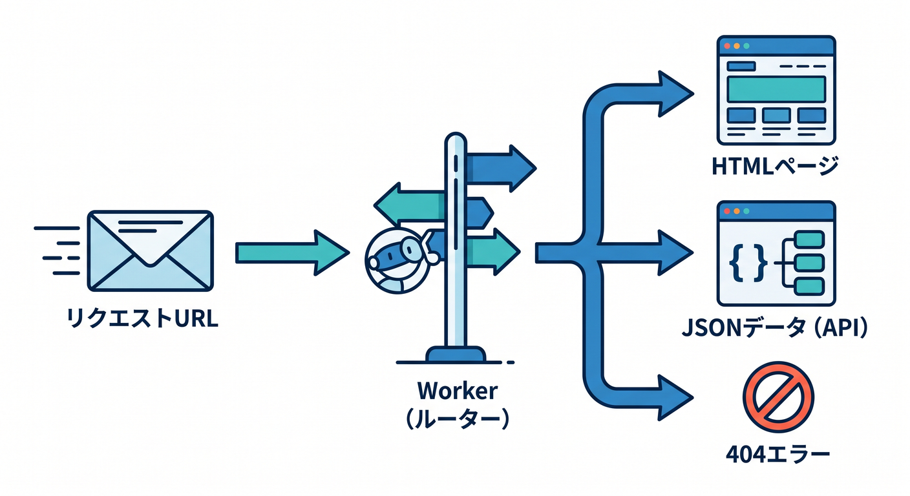
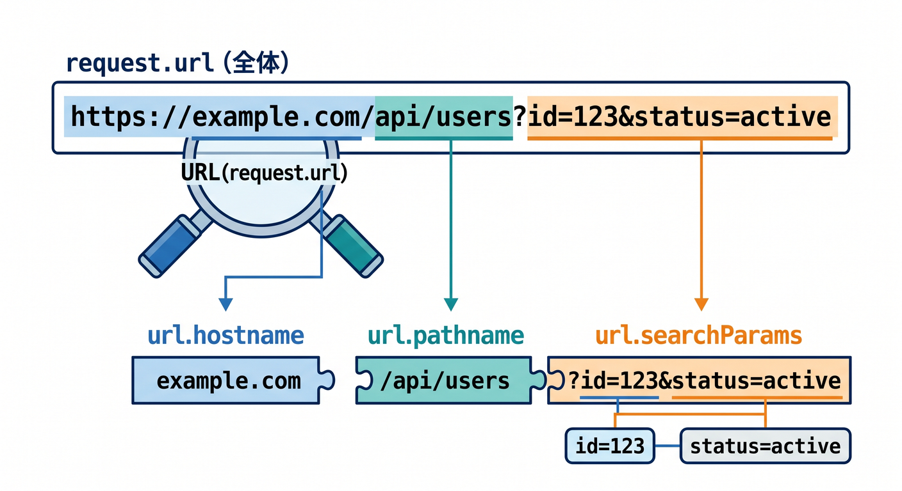
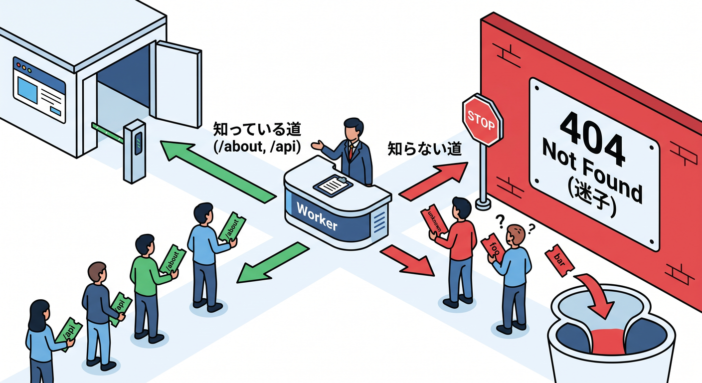
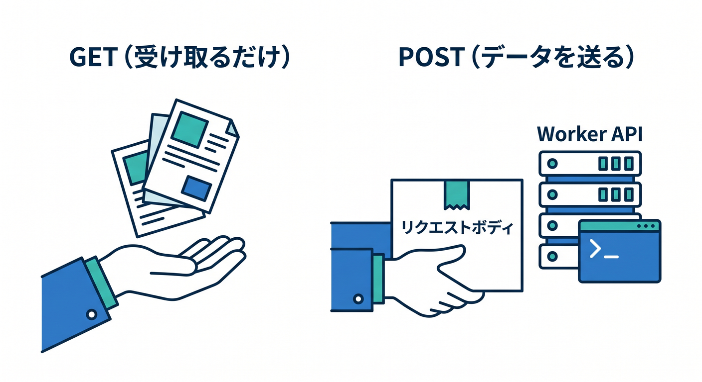
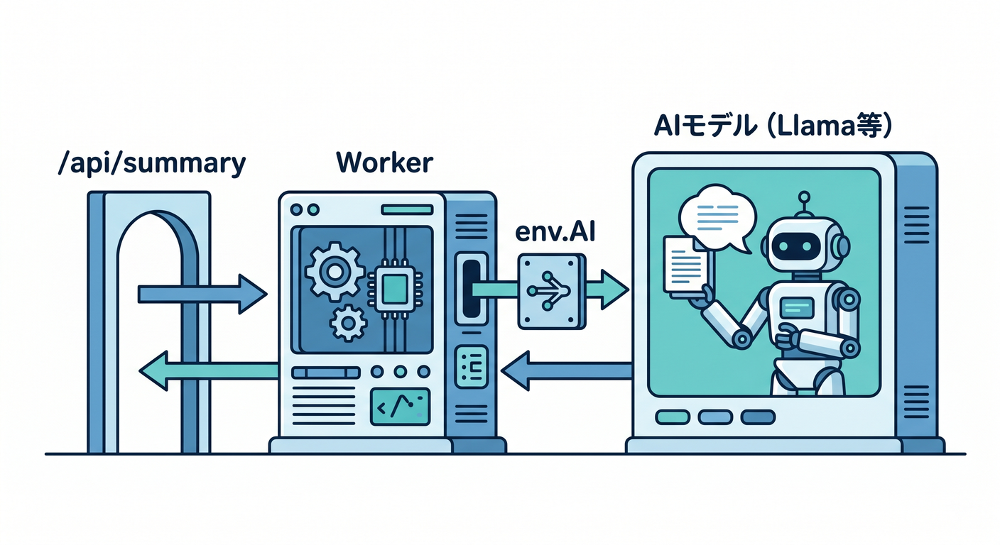

# 第7章　URLで分岐して“小さなAPI”っぽくしよう 🛣️🔗✨

この章では、1本のWorkerに「入口をいくつも作る」感覚を身につけます 😊
Cloudflare Workers の基本形は `fetch(request, env, ctx)` でリクエストを受け取り、`Request.url` を `new URL(request.url)` で分解して `url.pathname` を見ながら処理を分けていく形です。JSON は `Response.json()` で返せます。Cloudflare公式もこの流れを何度も実例として使っています。 ([Cloudflare Docs][1])

ここを理解すると、Workerが「Hello Worldを返すだけの箱」から、「ちょっとしたWebアプリの裏側」へ進化します 🚀
たとえば `/` は挨拶、`/about` は説明文、`/json` はJSON、`/api/hello` はAPI、というふうに分けられるようになります。Cloudflare公式のSPA向けサンプルでも、`url.pathname === "/api/name"` のような条件分岐でAPIエンドポイントを作る例が紹介されています。 ([Cloudflare Docs][2])


---

## この章のゴール 🎯

この章を終えるころには、こんなことが自然にできるようになります ✨

1. URLのパスを見て処理を分ける
2. ルートごとに返す内容を変える
3. 404を返す
4. クエリ文字列を読む
5. 「小さなAPIっぽい入口」を自分で増やせるようになる

---

## 先にひとこと！「コードのルート」と「Cloudflare Routes」は別ものです 🚧

ここは初心者さんがかなり混乱しやすいポイントです 😌

この章でやるのは、**Workerのコードの中で `url.pathname` を見て分岐すること**です。
一方で Cloudflare の **Routes** は、ダッシュボードや設定で「どのURLパターンにそのWorkerを割り当てるか」を決める仕組みです。Cloudflare公式でも、Routes は「URLパターンにWorkerをマッピングして、そのURLに来たらWorkerを実行する仕組み」と説明されています。 ([Cloudflare Docs][3])

つまり、イメージはこうです 🌈

* **Cloudflare Routes / Custom Domains**
  どの住所にこのWorkerを立たせるか
* **コードの `if (url.pathname === "...")`**
  その住所の中で、どの部屋に案内するか

この章では後者をやります 👍

---

## まずは完成形を見よう 👀💡

最初に、動く全体像を見てしまいましょう。
このコードは、`/`、`/about`、`/json`、`/api/hello` の4つを持つ、とても小さなWorkerです ✨

```ts
export default {
  async fetch(request: Request): Promise<Response> {
    const url = new URL(request.url);

    // 1) トップページ
    if (request.method === "GET" && url.pathname === "/") {
      return new Response("こんにちは！Cloudflare Workerへようこそ 👋", {
        headers: { "Content-Type": "text/plain; charset=UTF-8" },
      });
    }

    // 2) 説明ページ
    if (request.method === "GET" && url.pathname === "/about") {
      return new Response(
        "このWorkerは、URLごとに処理を切り替える練習用のサンプルです。🛠️",
        {
          headers: { "Content-Type": "text/plain; charset=UTF-8" },
        }
      );
    }

    // 3) JSONを返す
    if (request.method === "GET" && url.pathname === "/json") {
      return Response.json({
        ok: true,
        message: "JSONを返せました！",
        category: "sample",
      });
    }

    // 4) APIっぽい入口
    if (request.method === "GET" && url.pathname === "/api/hello") {
      const name = url.searchParams.get("name") ?? "ゲスト";

      return Response.json({
        ok: true,
        message: `こんにちは、${name}さん！`,
        path: url.pathname,
      });
    }

    // 5) どれにも当てはまらなければ404
    return new Response("404 Not Found 😢", {
      status: 404,
      headers: { "Content-Type": "text/plain; charset=UTF-8" },
    });
  },
} satisfies ExportedHandler;
```

この書き方は、Cloudflare公式が案内している `fetch()` ハンドラ、`new URL(request.url)`、`url.pathname` による分岐、そして `Response.json()` という基本パターンをまっすぐ組み合わせたものです。 ([Cloudflare Docs][1])

---

## コードをやさしく読み解こう 🧸📘

## 1. `const url = new URL(request.url);` が入口です 🌐

`request.url` にはアクセスされたURL全体が入っています。
Cloudflare Workers の `Request` には `url` と `method` があり、公式ドキュメントでも `url` はリクエストURL、`method` は `GET` や `POST` などのHTTPメソッドとして説明されています。 ([Cloudflare Docs][1])

`new URL(request.url)` にすると、たとえばこんなふうに分けて見られます ✨

* `url.pathname` → `/api/hello`
* `url.searchParams` → `?name=komiyanma` の部分
* `url.hostname` → ドメイン名


この章では、まず `pathname` だけで十分です 👍
Cloudflare公式の例でも、URL分岐はまず `url.pathname` を見るところから始まっています。 ([Cloudflare Docs][4])

## 2. `if` を上から順番に読むだけでOKです 🚶‍♂️

今はルーターライブラリを使わず、上から順に `if` を読ませるだけで十分です。
これで「このURLならこの返事」が作れます。初心者さんにとっては、この素朴な書き方のほうがむしろ理解しやすいです 😊

## 3. `Response.json()` はかなり便利です 📦

JSONを返すときは、手で `JSON.stringify()` して `Content-Type` を付ける方法もありますが、Cloudflare Workers には `Response.json()` が用意されています。公式ドキュメントでも `Response.json()` はJSONをシリアライズして新しいレスポンスを作るメソッドとして案内されています。 ([Cloudflare Docs][5])

なので、最初はこう覚えるとラクです ✨

* 文字を返したい → `new Response("...")`
* JSONを返したい → `Response.json({...})`

## 4. 404をちゃんと返すのが大事です 🚪

最後に404を置くことで、「知っている道だけ案内して、それ以外は迷子扱い」にできます。

Cloudflare公式のサンプルでも、条件に当てはまらないときに `new Response(null, { status: 404 })` を返すパターンが使われています。 ([Cloudflare Docs][2])

---

## 実際に試すURL 🧪✨

ローカルで `wrangler dev` を起動したら、たとえばこんな感じで試せます 😊

* `http://localhost:8787/`
* `http://localhost:8787/about`
* `http://localhost:8787/json`
* `http://localhost:8787/api/hello`
* `http://localhost:8787/api/hello?name=こみやんま`

最後のURLでは、`url.searchParams.get("name")` で値を読めます。Cloudflareの実例でも `url.searchParams.get(...)` を使ってクエリ文字列を読む例があります。 ([Cloudflare Docs][2])

---

## APIっぽさを1段だけ増やそう 📬✨

GETだけでも十分ですが、「APIらしさ」をもう少し感じたいなら、POSTの入口を1本足すと楽しいです 😄

Cloudflare Workers の `Request` には `json()` や `text()` があり、リクエストボディを読めます。GETやHEADにはボディを持てない点も、Requestドキュメントで説明されています。 ([Cloudflare Docs][1])

たとえば `/api/echo` を追加すると、こんな感じです 👇

```ts
export default {
  async fetch(request: Request): Promise<Response> {
    const url = new URL(request.url);

    if (request.method === "POST" && url.pathname === "/api/echo") {
      const body = (await request.json()) as { message?: string };

      return Response.json({
        ok: true,
        received: body.message ?? "",
      });
    }

    return new Response("404 Not Found", { status: 404 });
  },
} satisfies ExportedHandler;
```

これだけで、「受け取って返す」APIの最小形になります 🎉

---

## この章で伝えたい“設計のコツ” 🧭✨

## `/api/` を付けるクセを早めにつける

たとえば、

* `/about` → 人が読むページっぽい
* `/api/hello` → プログラムが読む入口っぽい

と分けておくと、あとでReactなどの画面とつないだときに整理しやすいです。
Cloudflareの React + Vite の公式ガイドでも、`worker/index.ts` 側にバックエンドAPIを置き、React側から `/api/` のエンドポイントを呼ぶ形が示されています。 ([Cloudflare Docs][6])

## 先に「URLの地図」を紙に書く

コードを書く前に、こんなふうに決めるとかなりラクです ✍️

* `/` → トップ
* `/about` → 説明
* `/json` → 動作確認
* `/api/hello` → API
* その他 → 404

この「URLの地図」を先に作るクセは、後でReact、Next.js、Honoへ進んでもずっと役立ちます 🌱

Cloudflareは React + Vite のフルスタック構成や、Next.js を Workers 上で動かす導線も整えています。Next.js 側では Route Handlers もサポートされていますが、今はまず自分の手でパス分岐を書く経験が大切です。 ([Cloudflare Docs][6])

---

## GitHub Copilot の使いどころ 🤖✨

GitHub Copilot の agent mode は、特定のタスクがあるときに、どのファイルを直すか・どんな変更が必要か・どんなターミナル操作が必要かを判断しながら反復して進める用途に向いています。MCP は、Copilot をほかのツールやシステムへつなぐための標準です。なので、この章のような「小さな機能追加」は Copilot とかなり相性がいいです。 ([GitHub Docs][7])

この章では、Copilotにはこんなお願いをすると使いやすいです 💬

**例1**
「Cloudflare Worker の `fetch` の中で、`/about` と `/json` と `/api/hello` を追加して。最後に404も返して」

**例2**
「`new URL(request.url)` を使って、`name` クエリを読んで挨拶JSONを返すようにして」

**例3**
「このWorkerのURL分岐を初心者向けコメント付きで整理して」

コツは、**“全部やって”ではなく、“何を増やしたいか”を具体的に言うこと**です 😊
Copilotはとても便利ですが、最初のうちは「説明役」「たたき台作成役」として使うのがちょうどいいです。

---

## Cloudflare AI を1本だけ混ぜると、一気に今っぽくなります 🤖☁️✨

Cloudflare Workers AI は、Worker から `env.AI` 経由でモデルを呼べます。使うには Wrangler 設定に AI binding を追加し、コードでは `env.AI.run()` を呼ぶ形です。公式ガイドでもその流れが案内されています。 ([Cloudflare Docs][8])

たとえば将来、こんなURLを足せます 👇

* `/api/summary?topic=castle`
* `/api/explain?word=edge`

ミニ例はこんな感じです ✨

```ts
export interface Env {
  AI: Ai;
}

export default {
  async fetch(request: Request, env: Env): Promise<Response> {
    const url = new URL(request.url);

    if (request.method === "GET" && url.pathname === "/api/summary") {
      const topic = url.searchParams.get("topic") ?? "Cloudflare Workers";

      const result = await env.AI.run("@cf/meta/llama-3.1-8b-instruct", {
        prompt: `次のテーマを大学生向けに1文でやさしく説明してください: ${topic}`,
      });

      return Response.json(result);
    }

    return new Response("404 Not Found", { status: 404 });
  },
} satisfies ExportedHandler<Env>;
```

これは今すぐ必須ではありませんが、「URLごとに機能を分ける」考え方と Workers AI はすごく相性がいいです 😊

なお、Cloudflare公式ガイドでは、Workers AI はローカル開発中でも実際にCloudflareアカウントへアクセスして実行され、利用料金が発生しうると案内されています。この点だけは軽く注意です。 ([Cloudflare Docs][9])

さらに、Workers AI には JSON Mode があり、構造化されたJSONを返してもらう流れも用意されています。対応モデルの一覧も公開されていますが、JSON Mode は極端なケースではスキーマ通りに返せないことがあり、その場合はエラー処理が必要で、現時点ではストリーミング非対応です。 ([Cloudflare Docs][10])

---

## でも、まだHonoは入れなくてOKです 🙆‍♂️✨

Cloudflare公式では Hono を「軽量で高速、Workers と相性がよいWebフレームワーク」と紹介していて、React SPA と組み合わせた構成も案内しています。 ([Cloudflare Docs][11])

ただ、この章ではまだ **手書きの `if` 分岐** で十分です 👍
なぜなら、Honoの便利さをちゃんと感じるには、先に「ルーティングってそもそも何をしているの？」が見えていたほうが理解しやすいからです。

おすすめの流れはこれです 🌱

1. まずは `if (url.pathname === "...")` を自分で書く
2. 少し増えてきて「長いな」と感じる
3. そのあとHonoへ進む

この順番だと、Honoが“魔法の箱”に見えにくいです ✨

---

## よくあるつまずき 😵‍💫🔧

## 1. `request.url` をそのまま文字列比較してしまう

`request.url === "/about"` はほぼうまくいきません。
`request.url` には `http://localhost:8787/about` のようにURL全体が入るからです。`new URL(request.url).pathname` を見ましょう。Cloudflare公式の実例もこの形です。 ([Cloudflare Docs][1])

## 2. 最後の404を書き忘れる

これを忘れると、「どこにも当てはまらない時に何を返すの？」が曖昧になります。
最後に404を置くクセはかなり大事です。 ([Cloudflare Docs][2])

## 3. `GET` と `POST` を混ぜてしまう

同じ `/api/echo` でも、GETなのかPOSTなのかで役割は変わります。
`request.method` も一緒に見るクセをつけると、あとで混乱しにくいです。 ([Cloudflare Docs][1])

## 4. リクエストを直接書き換えようとしてしまう

Cloudflare Workers では、`fetch()` に入ってくる `Request` は immutable です。
つまり、受け取った `request` をそのまま改造するのではなく、必要なら新しい `Request` を作ります。今章ではそこまでやらなくて大丈夫ですが、知っておくと安心です。 ([Cloudflare Docs][1])

---

## 章内ミニ演習 ✍️🎓

## 演習1：プロフィールAPIを増やそう

`/api/profile` を追加して、こんなJSONを返してみましょう。

```json
{
  "name": "komiyanma",
  "role": "programmer",
  "favorite": "Cloudflare"
}
```

## 演習2：クエリ文字列を使おう

`/api/greet?name=Hanako` で、名前付きの挨拶を返してみましょう。

## 演習3：メソッドでも分岐しよう

`POST /api/echo` を作って、送られたJSONをそのまま返してみましょう。

## 演習4：404をちょっと親切にしよう

404のときに、利用できるURL一覧をテキストで返してみましょう。

## 演習5：将来の拡張を想像しよう

`/api/ai-summary` みたいな入口をコメントだけ先に書いておきましょう。
「あとでAI bindingをつけたら、ここに入れるんだな」と見えるだけで、設計が急に立体的になります 🤖

---

## 発展メモ 🌟

Cloudflareの Rate Limiting API は、**ルートごと・リソースごと** の制限にも使えます。
つまり、将来 `/api/ai-summary` だけは厳しめに制限する、といった設計もできます。これは今章ではまだ実装しなくて大丈夫ですが、「URLで分ける」ことが後で運用にも効いてくる、というよい例です。 ([Cloudflare Docs][12])

---

## この章のまとめ 🧡☁️

この章の主役は、難しいフレームワークではありません。
**`new URL(request.url)` を作って、`url.pathname` を見て、返す内容を変える。**
まずはこれだけです ✨
Cloudflare公式の最新ドキュメントでも、この基本パターンは今もとても素直で、Workersらしい書き方の中心にあります。 ([Cloudflare Docs][1])

そして、この章の学びはあとで全部つながります 🌈

* React + Vite で `/api/` を呼ぶとき
* Hono に移るとき
* Next.js の Route Handlers を理解するとき
* Workers AI をURLごとに切り分けるとき
* レート制限や認証をルート単位で考えるとき

つまり第7章は、**Hello Worldを“Webアプリの入口たち”へ育てる章**です 🚀✨

必要なら次に続けて、同じ文体・同じ粒度で
**「第7章の学習目標・演習課題・成果物・想定学習時間つき教材版」** までそのまま作れます。

[1]: https://developers.cloudflare.com/workers/runtime-apis/request/ "Request · Cloudflare Workers docs"
[2]: https://developers.cloudflare.com/workers/static-assets/routing/single-page-application/ "Single Page Application (SPA) · Cloudflare Workers docs"
[3]: https://developers.cloudflare.com/workers/configuration/routing/routes/ "Routes · Cloudflare Workers docs"
[4]: https://developers.cloudflare.com/workers/examples/conditional-response/ "Conditional response · Cloudflare Workers docs"
[5]: https://developers.cloudflare.com/workers/runtime-apis/response/ "Response · Cloudflare Workers docs"
[6]: https://developers.cloudflare.com/workers/framework-guides/web-apps/react/ "React + Vite · Cloudflare Workers docs"
[7]: https://docs.github.com/copilot/using-github-copilot/asking-github-copilot-questions-in-your-ide "Asking GitHub Copilot questions in your IDE - GitHub Docs"
[8]: https://developers.cloudflare.com/workers-ai/configuration/bindings/ "Workers Bindings · Cloudflare Workers AI docs"
[9]: https://developers.cloudflare.com/workers-ai/get-started/workers-wrangler/ "Get started - Workers and Wrangler · Cloudflare Workers AI docs"
[10]: https://developers.cloudflare.com/workers-ai/features/json-mode/ "JSON Mode · Cloudflare Workers AI docs"
[11]: https://developers.cloudflare.com/workers/framework-guides/web-apps/more-web-frameworks/hono/ "Hono · Cloudflare Workers docs"
[12]: https://developers.cloudflare.com/workers/runtime-apis/bindings/rate-limit/ "Rate Limiting · Cloudflare Workers docs"
