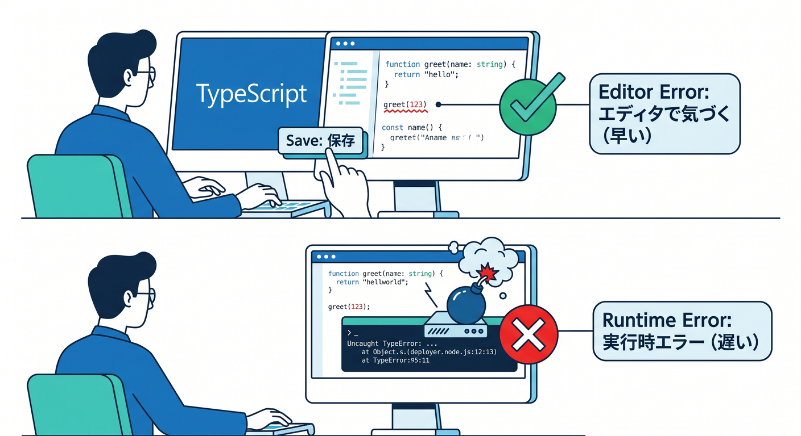
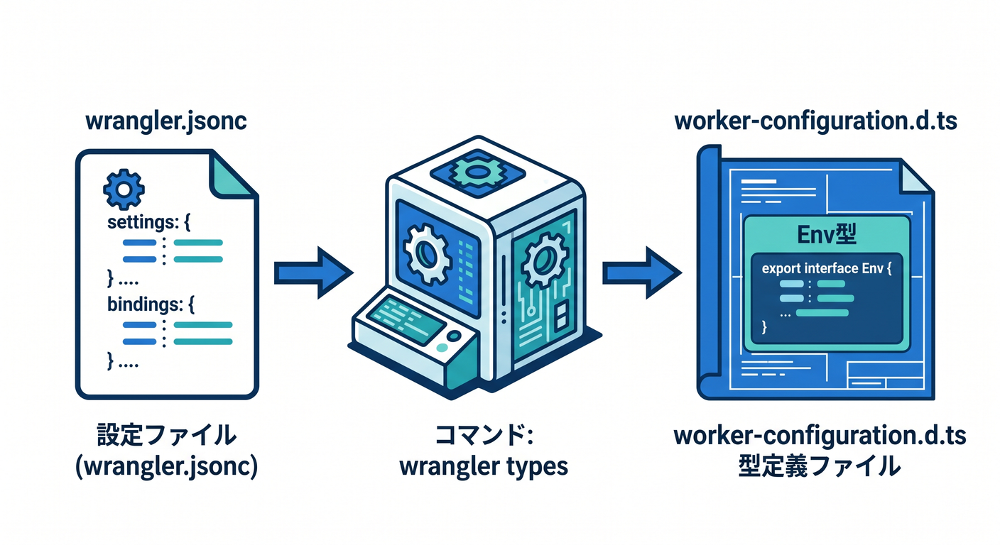
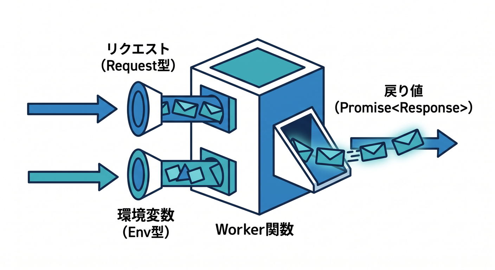
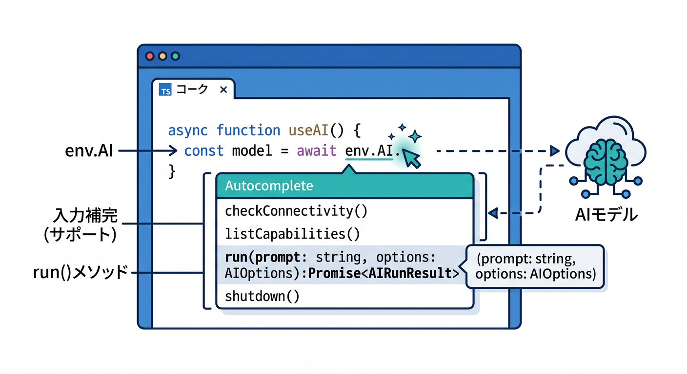

# 第8章　TypeScriptにして、型のありがたさを味わおう 🔷✍️☁️

この章では、これまでの「とりあえず動くWorker」から一歩進んで、**“安心して直せるWorker”** にしていきます 😊
Cloudflare Workers では TypeScript が正式に強くサポートされていて、いまの公式導線では **`wrangler types` で実行環境に合った型を生成する** のが中心です。しかも 2026年1月以降は、`wrangler types` が**全 environment の bindings をまとめて `Env` に含める** 挙動が標準になっていて、以前よりかなり扱いやすくなっています。 ([Cloudflare Docs][1])

この章のゴールは、次の4つです ✨

* TypeScriptを「難しい言語」ではなく、**先にミスを教えてくれる味方**として見られるようになる
* `wrangler types` の役割を理解して、**Cloudflareらしい型の付け方**ができるようになる ([Cloudflare Docs][1])
* `Env` を手で雑に書かず、**設定ファイルから正しく型を作る流れ**に慣れる ([Cloudflare Docs][2])
* Workers AI みたいな Cloudflare のAI機能を使うときも、**型付きで気持ちよく書ける**感覚をつかむ ([Cloudflare Docs][3])

---

## 1. まず、「型」って何がうれしいの？ 🤔💡

TypeScriptは、Cloudflare Workers で**第一級の言語**として扱われています。Cloudflare の runtime API は型付きで提供されていて、その型定義は open-source の Workers runtime である `workerd` から生成されています。つまり、型はおまけではなく、**実行環境そのものにかなり近い情報**です。 ([Cloudflare Docs][1])

初心者目線でいうと、型のありがたさはすごく単純です 🌱
**「動かしてから気づくミス」を、保存した時点で早めに気づける**ことです。
たとえば `env.AI` があるつもりで書いたのに設定していなかった、`request.url` から取りたい値を取り違えた、戻り値の形を勘違いした、みたいなズレを、実行前にかなり減らせます。これは Cloudflare の binding が増えてくるほど効いてきます。 ([Cloudflare Docs][2])



---

## 2. CloudflareのTypeScriptは「実行環境に合わせて型を作る」のが大事です 🧭🔧

ここが普通の TypeScript 学習と少し違うところです 👀
Cloudflare では「型は固定のセットを雑に入れて終わり」ではなく、**あなたの Worker の設定に合わせて型を作る**のがきれいなやり方です。

Cloudflare 公式は、正しい型が次の要素に依存すると説明しています。

* `compatibility_date`
* `compatibility_flags`
* `wrangler` の設定にある bindings
* 必要なら module rules

つまり、**同じ Worker っぽく見えても、設定が違えば正しい型も少し変わる**わけです。だから公式は `@cloudflare/workers-types` を何となく置くより、**`wrangler types` を使って runtime types を生成する方法**を推しています。 ([Cloudflare Docs][1])

さらに 2026年1月からは、`wrangler types` が **全 environment の bindings を集めて `Env` に含める** ようになりました。開発環境・本番環境で binding が少し違うときも、以前より型のズレで困りにくくなっています。 ([Cloudflare Docs][4])

---

## 3. まず見るのは `wrangler.jsonc` です 📘✨

Cloudflare 学習では、設定ファイルを軽く見過ごさないのがすごく大事です。
公式ドキュメントでは、Wrangler の設定ファイルを**Worker設定の source of truth** として扱うことが推奨されています。また、新規プロジェクトでは `wrangler.jsonc` が推奨されていて、いくつかの新しい機能は JSON 設定向けです。 ([Cloudflare Docs][5])

この章では、まず「型はコードだけで完結しない」とつかみましょう 😊
**Cloudflareでは、設定を書き換える → 型を再生成する → コード側の補完や型チェックが更新される**、この流れが基本です。


なので TypeScript の章だけど、主役は `index.ts` だけではありません。`wrangler.jsonc` も主役です 📦☁️ ([Cloudflare Docs][5])

---

## 4. `wrangler types` を実行しよう 🚀🔷

ここがこの章の中心です 🌟
Cloudflare 公式は、Worker の型を生成する方法として `wrangler types` を案内しています。これを実行すると、デフォルトでは `worker-configuration.d.ts` が生成され、そこに **`Env` の型** と **runtime API の型** が入ります。 ([Cloudflare Docs][1])

まずはこんな感じです。

```bash
npx wrangler types
```

ポイントはここです👇

* 生成される `.d.ts` は、**あなたの bindings に対応した `Env`** を含む ([Cloudflare Docs][1])
* `compatibility_date` や flags に応じた **runtime types** も含む ([Cloudflare Docs][1])
* 設定を変えたら、**そのたびに再実行する**のが公式のおすすめです ([Cloudflare Docs][1])

Cloudflare の Best Practices でも、**`Env` を手書きしないこと**、binding を追加・変更したら **`wrangler types` を再実行すること** がはっきり勧められています。 ([Cloudflare Docs][2])

---

## 5. `tsconfig.json` はここだけまず押さえればOK 🧩📄

型を生成しただけでは終わりません。
Cloudflare 公式では、生成された型ファイルを `tsconfig.json` の `compilerOptions.types` に入れるよう案内しています。 ([Cloudflare Docs][1])

最初はこの最小形で大丈夫です 🙆‍♂️

```json
{
  "compilerOptions": {
    "types": ["./worker-configuration.d.ts"]
  }
}
```

もし今後 `nodejs_compat` を使うなら、Cloudflare 公式は `@types/node` の追加も案内しています。これは次章の Node.js 互換の話とつながるので、**今の段階では「必要になったら足す」くらいでOK**です。 ([Cloudflare Docs][1])

---

## 6. JavaScriptのWorkerを、TypeScriptのWorkerへ育てよう 🌱➡️🌳

ここでは、いきなり難しいことはしません。
まずは `src/index.js` を `src/index.ts` にして、**引数と戻り値が読める状態**を作ります。
TypeScript の章なので、凝ったロジックよりも「読める」「怖くない」「間違いに気づける」を優先します 😊

たとえば、こんな形です。

```ts
export default {
  async fetch(request: Request, env: Env): Promise<Response> {
    const url = new URL(request.url)

    if (url.pathname === "/") {
      return new Response("Hello TypeScript Worker! 🔷")
    }

    if (url.pathname === "/json") {
      return Response.json({
        message: "TypeScriptで返しています ✨",
        path: url.pathname
      })
    }

    return new Response("Not Found", { status: 404 })
  }
}
```

このコードで見てほしいのは3点です ✍️

* `request: Request` で、受け取るものの形がわかる
* `env: Env` で、binding の入口がわかる
* `Promise<Response>` で、返すものがはっきりする



Cloudflare 公式が勧めている流れに乗ると、この `Env` は **設定から生成された正しい型**になるので、あとで KV、R2、D1、AI などを足しても、そのまま育てやすいです。 ([Cloudflare Docs][2])

---

## 7. `Env` は自分で書かないほうがいいです 🙅‍♂️📝

昔のサンプルや古い記事を見ると、こういうのを見かけることがあります。

```ts
interface Env {
  AI: any
  MY_KV: any
}
```

でも、今の Cloudflare 公式の考え方では、これはおすすめしにくいです 😅
Best Practices では、**`Env` は手書きせず `wrangler types` で生成する**よう明記されています。理由は単純で、設定とコードがズレるからです。設定では `MY_BUCKET` なのに、コードでは `MY_R2` と書いても、手書き型だと気づけないことがあります。 ([Cloudflare Docs][2])


なので、この章では次の感覚を身につけましょう 🌟

* binding の名前は **`wrangler.jsonc` に書く**
* 型は **`wrangler types` で作る**
* コードでは **生成済み `Env` を使う**

この順番です。
**“設定が本体、型はそこから生える”** と覚えると、Cloudflare の学習がかなりスムーズになります。 ([Cloudflare Docs][5])

---

## 8. Workers AI でも型はちゃんと効きます 🤖☁️✨

Cloudflare のAI機能も、この章で少し触れておくと楽しいです 😊
Workers AI を Worker から使うには、**AI binding を作る**必要があります。これは dashboard でも Wrangler 設定でも作れます。Wrangler で binding を追加したら、TypeScript を使っている場合は **`wrangler types` を再実行**するよう公式に案内されています。 ([Cloudflare Docs][3])

設定はこんな感じです。

```json
{
  "ai": {
    "binding": "AI"
  }
}
```

この設定を入れると、Worker コードでは `env.AI` として使えます。Cloudflare の AI Gateway ドキュメントでも、`env.AI.run()` を使う TypeScript 例が案内されています。 ([Cloudflare Docs][6])

たとえば、型付きで最小のAI呼び出しを書くとこんなイメージです。

```ts
export default {
  async fetch(request: Request, env: Env): Promise<Response> {
    const result = await env.AI.run(
      "@cf/meta/llama-3.1-8b-instruct",
      {
        prompt: "Cloudflare Workers を初心者向けに一言で説明して"
      }
    )

    return Response.json(result)
  }
}
```

さらに AI Gateway を組み合わせると、Cloudflare 公式は **分析・キャッシュ・セキュリティ目的で使える** と説明していて、binding 経由なら `env.AI.run()` の第3引数で `gateway` を指定できます。 `env.AI.aiGatewayLogId` で直近ログIDも取れます。 ([Cloudflare Docs][7])

つまりこの章では、**型は「普通のWorkerのため」だけでなく、CloudflareのAI機能を安全に使うためにも役立つ**、ここまで感じられれば十分です 🤖🔷☁️



---

## 9. Copilotは「説明役」と「型エラー整理役」にするとかなり相性がいいです 🤝✨

GitHub Copilot の公式ドキュメントでは、**agent mode** は「具体的なタスクがあり、自律的に編集させたいとき」に向いているとされています。IDE内で Copilot が変更対象ファイルや必要なコマンドを判断し、修正を反復していく使い方です。 ([GitHub Docs][8])

ただ、この章のおすすめは最初から全部任せることではありません 🙌
まずは **説明させる・比較させる・1個ずつ直させる** 使い方がやさしいです。

VSCode の Copilot Chat で、こんな聞き方が相性いいです 💬

* 「この `fetch(request: Request, env: Env): Promise<Response>` を初心者向けに分解して説明して」
* 「`wrangler.jsonc` を見て、この Worker で生成される `Env` に何が入りそうか説明して」
* 「型エラーを一度に全部直さず、1個ずつ原因と修正案を出して」
* 「`any` を使わずに、この Worker を Cloudflare 流に直して」


さらに GitHub 公式では、agent mode は **MCP と組み合わせると外部リソースやツールにアクセスでき、より強力になる** と説明しています。とはいえ学習初期は、まずローカルのコード理解に集中するほうが混乱しにくいです。MCP は「将来、調査や複数ツール連携をさせるときに強い」くらいで覚えておけば十分です。 ([GitHub Docs][9])

---

## 10. この章でよくあるつまずき 😵‍💫🛠️

## つまずき① `Env` が見つからない

だいたい次のどちらかです。

* `wrangler types` をまだ実行していない
* `tsconfig.json` の `types` に生成ファイルを入れていない

ここは Cloudflare 公式どおりに直すのが最短です。 ([Cloudflare Docs][1])

## つまずき② binding を追加したのに補完されない

たとえば `wrangler.jsonc` に AI や KV を追加したあと、型が変わっていないときですね。
この場合は **設定を変えたあとに `wrangler types` を再実行**します。Cloudflare 公式の Best Practices でも、この再生成が勧められています。 ([Cloudflare Docs][2])

## つまずき③ 古い記事を見て `@cloudflare/workers-types` をそのまま入れてしまう

今も package 自体は公開されていますが、Cloudflare 公式は**Worker 本体の runtime types には `wrangler types` を使うことを推奨**しています。 `@cloudflare/workers-types` はライブラリや共有パッケージ向けとして残っています。 ([Cloudflare Docs][1])

---

## 11. この章のミニ演習 🎓💪

## 演習1　`/json` を型付きで返す

`index.ts` に `/json` ルートを作り、次の形の JSON を返してください。

* `message`
* `chapter`
* `ok`

`Promise<Response>` を明示してみましょう 🔷

## 演習2　AI binding を追加してみる

`wrangler.jsonc` に AI binding を追加し、`wrangler types` を再実行してください。
そのあと `env.AI` がコード上で扱えるか確認してみましょう 🤖
binding を追加したら型を再生成する、という流れそのものが練習です。 ([Cloudflare Docs][3])

## 演習3　Copilotに説明させる

Copilot Chat に次のように聞いてみてください。

* 「この Worker の型注釈がない版とある版の違いを説明して」
* 「`Env` を手書きしないほうがいい理由を説明して」
* 「binding を1個追加した前提で、必要な作業手順を順番に出して」

---

## 12. この章の成果物 🎁✨

この章が終わった時点で、手元にはこんなものが残っていれば成功です 🙌

* `src/index.ts` で動く、型付きの小さな Worker
* `worker-configuration.d.ts` を生成する流れ
* `tsconfig.json` に型ファイルをつなぐ最小設定
* `wrangler.jsonc` を見て「設定 → 型 → コード」のつながりがわかる感覚
* `env.AI` のような Cloudflare の binding も、**型があると怖くない**という実感

---

## まとめ 🌈🔷

この章のいちばん大事な一言はこれです。

**CloudflareのTypeScriptは、手で型を書くというより、設定から正しい型を育てるもの**です。 ([Cloudflare Docs][5])

`wrangler types` を回す
↓
`Env` と runtime types がそろう
↓
コードが読みやすくなる
↓
AI binding や他の binding も扱いやすくなる
↓
Copilot とも会話しやすくなる

この流れが見えたら、第8章はかなり成功です 🎉☁️🤖🔷

次の第9章では、この型付き Worker を土台にして、**「Node.jsっぽく書ける範囲」と「Workersならではの違い」**へつなぐと、とてもきれいです。

[1]: https://developers.cloudflare.com/workers/languages/typescript/ "Write Cloudflare Workers in TypeScript · Cloudflare Workers docs"
[2]: https://developers.cloudflare.com/workers/best-practices/workers-best-practices/ "Workers Best Practices · Cloudflare Workers docs"
[3]: https://developers.cloudflare.com/workers-ai/configuration/bindings/ "Workers Bindings · Cloudflare Workers AI docs"
[4]: https://developers.cloudflare.com/changelog/post/2026-01-13-wrangler-types-multi-environment/ "`wrangler types` now generates types for all environments · Changelog"
[5]: https://developers.cloudflare.com/workers/wrangler/configuration/ "Configuration - Wrangler · Cloudflare Workers docs"
[6]: https://developers.cloudflare.com/ai-gateway/integrations/worker-binding-methods/ "AI Gateway Binding Methods · Cloudflare AI Gateway docs"
[7]: https://developers.cloudflare.com/ai-gateway/usage/providers/workersai/ "Workers AI · Cloudflare AI Gateway docs"
[8]: https://docs.github.com/copilot/using-github-copilot/asking-github-copilot-questions-in-your-ide "Asking GitHub Copilot questions in your IDE - GitHub Docs"
[9]: https://docs.github.com/en/copilot/tutorials/enhance-agent-mode-with-mcp "Enhancing GitHub Copilot agent mode with MCP - GitHub Docs"
