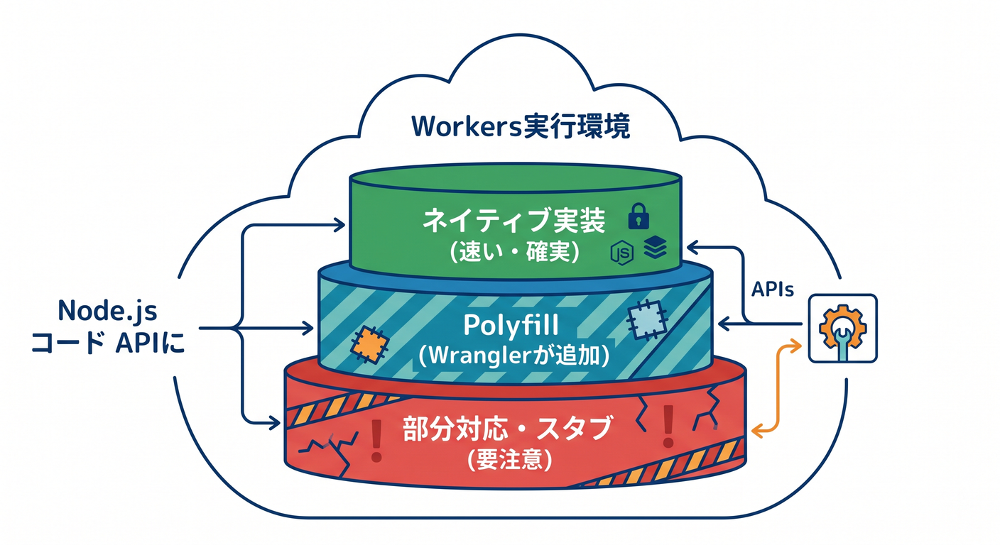
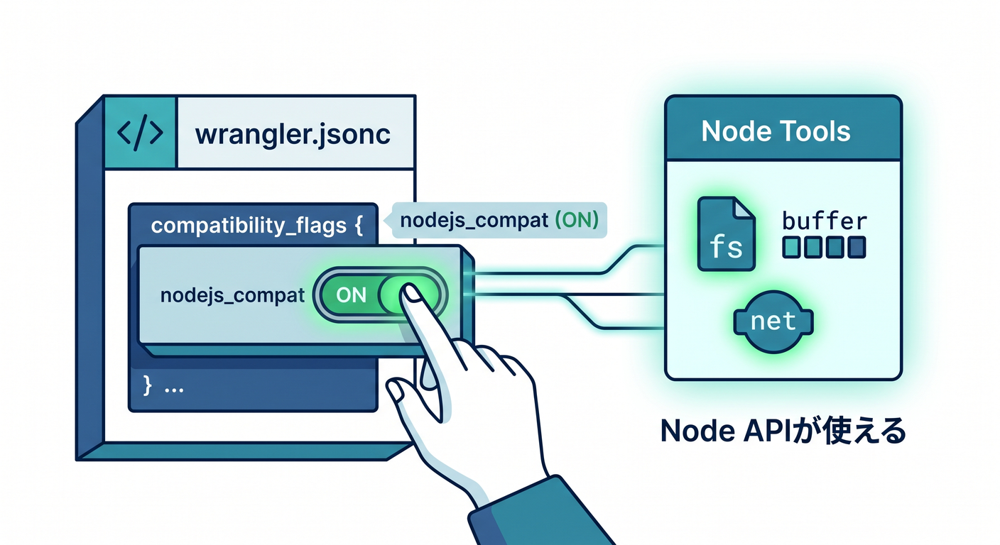
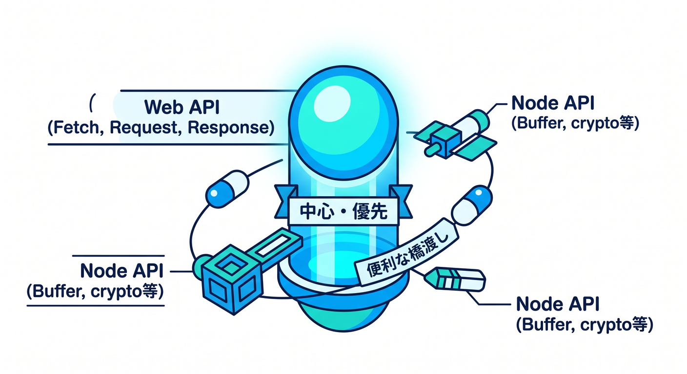
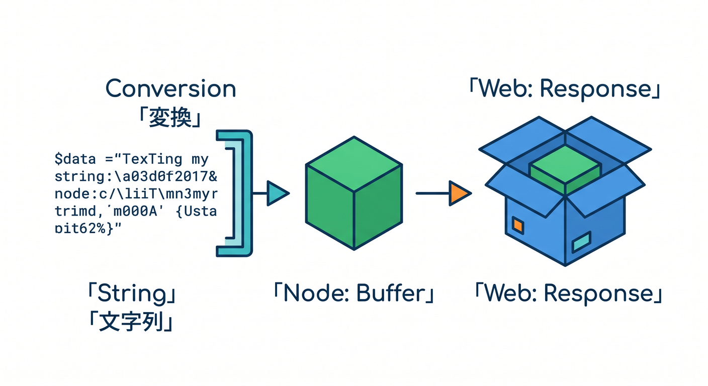
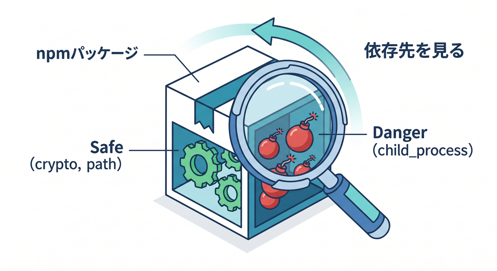
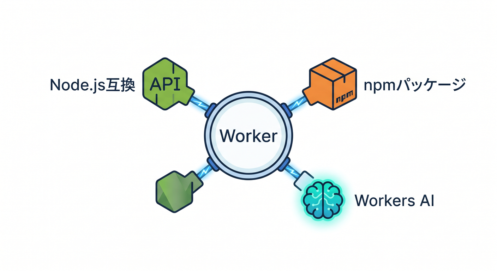

# 第9章　Node.jsっぽく書ける範囲を知ろう 🟢🧰

この章では、**Cloudflare Workers は Node.js ではないけれど、かなり Node.js っぽく書ける**、その“ちょうどいい距離感”をつかみます 😊
2026-04-15 時点のCloudflare公式では、Workers の Node.js 互換は `nodejs_compat` を中心にかなり強化されていますが、**全部が完全に同じ**ではなく、**ネイティブ実装・polyfill・部分対応**が混ざっています。ここを最初に理解しておくと、あとで npm パッケージを入れたときに「え、import できたのに動かない 😵」をかなり減らせます。 ([Cloudflare Docs][1])

この章のゴールは3つです 🌟

* `nodejs_compat` の役割を自分の言葉で説明できる
* 「使えそうな Node API」と「慎重に見るべき API」をざっくり見分けられる
* Workers AI や Copilot と組み合わせて、**今どきの Cloudflare 学習の進め方**がわかる

---

## 1. まず結論！Workers は「Node.jsそのもの」ではないよ ☁️🟢

Cloudflare公式の整理だと、Workers の Node.js 互換は大きく2種類あります。
1つ目は **Workers runtime によるネイティブ実装**、2つ目は **Wrangler が追加する polyfill** です。しかも一部には **部分対応** や **実用不可のスタブ** もあります。つまり、**`import` できた = 完全対応** ではありません。ここがこの章の最重要ポイントです 📌 ([Cloudflare Docs][1])



さらに 2026 時点の公式では、`nodejs_compat` は **自動でデフォルト化される予定ではない** と明記されています。なので、「そのうち勝手に Node っぽくなるでしょ」とは考えず、**必要なら自分で明示的に有効化する** クセをつけるのが大事です 👍
また、`compatibility_date` が 2024-09-23 以降なら `nodejs_compat` は `nodejs_compat_v2` も有効化し、追加の polyfill や globals によって互換性が上がります。ただし、そのぶん **bundle size は増えます**。初心者のうちはまず互換性優先でOKです。 ([Cloudflare Docs][2])

---

## 2. 最初に入れる設定はこれだけでOK ✍️✨

まずは `wrangler.jsonc` に、**今日の日付の `compatibility_date`** と `nodejs_compat` を入れます。Cloudflare公式でも、Node互換を有効にする基本形はこれです。 ([Cloudflare Docs][1])

```jsonc
{
  "compatibility_date": "2026-04-15",
  "compatibility_flags": ["nodejs_compat"]
}
```

この章では、まず **「Node互換をONにした Workers」** を土台にして考えます 😊
細かいフラグ地獄に入るのはまだ早いので、最初は **`nodejs_compat` を入れたら、Node系の道具がかなり使いやすくなる** くらいの理解で十分です。 ([Cloudflare Docs][1])



---

## 3. 何が使いやすくて、何に注意するの？ 🤔🧪

ざっくり言うと、今の Workers では次の感覚で覚えるのがわかりやすいです。

* **触りやすい代表**は `Buffer`、`crypto`、`process`、`fs`、`http/https`、`net`、`streams` あたりです。Cloudflare公式の Node API 一覧でも、かなりの範囲がネイティブ対応として並んでいます。
* **要注意**なのは `async_hooks`、`child_process`、`cluster`、`console` の一部です。公式一覧では「partially supported」や「non-functional」と書かれているものがあり、授業用サンプルでが安全です。 ([Cloudflare Docs][3])
* **Streams は Node流儀でも書けるけど、可能なら Web Streams を優先**、というのが公式の考え方です。Workers は Web 標準との相性がとても良いので、迷ったら `fetch` / `Request` / `Response` / `ReadableStream` 側へ寄([Cloudflare Docs][4])

ここ、初心者さん向けに言い換えるとこうです 🌱
**「Nodeの知識は活かせる。でも、頭の中心は Web API に置く」** です。



このバランス感覚があると、Cloudflare学習がかなりスムーズになります。

---

## 4. まずは `Buffer` を触って「Nodeっぽさ」を体感しよう 📦💚

Cloudflare公式でも `Buffer` は代表的な対応APIとして案内されています。`Buffer` は `Uint8Array` を拡張したもので、Workers の `Response` にそのまま渡せます。つまり、「Nodeっぽいバイナリ処理」をしつつ、返す先はちゃんと Web の `Response` です。こ([Cloudflare Docs][5])

```ts
import { Buffer } from "node:buffer";

export default {
  async fetch(): Promise<Response> {
    const message = "Hello from Buffer on Workers! 👋";
    const body = Buffer.from(message, "utf8");

    return new Response(body, {
      headers: {
        "content-type": "text/plain; charset=utf-8",
      },
    });
  },
} satisfies ExportedHandler;
```

このコードの見どころは、**Nodeの `Buffer` を使っているのに、出口は Workers の `Response`** になっているところです ✨
「Nodeっぽく書ける」けれど、最終的には **Cloudflare Workers の世界観で返す**。これが第9章で([Cloudflare Docs][5])



---

## 5. 最近の互換はかなり進んでいるよ 🚀

2026時点では、`nodejs_compat` を有効にした上で **`compatibility_date` が一定以上なら**、`http.get` / `http.request` 系や `node:fs` もかなり使いやすくなっています。Cloudflare公式では、`http` クライアント系は 2025-08-15 以降、`http` サーバー系と `node:fs` は 2025-09-01 以降で自動有効化され([Cloudflare Docs][6])

ただし、この教材ではあえてここで **Nodeサーバー流儀に全振りしません** 🙌
理由はシンプルで、Workers 学習の芯はやっぱり `fetch()` だからです。
Node互換は「便利な橋渡し」として使い、中心の考え方は **Web 標準 + Workers** に置くほうが、あとで D1・R2・AI・Durable Objects に進むときもキレイにつながります。Streams も同じで、Cloudflare公式は可能なら Web Stre([Cloudflare Docs][7])

---

## 6. npm パッケージを入れるときの見方 👀📦

この章で学んでほしい実践感覚は、**「そのパッケージは何に依存してる？」を見ること** です。
Cloudflare公式の説明どおり、npm パッケージの中には Node runtime API を前提にしているものが多く、Workers では `nodejs_compat` がないと動きにくいものがあります。しかも、polyfill だけのものは **呼び出すとエラー**([Cloudflare Docs][1])

初心者の段階では、こんな判断で十分です 😊

* `Buffer`、`crypto`、`stream`、`path`、`process` あたり中心なら試しやすい
* `child_process` や `cluster` が前提ならかなり警戒する
* 動かなかったら「Cloudflareがダメ」ではなく、**その依存が Workers 向きではない** かも？と考える



この視点があるだけで、npm での迷子がかなり減ります 🌈

---

## 7. AIもちゃんと今どき流でつなげよう 🤖☁️

CloudflareのAI連携は、今は **native binding を使う形が本筋** です。公式の Workers AI ガイドでは、Wrangler に AI binding を設定すると、コード側では `env.AI` として使えます。Workers AI 自体は **Free / Paid の両プランで利用可能** で、Workers・Pages([Cloudflare Docs][8])

また、古い記事で見かけやすい `@cloudflare/ai` パッケージは、Cloudflare公式の changelog で **deprecated** とされています。新しい機能は native binding 側が中心なので、教材でも **`env.AI.run(...)` を標準ルート** として教えるのがきれいです。さらに JavaScript / TypeScript 系では、Cloudflare公式が **Vercel AI SDK と `workers-ai-provider`** の組み合わせも案内しています。React や Next 系へ軽く伸ばす([Cloudflare Docs][9])

たとえば、この章の小さな発展版としてはこんなコードが書けます ✨

```ts
export interface Env {
  AI: Ai;
}

export default {
  async fetch(_request: Request, env: Env): Promise<Response> {
    const result = await env.AI.run("@cf/meta/llama-3.1-8b-instruct", {
      prompt: "Node.js compatibility を初心者向けに一言で説明して",
    });

    return new Response(JSON.stringify(result), {
      headers: {
        "content-type": "application/json; charset=utf-8",
      },
    });
  },
} satisfies ExportedHandler<Env>;
```

ここで大事なのは、「Node.js互換を使う章」でも **AIの入口はもう同じ Worker の中にある** ということです 🌟
つまり、**Buffer も使える、npm も試せる、AI も呼べる**。この“全部が同じ Worker に集まる感じ”が、今のCloud([Cloudflare Docs][8])



ひとつ注意もあります ⚠️
Cloudflare公式では、**Workers AI はローカル開発中でも Cloudflare アカウントにアクセスして推論を実行するため、`wrangler dev` 中でも課金対象になる** と案内されています。AI を混ぜた演習では、無限リロードや連打にちょっ([Cloudflare Docs][8])

---

## 8. Copilot はこの章だとこう使うと強い 🤝💡

GitHub公式では、Copilot の最新機能をしっかり使うには **最新安定版の IDE と Copilot 拡張** を推奨しています。さらに最新の VS Code 系では、**Agent mode** や **MCP** も広くサポートされています。Cloudflareみたいに「設定」「互換」「ライブラリ相性」の判断が多い学習では、この流れ([GitHub Docs][10])

VS Code では、Copilot は単なる補完だけではなく、**エージェントとしてファイル編集・コマンド実行・自己修正まで進める** 形に広がっています。公式ドキュメントでも、エージェントはローカル、背景実行、クラウドなど複数の動かし方があり、Windows では Chat view を **`Ctrl` + `Alt` + ([Visual Studio Code][11])

この章でのおすすめの使い方は、**書かせる前に、まず調べさせる** です 🔍
たとえばこんな聞き方がとても相性いいです。

* 「この npm パッケージは Cloudflare Workers で動きそう？ Node API 依存を見て」
* 「`nodejs_compat` 前提で、このコードを Workers 向けに直して」
* 「`@cloudflare/ai` を使っている古い例を、`env.AI.run` へ置き換えて」
* 「この Node Streams の例を Web Streams 寄りに書き換えて」

こういう問いは、**Node.js互換の境界線を学ぶ**のにぴったりです 😊

もう一歩進むなら、VS Code から **Copilot cloud agent** へ仕事を委譲するやり方もあります。公式では、チャットからタスクを delegate すると、追加のコンテキストやファイル参照が引き継がれ、クラウド側で進捗を見ながら PR 形式で追えるようになっています。大きめの整理や「このライブラリの互換チェックをまとめてやって」([Visual Studio Code][12])

---

## 9. この章の演習課題 🧩🎓

## 演習1　`Buffer` を使って返してみよう

`node:buffer` を import して、文字列を `Buffer` 化して返す Worker を作ってみましょう。
できたら、普通の文字列をそのまま返す版と比べて、「Nodeっぽい道具を使っても返し方は `Response` なんだな」と確認します。

## 演習2　使えるか怪しいAPIを調べてみよう

Copilot Chat に、
「`child_process` を使う npm パッケージは Workers で相性が悪い理由を説明して」
と聞いてみましょう。
そのあと公式の Node.js compatibility 一覧も見て、**AIの説明と一次情報を照合する習慣**をつけます。

## 演習3　AI binding を足してみよう

`env.AI.run()` で1回だけ推論を返す小さな Worker を作ってみましょう。
「Node.js互換の章なのにAIまで入るんだ！」と体感できたら大成功です 🤖✨

---

## 10. まとめ 🌈

この章でいちばん大事なのは、**Workers は Node.js をかなり取り込んでいるけれど、学び方の中心はあくまで Workers / Web 標準に置く** という感覚です。Cloudflare公式でも、Node互換は `nodejs_compat` と `compatibility_date` を軸に進化しており、対応APIは増えていますが、部分対応や polyfill もあるため、**「Nodeそのまま」だと思い込まな([Cloudflare Docs][1])

そして 2026 の今は、そこに **Workers AI の native binding** と **Copilot / Agent / MCP** が自然につながります。
つまり第9章は、単なる「Node互換の注意点」の章ではなく、**Cloudflare開発を現代的に進めるための橋渡しの([Cloudflare Docs][8])

次に進む第10章では、この流れを受けて **`wrangler.jsonc` と bindings をちゃんと読めるようになる** と、理解が一気に立体的になります 📘✨

必要なら続けて、このまま同じ文体・粒度で
**「第10章　`wrangler.jsonc` と bindings を読めるようになろう 🧭📘」**

もそのまま作れます。

[1]: https://developers.cloudflare.com/workers/runtime-apis/nodejs/ "Node.js compatibility · Cloudflare Workers docs"
[2]: https://developers.cloudflare.com/workers/configuration/compatibility-flags/ "Compatibility flags · Cloudflare Workers docs"
[3]: https://developers.cloudflare.com/workers/runtime-apis/nodejs/?utm_source=chatgpt.com "Node.js compatibility · Cloudflare Workers docs"
[4]: https://developers.cloudflare.com/workers/runtime-apis/nodejs/streams/?utm_source=chatgpt.com "Streams - Node.js APIs · Cloudflare Workers docs"
[5]: https://developers.cloudflare.com/workers/runtime-apis/nodejs/buffer/ "Buffer · Cloudflare Workers docs"
[6]: https://developers.cloudflare.com/workers/runtime-apis/nodejs/http/ "http · Cloudflare Workers docs"
[7]: https://developers.cloudflare.com/workers/runtime-apis/nodejs/streams/ "Streams - Node.js APIs · Cloudflare Workers docs"
[8]: https://developers.cloudflare.com/workers-ai/get-started/workers-wrangler/ "Get started - Workers and Wrangler · Cloudflare Workers AI docs"
[9]: https://developers.cloudflare.com/workers-ai/changelog/ "Changelog · Cloudflare Workers AI docs"
[10]: https://docs.github.com/en/copilot/reference/copilot-feature-matrix "Copilot feature matrix - GitHub Docs"
[11]: https://code.visualstudio.com/docs/copilot/overview "GitHub Copilot in VS Code"
[12]: https://code.visualstudio.com/docs/copilot/copilot-coding-agent "GitHub Copilot cloud agent"
