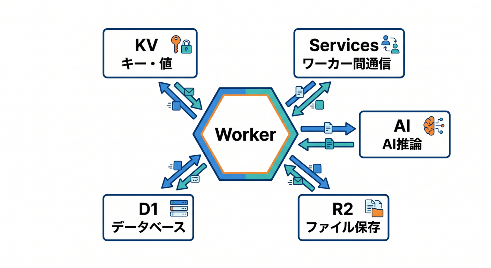
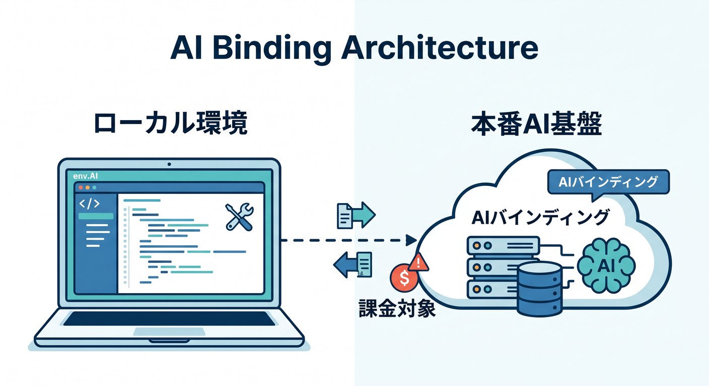
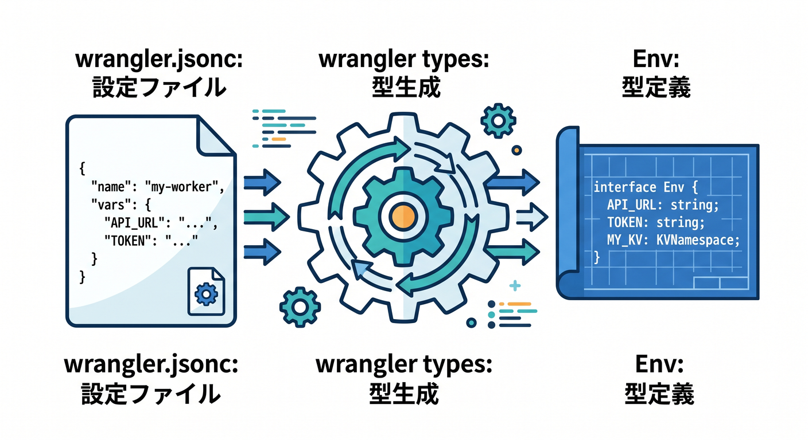
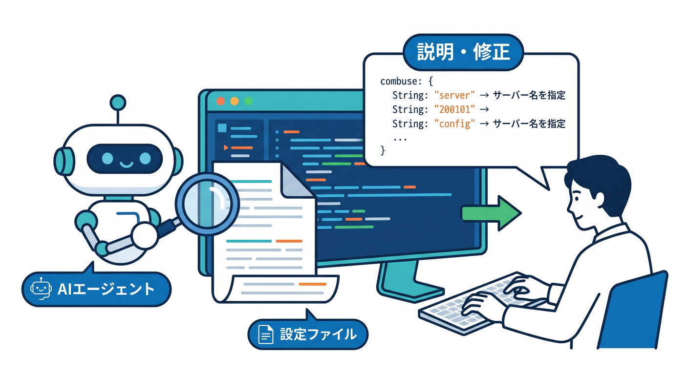
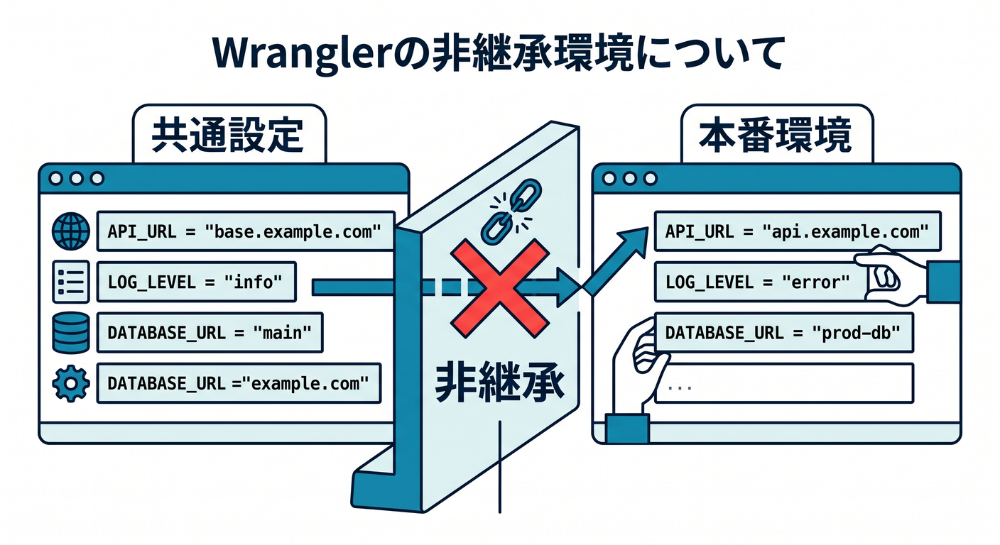

# 第10章　`wrangler.jsonc` と bindings を読めるようになろう 🧭📘✨

この章では、Cloudflare開発でかなり重要な `wrangler.jsonc` を、**「見た瞬間に固まる設定ファイル」から「だいたい意味が読める地図」へ変える**のが目標です 😊
本日時点の公式情報では、Wrangler は `wrangler.json` / `wrangler.jsonc` と `wrangler.toml` の両方に対応していますが、**新規プロジェクトでは `wrangler.jsonc` が推奨**されていて、しかも一部の新しい機能は JSON 設定を前提にしています。さらに Cloudflare は Wrangler 設定ファイルを、Worker の設定における **source of truth** として扱うのがベストプラクティスだと案内しています。 ([Cloudflare Docs][1])

この章でいちばん大事なのは、次の感覚です 🌱
**「コードは `src/index.ts` などに書く」「Cloudflare との接続は `wrangler.jsonc` に書く」**。
たとえば KV、R2、D1、Workers AI、Service bindings などは、コード側でいきなり使えるわけではなく、まず `wrangler.jsonc` で binding を宣言し、そのあとコードでは `env.XXX` として触ります。Cloudflare の公式ドキュメントでも、bindings は Worker が各種 Cloudflare リソースとやり取りするための窓口で、`env` オブジェクトからアクセスする形として整理されています。 ([Cloudflare Docs][2])

---

## 1. まず `wrangler.jsonc` を“設定の本体”として見る 👀📂

まず最初に、`wrangler.jsonc` は「おまけの設定」ではありません。
**Worker の名前、入口ファイル、互換性の日付、各種 binding、環境ごとの差分**まで、かなり多くの大事なことがここに集まります。公式のサンプルでも、`$schema`、`name`、`main`、`compatibility_date`、`kv_namespaces`、`env` などが最初から並んでいます。 ([Cloudflare Docs][1])

特にこの章では、次の4つを読めるようになるとかなり強いです 💪✨

1. `name` … Worker の名前
2. `main` … 実行入口のファイル
3. `compatibility_date` … どの互換性ルールで動かすか
4. binding 系の設定 … KV / R2 / D1 / AI / Services / vars など

Cloudflare 公式では、**少なくとも `name`、`main`、`compatibility_date` はデプロイに必要**とされています。 ([Cloudflare Docs][1])

---

## 2. まずは最小構成を読もう 🌟

こんな形が、かなり基本形です。
説明のために少しだけシンプル化した例です。

```json
{
  "$schema": "./node_modules/wrangler/config-schema.json",
  "name": "hello-worker",
  "main": "src/index.ts",
  "compatibility_date": "2026-04-15"
}
```

この4行の見方はこうです 😊

`$schema` は、VS Code で補完や警告を効きやすくするための道しるべです。
`name` は Worker 名です。
`main` は実際に動く入口ファイルです。
`compatibility_date` は、「その時点の Workers ランタイム仕様で動かす」という約束のようなものです。Cloudflare 公式サンプルでもこの並びが中心で、`name`・`main`・`compatibility_date` は必須扱いです。 ([Cloudflare Docs][1])

ここで初心者さんがやりがちなのが、**「Cloudflare の設定なのに、なぜコードのファイルパスまでここにあるの？」**と混乱することです 😵‍💫
でも考え方は単純で、`main` は「どのコードを動かすか」、bindings は「そのコードが何に接続できるか」です。
つまり `wrangler.jsonc` は、**Worker の実行条件をまとめる場所**なんですね。 ([Cloudflare Docs][1])

---

## 3. binding って何？をやさしく理解しよう 🔌☁️

binding は、ひとことで言うと **「Worker に外部リソースへの正式な入口を渡す仕組み」** です。
Cloudflare の公式では、bindings は Worker が Cloudflare Developer Platform の各種リソースとやり取りするための仕組みで、REST API を直接たたくより性能面や制約面で有利だと説明されています。 ([Cloudflare Docs][2])

たとえばこんな感じです 🌈

* `env.MY_KV` → KV に触る
* `env.MY_BUCKET` → R2 に触る
* `env.DB` → D1 に触る
* `env.AI` → Workers AI に触る
* `env.AUTH_SERVICE` → 別の Worker に触る

つまり、**binding 名 = コードの中で使う名前**です。
Cloudflare 側のリソースそのものの名前と、コード内での binding 名は似ていることが多いですが、役割は別です。設定ファイルで「この resource を、この名前で `env` に出す」と決めているイメージです。 ([Cloudflare Docs][1])

---

## 4. `vars` は“ただの文字列設定”の入口 📝

まず一番やさしい binding は `vars` です。
`vars` は Worker に文字列や JSON 値を渡すための環境変数系の設定です。Cloudflare 公式でも、environment variables は text strings や JSON values を Worker に付与する binding として説明されています。 ([Cloudflare Docs][1])

たとえばこんな感じです。

```json
{
  "$schema": "./node_modules/wrangler/config-schema.json",
  "name": "my-worker",
  "main": "src/index.ts",
  "compatibility_date": "2026-04-15",
  "vars": {
    "APP_NAME": "My First Worker App",
    "FEATURE_FLAG": "on",
    "SITE_INFO": {
      "title": "Cloudflare Study",
      "version": 1
    }
  }
}
```

コード側では、こんなふうに読めます。

```ts
export default {
  async fetch(request: Request, env: Env): Promise<Response> {
    return Response.json({
      appName: env.APP_NAME,
      featureFlag: env.FEATURE_FLAG,
      siteTitle: env.SITE_INFO.title
    });
  }
} satisfies ExportedHandler<Env>;
```

ここで超大事なのは、**`vars` は便利だけど秘密情報は入れない**ことです 🔐
Cloudflare 公式も、`vars` に sensitive information を保存しないよう注意しています。秘密情報は secrets を使う流れで、そこは次章の主役です。 ([Cloudflare Docs][1])

---

## 5. `env` は“環境ごとの差分置き場” 🌍🔀

Cloudflare では 1つの Worker に対して、`staging` や `production` のような **複数環境**を持たせられます。
そのとき使うのが `env` です。公式では、Wrangler environments によって同じ Worker に対して環境別の設定を書けると案内されています。 ([Cloudflare Docs][3])

たとえばこんな感じです。

```json
{
  "$schema": "./node_modules/wrangler/config-schema.json",
  "name": "my-worker",
  "main": "src/index.ts",
  "compatibility_date": "2026-04-15",
  "vars": {
    "API_HOST": "api.example.com"
  },
  "env": {
    "staging": {
      "vars": {
        "API_HOST": "staging.example.com"
      }
    },
    "production": {
      "vars": {
        "API_HOST": "production.example.com"
      }
    }
  }
}
```

ここでハマりやすい落とし穴があります 😱
**bindings と `vars` は non-inheritable、つまり環境へ自動継承されません。**
Cloudflare 公式でも、`vars` や `kv_namespaces` などの bindings は非継承で、環境ごとに明示が必要だとかなりはっきり書かれています。
なので「トップレベルに書いたから production でも使えるでしょ？」は危険です。 ([Cloudflare Docs][4])

この章では、ここをこう覚えるとラクです 🧠✨
**トップレベル = 基本形**
**`env.staging` / `env.production` = 差し替え版**
ただし、**binding 系は“差し替え”ではなく“書き直し”寄り**、という感覚です。 ([Cloudflare Docs][3])

---

## 6. 代表 binding をざっくり読めるようになろう 🪣🗃️🧠🤖

Cloudflare の bindings はかなり多いですが、この章ではまず代表格だけ読めれば十分です。


公式一覧でも AI、D1、Durable Objects、KV、R2、Secrets、Service bindings などが並んでいます。 ([Cloudflare Docs][2])

## KV の例

```json
{
  "kv_namespaces": [
    {
      "binding": "MY_KV",
      "id": "xxxxxxxxxxxxxxxxxxxxxxxxxxxxxxxx"
    }
  ]
}
```

KV は「キーと値」で軽いデータを持つときの定番です。設定では `binding` と `id` を見ればOKです。公式例でも `kv_namespaces` 配列の各要素に `binding` と `id` を置く形です。 ([Cloudflare Docs][1])

## D1 の例

```json
{
  "d1_databases": [
    {
      "binding": "DB",
      "database_name": "my-app-db",
      "database_id": "xxxxxxxx-xxxx-xxxx-xxxx-xxxxxxxxxxxx"
    }
  ]
}
```

D1 は Cloudflare のサーバーレス DB です。設定では `binding`、`database_name`、`database_id` を見ます。公式サンプルもこの形です。 ([Cloudflare Docs][1])

## R2 の例

```json
{
  "r2_buckets": [
    {
      "binding": "FILES",
      "bucket_name": "my-app-files"
    }
  ]
}
```

R2 はファイルや画像などのオブジェクト保存でよく使います。設定では `binding` と `bucket_name` が基本です。 ([Cloudflare Docs][1])

## Service binding の例

```json
{
  "services": [
    {
      "binding": "AUTH_SERVICE",
      "service": "auth-worker"
    }
  ]
}
```

Service bindings は、**ある Worker から別の Worker を呼ぶ仕組み**です。公開 URL を経由せずに呼べて、公式では RPC と HTTP の2通りが案内されています。
小さく分けた Worker 同士をつなぐときに便利です。 ([Cloudflare Docs][5])

---

## 7. Workers AI binding はこの章で絶対触れておきたい 🤖✨

この教材では Cloudflare の AI サービスも大事な柱なので、第10章でも **Workers AI binding** はしっかり触れておきます。
Cloudflare 公式では、Workers AI は Cloudflare ネットワーク上のモデルを Workers や Pages、REST API から使える仕組みとして整理されています。Workers から使う場合は、まず AI binding を作ります。 ([Cloudflare Docs][6])

設定はこんな形です。

```json
{
  "ai": {
    "binding": "AI"
  }
}
```

するとコードでは `env.AI` で使えます。

```ts
export default {
  async fetch(request: Request, env: Env): Promise<Response> {
    const result = await env.AI.run(
      "@cf/meta/llama-3.1-8b-instruct",
      { prompt: "Cloudflare Workers を一言で説明して" }
    );

    return Response.json(result);
  }
} satisfies ExportedHandler<Env>;
```

ここで最新の実務感として覚えておきたいのは2つです ⚠️
1つ目は、**AI binding は1 Worker project につき1つ**という点です。
2つ目は、**Workers AI はローカル開発中でも実際には Cloudflare 側へアクセスするため、料金が発生しうる**という点です。さらに local development の公式ガイドでも、AI bindings にはローカルシミュレーションがなく、実質リモート接続前提として扱われています。 ([Cloudflare Docs][1])

なので初心者向けには、こう教えるのが親切です 😊


**「`env.AI` はただのオブジェクトではなく、Cloudflare の AI 実行基盤への正式な入口」**
この理解があると、第15章の Workers AI や AI Gateway がすごく入りやすくなります。さらに AI Gateway 側の公式ドキュメントでも、Workers AI は AI Gateway と binding ベースで組み合わせられると案内されています。 ([Cloudflare Docs][7])

---

## 8. TypeScript では `Env` を手書きしないのが今どき ✨🔷

2026年の Cloudflare 学習でかなり大事なのがここです。
昔っぽく `interface Env { ... }` を手で書くより、**`wrangler types` で生成する**のが公式推奨です。


Cloudflare の TypeScript ドキュメントでも Best Practices でも、`wrangler types` を使って runtime types と binding types を生成する流れが推されています。 ([Cloudflare Docs][8])

しかも 2026-01-13 の変更で、`wrangler types` は **全 environment の bindings をまとめて `Env` に含める**ようになりました。
以前はトップレベルや `--env` 指定の1環境だけが中心でしたが、今は multi-environment な設定でも型がずれにくくなっています。 ([Cloudflare Docs][9])

基本コマンドはこれです。

```bash
npx wrangler types
```

生成される `.d.ts` は通常 `worker-configuration.d.ts` で、公式では `tsconfig.json` の `compilerOptions.types` に追加する流れが案内されています。
また Cloudflare は Best Practices で、**binding を追加・改名したら `wrangler types` を再実行すること**、そして **`Env` を手書きしないこと**を勧めています。 ([Cloudflare Docs][8])

`nodejs_compat` を使う構成では、TypeScript ドキュメント上で `@types/node` の導入にも触れられています。第9章と第10章は実はここでつながります。 ([Cloudflare Docs][8])

---

## 9. VS Code + Copilot でこの章をどう学ぶと強いか 🤖💬🛠️

この章は、GitHub Copilot と相性がかなりいいです。
GitHub 公式では、Copilot の agent mode は **複数ファイルの変更、必要な修正、ターミナルコマンドの提案まで含む自律的な作業**に向いていると案内されています。MCP を組み合わせると、さらに外部ツールや外部情報へ広がります。 ([GitHub Docs][10])

なので、この章では Copilot をこんな使い方にするとかなり良いです ✨



「この `wrangler.jsonc` の各キーを初心者向けに1行ずつ説明して」
「この binding に対応する TypeScript コード例を作って」
「`env.production` で不足している non-inheritable 設定を見つけて」
「`wrangler types` を前提に `Env` 手書きをやめる形へ直して」

この使い方だと、**設定を読ませる → 意味を言語化させる → コードへ接続する** という流れを Copilot に手伝ってもらえます。
その一方で、binding 名や Cloudflare resource ID のような**プロジェクト固有の正解**は、自分の設定ファイルを必ず目で確認するのが大切です。これは AI 活用全般のコツでもあります。GitHub 公式でも agent mode は自律的に進められますが、ツールやコンテキストに応じて動く前提です。 ([GitHub Docs][11])

さらに、GitHub の MCP 関連ドキュメントでは、Copilot Chat は MCP により他システムやツールとの連携を拡張でき、VS Code でも Agent モードから利用できます。日本語ドキュメントでは VS Code 1.99 以降が前提とされています。 ([GitHub Docs][12])

---

## 10. この章で作る“理解用サンプル” 🧪🎯

第10章の成果物としては、こんな `wrangler.jsonc` を読める・少し直せる状態が目標です。

```json
{
  "$schema": "./node_modules/wrangler/config-schema.json",
  "name": "chapter10-config-demo",
  "main": "src/index.ts",
  "compatibility_date": "2026-04-15",

  "vars": {
    "APP_TITLE": "Config Demo",
    "API_MODE": "dev"
  },

  "kv_namespaces": [
    {
      "binding": "MY_KV",
      "id": "your-kv-id"
    }
  ],

  "d1_databases": [
    {
      "binding": "DB",
      "database_name": "chapter10-db",
      "database_id": "your-d1-id"
    }
  ],

  "r2_buckets": [
    {
      "binding": "FILES",
      "bucket_name": "chapter10-files"
    }
  ],

  "ai": {
    "binding": "AI",
    "remote": true
  },

  "env": {
    "production": {
      "vars": {
        "APP_TITLE": "Config Demo Production",
        "API_MODE": "prod"
      },
      "kv_namespaces": [
        {
          "binding": "MY_KV",
          "id": "your-production-kv-id"
        }
      ],
      "d1_databases": [
        {
          "binding": "DB",
          "database_name": "chapter10-db-prod",
          "database_id": "your-production-d1-id"
        }
      ],
      "r2_buckets": [
        {
          "binding": "FILES",
          "bucket_name": "chapter10-files-prod"
        }
      ],
      "ai": {
        "binding": "AI",
        "remote": true
      }
    }
  }
}
```

この例で見てほしいのは、**production 側で `vars` や bindings をちゃんと書き直している**ところです。
Cloudflare 公式どおり、これらは non-inheritable なので、環境ごとの差分を明示していくのが安全です。


AI binding に `remote: true` を付けているのも、Workers AI のローカルシミュレーション事情を踏まえた実務寄りの形です。 ([Cloudflare Docs][3])

---

## 11. この章の演習課題 ✍️🎓

## 演習1：設定ファイルを日本語で読んでみよう

自分の `wrangler.jsonc` を開いて、
`name`
`main`
`compatibility_date`
`vars`
`env`
の意味を1行ずつ日本語で説明してみましょう。
“設定を説明できる” は “かなり理解している” とほぼ同じです。公式でも Wrangler 設定は source of truth です。 ([Cloudflare Docs][1])

## 演習2：`vars` を1個追加しよう

`APP_MESSAGE` を追加して、Worker から JSON で返してみましょう。
そのあと `production` 環境にも別値で書きましょう。
ここで **top-level に書いただけでは production へ自動継承されない**感覚を体で覚えるのが狙いです。 ([Cloudflare Docs][13])

## 演習3：AI binding の意味を理解しよう

まだ実行しなくてもよいので、`ai` binding を設定に追加して、
「コード上ではなぜ `env.AI` になるのか」
「なぜローカルでも課金の可能性があるのか」
を言葉で説明してみましょう。Workers AI は remote 実行前提の性質が強いです。 ([Cloudflare Docs][1])

## 演習4：`wrangler types` を実行しよう

`npx wrangler types` を実行して、生成された型ファイルを確認しましょう。
binding を1個追加して、再実行して、型が増えるのを見てみると理解が深まります。Cloudflare はこれをかなり強く推しています。 ([Cloudflare Docs][14])

---

## 12. つまずきやすいポイント集 😵‍💫🩹

## つまずき1：設定したのに `env.XYZ` が undefined

原因はだいたいこのどれかです。
binding 名の打ち間違い、環境側への未定義、`wrangler types` 未更新。
特に環境別設定では non-inheritable の罠が本当によく出ます。 ([Cloudflare Docs][3])

## つまずき2：`vars` に API キーを書いてしまう

これは初心者がかなりやりがちです 😢
公式も `vars` に秘密情報を置かないよう明記しています。秘密情報は secrets 側です。 ([Cloudflare Docs][1])

## つまずき3：AI をローカルだから無料だと思う

Workers AI はローカル実行でも実際には Cloudflare の AI 実行基盤へアクセスするため、課金対象になりえます。
ここは普通のローカルモック感覚とズレやすいので早めに知っておくと安全です。 ([Cloudflare Docs][1])

## つまずき4：`Env` を手書きして型がずれる

2026年の Cloudflare では、`wrangler types` を前提にするほうがかなり自然です。
Best Practices でも「手書きしない」が明確です。 ([Cloudflare Docs][14])

---

## 13. この章のまとめ 🌈📌

この章の本質は、`wrangler.jsonc` を **「怖い設定ファイル」ではなく「Worker と Cloudflare をつなぐ設計図」** として読めるようになることです。
本日時点の公式導線では、`wrangler.jsonc` は新規プロジェクトの推奨形式で、`name`・`main`・`compatibility_date` が基礎、その上に `vars` や各種 bindings を載せ、さらに `env` で環境差分を管理していきます。 ([Cloudflare Docs][1])

そして 2026 年の学習感としては、ここに **Workers AI の binding** と **`wrangler types` による型生成** を最初から混ぜておくのがとても大事です。
これで第11章の secrets、第12章のデバッグ、第15章の AI 活用まで、全部つながりやすくなります。Cloudflare も GitHub も、設定・型・AI 補助を分断せずにつなぐ方向へかなり進んでいます。 ([Cloudflare Docs][1])

---

## 14. 学習者向けの締めのひとこと ☁️💖

この章は派手さは少ないですが、**Cloudflare 学習の土台としてかなり重要**です。
ここを越えると、公式サンプルを見たときに「何が設定で、何がコードで、何が接続情報なのか」が見分けやすくなります。
つまりここから先は、ただの暗記ではなく **“読めるから進める” 学習** に変わっていきます 🚀✨

続けて第11章「環境変数とSecretsをちゃんと使おう 🔐🌱」も、この粒度でつなげると流れがとてもきれいです。

[1]: https://developers.cloudflare.com/workers/wrangler/configuration/ "Configuration - Wrangler · Cloudflare Workers docs"
[2]: https://developers.cloudflare.com/workers/runtime-apis/bindings/ "Bindings (env) · Cloudflare Workers docs"
[3]: https://developers.cloudflare.com/workers/wrangler/environments/ "Environments · Cloudflare Workers docs"
[4]: https://developers.cloudflare.com/workers/wrangler/configuration/?utm_source=chatgpt.com "Configuration - Wrangler · Cloudflare Workers docs"
[5]: https://developers.cloudflare.com/workers/runtime-apis/bindings/service-bindings/ "Service bindings - Runtime APIs · Cloudflare Workers docs"
[6]: https://developers.cloudflare.com/workers-ai/?utm_source=chatgpt.com "Overview · Cloudflare Workers AI docs"
[7]: https://developers.cloudflare.com/ai-gateway/usage/providers/workersai/?utm_source=chatgpt.com "Workers AI · Cloudflare AI Gateway docs"
[8]: https://developers.cloudflare.com/workers/languages/typescript/ "Write Cloudflare Workers in TypeScript · Cloudflare Workers docs"
[9]: https://developers.cloudflare.com/changelog/post/2026-01-13-wrangler-types-multi-environment/ "`wrangler types` now generates types for all environments · Changelog"
[10]: https://docs.github.com/copilot/using-github-copilot/asking-github-copilot-questions-in-your-ide?utm_source=chatgpt.com "Asking GitHub Copilot questions in your IDE"
[11]: https://docs.github.com/en/copilot/tutorials/enhance-agent-mode-with-mcp "Enhancing GitHub Copilot agent mode with MCP - GitHub Docs"
[12]: https://docs.github.com/ja/enterprise-cloud%40latest/copilot/how-tos/provide-context/use-mcp/extend-copilot-chat-with-mcp "モデル コンテキスト プロトコル (MCP) サーバーを使用した GitHub Copilot Chatの拡張 - GitHub Enterprise Cloud Docs"
[13]: https://developers.cloudflare.com/workers/configuration/environment-variables/ "Environment variables · Cloudflare Workers docs"
[14]: https://developers.cloudflare.com/workers/best-practices/workers-best-practices/ "Workers Best Practices · Cloudflare Workers docs"
