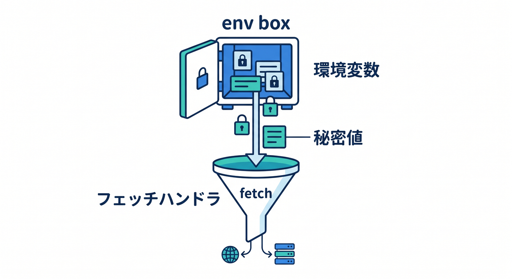
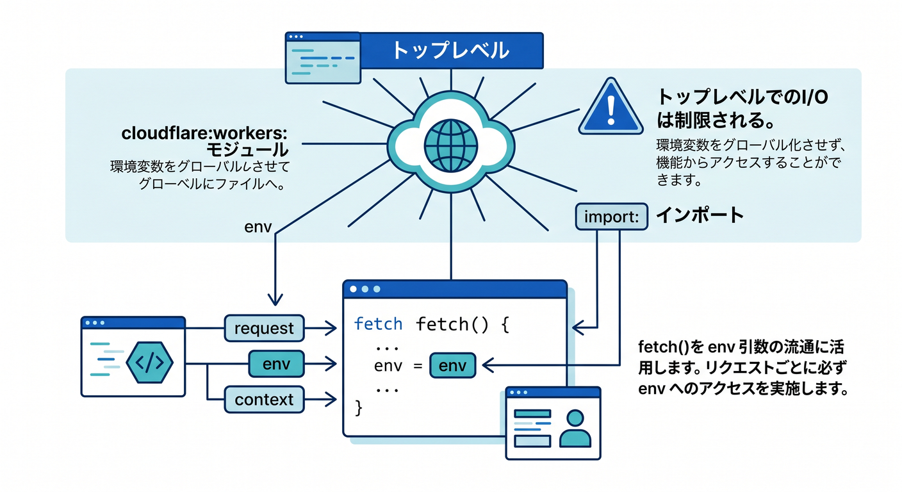
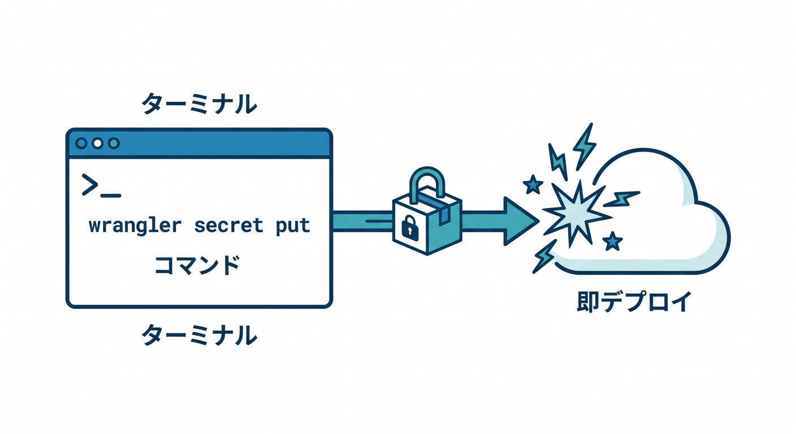
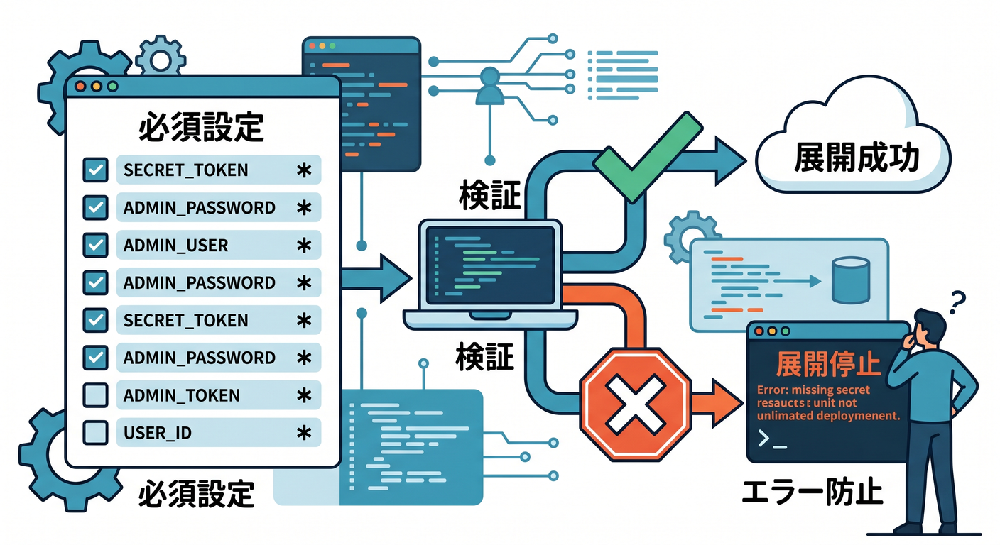
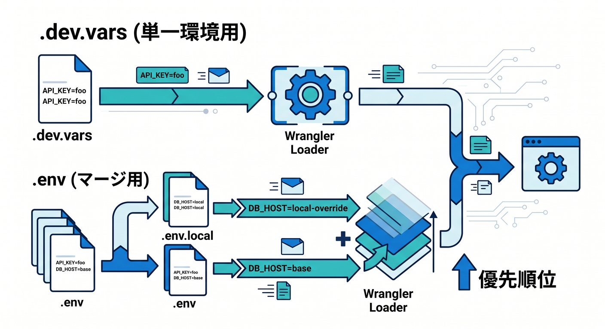
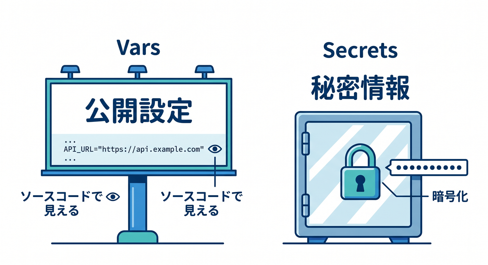

# 第11章　環境変数とSecretsをちゃんと使おう 🔐🌱

この章では、**「動く」から一歩進んで「安全に動かす」**へ進みます ✨
Cloudflare Workers では、設定値を入れる場所と、秘密情報を入れる場所をちゃんと分けて考えるのがとても大事です。Cloudflare公式も、**機密情報を **vars** に置かず、secrets を使うこと**をはっきり案内しています。さらに 2026 年時点では、**ローカル開発では **.dev.vars** または **.env** を使え、デプロイ時には **required secrets** の宣言で検証や型生成までつなげられる**流れがかなり整っています。 ([Cloudflare Docs][1])

この章のゴールは、次の3つです 😊
**1つ目**は、**環境変数と secrets の違いを説明できること**。
**2つ目**は、**ローカル用・本番用・環境別の値を整理して使い分けられること**。
**3つ目**は、**APIキーをコードや Git にうっかり置かない習慣を身につけること**です。 ([Cloudflare Docs][2])

---

## 1. まず最初に、いちばん大事な結論だけ覚えよう 🧠✨

Cloudflare Workers では、**secrets は「暗号化されたテキスト値を Worker に結びつける binding」**で、APIキーや認証トークンのような機密情報の保存に使います。コードから見ると、secrets も環境変数のように **env** 経由で扱えますが、**Wrangler やダッシュボード上で値が見えない**というのが大きな違いです。 ([Cloudflare Docs][2])

逆に **vars** は、「アプリ名」「公開しても困らないフラグ」「ログレベル」みたいな、**秘密ではない設定値**を入れる場所です。Cloudflare公式は、**機密情報を **vars** に保存しないで、secrets を使ってください**と明記しています。 ([Cloudflare Docs][1])

つまり、初心者向けに超シンプルに言うと、こうです 🌸
**見えて困るものは secrets**
**見えても困らないものは vars**
まずはこの切り分けができれば、この章は半分勝ちです。 ([Cloudflare Docs][2])

---

## 2. この章で触るファイルたち 📁🛠️

この章で主に見るのは、**wrangler.jsonc**、**.dev.vars** または **.env**、**.gitignore**、そして **src/index.ts** です。Cloudflare は新しいプロジェクトで **wrangler.jsonc** を推奨していて、いくつかの新しい Wrangler 機能は JSON 設定でないと使えません。 ([Cloudflare Docs][3])

また、Cloudflare公式はローカル開発で secrets を使うとき、**.dev.vars か .env のどちらか一方を使う**よう案内しています。**両方を同時に混ぜる前提では考えない**のが安全です。 ([Cloudflare Docs][2])

---

## 3. まずは「安全じゃない書き方」を知ろう 😱➡️🙂

こんな感じで API キーをコードへ直書きするのは、学習中でも避けたいです。

```ts
export default {
  async fetch(): Promise<Response> {
    const apiKey = "abc123-secret-key";
    return new Response("NG example");
  },
};
```

この書き方は、**Git に入る、画面共有で見える、Copilot やレビュー時に露出する、あとで消し忘れる**など、事故の入口になりやすいです。Cloudflare公式は、APIキーや auth token のような機密情報は secrets に保存するよう説明しています。 ([Cloudflare Docs][2])

---

## 4. いちばん基本の設計はこれ 👍🌱

まずは **vars に公開してよい設定**、**secrets に秘密情報** を分けます。
たとえばこんな感じです。

**公開してよい設定の例**

* アプリ名
* 表示モード
* ログレベル
* ステージ名

**秘密情報の例**

* 外部 API キー
* DB 接続文字列
* 認証トークン
* AI プロバイダのシークレット

Cloudflare の secrets は Worker では環境変数のように扱えますが、保存方法が違います。**見せてよい値は vars、見せたくない値は secrets** と覚えるのがいちばんやさしいです。 ([Cloudflare Docs][2])

---

## 5. まずは **wrangler.jsonc** に公開設定だけ書いてみよう 🧭

最初の形としては、こんな感じがわかりやすいです。

```jsonc
{
  "$schema": "./node_modules/wrangler/config-schema.json",
  "name": "chapter11-worker",
  "main": "src/index.ts",
  "compatibility_date": "2026-04-15",

  "vars": {
    "APP_NAME": "chapter11-worker",
    "LOG_LEVEL": "info"
  },

  "env": {
    "staging": {
      "vars": {
        "APP_NAME": "chapter11-worker-staging",
        "LOG_LEVEL": "debug"
      }
    },
    "production": {
      "vars": {
        "APP_NAME": "chapter11-worker-production",
        "LOG_LEVEL": "warn"
      }
    }
  }
}
```

Cloudflare の **vars** は **environment ごとに値を持てます**が、**non-inheritable** なので、上位で定義したものがそのまま各環境へ自動で引き継がれるわけではありません。つまり、**staging 用・production 用の値は、それぞれ明示的に書く**意識が大事です。 ([Cloudflare Docs][1])

---

## 6. ローカル開発の secrets は **.dev.vars** か **.env** に置こう 🏠🔐

Cloudflare公式は、**ローカル用 secrets を **.dev.vars** または **.env** に置ける**と案内しています。書式は dotenv 形式です。さらに、**Git へコミットしないように **.gitignore** へ追加**することも強く案内されています。 ([Cloudflare Docs][2])

たとえば **.dev.vars** はこんな感じです。

```dotenv
EXTERNAL_API_KEY="replace-me"
INTERNAL_TOKEN="replace-me"
```

そして **.gitignore** にはこれを入れておきます。

```gitignore
.dev.vars*
.env*
```

ここで超大事なのは、**.dev.vars と .env はどちらか片方に寄せる**ことです。Cloudflare公式は、**.dev.vars があると .env 側の値は **env** オブジェクトに入らない**と説明しています。 ([Cloudflare Docs][2])

---

## 7. TypeScript からは **env** で読むのが基本 ✍️🔷

Worker のコードでは、まず **fetch の引数の env** から読むのがいちばん素直です。

```ts
export interface Env {
  APP_NAME: string;
  LOG_LEVEL: string;
  EXTERNAL_API_KEY: string;
}

export default {
  async fetch(request: Request, env: Env): Promise<Response> {
    const body = {
      appName: env.APP_NAME,
      logLevel: env.LOG_LEVEL,
      hasApiKey: Boolean(env.EXTERNAL_API_KEY),
    };

    return new Response(JSON.stringify(body, null, 2), {
      headers: { "Content-Type": "application/json; charset=UTF-8" },
    });
  },
};
```

Cloudflare では、**secrets も env 経由でアクセス**できます。つまり、学習の最初は **「設定は全部 env に来る」**と考えるとわかりやすいです。


実際、Cloudflare公式も secret の例を **env.DB_CONNECTION_STRING** のような形で示しています。 ([Cloudflare Docs][2])

---

## 8. 少し慣れたら **cloudflare:workers** から global に読む方法も知ろう 🌍📦

Cloudflare では、**cloudflare:workers** から **env** を import して、トップレベルから binding を読む方法もあります。


これは、**設定値で API クライアントを初期化したい**ときなどに便利です。 ([Cloudflare Docs][1])

```ts
import { env } from "cloudflare:workers";

const appName = env.APP_NAME;

export default {
  async fetch(): Promise<Response> {
    return new Response(`Hello from ${appName}`);
  },
};
```

ただし、ここには注意点もあります ⚠️
Cloudflare公式は、**トップレベルで env は読めても、すべての binding の I/O をそこで自由に実行できるわけではない**と説明しています。最初のうちは、**値を読むだけ**にして、重い処理や外部アクセスは **fetch の中**で行う方が安全です。 ([Cloudflare Docs][4])

---

## 9. Node.js っぽく **process.env** で読む道もあるけれど… 🟢

Cloudflare公式によると、**Node.js compatibility を有効にした Worker では secrets を **process.env** から読むこともできます**。 ([Cloudflare Docs][2])

でも、この教材では最初は **env.XYZ** に寄せるのがおすすめです 😊
理由は単純で、**Cloudflare の binding という考え方がそのまま見える**からです。Node.js 風の書き方に寄せすぎると、**Cloudflare ならではの仕組み**が逆に見えにくくなることがあります。これは公式仕様を踏まえた上での、学習順としてのおすすめです。 ([Cloudflare Docs][2])

---

## 10. 本番の secrets は **Wrangler** かダッシュボードで登録しよう 🚀🔐

デプロイ済み Worker の secrets は、**Wrangler の secret コマンド**または **Cloudflare ダッシュボード**から追加できます。Cloudflare公式は、**npx wrangler secret put <KEY>** を基本コマンドとして案内していて、これは**新しい Worker バージョンを作って即デプロイ**します。


削除は **npx wrangler secret delete <KEY>** です。 ([Cloudflare Docs][2])

たとえば、こんなイメージです。

```bash
npx wrangler secret put EXTERNAL_API_KEY
```

環境を分けている場合、Cloudflare では **環境別の secrets も設定でき**、secrets も vars と同じく **non-inheritable** です。つまり、**production に入れた secret が staging に自動コピーされるわけではない**ので、そこはちゃんと意識しておきましょう。 ([Cloudflare Docs][5])

---

## 11. 2026年らしい便利機能：**required secrets** を使おう 🆕✨

本日時点の新しめの便利機能として、Wrangler には **secrets.required** があります。これは **wrangler.jsonc** に「この Worker はこの secret 名が必要です」と宣言する仕組みで、**ローカル開発時や deploy 時に不足を検証**してくれます。


さらに、**wrangler types の型生成の元情報**にもなります。 ([Cloudflare Docs][6])

こんな感じです。

```jsonc
{
  "$schema": "./node_modules/wrangler/config-schema.json",
  "name": "chapter11-worker",
  "main": "src/index.ts",
  "compatibility_date": "2026-04-15",

  "vars": {
    "APP_NAME": "chapter11-worker"
  },

  "secrets": {
    "required": ["EXTERNAL_API_KEY", "INTERNAL_TOKEN"]
  }
}
```

Cloudflare公式では、この **secrets** 設定は **experimental** 扱いですが、**required secret の検証**と**型生成の基準化**にはかなり便利です。教材では、**「今どきの便利機能」として採用しつつ、将来少し変わる可能性もある**と添えておくと親切です。 ([Cloudflare Docs][3])

---

## 12. 環境別ファイルの考え方も整理しよう 🌿🏭

Cloudflare公式では、ローカルで環境ごとに secrets を分けたいとき、**.dev.vars.staging** や **.env.production** のようなファイル名を使えます。ここでポイントが少しややこしいです。 ([Cloudflare Docs][2])

**.dev.vars 系**は、**より具体的な環境ファイルがあると、そちらだけが読み込まれ、共通の .dev.vars は読まれません**。


一方で **.env 系**は、**複数ファイルがマージされ、より具体的なものが優先**されます。公式はその優先順も示しています。 ([Cloudflare Docs][2])

初心者向けには、最初は次のどちらかがおすすめです 😊

* **シンプル派**：**.dev.vars** ひとつで始める
* **環境整理派**：**.env** 系で共通値と環境別を分ける

学習のしやすさでいえば、最初の数章は **.dev.vars** のほうが迷いにくいです。これは公式の読み込み挙動を踏まえた、教材設計上のおすすめです。 ([Cloudflare Docs][2])

---

## 13. この章のミニ完成例 🎯

ここまでを合わせた、初心者向けの最小セットです。

**wrangler.jsonc**

```jsonc
{
  "$schema": "./node_modules/wrangler/config-schema.json",
  "name": "chapter11-worker",
  "main": "src/index.ts",
  "compatibility_date": "2026-04-15",

  "vars": {
    "APP_NAME": "chapter11-worker",
    "LOG_LEVEL": "info"
  },

  "secrets": {
    "required": ["EXTERNAL_API_KEY"]
  },

  "env": {
    "staging": {
      "vars": {
        "APP_NAME": "chapter11-worker-staging",
        "LOG_LEVEL": "debug"
      },
      "secrets": {
        "required": ["EXTERNAL_API_KEY"]
      }
    }
  },

  "ai": {
    "binding": "AI"
  }
}
```

**.dev.vars**

```dotenv
EXTERNAL_API_KEY="replace-me"
```

**src/index.ts**

```ts
export interface Env {
  APP_NAME: string;
  LOG_LEVEL: string;
  EXTERNAL_API_KEY: string;
  AI: Ai;
}

export default {
  async fetch(request: Request, env: Env): Promise<Response> {
    const url = new URL(request.url);

    if (url.pathname === "/health") {
      return new Response("ok");
    }

    if (url.pathname === "/config") {
      return Response.json({
        appName: env.APP_NAME,
        logLevel: env.LOG_LEVEL,
        secretLoaded: Boolean(env.EXTERNAL_API_KEY),
      });
    }

    if (url.pathname === "/ai") {
      const result = await env.AI.run("@cf/meta/llama-3.1-8b-instruct", {
        prompt: "Cloudflare Workers を初心者向けに一言で説明して",
      });

      return Response.json(result);
    }

    return new Response("Hello Chapter 11!");
  },
};
```

この例では、**公開設定は vars**、**秘密値は secret**、**Cloudflare の AI は binding で接続**という3つの考え方を一度に体験できます。Workers AI は **wrangler に AI binding を追加すると env.AI で使える**のが公式の基本導線です。 ([Cloudflare Docs][7])

---

## 14. Cloudflare AI と secrets の関係をここで整理しよう 🤖☁️🔐

ここ、すごく大事です ✨
Cloudflare には **Workers AI のように binding でつながる AI** と、**外部 AI サービスの API キーを secret で持って呼ぶケース**の両方があります。Workers AI は **env.AI** の binding で使えるので、「API キーを自分で secret に入れて毎回 Authorization ヘッダーを書く」流れとは少し違います。 ([Cloudflare Docs][7])

一方で、**AI Gateway** を使って外部 AI へつなぐ場合は、認証トークンやプロバイダ API キーの扱いが出てきます。


Cloudflare公式は、**Authenticated Gateway を有効にするなら認証トークンが必要**で、**ログ保存を使うなら Authenticated Gateway を推奨**しています。 ([Cloudflare Docs][8])

さらに AI Gateway は、**ログがデフォルトで有効**で、リクエストやレスポンスのデータも扱います。**センシティブな prompt を投げる可能性があるなら、ログ自体を止めるか、少なくとも **cf-aig-collect-log-payload: false** で payload 保存を抑える**という考え方をこの章で軽く触れておくと、かなり今っぽい教材になります。 ([Cloudflare Docs][9])

---

## 15. Copilot をこの章でどう使うと上手い？ 🤖💬

GitHub公式は、**最新の安定版 IDE と Copilot 拡張機能の利用**を勧めています。また、**Agent mode と MCP** は VS Code で使える導線が整っています。 ([GitHub Docs][10])

この章での Copilot の使い方は、**コードを書かせることより、設定レビュー係にする**のが上手いやり方です 😊
たとえば次のお願いが相性抜群です。

* 「この **wrangler.jsonc** の **vars** と **secrets.required** の意味を中学生向けに説明して」
* 「**.gitignore** に secrets 系ファイルの漏れがないか見て」
* 「この Worker で secret を直書きしている箇所がないか点検して」
* 「**staging** と **production** で値が非継承になる場所を一覧にして」

これは、Copilot を**生成マシン**ではなく**見落とし防止の相棒**として使うイメージです。GitHub MCP server は VS Code の Copilot Chat から Agent モードで各種操作に使え、Cloudflare側も **cloudflare-docs MCP** や **cloudflare-observability MCP** で Workers の知識やログ確認を AI に渡す導線を案内しています。 ([GitHub Docs][11])

---

## 16. この章で学習者がハマりやすいポイント 💥

**その1：APIキーを vars に入れてしまう**
これはこの章の代表的な事故です。機密情報は secrets 側です。 ([Cloudflare Docs][1])

**その2：.dev.vars と .env を混ぜて混乱する**
Cloudflare公式は、ローカルでは **どちらか一方を使う**よう案内しています。特に **.dev.vars** があると **.env** は env に入らないので、混乱の元になりやすいです。 ([Cloudflare Docs][2])

**その3：staging に secret を入れたから production も大丈夫だと思う**
ダメです 🙅
vars も secrets も、環境では **non-inheritable** です。環境ごとにちゃんと定義が必要です。 ([Cloudflare Docs][1])

**その4：top-level の env で何でもできると思う**
値の参照や初期設定は便利ですが、Cloudflare公式は**トップレベルでは binding のすべての I/O ができるわけではない**と説明しています。 ([Cloudflare Docs][4])

---

## 17. 演習課題 🧪🎓

**演習1**
**APP_NAME** と **LOG_LEVEL** を vars に置き、**/config** へアクセスしたら JSON で返す Worker を作る。

**演習2**
**EXTERNAL_API_KEY** を **.dev.vars** に入れ、Worker から **Boolean(env.EXTERNAL_API_KEY)** を返して「secret がロードされているか」だけ確認する。

**演習3**
**staging** と **production** を分けて、**LOG_LEVEL** を変える。
その上で、**production 用 secret を未設定にしたとき何が起きるか**を確認する。

**演習4**
**Workers AI binding** を追加して **/ai** を作る。
その後、「Workers AI は binding でつなぐ」「外部 AI は secret が必要になりやすい」という違いを言葉で説明する。 ([Cloudflare Docs][7])

---

## 18. この章のまとめ 🌈

この章の本質は、**Cloudflare Worker に値を渡す方法を、安全さで分けて理解すること**です。


**公開してよい設定は vars**、**秘密情報は secrets**、**環境ごとに値は自動継承されない**、この3つが芯です。 ([Cloudflare Docs][1])

そして 2026 年時点では、Cloudflare は **.dev.vars / .env によるローカル secrets 管理**、**wrangler secret put による本番登録**、**secrets.required による検証と型生成**までつながっていて、かなり学びやすくなっています。 ([Cloudflare Docs][2])

さらに、AI 時代の実務を意識するなら、**Workers AI の binding 型の接続**と、**AI Gateway や外部 AI での token 管理・ログ配慮**まで軽く意識できると、とても強いです。 ([Cloudflare Docs][7])

必要なら次に、そのまま続けて
**「第12章　ログ・ブレークポイント・テストで“直せる人”になろう 🐞📈」**
の詳細教材も、同じ調子で最新情報ベースで作れます。

[1]: https://developers.cloudflare.com/workers/configuration/environment-variables/ "Environment variables · Cloudflare Workers docs"
[2]: https://developers.cloudflare.com/workers/configuration/secrets/ "Secrets · Cloudflare Workers docs"
[3]: https://developers.cloudflare.com/workers/wrangler/configuration/ "Configuration - Wrangler · Cloudflare Workers docs"
[4]: https://developers.cloudflare.com/workers/runtime-apis/bindings/ "Bindings (env) · Cloudflare Workers docs"
[5]: https://developers.cloudflare.com/workers/wrangler/environments/ "Environments · Cloudflare Workers docs"
[6]: https://developers.cloudflare.com/changelog/post/2026-03-24-secrets-config-property/ "Declare required secrets in your Wrangler configuration · Changelog"
[7]: https://developers.cloudflare.com/workers-ai/get-started/workers-wrangler/ "Get started - Workers and Wrangler · Cloudflare Workers AI docs"
[8]: https://developers.cloudflare.com/ai-gateway/configuration/authentication/ "Authenticated Gateway · Cloudflare AI Gateway docs"
[9]: https://developers.cloudflare.com/ai-gateway/observability/logging/ "Logging · Cloudflare AI Gateway docs"
[10]: https://docs.github.com/ja/enterprise-cloud%40latest/copilot/reference/copilot-feature-matrix?tool=vscode "Copilot 機能マトリックス - GitHub Enterprise Cloud Docs"
[11]: https://docs.github.com/en/copilot/how-tos/provide-context/use-mcp-in-your-ide/use-the-github-mcp-server "Using the GitHub MCP Server in your IDE - GitHub Docs"
