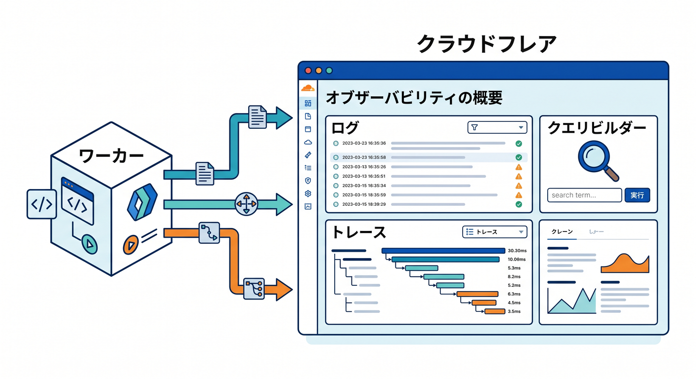
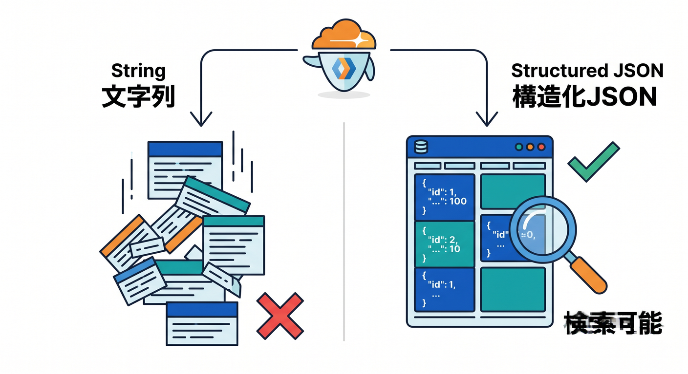
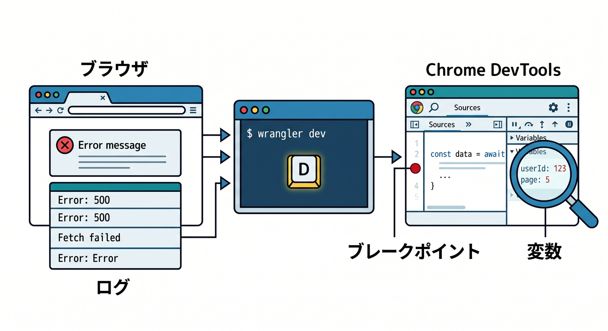
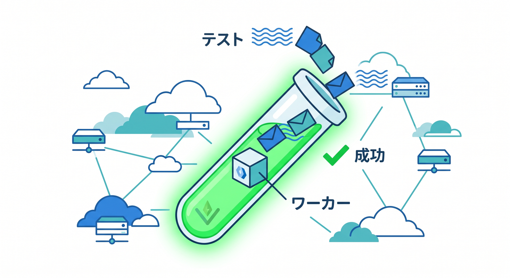
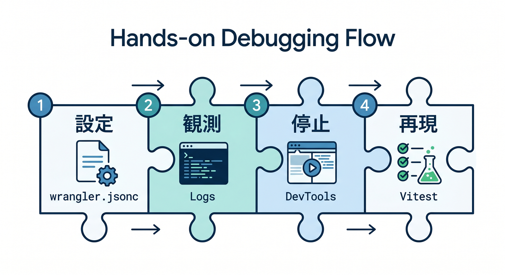
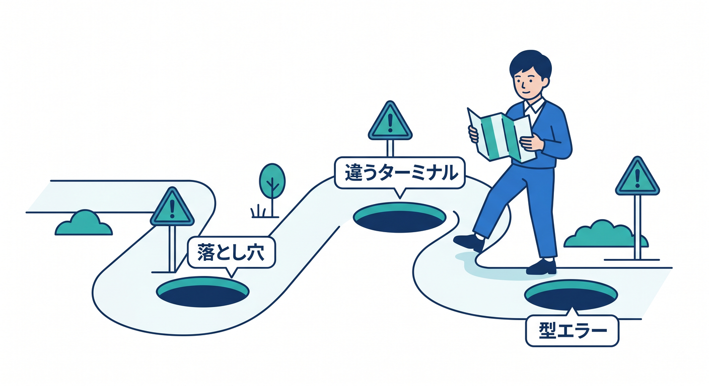

# 第12章　ログ・ブレークポイント・テストで“直せる人”になろう 🐞📈🛠️

この章では、「動かない…😢」で止まる人から、「原因を見つけて直せる人」へ進みます。2026年のCloudflare公式導線では、Workers Logs / Query Builder / DevTools / VS Codeブレークポイント / Workers Vitest integration がかなり整っていて、昔よりずっと“見ながら直す”学習がしやすくなっています。([Cloudflare Docs][1])

この章のゴールは4つです 😊



1つ目は、`console.log()` をただ置くだけで終わらず、CloudflareのObservabilityで「あとから追えるログ」にすること。
2つ目は、VS Codeで止めて値を見ること。
3つ目は、Vitestで「同じバグを何度でも再現できる状態」を作ること。
4つ目は、CopilotやCloudflareのAIまわりを“デバッグの相棒”として使うことです。([Cloudflare Docs][1])

---

## 12-1. まずは「見える化」を入れよう 👀📋

Cloudflareの公式ドキュメントでは、Observability は Logs・Traces・Metrics・Query Builder まで含めた全体機能として整理されています。特に Workers Logs は、Workerから出したログを自動で収集・保存・分析できる仕組みで、Query Builder はそのログを絞り込みや集計で調べる入口です。([Cloudflare Docs][1])

さらにCloudflareの最新ベストプラクティスでは、本番に出す前から Logs と Traces を有効化しておくことが推奨されています。理由は単純で、たまにしか出ない不具合ほど、**起きたあとに慌ててログを入れても遅い**からです。([Cloudflare Docs][2])

まずは `wrangler.jsonc` に、こんな感じで観測設定を入れます ✍️
Cloudflareは新規プロジェクトに `wrangler.jsonc` を推奨していて、JSON系設定でしか使えない新しめの機能もあります。([Cloudflare Docs][3])

```jsonc
{
  "$schema": "./node_modules/wrangler/config-schema.json",
  "name": "my-first-worker",
  "main": "src/index.ts",
  "compatibility_date": "2026-04-15",

  "observability": {
    "enabled": true,
    "logs": {
      "invocation_logs": true,
      "head_sampling_rate": 1
    },
    "traces": {
      "enabled": true,
      "head_sampling_rate": 0.05
    }
  },

  "ai": {
    "binding": "AI"
  }
}
```

この設定の意味はシンプルです 😊
`observability.enabled` で観測を有効化し、`logs.invocation_logs` で呼び出しログを取り、`head_sampling_rate` でどれくらい記録するかを決めます。Cloudflare公式では `1` は全件取得で、高トラフィック環境では下げる運用も案内されています。Traces も `observability.traces.enabled = true` で有効化できます。([Cloudflare Docs][4])

---

## 12-2. `console.log()` は「文字列のメモ」より「構造化ログ」にしよう 🧱📝

Cloudflareのベストプラクティスでは、検索しやすく絞り込みやすい **JSON形式の構造化ログ** が推奨されています。さらに `console.error()` はエラー、`console.warn()` は警告として、Observability上でも適切な severity で扱われます。([Cloudflare Docs][4])



たとえば、今までの章で作ってきた小さなWorkerに、こんなログを足します 👇

```ts
export interface Env {
  AI: Ai;
}

export default {
  async fetch(request: Request, env: Env): Promise<Response> {
    const url = new URL(request.url);
    const startedAt = Date.now();

    try {
      if (url.pathname === "/boom") {
        throw new Error("forced error");
      }

      if (url.pathname === "/ai") {
        const result = await env.AI.run(
          "@cf/meta/llama-3.1-8b-instruct",
          { prompt: "こんにちはを英語で短く言ってください。" }
        );

        console.log(JSON.stringify({
          type: "ai_call",
          path: url.pathname,
          model: "@cf/meta/llama-3.1-8b-instruct",
          gatewayLogId: env.AI.aiGatewayLogId ?? null,
          elapsedMs: Date.now() - startedAt
        }));

        return Response.json(result);
      }

      const response = Response.json({
        ok: true,
        path: url.pathname
      });

      console.log(JSON.stringify({
        type: "request",
        method: request.method,
        path: url.pathname,
        status: response.status,
        elapsedMs: Date.now() - startedAt
      }));

      return response;
    } catch (error) {
      console.error(JSON.stringify({
        type: "error",
        path: url.pathname,
        message: error instanceof Error ? error.message : String(error)
      }));

      return Response.json(
        { ok: false, message: "Internal Server Error" },
        { status: 500 }
      );
    }
  }
} satisfies ExportedHandler<Env>;
```

この形の良いところは、あとで Workers Logs や Query Builder で `type = "error"` や `path = "/ai"` のように追いやすいことです。CloudflareのWorkers AI / AI Gateway系では `env.AI.run()` で推論でき、AI Gateway binding methods では最新ログIDを `env.AI.aiGatewayLogId` から参照できます。なのでAI機能を作るときも、「どのモデル呼び出しで遅かったか」「どの経路で失敗したか」を追いやすくなります。([Cloudflare Docs][4])

---

## 12-3. ダッシュボードでログを見る流れを覚えよう ☁️📊

Workers Logs は、Cloudflareダッシュボードで Worker ごとに確認できます。公式では Worker を選んで **Observability** に入る流れが案内されていて、Query Builder は追加有効化なしで使えます。([Cloudflare Docs][4])

ここで最初に覚えたい観点はこの3つです 😊
「どのURLで失敗したか」
「どれくらい時間がかかったか」
「特定の処理だけ何度も失敗していないか」
この3つだけ見られるようになると、初心者のデバッグ力はかなり上がります。([Cloudflare Docs][1])

---

## 12-4. ローカルでは“止めて見る”のが最強です 🛑🔍

Cloudflare公式では、`wrangler dev` または Cloudflare Vite plugin を使ったローカル実行時に、Cloudflare実装のChrome DevToolsへアクセスできます。`wrangler dev` 中はターミナルで **`D` キー** を押すと DevTools を開けます。ログの確認、ブレークポイント、CPUプロファイル、メモリ確認までできます。([Cloudflare Docs][5])

つまり、ローカル開発では次の順番がとても強いです 🚀



「まずブラウザで再現」→「ログを見る」→「ブレークポイントで止める」→「変数を確認する」
これだけで、かなりの不具合は“勘”ではなく“観察”で直せます。([Cloudflare Docs][6])

---

## 12-5. VS Codeのブレークポイントを使おう 💙🧩

Cloudflare公式のブレークポイント案内では、VS Codeの **JavaScript Debug Terminal** を開いて、その中で `wrangler dev` を実行するだけでも自動接続できます。しかも複数Workerが動いていても接続できます。([Cloudflare Docs][6])

まずはVS Codeで `Ctrl + Shift + P` から「JavaScript Debug Terminal」を開いて、その中で次を実行します。

```bash
npx wrangler dev
```

そのあと `src/index.ts` の行番号左をクリックしてブレークポイントを置き、ブラウザで `http://127.0.0.1:8787/boom` などへアクセスします。するとそこで処理が止まり、変数や call stack を見られます。Cloudflare公式でも、ローカルURLの既定値は `http://127.0.0.1:8787` と案内されています。([Cloudflare Docs][6])

`launch.json` 派なら、Cloudflare公式そのままの最小形はこんな感じです 👇 ([Cloudflare Docs][6])

```json
{
  "configurations": [
    {
      "name": "Wrangler",
      "type": "node",
      "request": "attach",
      "port": 9229,
      "cwd": "/",
      "resolveSourceMapLocations": null,
      "attachExistingChildren": false,
      "autoAttachChildProcesses": false,
      "sourceMaps": true
    }
  ]
}
```

なお公式には注意点もあります ⚠️
`wrangler dev --remote` でブレークポイントデバッグをすると、実リソースに対して動くためCPU時間や課金面の影響が出る可能性があります。また `--remote` でデバッグする場合、minify を有効にすると変数を追いにくくなります。学習中は **ローカルの `wrangler dev` を優先** が安全です。([Cloudflare Docs][6])

---

## 12-6. テストは「未来の自分のための再現ボタン」🎯🧪

Cloudflare公式は、Workers のテスト方法として **Workers Vitest integration を最推奨** しています。



理由は、Workers runtime の中でテストを動かせて、ユニットテストも統合テストも扱いやすいからです。比較表でも、Wrangler設定ファイル読込・bindings直接利用・Durable Objectsへの直接アクセスなど、かなり強いです。([Cloudflare Docs][7])

今の公式ドキュメントでは、前提として ES Modules 形式であること、互換日が `2022-10-31` 以降であること、そして `vitest` と `@cloudflare/vitest-pool-workers` を dev dependency に入れることが案内されています。さらに `@cloudflare/vitest-pool-workers` は Vitest 4.1 以降が必要です。([Cloudflare Docs][8])

まずはインストールです 👇 ([Cloudflare Docs][8])

```bash
npm i -D vitest@^4.1.0 @cloudflare/vitest-pool-workers
```

そして `vitest.config.ts` は、まずこの最小形で十分です 😊 ([Cloudflare Docs][8])

```ts
import { cloudflareTest } from "@cloudflare/vitest-pool-workers";
import { defineConfig } from "vitest/config";

export default defineConfig({
  plugins: [
    cloudflareTest({
      wrangler: { configPath: "./wrangler.jsonc" }
    })
  ]
});
```

TypeScriptでは `wrangler types` の出力を読み込んで、`ProvidedEnv extends Env` にしておくと、テスト中の `env` も型付きで触れます。これはCloudflare公式の「Write your first test」で案内されている流れです。([Cloudflare Docs][8])

```ts
// test/env.d.ts
declare module "cloudflare:workers" {
  interface ProvidedEnv extends Env {}
}
```

---

## 12-7. 最初のテストを1本書いてみよう ✨

Cloudflare公式のテストAPIでは、`cloudflare:workers` から `env` や `exports` を、`cloudflare:test` から `createExecutionContext()` や `waitOnExecutionContext()` を使えます。`waitOnExecutionContext()` は、`ctx.waitUntil()` に積んだ非同期処理が終わるまで待つためのものです。([Cloudflare Docs][9])

まずはユニットテストです 👇 ([Cloudflare Docs][8])

```ts
import { env } from "cloudflare:workers";
import { createExecutionContext, waitOnExecutionContext } from "cloudflare:test";
import { describe, it, expect } from "vitest";
import worker from "../src";

describe("my worker", () => {
  it("returns 500 on /boom", async () => {
    const request = new Request("http://example.com/boom");
    const ctx = createExecutionContext();

    const response = await worker.fetch(request, env, ctx);
    await waitOnExecutionContext(ctx);

    expect(response.status).toBe(500);

    const body = await response.json<{ ok: boolean; message: string }>();
    expect(body.ok).toBe(false);
  });
});
```

次は統合テストです。Cloudflare公式では `exports.default.fetch()` を使う形が案内されています。これで「Workerを1つの実行物として呼ぶ」感覚がつかめます。([Cloudflare Docs][9])

```ts
import { exports } from "cloudflare:workers";
import { describe, it, expect } from "vitest";

describe("integration", () => {
  it("returns ok json on /", async () => {
    const response = await exports.default.fetch("https://example.com/");
    expect(response.status).toBe(200);

    const json = await response.json<{ ok: boolean; path: string }>();
    expect(json.ok).toBe(true);
    expect(json.path).toBe("/");
  });
});
```

---

## 12-8. テストもブレークポイントで止められます 🧪🛑

Cloudflare公式には、Vitestテスト自体をデバッグする方法も用意されています。`@cloudflare/vitest-pool-workers` v0.7.5 以降では、次のコマンドで inspector を開き、ポート `9229` にデバッガを接続できます。([Cloudflare Docs][10])

```bash
npx vitest --inspect --no-file-parallelism
```

VS Codeでテストデバッグをしたいなら、公式では `.vscode/launch.json` に Vitest用設定を書く方法も案内されています。学習段階では「通常のWorkerデバッグ」と「テストのデバッグ」は別物だと覚えるだけで十分です。まずは **通常実行で失敗 → テスト化 → テストをデバッガで止める** の順がわかりやすいです。([Cloudflare Docs][10])

---

## 12-9. CopilotとCloudflare AIを“デバッグ係”にしよう 🤖☁️🔎

GitHub公式では、Copilot の **agent mode** は「特定のタスクがあり、自律的にファイル編集やターミナル実行まで進めたいとき」に向いていると説明されています。さらにVS CodeのAgents解説では、**テスト失敗やlintエラー、debug output を直す作業には local agent が向く** とされています。第12章との相性はかなり良いです。([GitHub Docs][11])

この章でのCopilotの使い方は、こんな感じがちょうどいいです 😊


「このエラーログから怪しい分岐を3つ挙げて」
「この `console.log(JSON.stringify(...))` を structured logging として整えて」
「この不具合を再現する Vitest を1本作って」
「この `launch.json` の役割を1行ずつ説明して」
こういう使い方だと、AIに丸投げではなく、**自分の観察を速くする補助輪** になります。([GitHub Docs][11])

Cloudflare側も、Agents向けに `cloudflare-docs` MCP と `cloudflare-observability` MCP を案内しています。後者はログ確認や例外調査に役立つと公式が説明しています。つまり将来的には、CloudflareのログやドキュメントをAIエージェントに読ませて、原因調査をかなり自然に進められる流れがあります。([Cloudflare Docs][12])

AI機能をWorkerに載せる場合は、Workers AI binding を `env.AI` として使えますし、AI Gateway binding methods では `env.AI.aiGatewayLogId` も取れます。なので第15章のAI機能づくりへ進んだあとも、第12章の「ログで追う・テストで再現する」はそのまま効いてきます。([Cloudflare Docs][13])

---

## 12-10. この章の実践メニュー 🎓🧩

この章では、次の順に手を動かすとかなり理解しやすいです。



1. `wrangler.jsonc` に `observability` を入れる
2. `/`, `/boom`, `/ai` の3ルートを用意する
3. JSON形式の `console.log()` と `console.error()` を入れる
4. `wrangler dev` → `D` キー → DevTools でログを見る
5. VS Codeでブレークポイントを置く
6. `/boom` 用のVitestを1本書く
7. 失敗を直したら、そのテストが通るのを確認する

この順番だと、「見える」「止める」「再現する」の3つがきれいに繋がります。Cloudflare公式のObservability / Breakpoints / Vitest integration の学習順としてもかなり自然です。([Cloudflare Docs][1])

---

## 12-11. よくあるつまずきポイント 😵‍💫



`console.log()` を大量に出したのに、あとで絞り込めなくなる問題はすごく多いです。Cloudflare公式のベストプラクティスどおり、最初からJSONで出す癖をつけるとかなり楽になります。([Cloudflare Docs][4])

ブレークポイントが効かないときは、まず `wrangler dev` をVS Codeの通常ターミナルではなく **JavaScript Debug Terminal** から起動しているかを確認します。`launch.json` 方式なら、ポート `9229` と attach 設定を見直します。([Cloudflare Docs][6])

テストが型エラーだらけになるときは、`wrangler types` の出力を読み込めているか、`ProvidedEnv extends Env` を書いているかを確認します。Cloudflare公式でもここがTypeScript利用時の要点として説明されています。([Cloudflare Docs][8])

---

## 12-12. この章の着地 🌈

この章を終えるころには、あなたはもう「動けばOK」の人ではありません 🙌
ログで観測し、ブレークポイントで止め、テストで再現し、必要ならCopilotやCloudflareのAI導線まで使って直せる人になっています。第13章のデプロイ前にこの力を入れておくと、公開後のトラブル対応が本当に楽になります。([Cloudflare Docs][1])

必要なら次に、この第12章をさらに教材っぽくして
**「学習目標」「ハンズオン手順」「演習問題」「提出物」「想定学習時間」付きの完成版」** に整えることもできます。

[1]: https://developers.cloudflare.com/workers/observability/ "Observability · Cloudflare Workers docs"
[2]: https://developers.cloudflare.com/workers/best-practices/workers-best-practices/ "https://developers.cloudflare.com/workers/best-practices/workers-best-practices/"
[3]: https://developers.cloudflare.com/workers/wrangler/configuration/ "Configuration - Wrangler · Cloudflare Workers docs"
[4]: https://developers.cloudflare.com/workers/observability/logs/workers-logs/ "Workers Logs · Cloudflare Workers docs"
[5]: https://developers.cloudflare.com/workers/observability/dev-tools/ "https://developers.cloudflare.com/workers/observability/dev-tools/"
[6]: https://developers.cloudflare.com/workers/observability/dev-tools/breakpoints/ "Breakpoints · Cloudflare Workers docs"
[7]: https://developers.cloudflare.com/workers/testing/ "Testing · Cloudflare Workers docs"
[8]: https://developers.cloudflare.com/workers/testing/vitest-integration/write-your-first-test/ "Write your first test · Cloudflare Workers docs"
[9]: https://developers.cloudflare.com/workers/testing/vitest-integration/test-apis/ "Test APIs · Cloudflare Workers docs"
[10]: https://developers.cloudflare.com/workers/testing/vitest-integration/debugging/ "https://developers.cloudflare.com/workers/testing/vitest-integration/debugging/"
[11]: https://docs.github.com/copilot/using-github-copilot/asking-github-copilot-questions-in-your-ide "Asking GitHub Copilot questions in your IDE - GitHub Docs"
[12]: https://developers.cloudflare.com/workers/get-started/prompting/ "Prompting · Cloudflare Workers docs"
[13]: https://developers.cloudflare.com/workers-ai/configuration/bindings/?utm_source=chatgpt.com "Workers Bindings · Cloudflare Workers AI docs"
