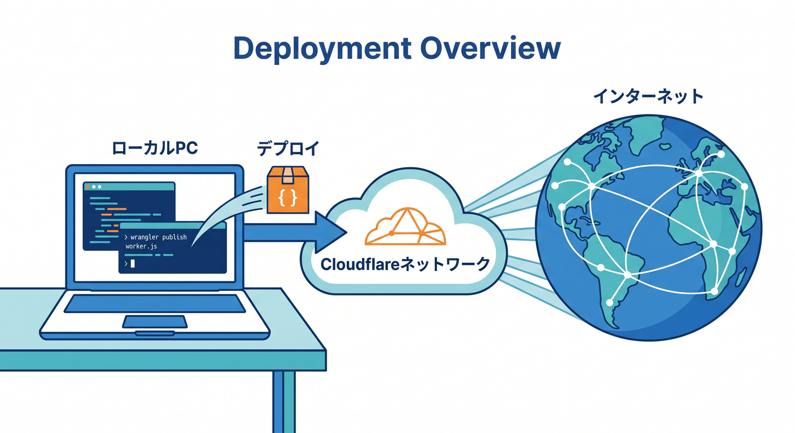
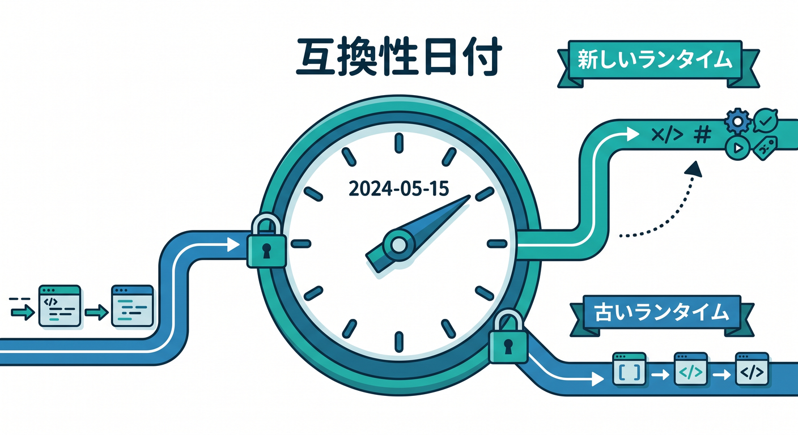
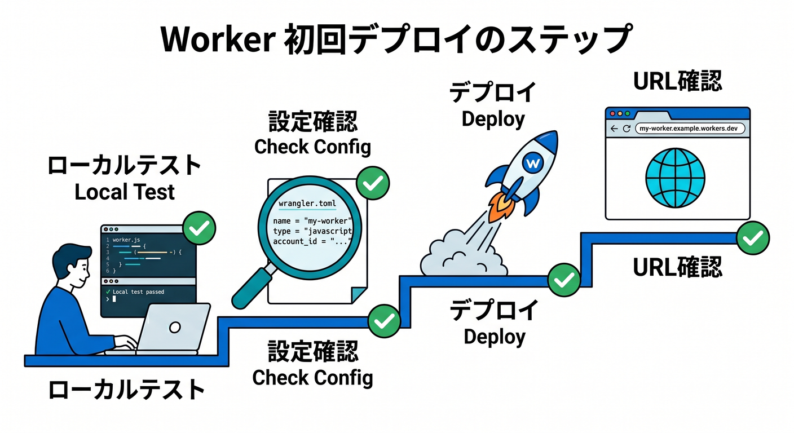
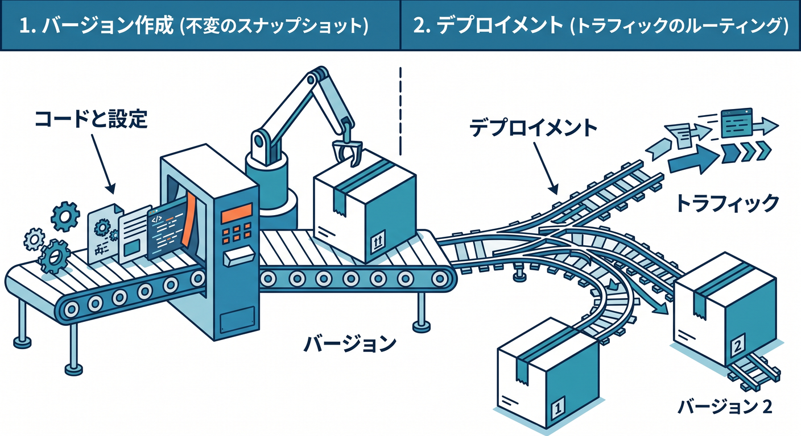
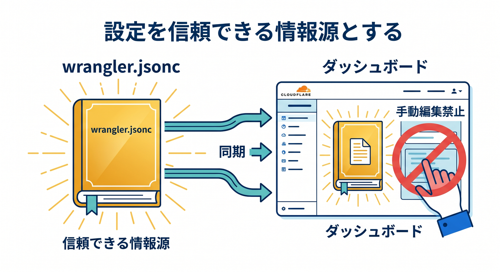
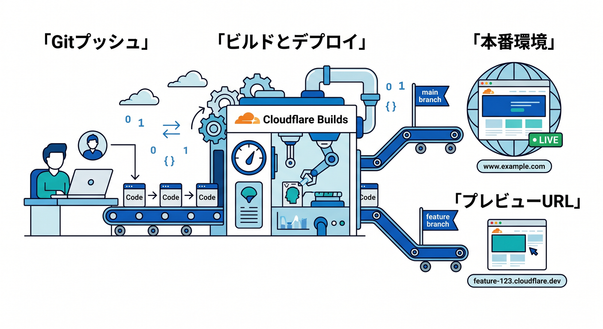
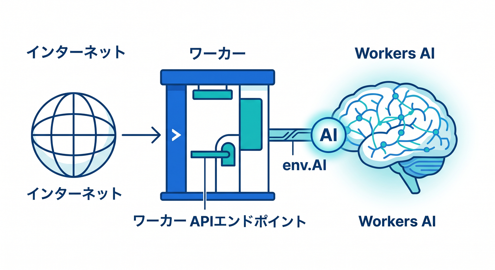

# 第13章　最初のデプロイで“本当に公開された！”を味わおう 🌐🎉🚀

この章では、いよいよ自分の Worker をインターネットへ公開します 😊
ローカルで `wrangler dev` で見えていたものを、Cloudflare のネットワーク上へ出して、実際の URL でアクセスできる状態にします。Cloudflare 公式の現在の基本導線は、Wrangler で作って、Wrangler でデプロイして、必要ならそのあと Git 連携や Builds に進む流れです。さらに、公開時に超大事な `compatibility_date` もここでちゃんと理解しておくと、あとで「なんで昨日まで動いてたのに？」をかなり減らせます。 ([Cloudflare Docs][1])

この章のゴールはシンプルです ✨



「デプロイって怖くない」「`wrangler deploy` で公開できる」「公開 URL を確認できる」「`compatibility_date` の役割がわかる」「次に自動デプロイへ進む道筋が見える」――ここまで到達できれば大成功です。Cloudflare Workers は、コードだけでなく設定も含めて公開されるので、**コードを書いたら終わりではなく、設定を含めて1つのアプリとして出す**感覚をここでつかみます。 ([Cloudflare Docs][2])

---

## 1. まず「デプロイ」って何？ 📦☁️

デプロイは、ざっくり言うと「自分の PC の中の Worker を、Cloudflare 上で動く本番の Worker にすること」です。
Cloudflare の公式 CLI ガイドでも、ローカル開発のあとに `npx wrangler deploy` を実行して、`*.workers.dev` か Custom Domain へ公開する流れが案内されています。つまりこの章は、今まで作ってきた Hello World を「本当に世界から見える場所へ出す章」です。 ([Cloudflare Docs][1])

C3 で作った最初のプロジェクトには、`wrangler.jsonc`、`src` の Worker 本体、`package.json` など、公開に必要な土台が最初からそろっています。なので初回デプロイは、**ゼロから全部準備する作業**ではなく、**すでにある土台を使って公開する作業**と考えると気が楽です 😌 ([Cloudflare Docs][1])

---

## 2. `compatibility_date` は「公開時の時限スイッチ」みたいなもの ⏰🧠



Cloudflare Workers の runtime は継続的に更新されています。でも、その更新で昔の Worker が急に壊れたら困りますよね。そこで Cloudflare は、runtime の変更や互換性の切り替えを `compatibility_date` と compatibility flags で管理しています。新しい Worker は新しい挙動を使いやすくしつつ、既存の Worker は急に壊れにくいように設計されています。 ([Cloudflare Docs][3])

公式ドキュメントでは、新規プロジェクトでは `compatibility_date` を**その日の日時点**に設定し、既存プロジェクトではときどき更新しつつ、更新時はテストして影響確認することが勧められています。しかも新しい `compatibility_date` は、ファイルを書き換えただけでは反映されず、**次回の `npx wrangler deploy` で有効になる**のがポイントです。ここ、かなり大事です 📌 ([Cloudflare Docs][3])

たとえば `wrangler.jsonc` の重要部分は、こんなイメージです。

```jsonc
{
  "name": "my-first-worker",
  "main": "src/index.ts",
  "compatibility_date": "2026-04-15"
}
```

Cloudflare は新規プロジェクトで `wrangler.jsonc` の利用を推奨していて、新しい機能の一部は JSON 形式の設定ファイル前提です。だからこの章でも、公開前に **`wrangler.jsonc` を見て意味がわかる状態** を目指します。 ([Cloudflare Docs][4])

---

## 3. 最初の公開手順を、やさしく順番に見よう 🪜✨



## 3-1. まずローカルで最後の確認をする 🔍

いきなり公開せず、先に `wrangler dev` で最終確認します。Cloudflare 公式でも、Worker を作ったあとまず `npx wrangler dev` でローカルサーバーを立ち上げ、`localhost:8787` で確認する流れが案内されています。初回はブラウザで Cloudflare アカウントへのログインが開くこともあります。 ([Cloudflare Docs][1])

確認ポイントは難しくありません 😊
表示文言が想定どおりか、URL 分岐が崩れていないか、JSON が返るべき場所で JSON が返るか、`console.log` の出しっぱなしがないか、このくらいで十分です。第12章で見たログ確認と合わせると、ここでの公開はかなり安心になります。 ([Cloudflare Docs][5])

## 3-2. 設定ファイルを見る 👀

次に `wrangler.jsonc` を開いて、最低でも `name`、`main`、`compatibility_date` を見ます。
特に `name` は、`workers.dev` の URL にそのまま使われる重要な名前です。Cloudflare の `workers.dev` URL は `<WORKER_NAME>.<YOUR_SUBDOMAIN>.workers.dev` という形になるので、**名前が公開 URL の一部になる**と思っておくと覚えやすいです。 ([Cloudflare Docs][6])

## 3-3. デプロイを実行する 🚀

公開コマンドはこれです。

```bash
npx wrangler deploy
```

Cloudflare の公式 CLI ガイドでも、デプロイ手順は `npx wrangler deploy` が基本です。もしまだ subdomain や custom domain を設定していなければ、Wrangler が公開時にセットアップを促してくれます。公開後は `<YOUR_WORKER>.<YOUR_SUBDOMAIN>.workers.dev` で確認できます。 ([Cloudflare Docs][1])

`package.json` に script を切っているなら、`npm run deploy` でも大丈夫です。公式の Wrangler コマンド資料でも、`deploy` script を作ってそれを package manager から実行する形が案内されています。つまり「毎回 `npx wrangler deploy` と打つ」でもよいし、「`npm run deploy` にまとめる」でもよい、ということです 👍 ([Cloudflare Docs][7])

## 3-4. 公開 URL を開いて確認する 🌍

デプロイできたら、ブラウザで `workers.dev` の URL を開きます。
Cloudflare アカウントには `workers.dev` subdomain があり、これによって custom domain を Cloudflare へ乗せる前でも、すぐに Worker を公開して試せます。最初の公開体験にはぴったりです。 ([Cloudflare Docs][6])

ただし、`workers.dev` は**公開 URL**です。Cloudflare の docs でも、`workers.dev` はすばやく始めるための導線として便利だけれど、business-critical な本番用途では route や custom domain を使うのが推奨されています。なのでこの章では「最初の公開場所」として使い、あとで本番運用の章で育てていくのが自然です。 ([Cloudflare Docs][6])

---

## 4. デプロイすると、裏では「version」が増えている 🧩📚

Cloudflare の今の Workers では、**Version** と **Deployment** を分けて考えるのが大切です。



Version はコードと設定の記録、Deployment はそのどの Version を実際のトラフィックへ出すか、という役割です。しかも Version には、コードだけでなく bindings や `compatibility_date` などの設定変更も含まれます。つまり、公開は「ファイルを送る」だけではなく、「設定込みの1つの状態を登録して出す」動きなんですね。 ([Cloudflare Docs][2])

通常の `wrangler deploy` は、新しい version をアップロードして、そのまま 100% のトラフィックへ即時デプロイする動きです。最初の学習ではこれで十分です。あとで段階的公開やロールバックに進むときも、この「まず version ができる」という考え方が土台になります。 ([Cloudflare Docs][2])

---

## 5. この章で特に大事な考え方は「設定もコードの一部」 📘🛠️

Cloudflare は、Wrangler の設定ファイルを Worker 設定の**source of truth**として扱うことを勧めています。



つまり、ダッシュボードでちょこちょこ直して、ローカルの `wrangler.jsonc` は別、という状態を続けるとズレやすいです。初学者ほど「動いたからいいや」で進みがちですが、公開後ほどこのズレが効いてきます。 ([Cloudflare Docs][4])

この章の時点では、**公開に関わる重要設定はまず `wrangler.jsonc` を見る**、この習慣をつけるだけで十分です。後の章で AI binding や KV、R2、D1 を足すときも、この感覚がものすごく効きます 🙌 ([Cloudflare Docs][4])

---

## 6. 公開後に「次の一歩」として見えてくるもの 🌱

ローカルからの手動デプロイに慣れたら、次は Git 連携です。Cloudflare の Workers Builds は GitHub / GitLab リポジトリを Worker に接続して、push ごとに自動 build・自動 deploy できます。



既存の Worker に対しても、ダッシュボードの Settings → Builds から接続できます。 ([Cloudflare Docs][8])

Builds では、本番 branch の deploy command はデフォルトで `npx wrangler deploy`、非本番 branch の preview deploy command はデフォルトで `npx wrangler versions upload` です。つまり Cloudflare の今の流れでは、**本番は deploy、確認用は preview version** と使い分けやすくなっています。Preview URL も `workers.dev` 系で自動的に扱えるので、Pull Request 単位の確認がかなりしやすいです。 ([Cloudflare Docs][9])

GitHub / GitLab 以外の Git provider を使う場合は、Cloudflare 公式でも external CI/CD を使って Wrangler で deploy する案内があります。たとえば GitHub Actions には Cloudflare の公式 action があり、`main` への push で Worker を deploy する例が公開されています。将来 CI/CD を学ぶときは、この章の `wrangler deploy` がそのまま自動化の中心になります。 ([Cloudflare Docs][10])

---

## 7. Copilot と AI を、この章でどう活かす？ 🤖✨

この章での GitHub Copilot の役割は、「コード生成の主役」よりも「公開前チェックの相棒」です。
たとえば `wrangler.jsonc` を見せて「この Worker が公開時に使う設定を3行で説明して」「`compatibility_date` を更新したときの注意点を教えて」と聞く使い方が相性抜群です。Cloudflare 公式 docs でも、GitHub Copilot 向けに `.github/copilot-instructions.md` を置いて、Workers 向けの指示を食べさせる使い方が案内されています。 ([Cloudflare Docs][11])

さらに Cloudflare は、Workers を学ばせるための `cloudflare-docs` MCP サーバーや、ログ・例外確認向けの `cloudflare-observability` MCP サーバーも案内しています。つまり AI を使うなら、「ふわっと一般論」ではなく、**Cloudflare 公式知識や observability とつながった相棒**として使うのがかなり今っぽいです。 ([Cloudflare Docs][11])

---

## 8. 「公開した Worker は、もう AI アプリの入口にもなる」 🤖🌐

この章はデプロイが主役ですが、Cloudflare らしさを感じるならここも触れておきたいです。
Workers AI は Worker から binding 経由で使えます。`wrangler.jsonc` に AI binding を追加すると `env.AI` でモデルを呼べるようになります。



つまり、今あなたが公開した Worker は、あとから **AI API の入口**にも育てられます。最初は Hello World でも、次に 1 本の `/ai` エンドポイントを足せば、立派な AI 対応 Worker です 🚀 ([Cloudflare Docs][12])

たとえば設定はこんな感じです。

```jsonc
{
  "ai": {
    "binding": "AI"
  }
}
```

そしてコード側では `env.AI.run()` を使ってモデルを呼べます。今この章でデプロイに慣れておくことは、そのまま「AI を公開する力」にもつながります。Cloudflare は Workers AI を Worker / Pages / API から呼べる形で提供しているので、学習の延長線がとてもきれいです 🌈 ([Cloudflare Docs][12])

---

## 9. この章の実践手順まとめ 🧭

実際の学習では、次の順で進めるとスムーズです。

1. `wrangler dev` でローカル最終確認をする。
2. `wrangler.jsonc` を開いて、`name` と `compatibility_date` を見る。
3. `npx wrangler deploy` で公開する。
4. `https://<worker>.<subdomain>.workers.dev` を開いて動作確認する。
5. Dashboard の Deployments を見て、「version が増えている」感覚をつかむ。
6. 次の発展として、GitHub / GitLab 連携や preview URL を知る。 ([Cloudflare Docs][1])

---

## 10. この章でハマりやすいポイント 😵‍💫🩹

**ローカルでは動いたのに公開 URL で見えない**
最初は subdomain 設定や反映直後のタイムラグが原因のことがあります。Cloudflare の CLI ガイドでも、初回の `workers.dev` 公開直後に 523 が見える場合は少し待つと解消する案内があります。まず慌てず、URL と Worker 名を確認しましょう。 ([Cloudflare Docs][1])

**`compatibility_date` を変えたのに挙動が変わらない**
これはよくあります。`compatibility_date` の更新は、次回の `npx wrangler deploy` で効きます。ファイル保存だけでは本番の Worker は変わりません。 ([Cloudflare Docs][3])

**ダッシュボードで直した設定とローカルの設定がズレる**
Wrangler 設定ファイルを source of truth にする、という基本を守るとかなり減ります。学習初期ほど「たまたま動いた」を積み重ねず、設定をコードと一緒に持つ癖をつけるのが大事です。 ([Cloudflare Docs][4])

---

## 11. この章の演習課題 ✍️🎯

演習1は、Hello World の公開です。
`Hello Worker!` を返すだけの Worker を `npx wrangler deploy` で公開し、`workers.dev` URL へアクセスして表示を確認しましょう。これがこの章の最重要クリア条件です。 ([Cloudflare Docs][1])

演習2は、`compatibility_date` の意味を体で覚える課題です。
`wrangler.jsonc` を開いて `compatibility_date` を確認し、「この日付は runtime のどんな役目を持つのか」を自分の言葉で 2〜3 行にまとめてみましょう。Cloudflare 公式の説明を、丸暗記ではなく、自分の理解に変換するのがコツです。 ([Cloudflare Docs][3])

演習3は、次章への橋渡しです。
GitHub へ push したら自動デプロイにしたい場合、Cloudflare Builds では何が build command で、何が deploy command なのかを調べてメモしましょう。ここがわかると、ローカル公開から CI/CD への移行がすごく自然になります。 ([Cloudflare Docs][9])

---

## 12. この章のまとめ 🎉☁️

この章で学ぶ本質は、「公開コマンドを打つこと」だけではありません。
**Cloudflare Workers は、コード＋設定を version として持ち、それを deploy して公開する**――この感覚こそが大事です。そして `compatibility_date` は、その公開物がどの runtime の振る舞いを前提にするかを決める超重要設定です。 ([Cloudflare Docs][2])

最初の `workers.dev` 公開は、小さいけれどかなりうれしい瞬間です 😊🌍
ここを越えると、「ローカルで動いたおもちゃ」から、「世界から触れるアプリ」へ一段進みます。そしてその先には、Git 連携の自動デプロイ、Preview URL、Custom Domain、Workers AI 公開 API と、きれいな発展ルートが待っています。まさにこの第13章は、学習全体のごほうび章です 🚀✨ ([Cloudflare Docs][6])

必要なら次に、この第13章をベースにして
**「学習目標・前提知識・本文・演習・確認テスト・用語集」つきの完全教材版** に整えてお渡しします。

[1]: https://developers.cloudflare.com/workers/get-started/guide/ "Get started - CLI · Cloudflare Workers docs"
[2]: https://developers.cloudflare.com/workers/configuration/versions-and-deployments/ "Versions & Deployments · Cloudflare Workers docs"
[3]: https://developers.cloudflare.com/workers/configuration/compatibility-dates/ "Compatibility dates · Cloudflare Workers docs"
[4]: https://developers.cloudflare.com/workers/wrangler/configuration/ "Configuration - Wrangler · Cloudflare Workers docs"
[5]: https://developers.cloudflare.com/workers/wrangler/commands/general/ "General commands · Cloudflare Workers docs"
[6]: https://developers.cloudflare.com/workers/configuration/routing/workers-dev/ "workers.dev · Cloudflare Workers docs"
[7]: https://developers.cloudflare.com/workers/wrangler/commands/?utm_source=chatgpt.com "Commands - Wrangler · Cloudflare Workers docs"
[8]: https://developers.cloudflare.com/workers/ci-cd/builds/ "Builds · Cloudflare Workers docs"
[9]: https://developers.cloudflare.com/workers/ci-cd/builds/configuration/ "Configuration · Cloudflare Workers docs"
[10]: https://developers.cloudflare.com/workers/ci-cd/builds/git-integration/ "Git integration · Cloudflare Workers docs"
[11]: https://developers.cloudflare.com/workers/get-started/prompting/ "Prompting · Cloudflare Workers docs"
[12]: https://developers.cloudflare.com/workers-ai/configuration/bindings/ "Workers Bindings · Cloudflare Workers AI docs"
