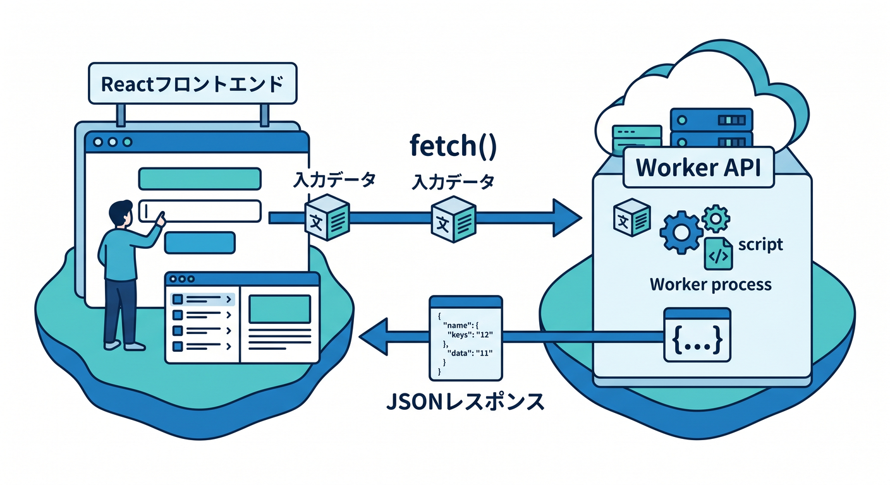
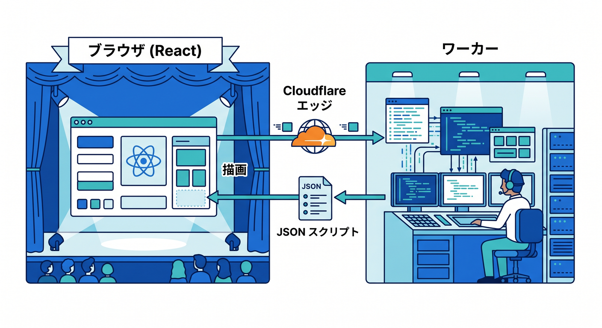
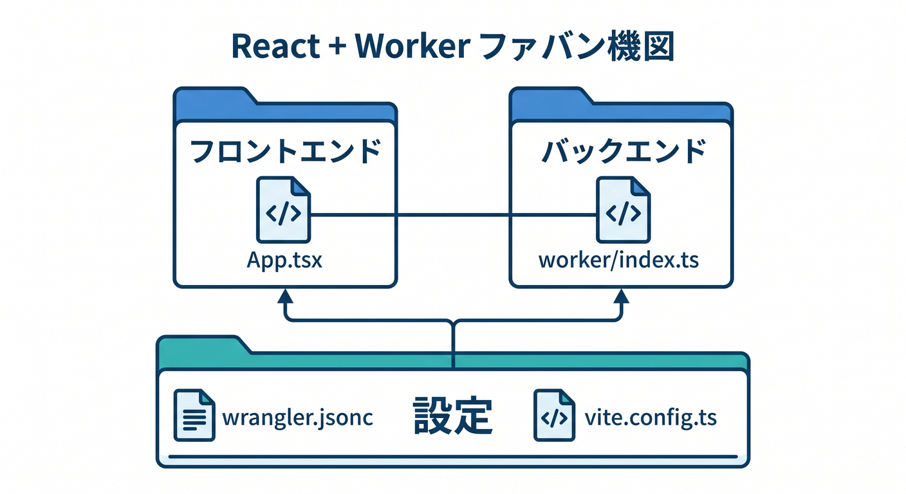
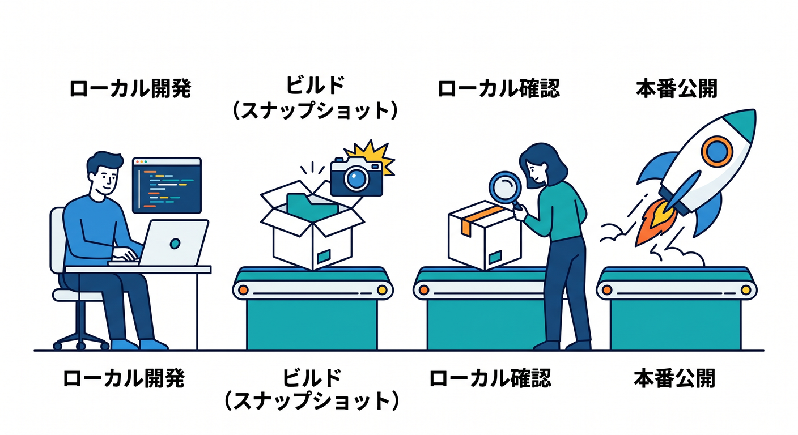

# 第14章　Reactの小さな画面とつないで“アプリ感”を出そう ⚛️💡🌈

この章は、ここまで作ってきた Worker を「画面から使える形」にして、ぐっとアプリっぽくする章です 😊
Cloudflare の現行公式導線では、React 向けの入口として `npm create cloudflare@latest -- my-react-app --framework=react` が案内されていて、React の画面と Workers API を一緒に始めやすくなっています。さらに Cloudflare Vite plugin は Worker コードを `workerd` 上で動かすので、本番にかなり近い感覚で開発できます。 ([Cloudflare Docs][1])

この章の気持ちはとてもシンプルです ✨
「入力する」→「送る」→「Worker が返す」→「画面に出る」。
たったこれだけでも、Hello World から一歩進んで「自分で作った Web アプリ」に見えてきます 😌



## この章のゴール 🎯

* React の小さな画面を用意できる
* `fetch()` で Worker の API を呼べる
* JSON を受け取って画面に表示できる
* Cloudflare AI をちょい足しして、今どき感も味わえる
* VS Code + Copilot を“説明役・修正役”として使える

---

## 1. この章で作るもの 🛠️📱

作るのは、すごく小さい「ひとことアプリ」です 🌟

* 名前を入力する
* ボタンを押す
* Worker があいさつ文を返す
* その結果を React の画面に表示する

さらにおまけで、Cloudflare Workers AI をつないで、テーマに対して短い AI メッセージも返せるようにします 🤖✨
Workers AI は `wrangler` 設定で binding を作ると `env.AI` から使え、`env.AI.run()` でモデルを呼び出せます。公式ドキュメントでもこの流れが案内されています。 ([Cloudflare Docs][2])

---

## 2. いまの公式ルートを、学習用にやさしく使う 🚀

React 連携の最新ルートとしては、Cloudflare 公式の React + Vite ガイドをベースに進めるのがいちばん素直です。公式は React SPA と Workers API をまとめて始める形を案内していて、別ルートとして Hono API や CI/CD、preview が入った構成も用意しています。今回は初心者向けなので、**いちばん軽い形**に絞ります。 ([Cloudflare Docs][1])

まずは VS Code のターミナルで、章用のフォルダを 1 つ作ります 💻

```bash
npm create cloudflare@latest chapter14-react-worker -- --framework=react
cd chapter14-react-worker
npm install
```

この方向で進めると、Cloudflare Vite plugin 前提の React プロジェクトになりやすく、後で build・preview・deploy まで流れがつながりやすいです。公式チュートリアルでも `dev` → `build` → `preview` → `deploy` の流れが整理されています。 ([Cloudflare Docs][1])

---

## 3. まずは全体像をつかもう 🧭

頭の中の図は、これだけで十分です 😊

```text
React画面（ブラウザ）
   ↓ fetch("/api/hello?name=...")
Worker API
   ↓ JSONを返す
React画面に表示
```

ここでの主役は React ではなく **Worker** です ☁️


React は「前面パーツ」、Worker は「裏で考えて返事をする部分」という役割分担です。Cloudflare の React + Vite チュートリアルも、SPA を作ってから API Worker を足す流れで説明しています。 ([Cloudflare Docs][3])

---

## 4. 重要ファイルを先に見よう 📁👀

この章で主に触るのは、だいたい次の 4 つです。

```text
chapter14-react-worker/
├─ src/
│  └─ App.tsx
├─ worker/
│  └─ index.ts
├─ vite.config.ts
└─ wrangler.jsonc
```

Cloudflare Vite plugin は、特別な複雑設定がなくても動きやすく、ルートの `wrangler.jsonc` / `wrangler.json` / `wrangler.toml` を見に行く作りです。さらに Vite plugin 利用時は `assets.directory` を自分で書かなくてもよく、SPA 用の routing 設定は `assets` 側で考える形になります。 ([Cloudflare Docs][4])



---

## 5. `vite.config.ts` を確認しよう ⚙️

Cloudflare Vite plugin を使う設定は、まずこんな感じです。

```ts
import { defineConfig } from "vite";
import react from "@vitejs/plugin-react";
import { cloudflare } from "@cloudflare/vite-plugin";

export default defineConfig({
  plugins: [react(), cloudflare()],
});
```

この形にしておくと、React 側と Worker 側を同じ開発体験の中で扱いやすくなります。Cloudflare 公式の React + Vite チュートリアルでも、`react()` と `cloudflare()` を並べる構成が案内されています。 ([Cloudflare Docs][3])

---

## 6. `wrangler.jsonc` をこの章用に整える 🧩

次に `wrangler.jsonc` をこうしてみましょう。

```jsonc
{
  "$schema": "./node_modules/wrangler/config-schema.json",
  "name": "chapter14-react-worker",
  "compatibility_date": "2026-04-15",

  "main": "./worker/index.ts",

  "assets": {
    "not_found_handling": "single-page-application"
  },

  // Workers AIを使う場合だけ有効化
  "ai": {
    "binding": "AI"
  }
}
```

ここで大事なのは 3 つです 🌸

1つ目は `main` です。これで Worker の入口ファイルを決めます。
2つ目は `assets.not_found_handling = "single-page-application"` です。これにすると、見つからないパスでも `index.html` を返すので、React の SPA らしいルーティングと相性がよくなります。
3つ目は `ai.binding` です。これを入れると Worker から `env.AI` を使えるようになります。 ([Cloudflare Docs][3])

この SPA 設定はかなり大事です 😊
Cloudflare 公式も、Vite plugin を使う場合は `assets` のルーティング設定で、**開発時と本番時のルーティング挙動がそろいやすい**ことを説明しています。 ([Cloudflare Docs][3])

---

## 7. Worker 側を作る ☁️💬

`worker/index.ts` を、まずはこんな最小形にします。

```ts
export interface Env {
  AI?: Ai;
}

export default {
  async fetch(request: Request, env: Env): Promise<Response> {
    const url = new URL(request.url);

    if (url.pathname === "/api/hello") {
      const name = url.searchParams.get("name")?.trim() || "ゲスト";

      return Response.json({
        ok: true,
        message: `こんにちは、${name}さん！ Worker から返事しています 👋`,
      });
    }

    if (url.pathname === "/api/idea") {
      const topic = url.searchParams.get("topic")?.trim() || "Cloudflare";

      // AI bindingがまだ無いときのやさしい逃げ道
      if (!env.AI) {
        return Response.json({
          ok: true,
          text: `AI binding が未設定です。テーマ「${topic}」で後から試してみましょう 😊`,
        });
      }

      const result = await env.AI.run("@cf/meta/llama-3.1-8b-instruct", {
        prompt: `${topic} について、初心者向けに前向きな一言を日本語で1文だけ返してください。`,
      }) as { response?: string };

      return Response.json({
        ok: true,
        text: result.response ?? "AI の返答を取得できませんでした。",
      });
    }

    return new Response("Not Found", { status: 404 });
  },
} satisfies ExportedHandler<Env>;
```

ここでは `/api/hello` が普通の API、`/api/idea` が AI つき API です 🤖


Cloudflare の Workers AI は binding 経由で使い、`env.AI.run()` でモデル実行できます。公式例でも `env.AI.run()` の基本形と、`stream: true` を使ったストリーミング例が示されています。 ([Cloudflare Docs][2])

ポイントは、「React から見れば、ただの API に見える」ことです 🌟
AI を使っていても、画面側では `fetch("/api/idea?...")` と呼ぶだけです。つまり **AI を直接ブラウザに書き散らかさず、Worker に寄せて整理できる**わけです。これは Cloudflare らしい設計の気持ちよさです。 ([Cloudflare Docs][2])

---

## 8. React 側を作る ⚛️🎨

次に `src/App.tsx` を、小さく作ります。

```tsx
import { useState } from "react";

export default function App() {
  const [name, setName] = useState("こみやんま");
  const [message, setMessage] = useState("");

  const [topic, setTopic] = useState("Cloudflare Workers");
  const [aiText, setAiText] = useState("");
  const [loading, setLoading] = useState(false);

  const fetchHello = async () => {
    const res = await fetch(`/api/hello?name=${encodeURIComponent(name)}`);
    const data = await res.json();
    setMessage(data.message ?? "");
  };

  const fetchIdea = async () => {
    setLoading(true);
    try {
      const res = await fetch(`/api/idea?topic=${encodeURIComponent(topic)}`);
      const data = await res.json();
      setAiText(data.text ?? "");
    } finally {
      setLoading(false);
    }
  };

  return (
    <main style={{ maxWidth: 720, margin: "40px auto", padding: 24, fontFamily: "sans-serif" }}>
      <h1>第14章ミニアプリ ⚛️☁️</h1>
      <p>React の画面から Worker API を呼んでみよう ✨</p>

      <section style={{ marginTop: 24, padding: 16, border: "1px solid #ddd", borderRadius: 12 }}>
        <h2>あいさつ API 👋</h2>
        <input
          value={name}
          onChange={(e) => setName(e.target.value)}
          placeholder="名前を入力"
          style={{ width: "100%", padding: 10, marginBottom: 12 }}
        />
        <button onClick={fetchHello}>Workerに送る</button>
        <p>{message}</p>
      </section>

      <section style={{ marginTop: 24, padding: 16, border: "1px solid #ddd", borderRadius: 12 }}>
        <h2>AI ひとこと ✨🤖</h2>
        <input
          value={topic}
          onChange={(e) => setTopic(e.target.value)}
          placeholder="テーマを入力"
          style={{ width: "100%", padding: 10, marginBottom: 12 }}
        />
        <button onClick={fetchIdea} disabled={loading}>
          {loading ? "考え中..." : "AIに聞く"}
        </button>
        <p>{aiText}</p>
      </section>
    </main>
  );
}
```

この React 側で学んでほしいのは 2 つだけです 😊
**`useState()` で画面の値を持つこと**、そして **`fetch()` で Worker を呼ぶこと**。
ここでは凝った設計を入れず、「入力 → ボタン → 結果表示」の最小ループだけにしています。Cloudflare の公式チュートリアルも、まずは API を呼んで結果を画面へ出す流れに集中しています。 ([Cloudflare Docs][3])


---

## 9. 動かしてみよう 🔥

開発中は、まずこれで十分です。

```bash
npm run dev
```

Cloudflare の React + Vite チュートリアルでも、まず `npm run dev` で開発サーバーを立てて確認する流れです。さらに Vite plugin によって、クライアント側とサーバー側を一緒に回しながら確認しやすく、編集しながら UI 状態を保ちつつ反復しやすいことも案内されています。 ([Cloudflare Docs][3])

動いたら、次の順番で触ると理解しやすいです 🌷

1. 名前を変える
2. 「Workerに送る」を押す
3. 表示が変わるのを確認する
4. `worker/index.ts` の返事文を変える
5. もう一度押して、画面の反映を見る

この「ちょっと変えて、すぐ見る」の繰り返しが、React と Worker を一緒に学ぶいちばん大事な感覚です 😊

---

## 10. build / preview / deploy の流れも知っておこう 📦🌍

本番へ行く前に、次の 3 つを知っておくと安心です。

```bash
npm run build
npm run preview
npm exec wrangler deploy
```

Cloudflare の公式チュートリアルでは、`build` 後にブラウザ側の成果物と Worker 側の成果物が分かれて出力され、`preview` ではその build 結果を Workers runtime でローカル確認できます。`deploy` では出力側の `wrangler.json` が自動的に使われます。 ([Cloudflare Docs][3])

ここは初心者にとってかなり大事です 📘
**`wrangler.jsonc` は入力用の設定**、**build 後の `wrangler.json` は出力用のスナップショット**、という意識を持っておくと、「どっちが使われてるの？」で迷いにくくなります。Cloudflare 公式もその役割分担を明確に説明しています。 ([Cloudflare Docs][3])



---

## 11. GitHub Copilot をこの章でどう使うか 🤝🤖

この章での Copilot は、**全部を書かせる人**ではなく、**学習を前に進める相棒**として使うのがちょうどいいです ✨

たとえば VS Code では、こんな頼み方がかなり相性いいです。

* 「この `fetch()` の流れを中学生にもわかる言葉で説明して」
* 「この `App.tsx` をもう少し見やすく分割して」
* 「入力欄が空のときボタンを押せないようにして」
* 「JSON の型を足して」

VS Code の agent 機能は、コードベースへの質問、実装計画、テスト失敗やデバッグ出力を見た修正、MCP や拡張ツールの利用に向いていると案内されています。GitHub Docs でも、MCP つき agent mode の前提として、VS Code のような MCP 対応 IDE が挙げられています。 ([Visual Studio Code][5])

さらに Cloudflare 側も、Workers 学習用に **docs MCP** と **observability MCP** を案内しています。docs MCP は Workers の最新情報を AI に渡しやすく、observability MCP はログや例外を見て修正の助けに使いやすいです。Cloudflare 公式の Prompting ページでは、VS Code を含むエディタ/エージェントで Workers 向けプロンプト利用や MCP 接続を案内しています。 ([Cloudflare Docs][6])

つまりこの章では、Copilot に対してはこんな役割分担がきれいです 🌈

* React の見た目調整 → Copilot
* Worker のルート追加 → 自分 + Copilot
* AI binding の説明確認 → Cloudflare docs MCP
* ログ調査 → observability MCP

この使い方だと、**自分の理解を残したまま AI の力も借りられる**ので、とても学びやすいです 😊


---

## 12. この章でハマりやすいポイント ⚠️

## ① 画面は出るのに API が返らない 😵

`worker/index.ts` のパス条件を見直しましょう。
`/api/hello` と `/api/idea` の文字がずれているだけでも動きません。

## ② React の画面は出るけど、URL直打ちで崩れる 😢

SPA のときは `assets.not_found_handling = "single-page-application"` が重要です。Cloudflare 公式も、この設定で SPA のルーティング挙動をそろえる方向を案内しています。 ([Cloudflare Docs][3])

## ③ AI だけ動かない 🤖💦

`wrangler.jsonc` に `ai.binding` を入れたか確認します。Workers AI は binding がないと `env.AI` から使えません。 ([Cloudflare Docs][2])

## ④ deploy はできたのに、ローカルと少し感覚が違う 😮

`preview` を挟むとかなり安心です。公式も `npm run preview` を本番に近い確認ステップとして案内しています。 ([Cloudflare Docs][3])

---

## 13. 演習課題 ✍️🎓

この章の最後に、次の 3 つをやると理解がぐっと深まります。

## 演習1　返事を分岐してみよう 🌱

`/api/hello` で、朝・昼・夜で返す文章を変えてみましょう。
「Worker にロジックを書く」感覚がつかめます。

## 演習2　入力チェックを入れよう ✅

名前が空なら React 側でボタンを押せないようにしましょう。
フロント側で守ることと、Worker 側でも守ることの違いが見えてきます。

## 演習3　AI ひとことを“戦国風”にしよう 🏯🤖

`prompt` を変えて、
「戦国武将が初心者を励ます一言を返す」
のようにしてみましょう。Cloudflare AI を遊びながら理解できます 😄

---

## 14. この章のまとめ 🌟

この章のいちばん大事な発見は、**Worker は API として React の前に立てる**ということです ☁️⚛️
Cloudflare の現行公式導線でも、React SPA + Workers API + Vite plugin の組み合わせがかなり整っていて、`dev`・`build`・`preview`・`deploy` まで一直線につながります。Worker 側は `workerd` に寄せた形で開発でき、SPA の routing も `assets` 設定でそろえやすいです。 ([Cloudflare Docs][1])

そして 2026 年らしい学び方としては、React で小さな画面を作り、Worker で API と AI をまとめ、VS Code + Copilot + MCP で調べながら育てる流れがとても自然です。Cloudflare 公式も docs MCP / observability MCP を案内していて、GitHub 側も VS Code での agent と MCP 利用を整えています。 ([Cloudflare Docs][6])

この章を終えると、もう「文字を返すだけの Worker」ではありません 🎉
**小さいけれど、ちゃんと画面があり、ちゃんと API があり、必要なら AI も呼べる。**
ここまで来ると、Cloudflare がかなり“作る道具”に見えてきます 😊🚀

次は、この第14章に対応する **「学習目標・演習課題・成果物・想定学習時間」つき教材版** として、授業形式に整理して出すのがきれいです。

[1]: https://developers.cloudflare.com/workers/framework-guides/web-apps/react/ "React + Vite · Cloudflare Workers docs"
[2]: https://developers.cloudflare.com/workers-ai/configuration/bindings/ "Workers Bindings · Cloudflare Workers AI docs"
[3]: https://developers.cloudflare.com/workers/vite-plugin/tutorial/ "Tutorial - React SPA with an API · Cloudflare Workers docs"
[4]: https://developers.cloudflare.com/workers/vite-plugin/get-started/ "Get started · Cloudflare Workers docs"
[5]: https://code.visualstudio.com/docs/copilot/agents/overview "Using agents in Visual Studio Code"
[6]: https://developers.cloudflare.com/workers/get-started/prompting/ "Prompting · Cloudflare Workers docs"
