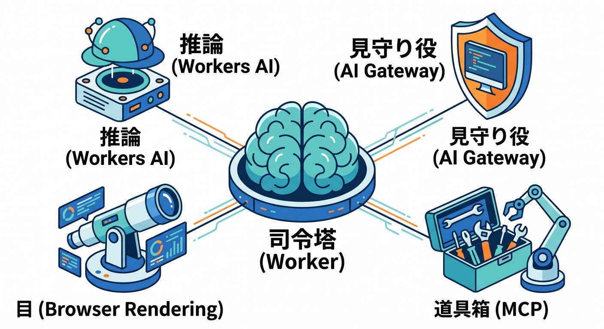
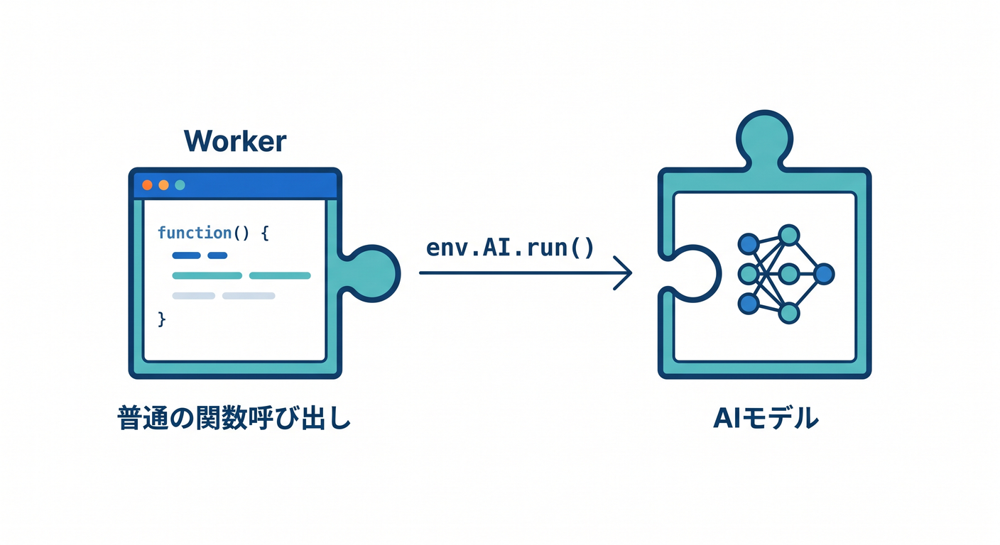
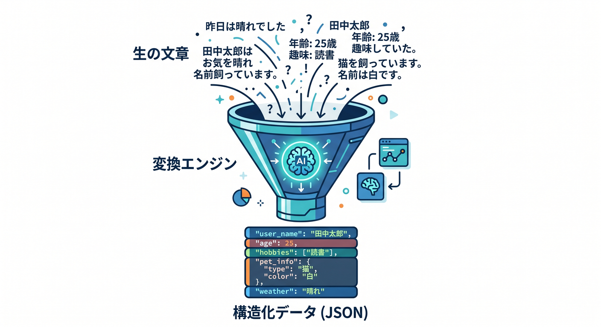
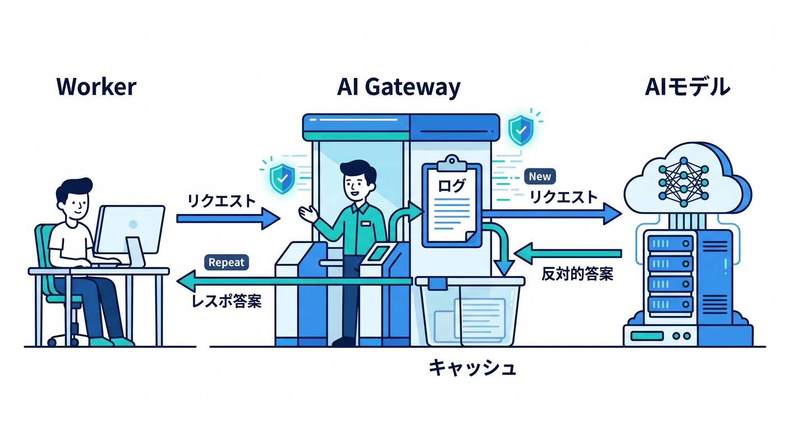
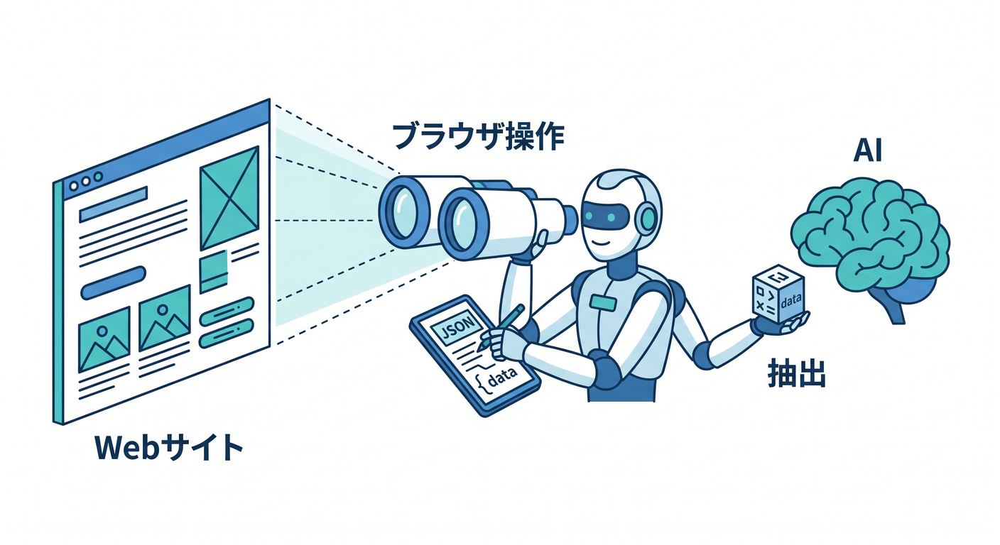
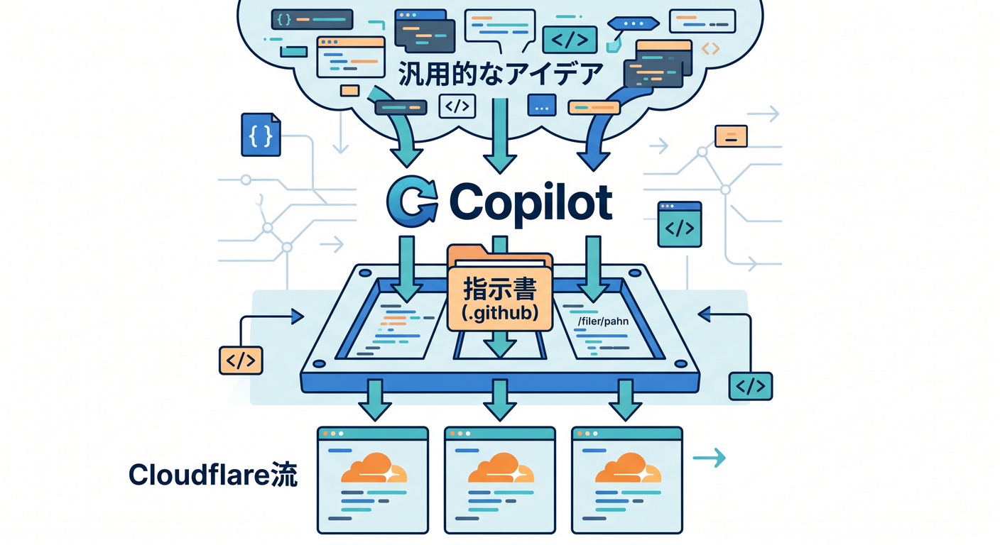
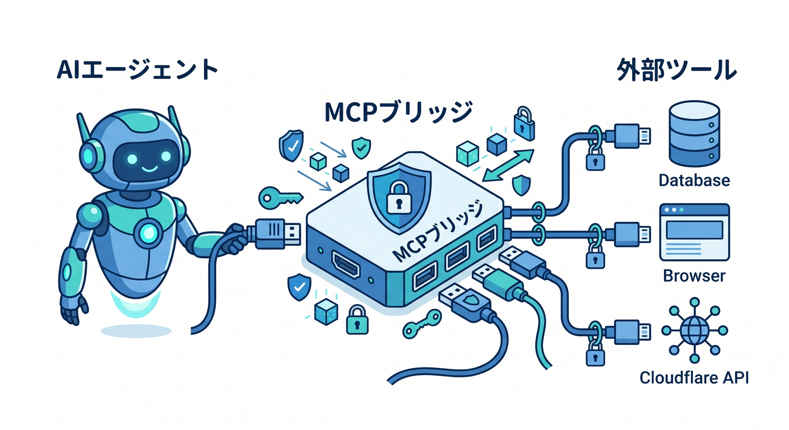

# 第15章　Workers AI・AI Gateway・Copilot・MCPで“今どきのWorker学習”に仕上げよう 🤖☁️🪄

この章は、これまで作ってきた Worker を「ただの返事マシン」から、「AIを呼べるアプリの土台」へ育てる章です 😊
Cloudflare では、Workers AI を Worker から binding 経由で呼べます。さらに AI Gateway を前に置くと、分析、ログ、キャッシュ、レート制限、リトライ、フォールバックまでまとめて扱えます。つまり、**AIを呼ぶ**だけでなく、**AIをちゃんと運用する**入口まで一気につながります。 ([Cloudflare Docs][1])

この章で目指すのは、次の4つです ✨

1. Worker から AI を1回ちゃんと呼べるようになる
2. AI Gateway を通して「見える化」と「守り」を足せるようになる
3. Browser Rendering や MCP を見て、「AIに何をさせられるのか」の視野を広げる
4. Copilot を“コード生成機”ではなく“Cloudflare学習の相棒”として使えるようになる

---

## 1. まず全体像をつかもう 🧭

この章の主役たちは、役割を分けて考えるとスッと入ります。
**Worker は司令塔**、**Workers AI は推論担当**、**AI Gateway は見守り役**、**Browser Rendering はブラウザ操作役**、**MCP はAIと外部ツールをつなぐ共通口**、**Copilot は学習と実装の相棒**、という感じです。MCP は外部アプリやツールとAIをつなぐオープン標準で、VS Code では MCP サーバーが tools・resources・prompts・interactive apps を提供できます。 ([Cloudflare Docs][2])



---

## 2. まずは Worker から AI を1回呼ぼう 🚀

Workers AI を Worker から使うには、まず binding を作ります。`wrangler.jsonc` に `ai.binding` を足すと、Worker 側では `env.AI` として扱えます。Cloudflare の公式導線でも、ここが最初の入口です。 ([Cloudflare Docs][3])

```jsonc
{
  "ai": {
    "binding": "AI"
  }
}
```

最初の1本は、難しく考えず **「文字を受け取る → AIに投げる → 結果を返す」** で十分です。`env.AI.run()` は、モデル名を第1引数、入力オブジェクトを第2引数に渡す形です。 ([Cloudflare Docs][3])

```ts
export interface Env {
  AI: Ai;
}

export default {
  async fetch(request: Request, env: Env): Promise<Response> {
    const url = new URL(request.url);

    if (url.pathname === "/ask") {
      const q =
        url.searchParams.get("q") ??
        "Cloudflare Workers を初心者向けに3行で説明して";

      const result = await env.AI.run("@cf/meta/llama-3.1-8b-instruct", {
        prompt: `次の質問に、やさしく短く答えてください。\n${q}`,
      });

      return Response.json(result);
    }

    return new Response("try: /ask?q=Cloudflareって何？", {
      headers: { "content-type": "text/plain; charset=UTF-8" },
    });
  },
} satisfies ExportedHandler<Env>;
```

ここで大事なのは、**AI機能を増やす前に、まず Worker の中で AI 呼び出しを普通の関数呼び出しみたいに感じること**です 😌


「AIは特別な巨大システム」ではなく、「binding された外部機能のひとつ」と見えるようになると、急に扱いやすくなります。 ([Cloudflare Docs][3])

---

## 3. “アプリ感”を出すなら、JSONで返そう 📦✨

Workers AI は OpenAI 互換エンドポイントも用意していて、`/v1/chat/completions` と `/v1/embeddings` が使えます。つまり、既存の OpenAI 系SDKの書き味をかなり流用しやすいです。さらに JSON Mode に対応していて、**自然文ではなく、構造化された JSON を返させる** こともできます。これは React 画面やフォーム連携と相性がとても良いです。 ([Cloudflare Docs][4])

たとえば「商品情報を要約して、`title` と `summary` と `tags` で返す」みたいにしておくと、フロント側は文字列を頑張って解析しなくて済みます。
このへんに来ると、AIは“文章生成”というより、**Worker の中で動く便利な変換エンジン**に見えてきます 🤖🧩 ([Cloudflare Docs][5])



---

## 4. AI Gateway を通して、“動く”から“一応安心”へ 🛡️📊

AI を呼ぶだけなら Workers AI 単体でも動きます。
でも、実務っぽくなるほど「何回呼ばれた？」「いくらくらい使ってる？」「同じ問い合わせを毎回AIに投げる必要ある？」「落ちたらどうする？」が気になってきます。そこで AI Gateway を間に入れます。Cloudflare 公式でも、AI Gateway は analytics、logging、caching、rate limiting、request retry / fallback をまとめて担う存在として整理されています。 ([Cloudflare Docs][6])

Workers AI と AI Gateway は binding ベースでもつなげられて、`env.AI.run()` の第3引数で gateway 設定を足せます。 ([Cloudflare Docs][7])

```ts
const result = await env.AI.run(
  "@cf/meta/llama-3.1-8b-instruct",
  {
    prompt: "CloudflareでAI Gatewayを使う理由を初心者向けに説明して",
  },
  {
    gateway: {
      id: "my-gateway",
      skipCache: false,
      cacheTtl: 3360,
    },
  }
);
```

この章では、AI Gateway を「高級機能」ではなく、**AI呼び出しの前に置く監督さん**くらいで覚えるとちょうどいいです 👀
最初から全部の設定を極めなくてよくて、まずは「ログを見る」「キャッシュを効かせる」「将来フォールバックできる」と知るだけで十分強いです。 ([Cloudflare Docs][6])



---

## 5. Browser Rendering を知ると、AIに“見る力”を足せる 👓🌐

Cloudflare Browser Rendering は、Cloudflare のネットワーク上で headless Chrome を動かせる機能です。Quick Actions ならスクリーンショットや PDF 生成、簡単なスクレイピングを1リクエストで行えます。Browser Sessions なら Puppeteer、Playwright、CDP、Stagehand で、もっと本格的なブラウザ操作ができます。 ([Cloudflare Docs][8])

しかも最近の公式導線では、**AI agent browsing** として Playwright MCP や CDP + MCP clients まで出てきています。さらに Workers AI と組み合わせて、Webページを見に行って JSON で情報抽出する例も公式にあります。つまり、
**Worker がAIを呼ぶ** → **AIが必要に応じてブラウザで情報を見る** → **構造化して返す**
という流れが、Cloudflareの中でかなり自然につながっています。 ([Cloudflare Docs][9])

ここは「今すぐ全部やる場所」ではなく、**CloudflareはAIを“推論だけ”で終わらせず、行動まで広げやすい** と感じる場所です 🚶‍♂️💨 ([Cloudflare Docs][8])



---

## 6. Copilot は“書かせる”より“Cloudflare流に寄せる”のがコツ 🧠✍️

Cloudflare 公式は、AI ツール向けに Workers のベースプロンプトまで用意しています。そこでは、TypeScript を基本にすること、ES Modules を使うこと、Cloudflare のベストプラクティスに寄せること、secrets をコードに埋め込まないことなどが整理されています。さらに GitHub Copilot では、リポジトリ直下に `.github/copilot-instructions.md` を置いて、プロジェクト用の指示を足せます。 ([Cloudflare Docs][10])

たとえばこの章のプロジェクトなら、こんな指示を置いておくとかなり噛み合いやすくなります ✨

```md
## Copilot instructions for this Cloudflare Workers project

- TypeScript を優先する
- Cloudflare Workers 向けの ES Modules 形式で書く
- 設定は wrangler.jsonc と bindings を前提に考える
- secrets をコードへ直書きしない
- まずは依存を増やしすぎず、Workers 標準APIを優先する
- AI を使う場合は Workers AI と AI Gateway を第一候補にする
- 例は初心者向けに短く、コメント付きで示す
```

これを入れておくと、Copilot が Node サーバー前提の答えへ脱線しにくくなります。
つまり Copilot のコツは、「賢い相手を使う」より、**自分の土俵を先に渡す** ことです 😊 ([Cloudflare Docs][10])



---

## 7. MCP を入れると、Copilot が“外の世界”に触れやすくなる 🔌🤖

GitHub Copilot の agent mode は、複数ステップを自律的に進める機能で、MCP サーバーと組み合わせると外部リソースやツールにアクセスしながら作業を進めやすくなります。GitHub 公式でも、MCP によって agent mode のループがかなり強くなると説明されています。 ([GitHub Docs][11])

VS Code 側では、MCP サーバーを追加・管理できて、resources、prompts、interactive apps まで扱えます。Chat Customizations editor からまとめて管理する導線もあります。 ([Visual Studio Code][12])

Cloudflare 側もかなり本気で、**managed remote MCP servers** を OAuth 接続で提供しています。特に Cloudflare API MCP server は、DNS・Workers・R2・Zero Trust などを含む Cloudflare API 全体へつながり、しかも 2,500超のエンドポイントを全部バラバラのツールとして見せるのではなく、`search()` と `execute()` の2ツールで扱えるよう工夫されています。かなり“今どき”です 😳✨ ([Cloudflare Docs][13])

さらに、自分で remote MCP server を Workers 上に作ることもでき、Streamable HTTP を使う現在の仕様に沿って公開できます。認証なし版と、認証・認可つき版の両方があり、Access for SaaS で保護する導線もあります。複数の MCP サーバーを1つの入口にまとめる MCP server portals もあり、Access ログや任意で Gateway 経由のHTTPログ/DLPも組み合わせられます。 ([Cloudflare Docs][14])

ここは初心者には少し未来感が強いですが、意味はシンプルです。
**「AIに何をさせるか」を、ただの文章指示ではなく、“安全に使える道具”として渡す世界** が MCP です 🛠️✨ ([Cloudflare Docs][2])



---

## 8. Next.js は紹介だけで十分。でも、つながりは知っておこう ⚛️➡️☁️

この講座では Worker が主役です。
ただし今の Cloudflare では、Next.js も Workers にデプロイでき、OpenNext adapter を使う導線があります。App Router、Pages Router、SSR、ISR、Server Actions、Middleware なども対応範囲に入っています。さらに自動設定では、R2 が有効なアカウントなら Next.js のキャッシュ用に R2 が組まれることもあります。 ([Cloudflare Docs][15])

なので、この章では **「React画面から Worker の `/ask` を叩く」** までできれば十分です。
Next.js は“次の発展先”として知っておけばOKです 🌱 ([Cloudflare Docs][15])

---

## 9. この章の演習課題 🧪🎯

1. `/ask?q=...` で Workers AI を呼ぶ Worker を作る
2. 返り値を JSON でそろえ、React 側で表示しやすくする
3. 同じ呼び出しを AI Gateway 経由に変えて、ログとキャッシュを確認する
4. 発展として、Browser Rendering で1ページ読ませて、その内容を Workers AI で要約する
5. さらに発展として、Copilot 用の `.github/copilot-instructions.md` を作り、Cloudflare向けのコード提案精度を上げる

---

## 10. この章のまとめ 🌈

第15章は、「AIを使う章」ではありますが、本当のテーマは **Cloudflareの世界が1本につながる感覚** をつかむことです。
Workers AI で推論し、AI Gateway で観測し、必要なら Browser Rendering で見に行き、MCP で外部ツールにつなぎ、Copilot で学習と実装を加速する。ここまで見えると、最初の Hello World がちゃんと“今の開発”につながっていたことがわかります。 ([Cloudflare Docs][1])

この章のゴールは、全部を今日マスターすることではありません 🙌
**「CloudflareのWorkerは、AI時代の司令塔になれる」** と実感できたら大成功です。 ([Cloudflare Docs][16])

必要なら次に、そのまま続けて
**「第15章の学習目標・演習課題・成果物・想定学習時間つき教材版」** に落とし込みます。

[1]: https://developers.cloudflare.com/workers-ai/ "Overview · Cloudflare Workers AI docs"
[2]: https://developers.cloudflare.com/agents/model-context-protocol/ "Model Context Protocol (MCP) · Cloudflare Agents docs"
[3]: https://developers.cloudflare.com/workers-ai/configuration/bindings/ "https://developers.cloudflare.com/workers-ai/configuration/bindings/"
[4]: https://developers.cloudflare.com/workers-ai/configuration/open-ai-compatibility/ "https://developers.cloudflare.com/workers-ai/configuration/open-ai-compatibility/"
[5]: https://developers.cloudflare.com/workers-ai/features/json-mode/ "https://developers.cloudflare.com/workers-ai/features/json-mode/"
[6]: https://developers.cloudflare.com/ai-gateway/ "https://developers.cloudflare.com/ai-gateway/"
[7]: https://developers.cloudflare.com/ai-gateway/usage/providers/workersai/ "https://developers.cloudflare.com/ai-gateway/usage/providers/workersai/"
[8]: https://developers.cloudflare.com/browser-rendering/ "Browser Rendering · Cloudflare Browser Rendering docs"
[9]: https://developers.cloudflare.com/browser-rendering/get-started/ "https://developers.cloudflare.com/browser-rendering/get-started/"
[10]: https://developers.cloudflare.com/workers/get-started/prompting/ "Prompting · Cloudflare Workers docs"
[11]: https://docs.github.com/en/copilot/tutorials/enhance-agent-mode-with-mcp "https://docs.github.com/en/copilot/tutorials/enhance-agent-mode-with-mcp"
[12]: https://code.visualstudio.com/docs/copilot/customization/mcp-servers "https://code.visualstudio.com/docs/copilot/customization/mcp-servers"
[13]: https://developers.cloudflare.com/agents/model-context-protocol/mcp-servers-for-cloudflare/ "https://developers.cloudflare.com/agents/model-context-protocol/mcp-servers-for-cloudflare/"
[14]: https://developers.cloudflare.com/agents/guides/remote-mcp-server/ "Build a Remote MCP server · Cloudflare Agents docs"
[15]: https://developers.cloudflare.com/workers/framework-guides/web-apps/nextjs/ "Next.js · Cloudflare Workers docs"
[16]: https://developers.cloudflare.com/workers/ "Overview · Cloudflare Workers docs"
